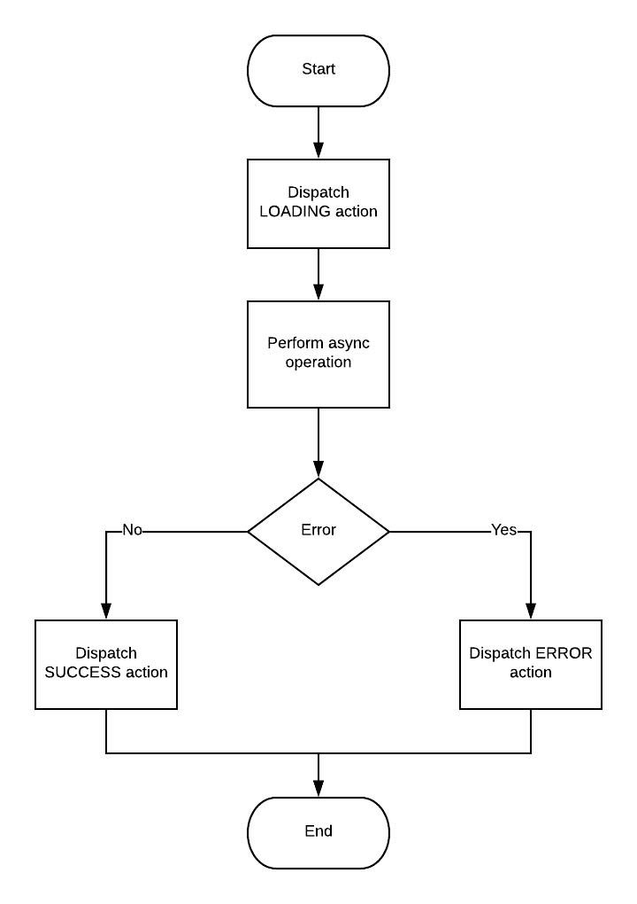
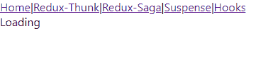
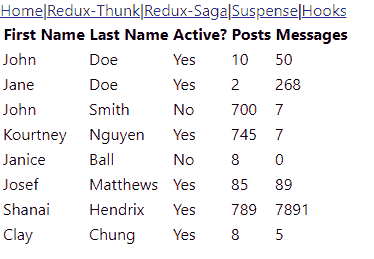
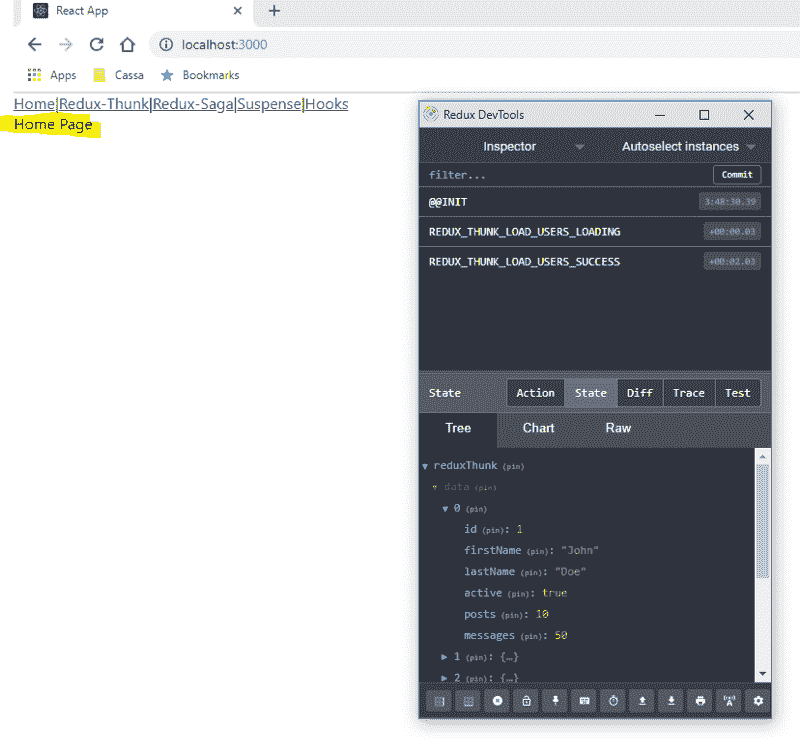
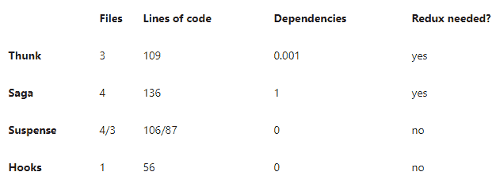

# 如何使用 redux-thunk、redux-saga、suspense & hooks 在 React 中加载数据

> 原文：<https://www.freecodecamp.org/news/loading-data-in-react-redux-thunk-redux-saga-suspense-hooks-666b21da1569/>

瓦莱里·捷列先科

# 如何使用 redux-thunk、redux-saga、suspense & hooks 在 React 中加载数据


### 介绍

[React](https://reactjs.org/) 是一个用于构建用户界面的 JavaScript 库。使用 React 通常意味着使用 React 和 [Redux](https://redux.js.org/) 。 [Redux](https://redux.js.org/) 是另一个用于管理全局状态的 JavaScript 库。遗憾的是，即使有了这两个库，也没有一种明确的方法来处理对 API(后端)的异步调用或任何其他副作用。

在这篇文章中，我试图比较解决这个问题的不同方法。先定义一下问题。

***组件 X 是网站的众多组件之一(或者移动，或者桌面应用，也有可能)。x 查询并显示从 API 加载的一些数据。x 可以是页面或者只是页面的一部分。重要的是，X 是一个独立的组件，应该尽可能与系统的其余部分松散耦合。x 应该显示加载指示，而数据正在检索和错误，如果调用失败。***

本文假设您已经有了一些创建 React/Redux 应用程序的经验。

本文将展示解决这个问题的 4 种方法，并比较每种方法的优缺点。**这不是一本关于如何使用 thunk、saga、suspence 或 hooks** 的详细手册。

这些例子的代码可以在 [GitHub](https://github.com/ValeraT1982/react-data-load) 上找到。

### 初始设置

#### 模拟服务器

出于测试目的，我们将使用 [json-server](https://github.com/typicode/json-server) 。这是一个令人惊叹的项目，它允许您非常快速地构建假 REST APIs。对于我们的例子，它看起来像这样。

```
const jsonServer = require('json-server');
const server = jsonServer.create();
const router = jsonServer.router('db.json');
const middleware = jsonServer.defaults();

server.use((req, res, next) => {
   setTimeout(() => next(), 2000);
});
server.use(middleware);
server.use(router);
server.listen(4000, () => {
   console.log(`JSON Server is running...`);
});
```

我们的 db.json 文件包含 json 格式的测试数据。

```
{
 "users": [
   {
     "id": 1,
     "firstName": "John",
     "lastName": "Doe",
     "active": true,
     "posts": 10,
     "messages": 50
   },
   ...
   {
     "id": 8,
     "firstName": "Clay",
     "lastName": "Chung",
     "active": true,
     "posts": 8,
     "messages": 5
   }
 ]
}
```

启动服务器后，调用[*http://localhost:4000/users*](http://localhost:4000/users)返回用户列表，延迟大约 2s。

### 项目和 API 调用

现在我们准备开始编码。我假设您已经使用 [create-react-app](https://github.com/facebook/create-react-app) 创建了一个 React 项目，并配置了 Redux，可以使用了。

如果你有任何困难，你可以检查一下[这个](https://facebook.github.io/create-react-app/)和[这个](https://medium.com/backticks-tildes/setting-up-a-redux-project-with-create-react-app-e363ab2329b8)。

下一步是创建一个函数来调用 API ( *api.js* ):

```
const API_BASE_ADDRESS = 'http://localhost:4000';

export default class Api {
   static getUsers() {
       const uri = API_BASE_ADDRESS + "/users";

       return fetch(uri, {
           method: 'GET'
       });
   }
}
```

### 还原-thunk

[Redux-thunk](https://github.com/reduxjs/redux-thunk) 是推荐用于基本 Redux 副作用逻辑的中间件，比如简单的异步逻辑(比如对 API 的请求)。Redux-thunk 本身做的不多。只是 [14！！！线条](https://github.com/reduxjs/redux-thunk/blob/master/src/index.js)[代码](https://github.com/reduxjs/redux-thunk/blob/master/src/index.js)。它只是添加了一些“语法糖”，仅此而已。

下面的流程图有助于理解我们将要做的事情。



每次执行一个动作，减速器相应地改变状态。该组件将状态映射到属性，并在 ***render()*** 方法中使用这些属性来确定用户应该看到什么:加载指示器、数据或错误消息。

为了让它发挥作用，我们需要做 5 件事。

#### 1.安装 thunk

```
npm install redux-thunk
```

#### 2.配置 store 时添加 thunk 中间件(configureStore.js)

```
import { applyMiddleware, compose, createStore } from 'redux';
import thunk from 'redux-thunk';
import rootReducer from './appReducers';

export function configureStore(initialState) {
 const middleware = [thunk];

 const composeEnhancers = window.__REDUX_DEVTOOLS_EXTENSION_COMPOSE__ || compose;
 const store = createStore(rootReducer, initialState, composeEnhancers(applyMiddleware(...middleware)));

 return store;
}
```

在第 12–13 行，我们还配置了[redux](https://github.com/zalmoxisus/redux-devtools-extension)T2【dev tools。稍后，它将有助于显示这个解决方案的一个问题。

#### 3.创建操作(redux-thunk/actions.js)

```
import Api from "../api"

export const LOAD_USERS_LOADING = 'REDUX_THUNK_LOAD_USERS_LOADING';
export const LOAD_USERS_SUCCESS = 'REDUX_THUNK_LOAD_USERS_SUCCESS';
export const LOAD_USERS_ERROR = 'REDUX_THUNK_LOAD_USERS_ERROR';

export const loadUsers = () => dispatch => {
   dispatch({ type: LOAD_USERS_LOADING });
   Api.getUsers()
       .then(response => response.json())
       .then(
           data => dispatch({ type: LOAD_USERS_SUCCESS, data }),
           error => dispatch({ type: LOAD_USERS_ERROR, error: error.message || 'Unexpected Error!!!' })
       )
};
```

还建议将你的动作创建者分开(这增加了一些额外的编码)，但是对于这个简单的例子，我认为“动态地”创建动作是可以接受的。

#### 4.创建 reducer (redux-thunk/reducer.js)

```
import {LOAD_USERS_ERROR, LOAD_USERS_LOADING, LOAD_USERS_SUCCESS} from "./actions";

const initialState = {
   data: [],
   loading: false,
   error: ''
};

export default function reduxThunkReducer(state = initialState, action) {
   switch (action.type) {
       case LOAD_USERS_LOADING: {
           return {
               ...state,
               loading: true,
               error:''
           };
       }
       case LOAD_USERS_SUCCESS: {
           return {
               ...state,
               data: action.data,
               loading: false
           }
       }
       case LOAD_USERS_ERROR: {
           return {
               ...state,
               loading: false,
               error: action.error
           };
       }
       default: {
           return state;
       }
   }
}
```

#### 5.创建连接到 redux 的组件(redux-thunk/userswithrudxthunk . js)

```
import * as React from 'react';
import { connect } from 'react-redux';
import {loadUsers} from "./actions";

class UsersWithReduxThunk extends React.Component {
   componentDidMount() {
       this.props.loadUsers();
   };

   render() {
       if (this.props.loading) {
           return <div>Loading</div>
       }

       if (this.props.error) {
           return <div style={{ color: 'red' }}>ERROR: {this.props.error}</div>
       }

       return (
           <table>
               <thead>
                   <tr>
                       <th>First Name</th>
                       <th>Last Name</th>
                       <th>Active?</th>
                       <th>Posts</th>
                       <th>Messages</th>
                   </tr>
               </thead>
               <tbody>
               {this.props.data.map(u =>
                   <tr key={u.id}>
                       <td>{u.firstName}</td>
                       <td>{u.lastName}</td>
                       <td>{u.active ? 'Yes' : 'No'}</td>
                       <td>{u.posts}</td>
                       <td>{u.messages}</td>
                   </tr>
               )}
               </tbody>
           </table>
       );
   }
}

const mapStateToProps = state => ({
   data: state.reduxThunk.data,
   loading: state.reduxThunk.loading,
   error: state.reduxThunk.error,
});

const mapDispatchToProps = {
   loadUsers
};

export default connect(
   mapStateToProps,
   mapDispatchToProps
)(UsersWithReduxThunk);
```

我试图使组件尽可能简单。我明白这看起来很糟糕:)

装载指示器



数据



错误


就这样:3 个文件，109 行代码(13(动作)+ 36(缩减器)+ 60(组件))。

#### 优点:

*   react/redux 应用的“推荐”方法。
*   没有额外的依赖。差不多，thunk 很小:)
*   不需要学习新的东西。

#### 缺点:

*   不同地方的大量代码
*   导航到另一个页面后，旧数据仍处于全局状态(见下图)。这些数据是消耗内存的过时和无用的信息。
*   在复杂的情况下(一个动作中的多个条件调用等)。)代码可读性不强



### 还原传奇

Redux-saga 是一个 Redux 中间件库，旨在使处理副作用变得容易和可读。它利用 ES6 生成器，允许我们编写看起来同步的异步代码。此外，该解决方案易于测试。

从高层次的角度来看，这个解决方案与 thunk 的工作原理相同。thunk 示例中的流程图仍然适用。

为了让它发挥作用，我们需要做 6 件事。

#### 1.安装 saga

```
npm install redux-saga
```

#### 2.添加 saga 中间件并添加所有 saga(configure store . js)

```
import { applyMiddleware, compose, createStore } from 'redux';
import createSagaMiddleware from 'redux-saga';
import rootReducer from './appReducers';
import usersSaga from "../redux-saga/sagas";

const sagaMiddleware = createSagaMiddleware();

export function configureStore(initialState) {
 const middleware = [sagaMiddleware];

 const composeEnhancers = window.__REDUX_DEVTOOLS_EXTENSION_COMPOSE__ || compose;
 const store = createStore(rootReducer, initialState, composeEnhancers(applyMiddleware(...middleware)));

 sagaMiddleware.run(usersSaga);

 return store;
}
```

第 4 行的传奇将在第 4 步添加。

#### 3.创建操作(redux-saga/actions.js)

```
export const LOAD_USERS_LOADING = 'REDUX_SAGA_LOAD_USERS_LOADING';
export const LOAD_USERS_SUCCESS = 'REDUX_SAGA_LOAD_USERS_SUCCESS';
export const LOAD_USERS_ERROR = 'REDUX_SAGA_LOAD_USERS_ERROR';

export const loadUsers = () => dispatch => {
   dispatch({ type: LOAD_USERS_LOADING });
};
```

#### 4.创建传奇(redux-saga/sagas.js)

```
import { put, takeEvery, takeLatest } from 'redux-saga/effects'
import {loadUsersSuccess, LOAD_USERS_ERROR, LOAD_USERS_LOADING, LOAD_USERS_SUCCESS} from "./actions";
import Api from '../api'

async function fetchAsync(func) {
   const response = await func();

   if (response.ok) {
       return await response.json();
   }

   throw new Error("Unexpected error!!!");
}

function* fetchUser() {
   try {
       const users = yield fetchAsync(Api.getUsers);

       yield put({type: LOAD_USERS_SUCCESS, data: users});
   } catch (e) {
       yield put({type: LOAD_USERS_ERROR, error: e.message});
   }
}

export function* usersSaga() {
   // Allows concurrent fetches of users
   yield takeEvery(LOAD_USERS_LOADING, fetchUser);

   // Does not allow concurrent fetches of users
   // yield takeLatest(LOAD_USERS_LOADING, fetchUser);
}

export default usersSaga;
```

Saga 有一个很陡的学习曲线，所以如果你从未使用过它，也从未读过关于这个框架的任何东西，你可能很难理解这里发生了什么。简而言之，在 ***userSaga*** 函数中，我们配置 Saga 来监听 **LOAD_USERS_LOADING** 动作并触发 ***fetchUsers*** 函数。 ***fetchUsers*** 函数调用 API。如果调用成功，则调度 **LOAD_USER_SUCCESS** 动作，否则调度 **LOAD_USER_ERROR** 动作。

#### 5.创建缩减器(redux-saga/reducer.js)

```
import {LOAD_USERS_ERROR, LOAD_USERS_LOADING, LOAD_USERS_SUCCESS} from "./actions";

const initialState = {
   data: [],
   loading: false,
   error: ''
};

export default function reduxSagaReducer(state = initialState, action) {
   switch (action.type) {
       case LOAD_USERS_LOADING: {
           return {
               ...state,
               loading: true,
               error:''
           };
       }
       case LOAD_USERS_SUCCESS: {
           return {
               ...state,
               data: action.data,
               loading: false
           }
       }
       case LOAD_USERS_ERROR: {
           return {
               ...state,
               loading: false,
               error: action.error
           };
       }
       default: {
           return state;
       }
   }
}
```

这里的缩减器与 thunk 示例中的完全相同。

### 6.创建连接到 redux 的组件(redux-saga/userswithrudxsaga . js)

```
import * as React from 'react';
import {connect} from 'react-redux';
import {loadUsers} from "./actions";

class UsersWithReduxSaga extends React.Component {
   componentDidMount() {
       this.props.loadUsers();
   };

   render() {
       if (this.props.loading) {
           return <div>Loading</div>
       }

       if (this.props.error) {
           return <div style={{color: 'red'}}>ERROR: {this.props.error}</div>
       }

       return (
           <table>
               <thead>
                   <tr>
                       <th>First Name</th>
                       <th>Last Name</th>
                       <th>Active?</th>
                       <th>Posts</th>
                       <th>Messages</th>
                   </tr>
               </thead>
               <tbody>
                   {this.props.data.map(u =>
                       <tr key={u.id}>
                           <td>{u.firstName}</td>
                           <td>{u.lastName}</td>
                           <td>{u.active ? 'Yes' : 'No'}</td>
                           <td>{u.posts}</td>
                           <td>{u.messages}</td>
                       </tr>
                   )}
               </tbody>
           </table>
       );
   }
}

const mapStateToProps = state => ({
   data: state.reduxSaga.data,
   loading: state.reduxSaga.loading,
   error: state.reduxSaga.error,
});

const mapDispatchToProps = {
   loadUsers
};

export default connect(
   mapStateToProps,
   mapDispatchToProps
)(UsersWithReduxSaga);
```

这里的组件与 thunk 示例中的组件几乎相同。

这里我们有 4 个文件，136 行代码(7(动作)+ 36(缩减器)+ sagas(33) + 60(组件))。

#### 优点:

*   更可读的代码(异步/等待)
*   适用于处理复杂场景(一个动作中有多个条件调用，一个动作可以有多个监听器，取消动作等)。)
*   易于单元测试

#### 缺点:

*   不同地方有很多代码
*   导航到另一个页面后，旧数据仍处于全局状态。这些数据是消耗内存的过时和无用的信息。
*   附加依赖性
*   很多概念要学

### 焦虑

悬念是 React 16.6.0 中的新特性。它允许我们推迟呈现组件的一部分，直到满足某些条件(例如从 API 加载数据)。

为了让它工作，我们需要做 4 件事(它肯定会变得更好:)。

#### 1.创建缓存(suspension/cache . js)

对于缓存，我们将使用一个[简单缓存提供者](https://www.npmjs.com/package/simple-cache-provider)，它是 react 应用程序的一个基本缓存提供者。

```
import {createCache} from 'simple-cache-provider';

export let cache;

function initCache() {
 cache = createCache(initCache);
}

initCache();
```

#### 2.创建错误边界(suspension/Error Boundary . js)

这是一个错误边界，用于捕捉由悬念引发的错误。

```
import React from 'react';

export class ErrorBoundary extends React.Component {
 state = {};

 componentDidCatch(error) {
   this.setState({ error: error.message || "Unexpected error" });
 }

 render() {
   if (this.state.error) {
     return <div style={{ color: 'red' }}>ERROR: {this.state.error || 'Unexpected Error'}</div>;
   }

   return this.props.children;
 }
}

export default ErrorBoundary;
```

#### 3.创建用户表(暂记/用户表. js)

对于这个例子，我们需要创建一个加载和显示数据的附加组件。这里我们创建一个资源来从 API 获取数据。

```
import * as React from 'react';
import {createResource} from "simple-cache-provider";
import {cache} from "./cache";
import Api from "../api";

let UsersResource = createResource(async () => {
   const response = await Api.getUsers();
   const json = await response.json();

   return json;
});

class UsersTable extends React.Component {
   render() {
       let users = UsersResource.read(cache);

       return (
           <table>
               <thead>
               <tr>
                   <th>First Name</th>
                   <th>Last Name</th>
                   <th>Active?</th>
                   <th>Posts</th>
                   <th>Messages</th>
               </tr>
               </thead>
               <tbody>
               {users.map(u =>
                   <tr key={u.id}>
                       <td>{u.firstName}</td>
                       <td>{u.lastName}</td>
                       <td>{u.active ? 'Yes' : 'No'}</td>
                       <td>{u.posts}</td>
                       <td>{u.messages}</td>
                   </tr>
               )}
               </tbody>
           </table>
       );
   }
}

export default UsersTable;
```

#### 4.创建组件(suspension/userswithstypension . js)

```
import * as React from 'react';
import UsersTable from "./UsersTable";
import ErrorBoundary from "./ErrorBoundary";

class UsersWithSuspense extends React.Component {
   render() {
       return (
           <ErrorBoundary>
               <React.Suspense fallback={<div>Loading</div>}>
                   <UsersTable/>
               </React.Suspense>
           </ErrorBoundary>
       );
   }
}

export default UsersWithSuspense;
```

**4 个文件，106 行代码(9(缓存)+ 19(错误边界)+ UsersTable(33) + 45(组件))。**

3 个文件，87 行代码(9(缓存)+ UsersTable(33) + 45(组件))如果我们假设 ErrorBoundary 是一个可重用的组件。

#### 优点:

*   不需要冗余。这种方法可以不使用 redux。组件是完全独立的。
*   没有额外的依赖关系([简单缓存提供者](https://www.npmjs.com/package/simple-cache-provider)是 React 的一部分)
*   通过设置 dellayMs 属性显示加载指示器的延迟
*   与前面的示例相比，代码行更少

#### 缺点:

*   即使我们并不真正需要缓存，也需要缓存。
*   需要学习一些新概念(这是 React 的一部分)。

### 钩住

在撰写本文时，钩子还没有正式发布，只能在“下一个”版本中使用。钩子无疑是即将到来的最具革命性的特性之一，它将很快改变 React 世界。关于钩子的更多细节可以在[这里](https://reactjs.org/docs/hooks-intro.html)和[这里](https://reactjs.org/docs/hooks-overview.html)找到。

为了让它在我们的例子中发挥作用，我们需要做 **one(！)**事情:

#### 1.创建和使用钩子(hooks/UsersWithHooks.js)

这里我们创建了 3 个钩子(函数)来“挂钩”React 状态。

```
import React, {useState, useEffect} from 'react';
import Api from "../api";

function UsersWithHooks() {
   const [data, setData] = useState([]);
   const [loading, setLoading] = useState(true);
   const [error, setError] = useState('');

   useEffect(() => {
       async function fetchData() {
           try {
               const response = await Api.getUsers();
               const json = await response.json();

            setData(json);
           } catch (e) {
               setError(e.message || 'Unexpected error');
           }

           setLoading(false);
       }

       fetchData();
   }, []);

   if (loading) {
       return <div>Loading</div>
   }

   if (error) {
       return <div style={{color: 'red'}}>ERROR: {error}</div>
   }

   return (
       <table>
           <thead>
           <tr>
               <th>First Name</th>
               <th>Last Name</th>
               <th>Active?</th>
               <th>Posts</th>
               <th>Messages</th>
           </tr>
           </thead>
           <tbody>
           {data.map(u =>
               <tr key={u.id}>
                   <td>{u.firstName}</td>
                   <td>{u.lastName}</td>
                   <td>{u.active ? 'Yes' : 'No'}</td>
                   <td>{u.posts}</td>
                   <td>{u.messages}</td>
               </tr>
           )}
           </tbody>
       </table>
   );
}

export default UsersWithHooks;
```

就这样——一个文件，56 行代码！！！

#### 优点:

*   不需要冗余。这种方法可以不使用 redux。组件是完全独立的。
*   没有额外的依赖
*   代码比其他解决方案少大约 2 倍

#### 缺点:

*   乍一看，代码看起来很奇怪，难以阅读和理解。需要一段时间来适应钩子。
*   需要学习一些新概念(这是 React 的一部分)
*   尚未正式发布

### 结论

让我们首先将这些指标组织成一个表格。



*   Redux 仍然是管理全局状态的一个很好的选择(如果你有的话)
*   每个选项都有利弊。哪种方法更好取决于项目:它的复杂性、用例、团队知识、项目何时投入生产等等。
*   Saga 可以帮助处理复杂的用例
*   悬念和挂钩都值得考虑(或至少学习)，尤其是对于新项目

就这样——享受快乐的编码吧！