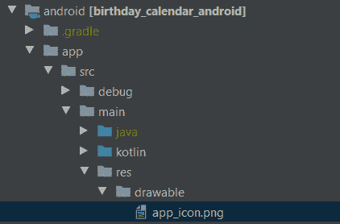

# 如何在 Flutter 中设置本地通知

> 原文：<https://www.freecodecamp.org/news/local-notifications-in-flutter/>

通知是吸引用户或让他们回到你的应用程序的好方法。您还可以使用通知来让用户在使用应用程序时注意某些事情。

有两种类型的通知:

1.  推送通知
2.  本地通知

正如本文的标题所暗示的，我们将不会关注推送通知(也因为它是被大量记录的东西)。相反，我们将只关注本地通知。两者的区别源于一个要点:

> 与从远程服务器触发的推送通知相反，本地通知源自应用程序本身。

对于本文，我们将使用在您打开一个新的 Flutter 应用程序(带有计数器的应用程序)时创建的普通项目——减去所有相关的计数器位。

截至撰写本文时，Flutter 的最新版本是 5.0.0+1，因此对于任何未来的读者，请记住这一点。

## 设置项目

为了允许我们的应用程序使用本地通知，我们需要将[flutter _ local _ notifications](https://pub.dev/packages/flutter_local_notifications)*包添加到我们的项目中。*

*在依赖项下，将以下内容添加到您的`pubspec.yaml`文件中:*

```
*`dependencies:
  flutter:
    sdk: flutter
  flutter_local_notifications: ^5.0.0+1`*
```

*pubspec.yaml*

*然后运行以下命令:*

```
*`Pub get`*
```

*由于本地通知包需要初始化，我们将创建一个服务类来处理整个应用程序的这个逻辑。这个类还将公开创建/发送/取消通知的方法。*

*使用以下代码创建一个名为****notification _ service . dart*****的新 dart 文件:**

```
**`import 'package:flutter_local_notifications/flutter_local_notifications.dart';

class NotificationService {
  static final NotificationService _notificationService =
      NotificationService._internal();

  factory NotificationService() {
    return _notificationService;
  }

  NotificationService._internal();

}`**
```

**notification_service.dart**

**上面的代码在 Dart 中转化为一个 Singleton 对象。确保在该文件的顶部导入本地通知包。**

## **综合**

**因为 Flutter 是一个跨平台框架，所以为它创建的每个包都需要支持 iOS 和 Android 设备。**

**因为 iOS 和 Android 对通知的处理非常不同，所以在使用本地通知包时，我们需要进行一些校准。**

**首先我们需要为****FlutterLocalNotificationPlugin****创建一个实例。我们将使用这个对象来初始化 Android 和 iOS 的设置，也用于其他通知目的。**

```
**`final FlutterLocalNotificationsPlugin flutterLocalNotificationsPlugin = FlutterLocalNotificationsPlugin();`** 
```

**我们现在需要用 Android 和 iOS 的特定设置来初始化本地通知插件。为此，我们需要创建一个*对象。它接受 Android、iOS 和 MacOS 操作系统的参数。***

> ****我们不会在这里讨论 MacOS，因为*有一个*类似于 *iOS* 的*配置。***

### 机器人

为 Android 设置这一点相当简单，因为只需要传递一个强制参数—****defaultIcon****(字符串)。它表示将在通知中显示的图标。

这里你需要传递你想要使用的图标的名字。您必须将此图标放在 drawable 目录中。它的完整路径是:

**YOUR _ APPLICATION _ NAME \ Android \ APP \ src \ main \ RES \ drawable \ YOUR _ APP _ icon . png**



Location of app_icon

不需要请求任何权限。

### ios

与大多数与 iOS 相关的主题一样，这里的事情变得有点复杂。由于不同版本的操作系统之间如何处理通知，我们需要在这里做一些额外的配置。

在****app delegate*****文件里面你需要添加下面几行代码:*

```
*`- (BOOL)application:(UIApplication *)application 
didFinishLaunchingWithOptions:(NSDictionary<UIApplicationLaunchOptionsKey, id> *)launchOptions {
  if (@available(iOS 10.0, *)) {
    [UNUserNotificationCenter currentNotificationCenter].delegate = (id<UNUserNotificationCenterDelegate>) self;
  }
}`*
```

*对于与通知相关的各种问题，您需要请求用户的许可。因此，iOS 的初始化器对象具有以下参数:*

*   *[请求者许可](https://pub.dev/documentation/flutter_local_notifications/latest/flutter_local_notifications/IOSInitializationSettings/requestAlertPermission.html)*
*   *[请求许可](https://pub.dev/documentation/flutter_local_notifications/latest/flutter_local_notifications/IOSInitializationSettings/requestBadgePermission.html)*
*   *[请求声音许可](https://pub.dev/documentation/flutter_local_notifications/latest/flutter_local_notifications/IOSInitializationSettings/requestSoundPermission.html)*

*它们每个都是不言自明的，但是与通知中的不同方面相关。为了与这些权限相对应，您还可以为每个权限设置默认值。*

*   *[默认显示警告](https://pub.dev/documentation/flutter_local_notifications/latest/flutter_local_notifications/IOSInitializationSettings/defaultPresentAlert.html)*
*   *[defaultPresentBadge](https://pub.dev/documentation/flutter_local_notifications/latest/flutter_local_notifications/IOSInitializationSettings/defaultPresentBadge.html)*
*   *[默认呈现声音](https://pub.dev/documentation/flutter_local_notifications/latest/flutter_local_notifications/IOSInitializationSettings/defaultPresentSound.html)*

*这些选项之所以存在，是因为本地通知插件的初始化可能会导致操作系统在您不希望权限对话框出现时向用户显示它们。如果您不想要这种行为，您可以将所有这些值设置为 false。*

*iOS 中的另一个警告是，当应用程序在前台或在后台时，呈现给用户的通知之间的行为差异。*

*开箱即用，如果应用程序在前台，操作系统不会向用户显示通知。*

*当应用程序在前台时，插件本身会显示一个通知。但是在 iOS10 下面，你需要给出一个回调方法****onDidReceiveLocalNotification****来处理用户与通知的交互。*

*在配置了特定的平台初始化之后，是时候将所有这些逻辑封装到我们的通知服务的方法中了。这里我们最好的方法是创建一个 init 方法，当应用程序第一次启动时，这个方法将从我们的 ****main.dart**** 文件中被调用。*

```
*`void init() {
  final AndroidInitializationSettings initializationSettingsAndroid =
      AndroidInitializationSettings('app_icon');

  final IOSInitializationSettings initializationSettingsIOS =
      IOSInitializationSettings(
    requestSoundPermission: false,
    requestBadgePermission: false,
    requestAlertPermission: false,
    onDidReceiveLocalNotification: onDidReceiveLocalNotification,
  );

    final InitializationSettings initializationSettings =
        InitializationSettings(
            android: initializationSettingsAndroid, 
            iOS: initializationSettingsIOS, 
            macOS: null);
  }`*
```

*注意，在为平台特定的初始化设置创建实例之后，我们还需要创建一个****initialization settings****对象，我们在平台特定的初始化设置对象中传递该对象。*

*这里我们的最后一步是在****FlutterLocalNotificationsPlugin****对象上调用 initialize 方法。*

*除了上面的初始化设置，它还有另一个参数叫做****onSelectNotification****。此参数表示点击通知后将调用的回调，它是一个可选参数。这个回调函数有一个名为 ****有效负载**** 的参数，它将保存通过通知传递的任何数据。*

```
*`Future<void> init() async {
  final AndroidInitializationSettings initializationSettingsAndroid =
      AndroidInitializationSettings('app_icon');

  final IOSInitializationSettings initializationSettingsIOS =
      IOSInitializationSettings(
    requestSoundPermission: false,
    requestBadgePermission: false,
    requestAlertPermission: false,
    onDidReceiveLocalNotification: onDidReceiveLocalNotification,
  );

    final InitializationSettings initializationSettings =
        InitializationSettings(
            android: initializationSettingsAndroid, 
            iOS: initializationSettingsIOS, 
            macOS: null);

   await flutterLocalNotificationsPlugin.initialize(initializationSettings,
        onSelectNotification: selectNotification);
  }

   Future selectNotification(String payload) async {
      //Handle notification tapped logic here
   }`*
```

*在我们的 main.dart 文件中，我们将像这样调用 init 方法:*

```
*`Future<void> main() async {
  WidgetsFlutterBinding.ensureInitialized();
  await NotificationService().init(); // <----
  runApp(MyApp());
}`*
```

## *本地通知用例*

### *如何显示本地通知*

*要显示通知，您需要创建一个适当的通知细节实例(适用于 Android/iOS)。每个平台都有自己特定的参数需要传入。*

```
*`const AndroidNotificationDetails androidPlatformChannelSpecifics = 
    AndroidNotificationDetails(
        channelId: String,   //Required for Android 8.0 or after
        channelName: String, //Required for Android 8.0 or after
        channelDescription: String, //Required for Android 8.0 or after
        importance: Importance,
        priority: Priority
    );`*
```

*AndroidNotificationDetails*

*上面的例子只显示了几个可以传递给 ****和**** 的参数。完整的列表很长，你可以在这里查看。*

```
*`const IOSNotificationDetails iOSPlatformChannelSpecifics =
    IOSNotificationDetails(
        presentAlert: bool?,  // Present an alert when the notification is displayed and the application is in the foreground (only from iOS 10 onwards)
        presentBadge: bool?,  // Present the badge number when the notification is displayed and the application is in the foreground (only from iOS 10 onwards)
        presentSound: bool?,  // Play a sound when the notification is displayed and the application is in the foreground (only from iOS 10 onwards)
        sound: String?,  // Specifics the file path to play (only from iOS 10 onwards)
        badgeNumber: int?, // The application's icon badge number
        attachments: List<IOSNotificationAttachment>?, (only from iOS 10 onwards)
        subtitle: String?, //Secondary description  (only from iOS 10 onwards)
        threadIdentifier: String? (only from iOS 10 onwards)
   );`*
```

*iOSNotificationDetails*

*接下来，我们将创建一个****notification details****对象，并将其传递给我们的平台特定的通知细节对象。*

```
*`const NotificationDetails platformChannelSpecifics = 
  NotificationDetails(android: androidPlatformChannelSpecifics);

OR

const NotificationDetails platformChannelSpecifics = 
  NotificationDetails(iOS: iOSPlatformChannelSpecifics);`*
```

*然后我们需要调用****FlutterLocalNotificationPlugin****的`show`方法。*

```
 *`await flutterLocalNotificationsPlugin.show(
    int id,
    String? title,
    String? body,
    NotificationDetails? notificationDetails,
    String? payload);`*
```

*这里的参数更容易理解，但我们还是要检查一下:*

*   *****id**–**通知的标识符。每个通知必须有一个唯一的标识符*
*   *****标题**–**通知的标题*
*   *****正文**–**我们希望显示的通知的主要信息*
*   *****通知细节**–**我们上面讨论的通知细节对象*
*   *****有效负载**–**我们希望通过此通知传递的数据，以便在以后点击通知并再次打开应用程序时可以使用*

*一个例子是这样的:*

```
*`await flutterLocalNotificationsPlugin.show(
        12345, 
        "A Notification From My Application",
        "This notification was sent using Flutter Local Notifcations Package", 
        platformChannelSpecifics,
        payload: 'data');`*
```

### *如何安排本地通知*

*安排通知需要传入相对于用户设备时区的时间和日期。这是为了克服夏令时带来的时差。*

*因为本地通知插件已经包含了时区库，所以我们不需要在 pubspec.yaml 文件中添加任何其他依赖项。但是我们确实需要将它导入到我们的通知服务中，并初始化它。*

```
*`import 'package:flutter_local_notifications/flutter_local_notifications.dart';
import 'package:timezone/data/latest.dart' as tz;
import 'package:timezone/timezone.dart' as tz;

Future<void> init() async {
  final AndroidInitializationSettings initializationSettingsAndroid =
      AndroidInitializationSettings('app_icon');

  final IOSInitializationSettings initializationSettingsIOS =
      IOSInitializationSettings(
    requestSoundPermission: false,
    requestBadgePermission: false,
    requestAlertPermission: false,
    onDidReceiveLocalNotification: onDidReceiveLocalNotification,
  );

    final InitializationSettings initializationSettings =
        InitializationSettings(
            android: initializationSettingsAndroid, 
            iOS: initializationSettingsIOS, 
            macOS: null);

  tz.initializeTimeZones();  // <------

   await flutterLocalNotificationsPlugin.initialize(initializationSettings,
        onSelectNotification: selectNotification);
  }`*
```

*要调度一个通知，我们需要使用 ****zoneSchedule**** 方法:*

```
*`Future<void> zonedSchedule(
              int id,
              String? title,
              String? body,
              TZDateTime scheduledDate,
              NotificationDetails notificationDetails,
              {required UILocalNotificationDateInterpretation uiLocalNotificationDateInterpretation,
              required bool androidAllowWhileIdle,
              String? payload,
              DateTimeComponents? matchDateTimeComponents}`*
```

*它与 show 方法有几个相似之处，但是它有一些与应该何时发送通知相关的参数。让我们一个一个来看:*

*   *****scheduled date****–这个参数告诉通知何时发送。你可以得到今天的日期，然后加上你想要的时间*
*   *****uilocalnotificationdatediation****——用于 iOS 以下版本(因缺乏支持)将时间解释为绝对时间或挂钟时间*
*   *****androidAllowWhileIdle****–指定即使设备处于低功耗空闲模式，是否也应发送通知*

*一个例子是这样的:*

```
*`await flutterLocalNotificationsPlugin.zonedSchedule(
        12345,
        "A Notification From My App",
        "This notification is brought to you by Local Notifcations Package",
        tz.TZDateTime.now(tz.local).add(const Duration(days: 3)),
        const NotificationDetails(
            android: AndroidNotificationDetails(CHANNEL_ID, CHANNEL_NAME,
                CHANNEL_DESCRIPTION)),
        androidAllowWhileIdle: true,
        uiLocalNotificationDateInterpretation:
            UILocalNotificationDateInterpretation.absoluteTime);
  }`*
```

### *如何取消本地通知*

*取消通知时，您有两种选择:*

1.  *您可以取消特定的通知*
2.  *您可以取消所有待定通知*

*要取消特定的通知，您必须使用通知 id。*

```
*`await flutterLocalNotificationsPlugin.cancel(NOTIFICATION_ID);`* 
```

*要取消所有通知，您使用****cancel****方法:*

```
*`await flutterLocalNotificationsPlugin.cancelAll();`* 
```

## *包扎*

*在 Flutter 中，您可以使用本地通知包做更多的事情，我强烈建议您阅读更多相关内容，并查看[文档](https://pub.dev/documentation/flutter_local_notifications/latest/index.html)。*

*要查看使用本地通知的应用程序的真实示例，您可以点击这里:*

*[Birthday Calendar - Apps on Google PlayIn today’s world, it’s hard to keep track of the birthdays for all the people in your life. Who has time to remember all the dates? Enter Birthday Calendar.You will be able to save any birthday you want to and schedule a notification for it.tomerpacificApps on Google Play](https://play.google.com/store/apps/details?id=com.tomerpacific.birthday_calendar)*

*要查看源代码，请点击这里:*

*[TomerPacific/BirthdayCalendarContribute to TomerPacific/BirthdayCalendar development by creating an account on GitHub.TomerPacificGitHub](https://github.com/TomerPacific/BirthdayCalendar)*

*感谢阅读！*