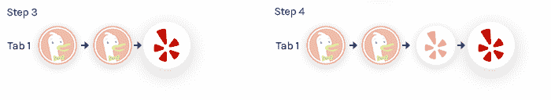
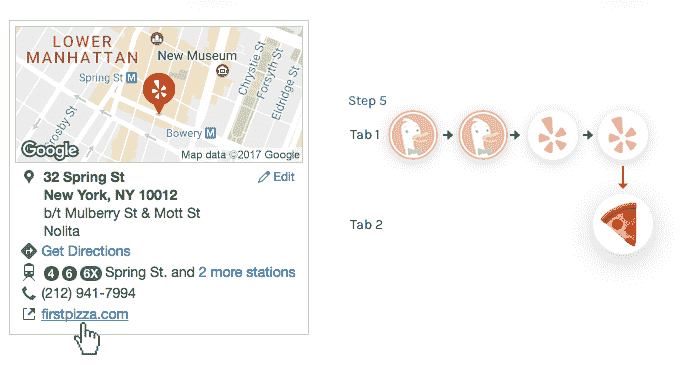
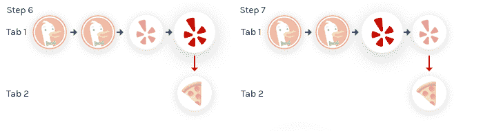
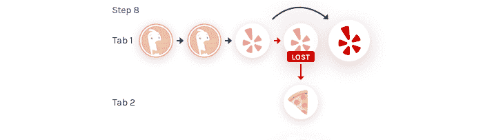
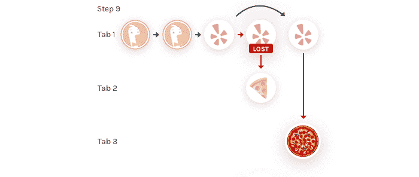
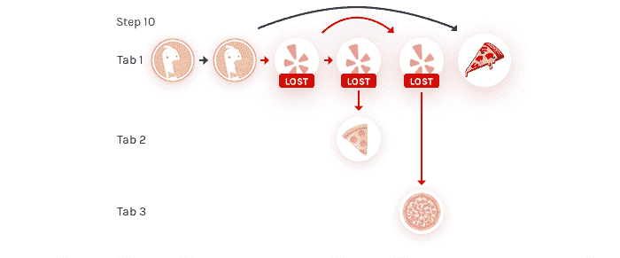
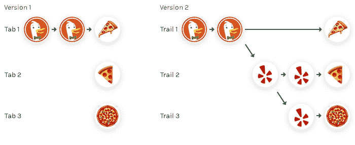
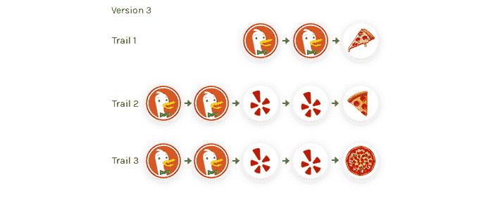

# 带轨迹的无损网络导航

> 原文：<https://www.freecodecamp.org/news/lossless-web-navigation-with-trails-9cd48c0abb56/>

一个小岛

# 带轨迹的无损网络导航

自 21 世纪初以来，选项卡式浏览的桌面隐喻已经主导了我们浏览网页的方式。Mozilla 的研究项目[Browser.html](https://github.com/browserhtml/browserhtml)，旨在为[伺服](https://servo.org/)的夜间构建构建一个 HTML 格式的浏览器用户界面，我们正在试验**将标准标签式浏览器进化为基于*轨迹*的模型。**

trails 的目标不仅是构建一个进入网络内容的窗口，而且是用户活动的叙述。我们希望我们的工作可以帮助浏览更接近理想的工具状态，即*增强*我们的认知过程，而不是增加我们的认知负荷。

为了说明我们正在考虑的这种情况，我们将把你介绍给我们的朋友娜娜。

### 寻找完美的比萨饼

娜拉在找披萨店。在她传统的选项卡式浏览器中，她开始搜索 *(1)* ，然后进入搜索结果页面 *(2)* 。

她在 Yelp 上点击了一个餐馆列表的链接，并查看了一家很有前景的披萨店 *(4)* 。

Yelp 上的外部链接在单独的标签中打开，所以当 Nala 点击一个餐馆网站的链接时，它会启动一个新标签 *(5)* 。

新选项卡没有任何历史记录，也没有与第一个选项卡的任何连接。所有关于娜拉如何进入餐厅网站的历史都丢失了！

当她去查看更多选项时，浏览器的健忘症加剧了:切换回第一个标签*【6】*并导航回 Yelp 结果*【7】*，她寻找另一家餐馆。

现在，当她选择一家新餐馆*【8】***时，当前标签的部分导航历史也会丢失:**

再次点击下一家餐馆网站的外部链接会打开一个新的标签页 *(9)* ，并再次切断之前的历史链接。

为了再次查看她最初搜索结果的结果，Nala 在第一个标签的历史中后退了几步，并直接从那里打开了另一个披萨店 *(10)* 。

在这个常见搜索场景的例子中，超过三分之一的历史记录丢失了！

当然，浏览器通常会提供历史视图和“最近标签”菜单等工具，但这些工具都无法提供与 Nala 实际经历相符的叙述。

### 从标签到轨迹

有了 Browser.html，我们正在开发一个用户界面原型，它不仅讲述了选项卡式浏览器保留的 Nala 历史片段*(第 1 版)*，而且讲述了它的全部*(第 2 版)*:

但是这些树很容易变得错综复杂。我们认为最重要的不是每个探索在哪里分叉，而是通向结果的完整路径。这就是我们向用户显示的内容*(版本 3)* :

每一行代表从导航树的根到结果的轨迹。好处是一条小道从左到右讲述一个自成一体的故事。另一方面，重复会导致大量分散注意力的视觉噪音。幸运的是，这可以通过关注一条线索而忽略其他线索来消除。

这是娜拉实际上会看到的:

### 标签和轨迹:相同，但不同。

如果你忽略了通向每个探索主题的路径，线索与传统的标签没有什么不同。这是有意的:我们的目标是增强现有的用户体验，而不是取代它们。用户可以像往常一样继续使用浏览器。然而**每个导航轨迹都是一个标签，从头到尾讲述一个完整的故事。**这为我们提供了探索进一步增强用户体验的机会。以下是我们正在考虑的几个:

*   分享的不仅仅是网址，而是整个路径。
*   当它们变得不相关时逐渐消失，并最终将它们移出网格。
*   将踪迹保持在访问期间的形式，以便可以重新访问(离线)。
*   允许对轨迹进行注释，这样用户可以在研究某个主题时记录他们的想法。
*   合作课题研究。
*   选择性地在新路径中打开页面。

### 通往小径的道路

将用户的网络之旅可视化为轨迹的想法并不新鲜。甚至在 70 年前，在他的里程碑式的[我们可能认为](http://www.theatlantic.com/magazine/archive/1945/07/as-we-may-think/303881/)普及超链接数据的想法的文章中， [Vannevar Bush](https://en.wikipedia.org/wiki/Vannevar_Bush) 描述了一个“memex 机器”他设想这台机器将帮助我们通过个人图书馆收集和分享数据，这将帮助我们在研究过程中留下痕迹。

从那以后，已经有过几次创造这种工具的尝试，从[施乐公司的](http://adsabs.harvard.edu/abs/2010SPIE.7540E..07R)开始。这个概念被 2004 年的[开拓者](https://www-s.acm.illinois.edu/macwarriors/projects/trailblazer/)和 [MacWarriors](https://www-s.acm.illinois.edu/macwarriors/) 延续，现在是[开拓者. io](http://www.trailblazer.io) 。我们希望通过将轨迹的想法与熟悉的选项卡式习惯用法联系起来，我们将建立在现有的工作流程上，并使这个想法具有广泛的吸引力。Browser.html 是这些想法的一个很好的测试平台。

### 一个特殊的模型

我正在通过各种用户交互和动画制作一个空间模型。这将有助于用户更好地理解正在发生的事情，以及如何最有效地浏览网页。

你可以在这里阅读更多相关内容。

### 加入我们吧！

我们目前正致力于建立我们的第一个工作原型。如果你觉得这听起来很有趣，请来看看 Browser.html 项目！你可以在 GitHub 上找到我们的[未决问题列表](https://github.com/browserhtml/browserhtml/issues)，或者来我们的 [Slack](https://browserhtml-slackin.herokuapp.com) 上和我们聊天。