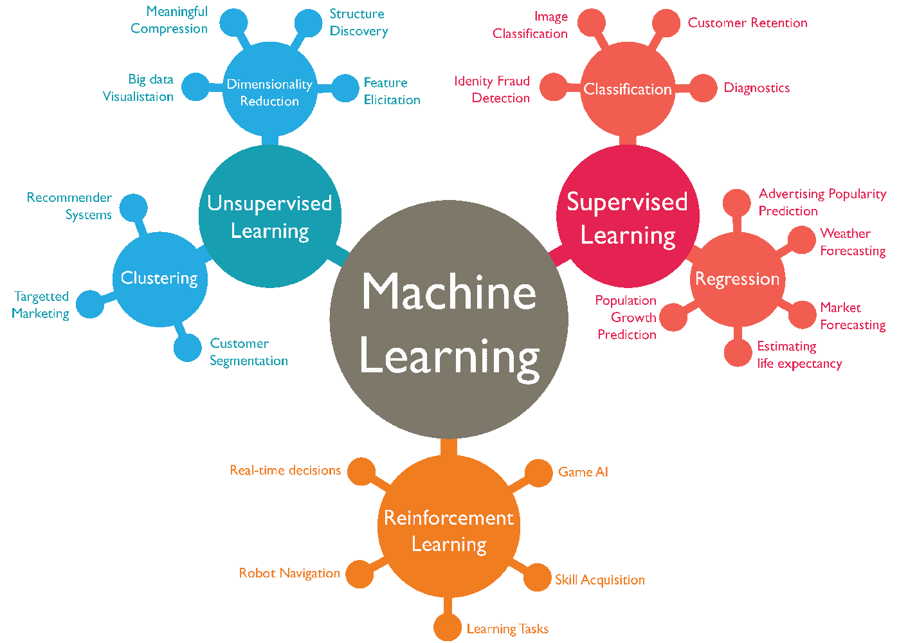
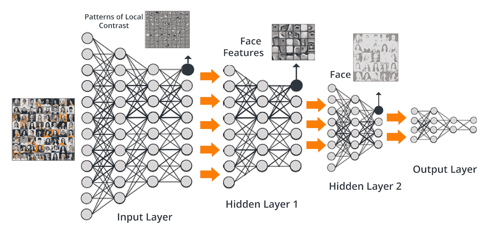

# 管理者的机器学习——你需要知道的

> 原文：<https://www.freecodecamp.org/news/machine-learning-for-managers-what-you-need-to-know/>

如果你作为产品或项目经理管理一个技术团队，这里是你需要了解的关于机器学习的知识。

机器学习和深度学习在过去五年里一直是热门词汇。对…的需求。人工智能领域飞速发展。

但是除了围绕机器学习的所有宣传，如果你是一个绝对的初学者，很难轻松掌握基本概念。

鉴于 ML 和 AI 的普遍性质，现在几乎每个产品都可以有机器学习用例。因此，在本文中，我们将深入研究机器学习，并为您的下一次技术对话提供所需的知识。

## 什么是机器学习？

机器学习是人工智能的一个分支。人工智能作为一个整体，包括许多旨在模拟人类思维的一般概念。

机器学习只关注一个关键方面:让机器学习。

> 机器学习是让计算机在没有明确编程的情况下做出决策的科学。

在过去的十年里，机器学习给了我们自动驾驶汽车、人脸识别、聊天机器人和许多其他有用的应用。机器学习正在为我们日常使用的许多工具提供动力。

## 机器学习是如何工作的？

机器学习使用算法来分析海量数据，并从中得出结论。当你把大数据集和高计算能力结合起来，这些算法就能理解数据之间的模式和关系。

例如，让我们看一个简单的数据集:

x = 1，2，3，4，5

y = 1，4，9，16，25

如果你看上面的数字，你会发现 x 和 y 的关系是 y 是 x 的平方(也就是 y = x)。

在机器学习中，算法的工作是找到定义输入和输出之间关系的函数。一旦建立了这个函数，就很容易预测未来的值。

例如，如果 x 是 10，y 是 100。

虽然这个例子太简单了，但它应该能让你了解机器学习模型是如何工作的。

考虑一个复杂的数据集，比如预测房价。

该数据集将包含区号、平方英尺和许多其他输入，并将价格作为输出。如果您有一个包含数千个这些输入要素和最终价格的数据集，您可以训练一个模型来根据新的输入预测平均价格。

机器学习问题通常涉及找到输入和输出之间的关系，以找到“假设函数”。在我们之前的例子中，假设函数是 y = x。

真实世界的假设函数比这复杂得多。然后，我们使用该函数来查找自定义输入的答案。

简而言之，机器学习，在大多数情况下，是高级统计学与计算能力的结合。今天，机器学习为面部识别、[情感分析](https://medium.com/manishmshiva/a-complete-guide-to-sentiment-analysis-and-its-applications-72adb3b057f5)和许多其他技术提供了动力。

## 学习算法的类型

让我们来看看在使用机器学习时会遇到的问题类型。首先，有三种方法可以让机器学习。

### 监督学习

在监督学习中，你为机器学习算法提供清晰的输入。算法知道从数据中学习什么，以及从中预期的结论。

例如，为了识别猫和狗之间的差异，你用成千上万的图像来训练算法。这些图像中的每一个都将被相应地标记。

一旦你通过算法运行这些数据，算法就会学习并理解其中的差异。因此，它可以相当准确地预测新图像是猫还是狗。

### 无监督学习

标注数据对于构建监督模型非常重要。然而，公司每天都在收集大量数据集。标记这些数据集以使机器学习模型的工作更容易并不是解决这个问题的好方法。

这就是无监督学习的用武之地。您可以使用无监督学习算法根据可用属性对数据进行聚类。然后，可以将这些数据输入到监督学习模型中，以实现更高的预测精度。

无监督学习模型比监督学习模型更具挑战性。[你可以在这里找到更多的信息和例子](https://www.mathworks.com/discovery/unsupervised-learning.html)，你可以在这里 l[了解更多关于重要的机器学习算法。](https://www.freecodecamp.org/news/a-no-code-intro-to-the-9-most-important-machine-learning-algorithms-today/)

### 强化学习

没有机器学习算法是 100%准确的。精确度取决于用来训练算法的数据集。

这意味着，在您训练一个算法之后，可能会有新的数据集可用。这些数据集可能会极大地提高模型的准确性。

对于这些类型的场景，您可以使用强化学习。强化学习是在生产过程中更新算法的概念。强化学习模型可以基于新的输入进行再训练。

例如，自动驾驶汽车可以在穿过一种新的地形后了解该地形。下次自动驾驶汽车选择路线时，它的算法会将这一点考虑在内。

## 机器学习问题的类型

机器学习问题可以根据你要寻找的结果类型分为四个子类。

### 分类

分类模型产生属于有限集合的结果。分类模型的示例包括垃圾邮件/非垃圾邮件、0 或 1(二进制分类)、肯定/否定/中性等等。

### 回归

回归模型产生属于某个范围的结果。例子包括预测股票市场价格、天气预报等等。这些问题不限于有限的一组值，因此被称为回归问题。

### 使聚集

聚类是无监督学习中的一个关键概念。聚类分析有助于对具有相似属性的数据进行分组。一旦这些小组建立起来，使用监督模型来训练他们就变得更容易了。

[点击](https://www.freecodecamp.org/news/how-to-build-and-train-k-nearest-neighbors-ml-models-in-python/)了解更多关于集群的信息。

### 降维

降维是另一种无监督学习技术。使用降维，您可以将包含数千个要素的复杂数据集简化为一个可能包含一百个输入的简单数据集。

与聚类类似，在将大型数据集输入监督训练模型之前，通常使用降维来减少噪音。

[你可以在这里找到一篇关于降维的更深入的文章](https://machinelearningmastery.com/dimensionality-reduction-for-machine-learning/)。

## 什么是深度学习？

深度学习是机器学习的兴奋剂。

机器学习有很多算法。一个突出的例子是神经网络。

其他机器学习算法和神经网络的区别在于，你可以将神经网络堆叠在一起——想堆叠多少就堆叠多少。

这有助于我们解决复杂的问题，如面部识别和自动驾驶，因为这些类型的问题会有成千上万的实时输入。

使用神经网络，如果您拥有模型运行所需的数据和计算能力，您可以高精度地解决几乎任何复杂的问题。

神经网络已经存在了几十年，但正是大数据集和计算能力的可用性让它们重获新生。现在深度学习是业界最激动人心的领域之一。

## 为什么需要机器学习？

让我们看看一些我们每天都在使用的流行的机器学习解决方案。

### 语音助手

想知道 Siri 如何理解和解释你的语音命令吗？答案是机器学习。由于自然语言处理技术的进步，现在几乎每部智能手机中都有语音助手。

尽管计算机很难理解自然语言，但多亏了机器学习，我们有了 Alexa、Cortana 和 Siri。

### 产品推荐

推荐引擎是电子商务公司的一个有利可图的用例。如果你能找到合适的产品推荐，你的顾客很可能会多次购买。

机器学习算法可以从过去的购买中理解用户行为。当顾客在你的网站上购物时，这有助于他们推荐类似的产品。

推荐不限于电商。这适用于 Spotify 或网飞等推荐你喜欢的音乐或电影的产品。

### 聊天机器人

客户支持可以成就你的公司，也可以毁掉你的公司，尤其是如果你是一家初创公司。你吸引的用户越多，你提供的客户支持就越多。

聊天机器人在与客户互动时可以节省大量时间。因为你的大多数客户会有共同的问题，你可以设计一个聊天机器人来回答多余的问题。

你不必雇用额外的客户服务专业人员或让你的客户排队等候。由于机器学习，聊天机器人正在为企业节省时间和金钱。

### 垃圾邮件过滤

垃圾邮件过滤是机器学习的一个简单而强大的应用。是 Gmail 或 Outlook 能高准确率为你过滤掉垃圾邮件的原因。

垃圾邮件过滤系统也是为了从经验中学习而构建的。这种模型也被称为强化学习，当你将一封电子邮件标记为垃圾邮件时，它可以更好地理解你的偏好。

由于机器学习，我们现在有了更干净的收件箱。

### 语言翻译

如果没有谷歌翻译，我们会做什么？基于机器学习的语言翻译引擎每年为企业节省数百万美元。

在机器学习之前，翻译服务完全由人力提供。多亏了机器学习，你可以在几分钟内将大型数据集翻译成任何语言。

## 工具和框架

机器学习和深度学习是通过使用不同的库和框架来完成的。虽然其他语言也有自己的工具，但 Python 通常是机器学习的首选语言。

这里有几个 Python 框架，可以用来构建你的下一个机器学习或深度学习产品。

*   [Scikit-learn](https://scikit-learn.org/) —流行用于机器学习问题。巨大的社区支持。不适合复杂的深度学习模型。
*   [Tensorflow](https://www.tensorflow.org/) —最流行的深度学习框架。由谷歌打造。支持所有复杂的深度学习模型，如 CNN 和 RNNs
*   PyTorch —由脸书制造，可扩展，提供高性能。

[我最近写了一篇关于流行的深度学习框架的博文，如果你感兴趣的话](https://medium.com/manishmshiva/a-detailed-comparison-of-the-popular-deep-learning-frameworks-a0f65fddf276)。

## 结论

机器学习有潜力改变每个行业。从语音助手到自动驾驶汽车，机器学习的应用今天就在我们身边。它可以帮助您更好地了解客户，并利用数据做出更明智的决策。

我希望这篇文章帮助你很好地掌握了机器学习和深度学习的概念。如果你和我一样对机器学习着迷，可以看看吴恩达教授在 Coursera 上的[机器学习课程。](https://www.coursera.org/learn/machine-learning)

我经常写关于机器学习、网络安全和 DevOps 的文章。你可以在这里注册我的 [*周报*](https://www.manishmshiva.com/) *。*