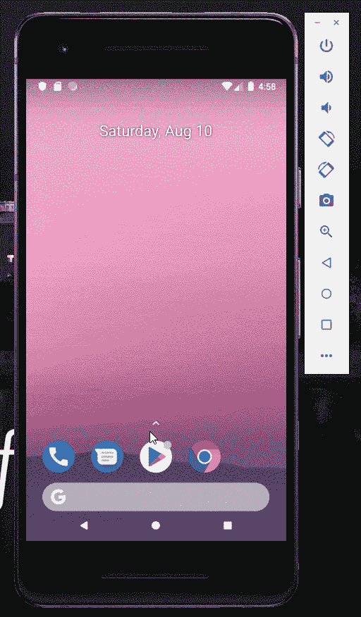

# 如何在移动和嵌入式设备上部署机器学习模型

> 原文：<https://www.freecodecamp.org/news/machine-learning-for-mobile-and-embedded-devices/>

## 介绍

感谢 Pandas、scikit-learn 和 Matplotlib 等库，使用 Python 中的简单机器学习(ML)算法开始探索数据集和进行一些初步预测相对容易。虽然，为了使这些训练好的模型在现实世界中有用，有必要使它们在网络或便携式设备上进行预测。

在我之前的两篇文章中，我解释了如何使用 [Heroku/Flask](https://towardsdatascience.com/flask-and-heroku-for-online-machine-learning-deployment-425beb54a274) 和 [Tensorflow.js](https://towardsdatascience.com/online-machine-learning-with-tensorflow-js-2ae232352901) 创建和部署一个简单的机器学习模型。今天，我将改为向您解释如何使用 TensorFlow Lite 在智能手机和嵌入式设备上部署机器学习模型。

## TensorFlow Lite

TensorFlow Lite 是谷歌开发的一个平台，用于在移动、物联网(物联网)和嵌入式设备上训练机器学习模型。

使用 TensorFlow Lite，所有工作流程都在设备内执行，避免了从服务器来回发送数据。这样做的一些主要优点是:

*   由于数据不必离开设备，隐私得到了提高(这可以让您应用诸如[差分隐私和联邦学习](https://towardsdatascience.com/ai-differential-privacy-and-federated-learning-523146d46b85)等技术)。
*   降低功耗，因为不需要互联网连接。
*   减少延迟，因为没有与服务器的通信。

TensorFlow Lite 提供对 Python、Java、Swift、C++等不同语言的 API 支持。

使用 TensorFlow Lite 的典型工作流包括:

1.  使用 TensorFlow 在 Python 中创建和训练机器学习模型。
2.  使用 [TensorFlow Lite 转换器](https://www.tensorflow.org/lite/convert/index)将我们的模型转换为适合 TensorFlow Lite 的格式。
3.  使用 [TensorFlow Lite 解释器](https://www.tensorflow.org/lite/guide/inference)在我们的移动设备上部署我们的机器学习模型。
4.  优化模型内存消耗和准确性。

为了减少机器学习模型的内存消耗，在过去几年中开发了几种技术[1]。一个例子是模型量化。

模型量化旨在减少:

1.  人工神经网络权重的精确表示(例如，将 34.3456657 转换为 34.3)。
2.  读取和存储中间激活函数的存储器访问成本。

因此，使用模型量化可以减少模型延迟和大小。这种技术的一个主要缺点是精度略有下降(根据应用的不同，这或多或少是很重要的)。

根据 TensorFlow Lite 文档，以 Inception_v3 图像分类器为例，使用模型量化会导致精度下降高达 0.8%。另一方面，使用模型量化可以将模型大小减少 4 倍(95.7MB 对 23.9MB)，并将延迟减少 285ms (1130ms 对 845ms) [2]。

在下面的例子中，我将演示如何在 Android 应用程序中使用预先训练好的模型。

## 示范

作为一个实际的例子，由于 TensorFlow Lite，我最近使用预训练的 Inception v3 图像分类器创建了一个 Android Studio 应用程序。

### 盗梦空间 v3

创建初始分类器是为了解决为图像分类任务创建非常大且深的神经网络所带来的一些限制。

几年前，为了解决图像分类任务，创建了由不断增加的层数和每层中的神经元组成的深度学习模型。采用这种方法，有可能获得更好的结果，但也导致了两个主要问题:

1.  训练我们的模型需要越来越多的计算能力。
2.  增加了过度拟合的可能性(使我们的模型在训练阶段表现得非常好，但在处理全新的数据时就不那么好了)。

初始分类器的创建旨在通过大量设计模型的特征来解决这些问题，从而提高训练速度。在过去的几年中，已经创建了不同版本的 Inception 分类器。在下面的例子中，我决定使用 v3 版本。

### Android 图像分类器

为了创建这个应用程序，我决定使用 Android Studio 作为 IDE。这样，集成所有需要的 TensorFlow Lite 依赖项来加载 Inception v3 模型就相对容易了。

我连续决定将这个应用程序分成两个主窗口:

*   在第一个例子中，欢迎用户并要求用户选择要使用的图像分类器(在这种情况下是“初始量化分类器”)。然后，用户被要求拍摄他们想要分类的物体的照片，最后照片被裁剪。在这种情况下，有必要裁剪图像，因为初始分类器只将方形图像作为输入。
*   在第二个窗口中，用户最后被要求点击“分类图像”按钮，以便返回由分类器做出的 3 个最可能的预测。

Simple Android Image Classifier

为了实现这个项目，我参考了 Michael Shea 和 TensorFlow Lite 文档实现[3，4]。

如果你有兴趣自己测试这个应用，所有的代码和应用的 Apk 都可以在[我的 Github 库](https://github.com/pierpaolo28/Artificial-Intelligence-Projects/tree/master/Google%20AI%20tools/TensorFlow-Lite-Image-Classifier)中找到。

如果您计划使用 TensorFlow Lite 开始自己的项目，他们的[文档](https://www.tensorflow.org/lite/guide/get_started)可能是开始的最佳地方。

## 联系人

如果你想了解我最新的文章和项目[，请关注我](https://medium.com/@pierpaoloippolito28?source=post_page---------------------------)并订阅我的[邮件列表](http://eepurl.com/gwO-Dr?source=post_page---------------------------)。以下是我的一些联系人详细信息:

*   [Linkedin](https://uk.linkedin.com/in/pier-paolo-ippolito-202917146?source=post_page---------------------------)
*   [个人博客](https://pierpaolo28.github.io/blog/?source=post_page---------------------------)
*   [个人网站](https://pierpaolo28.github.io/?source=post_page---------------------------)
*   [中等轮廓](https://towardsdatascience.com/@pierpaoloippolito28?source=post_page---------------------------)
*   [GitHub](https://github.com/pierpaolo28?source=post_page---------------------------)
*   [卡格尔](https://www.kaggle.com/pierpaolo28?source=post_page---------------------------)

来自本文的封面照片[。](https://tipsmake.com/google-launched-tensorflow-lite-10-for-mobile-devices-and-embedded-devices)

## 文献学

[1] Nimit S. Sohoni，Christopher R. Aberger 等，低记忆神经网络训练:技术报告。访问时间:[https://arxiv.org/pdf/1904.10631.pdf](https://arxiv.org/pdf/1904.10631.pdf)

[2]模型优化，TensorFlow。访问网址:[https://www . tensor flow . org/lite/performance/model _ optimization](https://www.tensorflow.org/lite/performance/model_optimization)

[3] Michael Shea，TensorFlow Lite Inception 模型 Android 教程。访问时间:[https://www.youtube.com/watch?v=8zQsAl2z4iU](https://www.youtube.com/watch?v=8zQsAl2z4iU)

[4] TensorFlow Lite 文档，TensorFlow Lite 图像分类 Android 示例应用。访问位置:[https://github . com/tensor flow/examples/tree/master/lite/examples/image _ classification/Android](https://github.com/tensorflow/examples/tree/master/lite/examples/image_classification/android)