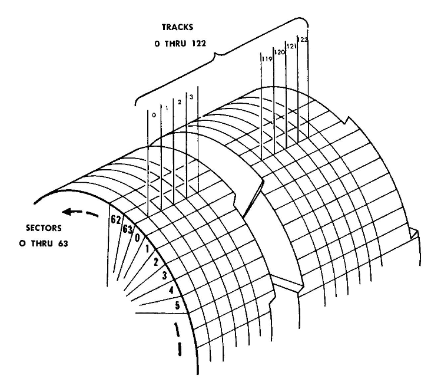
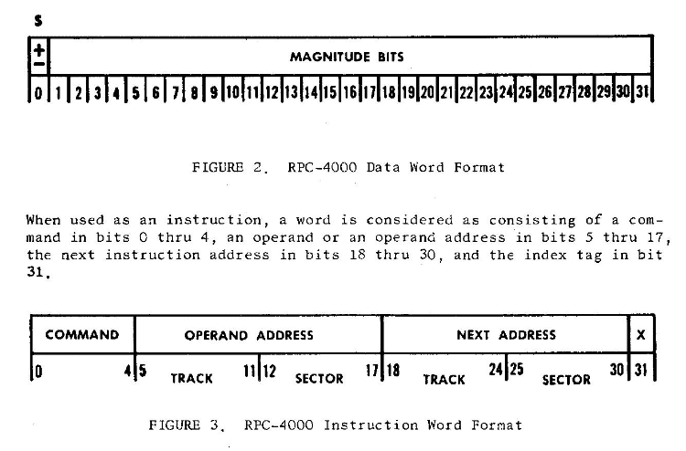
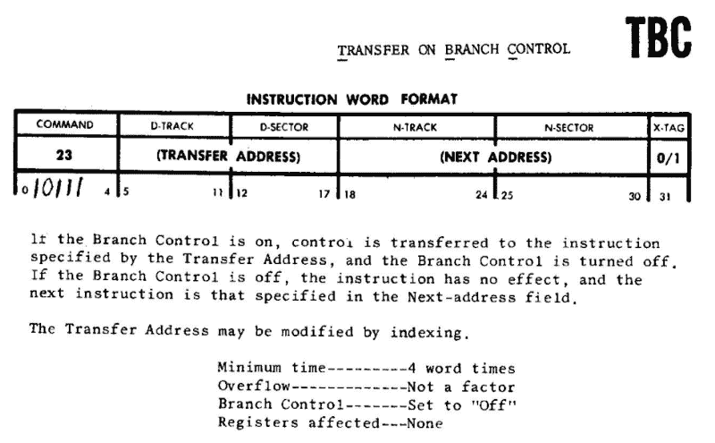
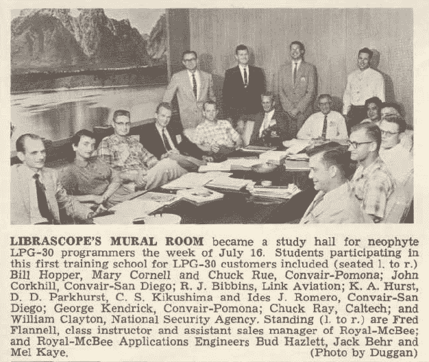

# 大男子主义程序员、鼓内存和对 20 世纪 60 年代机器码的法庭分析

> 原文：<https://www.freecodecamp.org/news/macho-programmers-drum-memory-and-a-forensic-analysis-of-1960s-machine-code-6c5da6a40244/>

### 真正的程序员不用 PASCAL

今天的程序员构建分布式应用程序和人工神经网络。他们使用功能反应式编程、开源 web 框架和无服务器环境。然而，冒名顶替综合症是真实存在的，程序员仍然互相指责对方不是“真正的程序员”

我在计算机历史博物馆当了多年的讲解员。“真正的程序员”这个比喻自软件诞生以来就一直存在。我可以用一个故事来证明。

故事从 1983 年的一封信开始，[真正的程序员不用 PASCAL](http://web.mit.edu/humor/Computers/real.programmers) ，是 Ed Post 写的。这封信发表在《数据自动化》杂志上，讨论了编程的“大男子主义”一面。这激怒了那些贬低高级语言用户为**而不是**“真正的程序员”的人

梅尔的故事是对那封信的在线回复。它于 1983 年 5 月 21 日由[艾德·纳特](https://en.wikipedia.org/wiki/Ed_Nather)寄往新闻组。

梅尔和埃德是一家打字机公司的同事，这家公司的业务扩展到制造计算机。他们的突破性成功是 [LGP-30](http://www.computerhistory.org/revolution/early-computer-companies/5/116) :一台[鼓式记忆计算机](https://en.wikipedia.org/wiki/Drum_memory)，配有柔性版印刷键盘和纸带阅读器。(本文中的标题图片是 LGP-30 的仪表板。)梅尔被指派为后继计算机 RPC-4000 重写一个流行的程序。

> 港口？那是什么意思？

梅尔离开公司后，艾德被要求重写部分程序。在这个故事中，他发现了代码中的一个无限循环，但这并不妨碍程序运行:

> 也许最让我震惊的是，我发现了一个没有经过测试的无辜循环。
> 没有测试。没有。常识告诉我们这必须是一个封闭的循环，程序将永远、无休止地循环。
> 然而，程序控制正好穿过它，安全地从另一边出去了。

Ed 发现闭环会导致溢出，于是重写了指令代码。溢出的结果是一个**跳转**指令，将程序的控制权转移到不同的内存位置。

这是一个伟大的故事。但这能证实吗？

### 法医代码分析:故事核实了吗？

我们的第一步是寻找为之编写程序的机器的技术细节。虽然这篇报道大量提到了 LGP-30，但该程序实际上是在 RPC-4000 上运行的。(记住，需要为这台新机器重新编写。)

两台机器都使用磁鼓存储器来存储程序。(有趣的事实:你的现代硬盘的大致等价物是磁鼓存储器、纸带、穿孔卡片或磁带！)当磁鼓以恒定速度在其下方旋转时，单行电磁磁头将读取/写入数据。以下是视觉参考:

Memory drum diagram. Source: [RPC-4000 Manual](https://archive.org/details/bitsavers_royalPrecirogrammingManual_8537458)

数据是从磁鼓的各个扇区和磁道存储和检索的。要了解更多关于数据格式的信息，我们可以查阅 RPC-4000 编程手册，archive.org 已经在网上扫描并保存了该手册。

在手册的第 20 页，我们找到了以下数据字图:

RPC-4000 Word Format Diagrams

命令字分为:

*   5 位用于命令
*   13 位用于操作数的磁道/扇区位置
*   13 位用于下一个命令地址的磁道/扇区

位 31 是**索引标签**，当其被设置时，激活索引寄存器:

> [索引寄存器]允许程序员编写一个使用索引指令的程序循环；每次通过时，变址寄存器中的数字被加到该指令的地址上，因此它将指向一系列数据中的下一个数据。

这个故事提到“索引位”是*位于地址和指令字*中的操作码之间的位*然而，上图显示索引标签位实际上位于第 31 位，在命令和地址之后。就我个人而言，我把这归因于作者在回顾代码和记录故事之间的几年里的错误记忆。*

*幸运的是，这并不影响故事的溢出方面。由于指令字被拉入内存并递增，索引位仍需要在上设置**，以便增量溢出**下一个地址**。***

*为了在循环中重新创建指令字，我们需要更多地了解程序是如何运行的。以下是故事关键部分的一段引文:*

> *他将正在处理的数据放在内存顶部附近，这是指令可以寻址的最大位置，因此，在处理完最后一个数据后，增加指令地址会使其溢出。
> 进位会给操作码加一，变成指令集中的下一条:跳转指令。
> 果然，下一条程序指令在地址位置零，程序高高兴兴地上路了。*

### *假设的实现:“给我看看比特！”*

*这里有一个潜在的指令，可能是故事中引用的**跳转指令**:*

**

*我们可以看到命令位是 **10111** 。如果**分支控制**关闭，“下一条指令是下一个地址字段中指定的指令。”因此，一种假设的情况是，在溢出之后，寄存器(使用管道来表示位域之间的分隔)读取:*

***10111 | 0000000 | 000000 | 0***

*往回推断，在递增和溢出之前，寄存器应该是:*

***10110 | 1111111 | 111111 | 1***

*完成这个实现的一个有趣的副作用是，使用的指令并不重要。RPC-4000 中的每条指令都包括下一条指令的地址。索引位溢出到下一个地址字段将导致跳转到该地址，而与命令位无关。*

### *收场白*

*

Group photo from the August 1956 Librazette* 

*梅尔·凯耶(图中最右边站着的人)继续工作，最终退休。一位名叫安东尼·库佐的粉丝在 2014 年发帖称，他试图与梅尔取得联系:*

> *我最终设法联系上了梅尔，但不幸的是，我把他吓跑了。那是另一天的故事……:-/([来源](https://news.ycombinator.com/item?id=7869771))*

*出于对梅尔隐私的尊重，我不会发布任何个人信息，坚持节目和故事。如果有人知道梅尔对他的网络名气的感受，我很想听听你的意见。*

> *我没有和 Mel 保持联系，所以我不知道他是否曾经屈服于那些逝去的日子以来淹没编程技术的变革浪潮。我倾向于认为他没有。—艾德·纳特*

**其他来源:**

*   *[*维基百科关于梅尔的故事的页面*](https://en.wikipedia.org/wiki/The_Story_of_Mel)*
*   *[*梅尔的 RPC-4000 二十一点游戏手册*](http://bitsavers.trailing-edge.com/pdf/royalPrecision/RPC-4000/programWriteups/W1-01.0_Blackjack_Game.pdf)*
*   *真相永远不会妨碍一个好故事 *简·霍华德·布伦万德**

*戴夫在 IBM 从事开发人员关系工作。出于某种原因，IBM 没有 RPC-4000 的 SDK。*