# 苹果 MacPad Pro 会是什么样子？

> 原文：<https://www.freecodecamp.org/news/macpad-pro-two-worlds-united-a8c6f4c51eb3/>

本杰明·班尼斯特

# 苹果 MacPad Pro 会是什么样子？

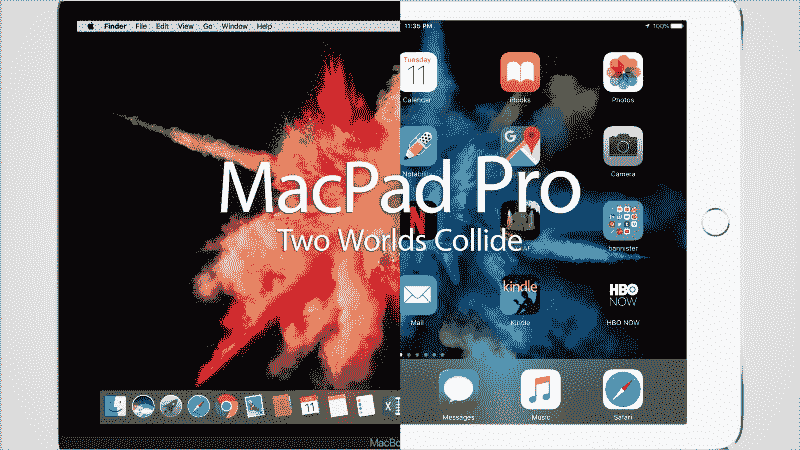

Let’s conceptualize an Apple MacPad Pro. Image: [benjamin bannister](http://www.benjaminbannister.com/)

苹果创造了许多近乎神奇的设备，丰富了我们的生活。他们的产品散发着超高级的设计，具有多种有用的功能，并由精制的材料制成。他们变瘦了。它们变轻了。(但这些价格永远不会变小。)我们因此爱他们。

但是仍然有一个技术圣杯:**一个可以成功融合使用笔记本电脑和平板电脑体验的设备。**

今天，我将带你开始一段猜想一款理论上的 **MacPad Pro** 的设计和规格的旅程。

> ***MacBook Pro+iPad Pro = MacPad Pro***

> “我们强烈感觉到，客户并不是真的在寻找融合的 Mac 和 iPad，……你会开始以不同的方式妥协。”—苹果 CEO 蒂姆·库克[2015 年](http://www.independent.ie/business/technology/tim-cook-apple-wont-create-converged-macbook-and-ipad-34201986.html)

好吧，早在 2010 年史蒂夫·乔布斯就说过[没人会去买一个大的 iPhone](http://money.cnn.com/2015/01/19/technology/steve-jobs-apple/) 。

看看结果如何。最新的 [iPhone 7 Plus 在发布后几个月](http://www.reuters.com/article/us-apple-iphone-idUSKCN11L0AD)就在全球*售罄。*

*不管告诉我们的是哪条线，所有关于苹果走向的线索都在他们当前的产品线中。*

### *为什么 MacPad Pro 一直没有发布？*

*一个可能的原因:**因为产品自相残杀。**如果苹果发布 MacPad Pro，它将吞噬 MacBook Pro *和* iPad Pro 的销量。*

*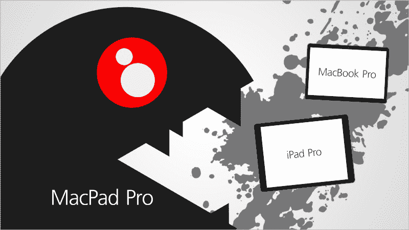

Cannibalization doesn’t allow for much coexistence. Lots of stylized paint will spill. Image: [benjamin bannister](http://www.benjaminbannister.com/)* 

*这些产品是两个收入来源，现在将合二为一。*

*苹果很可能在等待产品发布的时机——因为他们可以。为什么要发布一款混合动力车来蚕食两个产品类别的销售，而他们可以在几年内发布这些产品线？这是聪明的生意。*

*但是正如他自己曾经说过的:*

> *"如果你不拆自己的台，别人会拆的."— [史蒂夫·乔布斯](https://www.goodreads.com/quotes/908575-one-of-job-s-business-rules-was-to-never-be-afraid)*

*在商业中，自相残杀是不可避免的。苹果可以按照他们的条件来做。或者他们可以让竞争对手——如微软 Surface——[—蚕食这一新兴产品类别的市场份额](http://appleinsider.com/articles/16/10/21/microsoft-surface-sales-boom-amid-tepid-ipad-demand)。*

*MacPad Pro 尚未发布的第二个可能原因是*它还没有准备好*。从历史向我们展示的 iPhone 和 iPad 来看，苹果在准备好的时候发布新产品。不会太早，也不会太晚，但总是准时。如果他们决定自相残杀，这不是*的问题，而是*什么时候*的问题。**

*让我们来谈谈阻碍该产品发布的主要障碍有哪些。*

### *用户体验和用户界面的融合*

*实际制作 MacPad Pro 的第一个主要障碍是如何以直观和自然的方式将两个不同平台的**用户界面**(UI，——*外观*)与**用户体验**(UX，——*使用感受*)融合在一起。*

#### *用户界面*

*如果你研究多年来的 MacOS 和 iOS 操作系统，你会发现界面渗透已经开始。iOS 最初是通过 iPhone 将电脑的元件放入你的口袋，而 macOS 已经将 iPhone 的更多部分整合到笔记本电脑中。*

**示例 1:*iPhone 上的 iMessage 外观和工作方式与 iPad/Mac 上的 iMessage 相似:*

*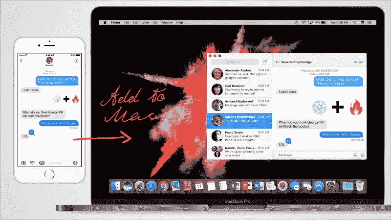

The first sign of a merging. Image: [benjamin bannister](http://www.benjaminbannister.com/)* 

*例 2: 现在，iPhone/iPad/Mac 上的电子邮件几乎完全相同。你还能分辨出哪个是哪个吗？*

*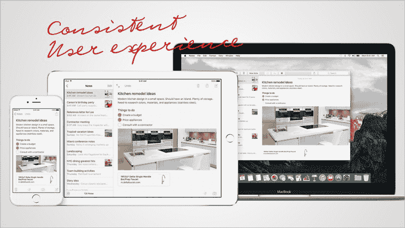

A consistent interface creates a seamless experience across many devices. This is good UI and UX. Image: Apple* 

*当你的设备开始看起来一样，在尺寸和功能上变得几乎一样时，你必须问:“为什么我有一台笔记本电脑*和一台平板电脑*做同样的事情？为什么不结合？”*

*

You may never question Miranda about ANYthing. Image: [benjamin bannister](http://www.benjaminbannister.com/)* 

#### *合并用户界面*

*所以不同设备上的应用看起来都差不多。我们现在如何在视觉上区分使用电脑的*和使用平板电脑的*？***

**让我们看看竞争对手在做什么。微软 Surface Pro 是一款具备平板电脑功能的笔记本电脑。这是 Windows 10 操作系统:**

**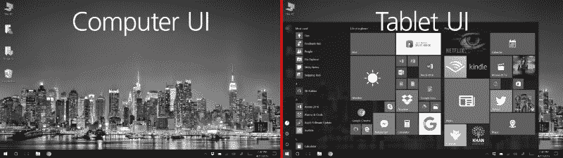

Microsoft Surface Pro, computer and tablet modes. Image: [benjamin bannister](http://www.benjaminbannister.com/)** 

**用户界面各不相同。左边看起来像是一个普通的电脑桌面，当你想做电脑的事情的时候。当你想做平板电脑的事情时，右边是应用程序方块。您可以通过硬件中嵌入的按钮在它们之间切换，或者单击软件中的 Windows 图标。**这是好 UX。****

**微软的系统很不错，我说“不错”是因为还没有开发出足够多的应用程序来充分利用他们的平板电脑模式。你将得到一台拥有平板电脑功能的笔记本电脑*。***

**我们来看看苹果的 macOS:**

**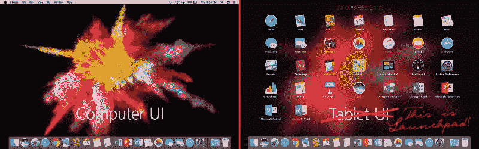

MacBook Pro, computer and tablet modes, wait, the right is just Launchpad. Image: [benjamin bannister](http://www.benjaminbannister.com/)** 

**等等，macOS 已经有了与 Windows 类似的独特界面——除了 MacBook 没有把自己作为平板电脑来销售。**

**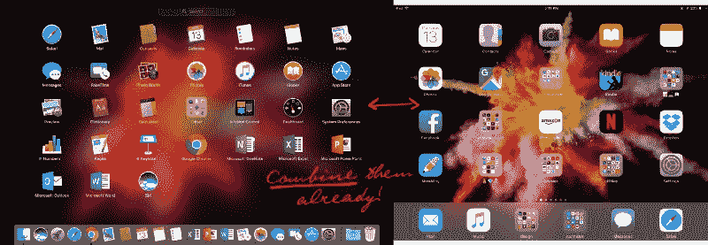

Who’s trying to be who? macOS and iOS.** 

**这也是苹果无可争议的优势所在。他们有一个很棒的电脑操作系统*和*一个拥有数百万应用程序的奇妙的平板电脑体验。macOS 已经有了一种在“笔记本电脑模式”和“平板电脑模式”之间切换的方法，只需一个五指手势。把它们结合起来就行了。**

> **障碍 1:组合操作系统界面。解决了。**

#### **UX**

****UX 是产品的全部体验。**从在店内看到产品展示，到你带回家的包装，再到使用和互动的乐趣。这一经历的每一步都可以被分解成更小的 UX 区域。产品展示、包装施工。**

**用户界面设计是 UX 的一个子集。**

**你如何将平板电脑上的互动体验与手指融合在一起；在笔记本电脑上与触控板/鼠标互动？他们本质上是两个不同的系统。**

**让我们看一个产品在两个平台上，这样你就知道我的意思了。**

***举例:*MAC OS 和 iOS 上的微软 Word**

**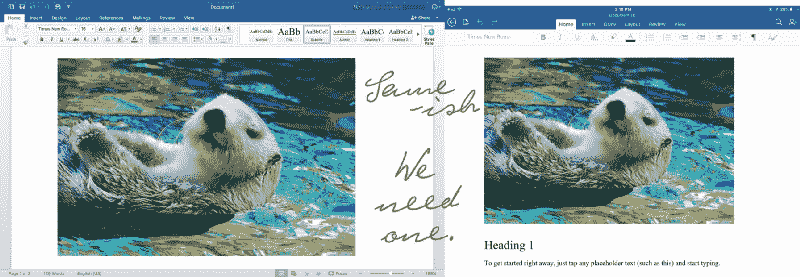

The left is the full version of Word, the right is a “light” tablet version.** 

**在一台设备上安装同一软件的两个不同版本是不好的 UX。我们可以在笔记本电脑上放置更多按钮的原因是因为鼠标可以点击它们，但你需要在平板电脑上放置更大的手指按钮。**

****这大概是蒂姆·库克所说的最大的“妥协”**。**

**MacPad Pro 被认为是结合了*两个*不同的设备。作为消费者和用户，我希望能够在这两款设备上使用我*为*支付的软件。我也想要一个设备，而不是两个。**

**嗯，*不是所有的*app 都有两个版本。主要的是苹果和微软的办公套件。对于其他应用程序来说，这是一个版本或其他版本。**

**可能的解决方案是保持所有应用程序不变。让它像 Surface 一样:提供一个操作系统，包含两个系统的应用程序。**

> **障碍 2:保持当前所有的应用软件不变。**

#### **用户输入**

**我们现在继续讨论用户如何与产品交互。在平板电脑上，我们使用手指，在笔记本电脑上，我们使用触控板。虽然拥有一体化的输入解决方案是件好事，但我们使用设备的方式各不相同。因此，解决方案是选择不同的交互方式。**

**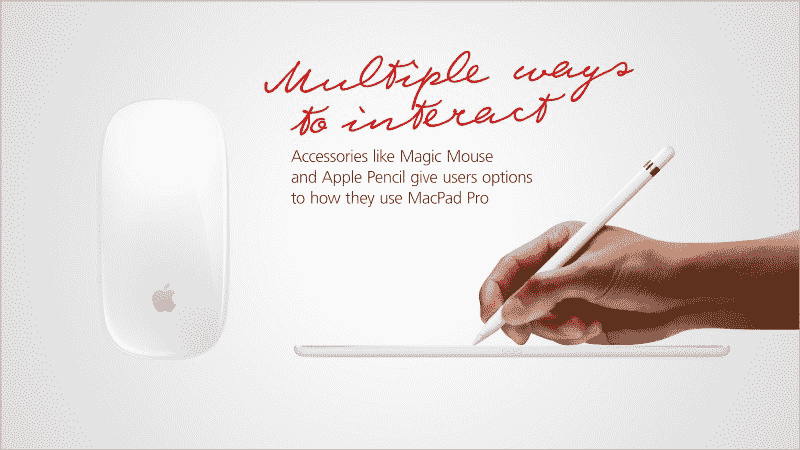

People use devices differently, and thus we need different inputs. Image: [benjamin bannister](http://www.benjaminbannister.com/)** 

**Apple Pencil 可以供画画的艺术家使用，Magic Mouse 可以供喜欢鼠标的人使用。你也有一个触控板，你有你的手指。一个设备，不同的使用方法。**

> **障碍 3:用户偏好的多种输入。**

### **规范**

**现在是有趣的部分。让我们来看看 MacPad Pro 可能具有的技术规格:**

**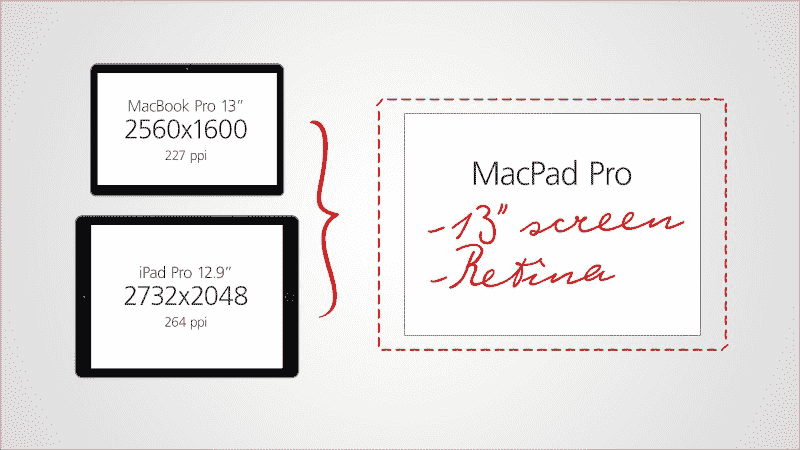

A 13" Retina display is nearly guaranteed. Image: [benjamin bannister](http://www.benjaminbannister.com/)** 

#### **显示**

**最受欢迎的 MacBook Pro 是 13 英寸的型号。iPad Pro 最初的显示屏尺寸为 12.9 英寸。逻辑表明第一代屏幕 MacPad Pro 很可能会有一个 13" 的**对角线标签。这是一个符合专业用户期望的尺寸。****

**分辨率呢？当前规格如下:**

*   **MacBook Pro 13 英寸，2560 x 1600，每英寸 227 像素**
*   **iPad Pro 12.9 英寸，2732 x 2048 英寸，每英寸 264 像素**

**无论 iPad 的尺寸大小，其长宽比都保持一致。笔记本电脑的长宽比不断变化。我的最佳猜测是 MacPad Pro 将保持 iPad 的比例和分辨率，因为 macOS 可以适应屏幕比例。**

**视网膜(高像素密度)显示器是专业标签的期望。**

**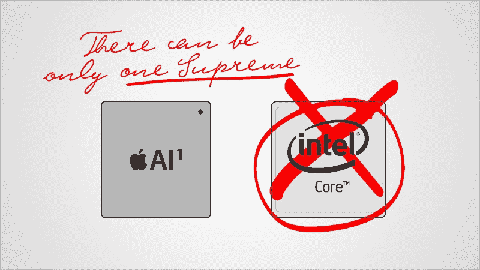

It’s not you, it’s me. Get that red Sharpie out, Ems. Image: [benjamin bannister](http://www.benjaminbannister.com/)** 

#### **处理器**

**当前的 MacBook Pros 拥有双核**英特尔酷睿 i5/i7** ，运行在 *x86 架构(具有 64 位能力)*上。目前的 iPad Pro 有一个**苹果 A9X** 芯片，运行在 *ARM 架构(具有 64 位能力)*上。那是什么意思？简单来说:你不能只是把它们结合起来；一个运行在另一个上需要大量的编码。**

**先说轻薄的 *MacBook* ，它有一个*英特尔酷睿 M* 处理器。Anandtech 对 iPad Pro 的 A9X 和 Intel Core M 做了一个[比较，它们在处理能力上基本上已经趋同。不幸的是，Core M 芯片对于一个 *Pro* 标签来说是不够的。](http://www.anandtech.com/show/9766/the-apple-ipad-pro-review)**

**苹果为 iPad 制造自己的处理器，但笔记本电脑依赖英特尔。如果苹果在任何时候*很快*推出 MacPad Pro，那么*将不得不*采用英特尔处理器。**

**如果我是苹果，我会想用自己的芯片。这是最后一个障碍:**处理器是一个妥协**。他们正在等待他们的 A 芯片在处理能力方面赶上或完全超过英特尔酷睿 i5/i7。此外，苹果需要支付许可费才能使用英特尔的芯片。在某个时候断绝这种关系会减少这种额外的成本。**

**最终结果是苹果想要自己的 A 标签处理器。**

> **障碍 4:处理器技术必须迎头赶上。**

#### **储存；储备**

**这是一个专业模型，所以最小的存储量是必要的。安装笔记本电脑应用程序*和*移动应用程序、照片和视频以及操作系统本身都需要空间。**

**256GB 可能是基本型号，有 512GB 和 1TB 两种选择。**

#### **记忆**

**8GB 内存是 MacBook Pro 上的标配，对于大多数消费者来说已经足够了。 **8GB** 满足当前笔记本电脑应用的内存需求，超越 iPad Pro 的内存容量。可能会有一个**选项升级到 16GB** 。**

#### **制图法**

*   **如果苹果选择英特尔处理器，这将是英特尔 Iris Graphics 的升级版。**
*   **如果苹果创造自己的处理器，图形能力将直接实现到芯片中。**

#### **充电和扩展**

**将如何收费？一个雷电 3 (USB-C)端口，可用于充电、输出到显示器或 USB 3.1 扩展。**

#### **声音的**

**可能会有一个耳机和充电的闪电端口。[无 3.5 毫米插孔](http://bannistr.benjaminbannister.com/post/153508016136/apple-lightning-ripple-timeline-infographic-benjamin-ban)。抱歉。为了保持轻薄的设备外形，3.5 毫米插孔必须从所有未来的设备中移除。将包括一个 3.5 毫米的 Lightning 适配器(如 iPhone 7/7 Plus)。**

#### **扬声器**

**期望立体声。两个音频格栅将位于左右两侧(横向位置)。**

#### **触控 ID**

**触控 ID 将是决定外形的一个重要因素。我们有两种可能的情况:**

*   **如果触控 ID 保持在目前的位置，它将看起来像一个 iPad。**
*   **如果触控 ID 转向键盘(像最新的 MacBook Pro)，边框可以更薄。您仍然可以使用密码解锁您的设备。**

#### **智能键盘**

**自从微软发布 Surface Pro 的触摸/打字外壳以来，很明显，便携式键盘的未来将是一个薄键盘，兼作保护性屏幕外壳。**

**用于 iPad Pro 的苹果智能键盘遵循了与微软触摸键盘类似的设计，但在键盘中实现了支架。正因为如此，当从侧面看*时，就有这种不均匀的缝隙。通过添加触控板，智能键盘可以被拉伸，并且间隙会自行修复，无需进一步修改:***

**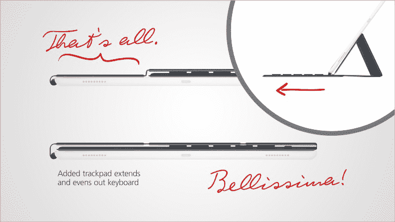

An added trackpad makes this Smart Keyboard easier on the eyes for Obsessive Compulsives. Image: [benjamin bannister](http://www.benjaminbannister.com/)** 

**至于按键，背光已经在第二代微软 [Type Covers](https://www.microsoft.com/en-us/surface/accessories/surface-pro-4-type-cover) 上可用，所以**期待背光按键**并不是一件难事。也可以实现更暗的键来指示键盘的 *Pro* 特性，并在视觉上与常规智能键盘区分开来。**

**在触控板中实现 Force Touch 怎么样？取决于它能平到什么程度。**

**

Trackpad and backlit keys added makes a smarter Smart Keyboard. Image: [benjamin bannister](http://www.benjaminbannister.com/)** 

#### **其他功能**

**我不想触及其他所有功能，所以期待典型的 Wi-Fi (802.11a/b/g/n/ac)规格，具有蜂窝选项和 Nano-SIM 卡支持，1200 万像素摄像头，4K 视频录制，双麦克风，720p Facetime 高清摄像头，可能更难的 Siri ，以及与当前产品一致的电池寿命。**

### **定价**

**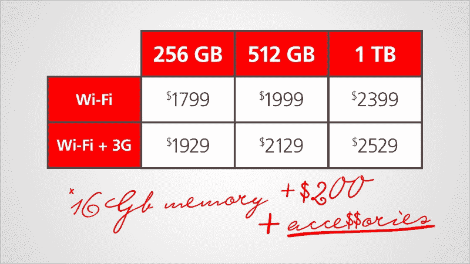

Pricing for base model, with storage and wireless options.** 

**MacPad Pro 的定价会是多少？很多。是的，会有面向大众的普通 MacPad，但 MacPad *Pro* 将面向 ***职业至尊*** 。专业的最高权威会有钱买它。**

**考虑到您将获得两个设备，但是现在使用一个硬件集；你不能准确地把两者的价格相加。我不是分析师，所以我的最佳猜测是从 1799 美元开始，外加额外的额外功能。**

> **价格可能从 1799 美元起。**

**一部 iPhone 7 Plus 售价 899 美元，人们连眼睛都没眨一下(只是退缩了一下)。1，799 美元到 2，399 美元是一个不错的范围，对于真正的苹果笔记本电脑/平板电脑来说是合理的，但即使这也是一个保守的估计。由于苹果公司的税收，这一定价也高于同类竞争机型。**

**配件包括 Apple Pencil(99 美元)、Magic Mouse(79 美元)、Smart Keyboard(169 美元)。**

### **摘要**

**你知道如果苹果今年*发布 MacPad Pro 会怎么样吗？(不会的。)由于担心自相残杀，苹果的股票最初会下跌，但一旦销售数据正常化，最终会回升。拍卖网站上可能会出现大量抛售 iPad 和 MacBook 的情况(我会卖掉我的 MacBook Pro、iPad mini 和 Surface Pro)。它将成为新的 It 产品。它将在几个月内售完。你知道，老样子。***

***混合计算行业最终会有像样的竞争。消费者将拥有一台专为媒体消费和全面生产力而设计的设备！在一个轻巧的神奇硬件中！***

***振作起来。至少 2-3 年内不要指望 MacPad Pro。所需的技术必须赶上苹果的愿景。但我的钱已经准备好了，如果它能早点出来的话。***

***你怎么想呢?你认为这种产品会很快出现吗？为什么？你希望你的 MacPad Pro 有什么特点？让我听听你下面的评论。***

> ***请为这篇文章鼓掌、发微博、分享来表达你的支持，并关注我来发现新事物。***

***

[**benjaminbannister.com**](http://www.benjaminbannister.com/)*** 

*****本杰明·班尼斯特:*****

*   ***[iPhone X 的未来:从现实到荒谬](https://medium.com/@benjaminbannister/the-future-of-the-iphone-x-from-the-realistic-to-the-absurd-f33bee3288ea)***
*   ***[SEO 秘密:逆向工程谷歌的算法](https://medium.freecodecamp.org/seo-secrets-reverse-engineering-googles-algorithm-92fad4f5a39)***
*   ***[为什么排版很重要——尤其是在奥斯卡颁奖典礼上](https://medium.freecodecamp.com/why-typography-matters-especially-at-the-oscars-f7b00e202f22)***