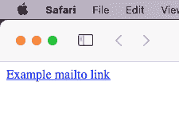
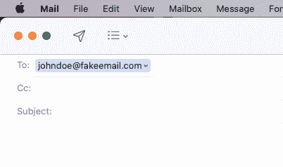
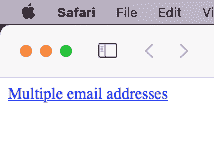
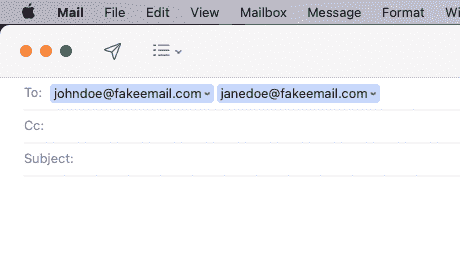
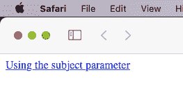
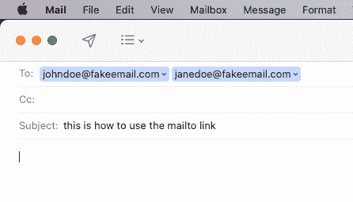
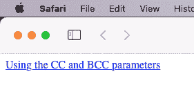
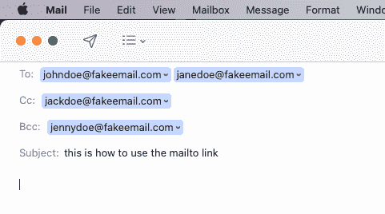
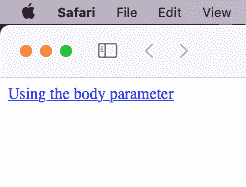
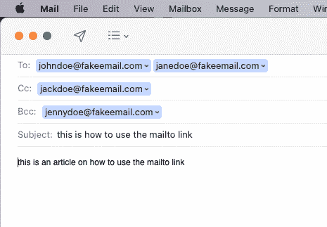

# Mailto 链接——如何创建 HTML 电子邮件链接[示例代码]

> 原文：<https://www.freecodecamp.org/news/mailto-link-how-to-make-an-html-email-link-example-code/>

mailto 链接允许用户使用默认的电子邮件客户端直接从网站发送电子邮件。但是如何在 HTML 中创建 mailto 链接呢？

在本文中，我将使用示例代码向您展示如何在 HTML 中创建 mailto 链接。

## 基本`mailto`链接语法

以下是 mailto 链接的基本语法:

```
<a href="mailto:johndoe@fakeemail.com">Example mailto link</a> 
```

在浏览器中，用户可以点击链接，这将打开他们的默认电子邮件客户端。

在本例中，当我点击链接时，它会打开我的邮件应用程序，并且电子邮件地址已经填充在`to`字段中。



使用这种方法，我可以快速发送电子邮件并返回网站。

## 如何向 mailto 链接添加多个电子邮件地址

您可以使用以下语法向 mailto 链接添加多个电子邮件地址:

```
<a href="mailto:johndoe@fakeemail.com, janedoe@fakeemail.com">
    Multiple email addresses
</a> 
```

使用逗号分隔多个电子邮件地址非常重要。

当我点击浏览器中的链接时，它将打开`Mail`应用程序，并在`to`字段中填充电子邮件地址。



## 如何向邮件链接添加主题行

下面是一些示例代码，展示了如何向 mailto 链接添加主题行。

```
<a href="mailto:johndoe@fakeemail.com, janedoe@fakeemail.com?subject=this is how to use the mailto link">
    Using the subject parameter
</a>
```

在电子邮件地址之后，您需要添加一个`?`来分隔电子邮件和`subject`参数。如果你省略了`?`，那么主题链接将不起作用。



## 如何将抄送和密件抄送添加到 mailto 链接中

这是一个向你展示如何添加抄送和密件抄送给 mailto 链接的例子。

```
<a
    href="mailto:johndoe@fakeemail.com, janedoe@fakeemail.com?cc=jackdoe@fakeemail.com &bcc=jennydoe@fakeemail.com &subject=this is how to use the mailto link">
    Using the CC and BCC parameters
</a>
```

在电子邮件地址之后，您需要添加一个`?`来分隔电子邮件和`CC`参数。您还需要在`BCC`和`subject`参数前添加一个`&`。



## 如何将 body 参数添加到 mailto 链接

这个例子展示了如何在 mailto 链接中使用 body 参数。这使您可以在电子邮件正文中添加文本。

```
<a
   href="mailto:johndoe@fakeemail.com, janedoe@fakeemail.com?cc=jackdoe@fakeemail.com &bcc=jennydoe@fakeemail.com &subject=this is how to use the mailto link &body=this is an article on how to use the mailto link">
    Using the body parameter
</a>
```

您需要在`body`参数前添加一个`&`。



## 使用 mailto 链接有缺点吗？

使用 mailto 链接的一个缺点是，它确实经常被用户视为垃圾邮件。不幸的是，许多垃圾邮件发送者会使用这个选项向用户发送电子邮件。所以当你使用它的时候请记住这一点。

## 使用 mailto 链接的优势

使用 mailto 链接的一个很好的理由是，如果你向一群你认识的人发送电子邮件。如果整个小组都使用默认的电子邮件客户端，那么使用 mailto 链接会是一个比联系表单更好的选择。