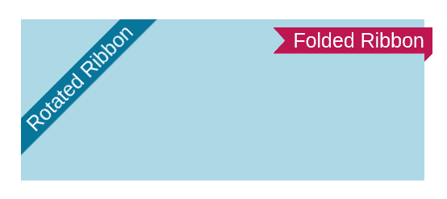
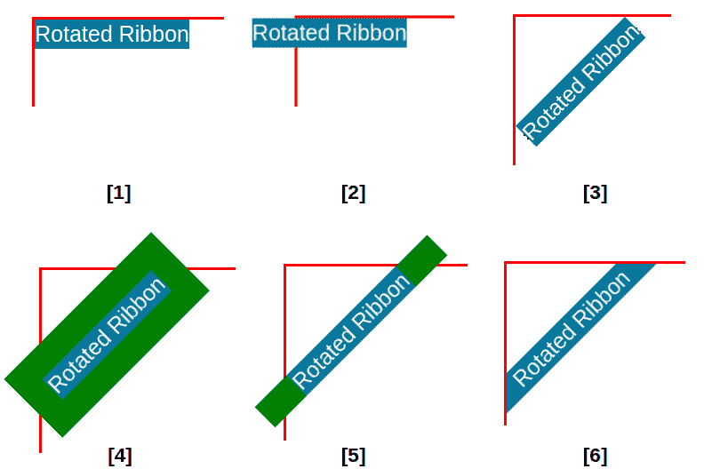
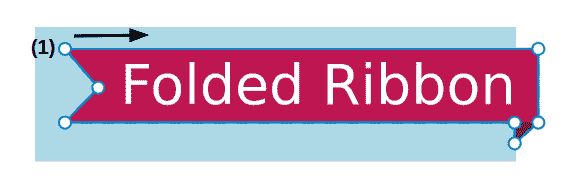
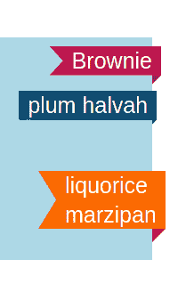

# 如何为你的网站创建一个 CSS 专用的功能区

> 原文：<https://www.freecodecamp.org/news/make-a-css-only-ribbon/>

你有没有注意到网站上那些花哨的丝带，提醒用户一些特殊的功能或事件？拥有它们很好，但是对于许多开发人员来说，创建它们是一场噩梦。

你可以很容易地找到这样一个组件的大量现成代码，但是它们不容易更新。您还必须处理大量的试验和错误，直到您让它们正确工作。

在这篇文章中，我将向你展示如何用一些简单的 CSS 代码创建两种类型的 ribbons，在这里你不需要为调整很多值而烦恼。

以下是我们将在本文中创建的内容:



Rotated Ribbon & Folded Ribbon

下面是这两种丝带的完整代码，所以你可以看到它是多么简单:

[https://codepen.io/t_afif/embed/preview/55e02b7d8b1dffb5c1a63473d5724dee?default-tabs=css%2Cresult&height=300&host=https%3A%2F%2Fcodepen.io&slug-hash=55e02b7d8b1dffb5c1a63473d5724dee](https://codepen.io/t_afif/embed/preview/55e02b7d8b1dffb5c1a63473d5724dee?default-tabs=css%2Cresult&height=300&host=https%3A%2F%2Fcodepen.io&slug-hash=55e02b7d8b1dffb5c1a63473d5724dee)

<details><summary>Click to see the full code</summary>

```
 <div class="box">
    <div class="ribbon-2">Folded Ribbon</div>
  </div>
  <div class="ribbon-1 left">Rotated Ribbon</div>
  <div class="ribbon-1 right">Rotated Ribbon</div> 
```

```
 .ribbon-1 {
    position: fixed;
    background: #08769b;
    box-shadow: 0 0 0 999px #08769b;
    clip-path: inset(0 -100%);
  }
  .left {
    inset: 0 auto auto 0;
    transform-origin: 100% 0;
    transform: translate(-29.3%) rotate(-45deg);
  }
  .right {
    inset: 0 0 auto auto;
    transform-origin: 0 0;
    transform: translate(29.3%) rotate(45deg);
  }

  .ribbon-2 {
    --f: 10px; /* control the folded part*/
    --r: 15px; /* control the ribbon shape */
    --t: 10px; /* the top offset */

    position: absolute;
    inset: var(--t) calc(-1*var(--f)) auto auto;
    padding: 0 10px var(--f) calc(10px + var(--r));
    clip-path: 
      polygon(0 0,100% 0,100% calc(100% - var(--f)),calc(100% - var(--f)) 100%,
        calc(100% - var(--f)) calc(100% - var(--f)),0 calc(100% - var(--f)),
        var(--r) calc(50% - var(--f)/2));
    background: #BD1550;
    box-shadow: 0 calc(-1*var(--f)) 0 inset #0005;
  }

  .box {
    max-width:500px;
    height:200px;
    margin:50px auto 0;
    background:lightblue;
    position:relative;
  } 
```</details> 

## 如何用 CSS 创建一个旋转的功能区

在大多数情况下，这种类型的色带用于在屏幕顶部放置一条固定的信息。但是我们也可以在页面的元素内部使用它。

要了解如何创建这样的功能区，让我们来看一个逐步说明:



Step-by-Step illustration of the Rotated Ribbon

首先，我们将元素放在屏幕的左上角。图中的红色边框是屏幕的边界(或要放置功能区的元素)。

```
.ribbon {
  position: fixed;
  inset: 0 auto auto 0;
  background: #08769b;
}
```

目前还没什么复杂的。如果你不熟悉`inset`属性，它不过是`top`、`right`、`bottom`、`left`的简称。

接下来，我们通过使用`translate(-29.3%)`向左执行平移。

翻译后，我们使用`rotate(-45deg)`旋转元素，代码变成这样:

```
.ribbon {
  position: fixed;
  inset: 0 auto auto 0;
  background: #08769b;
  transform-origin: 100% 0; /* or top left */
  transform: translate(-29.3%) rotate(-45deg);
}
```

你可能在想奇怪的值`29.3%`的秘密是什么？嗯，等于`100% * (1 - cos(45deg))`。

我将避免开始一个“无聊”的数学解释，但你可以看到，在我们做了旋转后，元素被完美地放置(它的两个顶角都接触到了边缘)。翻译是获得完美位置的关键。

你也可以注意到`transform-origin: top left`的用法。在第三步中，我必须从左上角旋转元素。

现在我们的元素已经正确放置，但是我们还有一些空白需要填充。我将使用一个“大”`box-shadow`来做到这一点。在图中，我用绿色来说明，但你应该认为它是和背景一样的颜色。

接下来，我们需要剪辑阴影，只显示它的左边和右边部分。为此，我将使用`clip-path`。我将使用`inset(0 -100%)`，这意味着剪辑顶部和底部的阴影(值`0`，并显示一些左右阴影(`-100%`)。

`100%`是一个需要很大的随机值。例如，它可以是`999px`或`100vmax`——任何确保我们保留阴影的左边和右边部分的值。

现在我们将在第六步看到最终结果。我们仍然有一些溢出的阴影，但是没有人能看到它们，因为我们把元素放在了屏幕的角落。

如果你将把丝带放在另一个元素里面，不要忘记在父元素上使用`overflow: hidden`，并且用`absolute`替换`fixed`

我们的最终代码是:

```
.ribbon-1 {
  position: fixed;
  inset: 0 auto auto 0;
  background: #08769b;
  transform-origin: 100% 0;
  transform: translate(-29.3%) rotate(-45deg);
  box-shadow: 0 0 0 999px #08769b;
  clip-path: inset(0 -100%);
}
```

只有 7 个声明，我们有我们的旋转丝带。你会注意到我们的代码是通用的，不依赖于文本内容。无论功能区的内容是什么，它总是会被正确地放置。你甚至可以有多行文本。

要将功能区放在右上角，我们只需更新几个值。更好的是，让我们用两个类来轻松控制位置:

```
.ribbon-1 {
  position: fixed;
  background: #08769b;
  box-shadow: 0 0 0 999px #08769b;
  clip-path: inset(0 -100%);
}
.left {
  inset: 0 auto auto 0; /* top and left equal to 0 */
  transform-origin: 100% 0; /* OR top right */
  transform: translate(-29.3%) rotate(-45deg);
}
.right {
  inset: 0 0 auto auto; /* top and right equal to 0 */
  transform-origin: 0 0; /* OR top left */
  transform: translate(29.3%) rotate(45deg);
}
```

我认为代码是不言自明的，左右之间的变化很容易理解。

## 如何用 CSS 创建一个折叠的丝带

让我们用与前一种相同的方式，通过一步一步的演示来处理第二种类型的丝带。


Step-by-Step illustration of the Folded Ribbon

首先，我们将把元素放在父元素的右边。

```
.ribbon-2 {
  --t: 10px; /* the top offset */

  position: absolute;
  inset: var(--t) 0 auto auto;
  padding:0 10px;
  background: #BD1550;

}
```

我将考虑一个变量来控制从顶部的偏移，这意味着我们可以通过调整该变量来轻松控制色带的位置。既然我们正在使用`position: absolute`，我们不应该忘记将`position: relative`添加到 Ribbon 的父元素中。

我还会在左右两边添加一些填充。`10px`背后没有特定的逻辑——你可以选择你想要的值。

现在我将引入另一个控制折叠部分的变量。我将使用这个变量来定义一个插入阴影`box-shadow: 0 calc(-1*var(--f)) 0 #0005`。

如上图所示，这个阴影将在底部添加一个半透明的黑色覆盖，其高度等于变量`--f`。我还将增加底部填充来包含那个阴影`padding: 0 10px var(--f)`。

接下来，使用同一个变量`--f`，我将把`right:0`替换为`right: calc(-1*var(--f))`，将色带向右移动一点。

到目前为止，代码如下所示:

```
.ribbon-2 {
  --t: 10px; /* the top offset */
  --f :10px /* control the folded part */

  position: absolute;
  inset: var(--t) calc(-1*var(--f)) auto auto; /* the right value is here*/
  padding:0 10px var(--f);
  background: #BD1550;
  box-shadow: 0 calc(-1*var(--f)) 0 inset #0005; 
}
```

代码可能看起来很奇怪(结果也是如此)，但在下一步我们创建最终形状时，一切都将变得有意义。

第四步(最后一步)，我们将引入`clip-path`来切割我们的元素。我还将添加另一个变量`--r`来控制丝带的箭头形状。

在添加剪辑路径之前，我将首先增加左填充，为箭头形状留出必要的空间:

```
padding: 0 10px var(--f) calc(10px + var(--r));
```

*   顶部填充等于`0`。
*   右填充等于`10px`(随机值)
*   底部填充由`--f`定义
*   左填充等于`10px`(与右相同)加上一个由新变量`--r`定义的值

现在让我们添加`clip-path`。这里有一个插图，可以帮助我们理解通向最终形状的道路。



Illustration of the clip-path

使用 7 个点定义路径。从点(1)开始，沿着箭头方向，我们有以下代码:

```
clip-path: polygon(
  0 0,  /* (1) */
  100% 0, /* (2) */
  100% calc(100% - var(--f)), /* (3) */
  calc(100% - var(--f)) 100%, /* (4) */
  calc(100% - var(--f)) calc(100% - var(--f)), /* (5) */
  0 calc(100% - var(--f)), /* (6) */
  var(--r) calc(50% - var(--f)/2) /* (7) */
)
```

如果你不熟悉`clip-path`也不要担心——这对你来说可能看起来有点奇怪。你不需要操纵那条路。你只需要更新 CSS 变量来控制整体形状。

这意味着通过改变一些值来更好地理解它是如何工作的，这是一个很好的尝试。

我们完了。我们的最终代码是:

```
.ribbon-2 {
  --f: 10px; /* control the folded part*/
  --r: 15px; /* control the ribbon shape */
  --t: 10px; /* the top offset */

  position: absolute;
  inset: var(--t) calc(-1*var(--f)) auto auto;
  padding: 0 10px var(--f) calc(10px + var(--r));
  clip-path: 
    polygon(0 0,100% 0,100% calc(100% - var(--f)),calc(100% - var(--f)) 100%,
      calc(100% - var(--f)) calc(100% - var(--f)),0 calc(100% - var(--f)),
      var(--r) calc(50% - var(--f)/2));
  background: #BD1550;
  box-shadow: 0 calc(-1*var(--f)) 0 inset #0005;
}
```

您可以调整变量的值以获得不同的结果:



就像我们对旋转的功能区所做的那样，我们可以更新一些值来将这个功能区的位置从右向左更改——但是这次我不会给出代码。我会让你试着独自找到它😉

这是一个很好的练习，可以找出哪些值需要更新，尤其是对于`clip-path`。如果你有任何问题，你可以随时联系我。

## 包扎

现在你知道如何使用 CSS 为你的网站创建漂亮的丝带了。

如果你想跟进这篇文章，我还有另外一篇关于创建丝带的文章。我详细介绍了如何创建一个旋转和折叠的丝带——一种我们在这里学到的混合。

感谢您的阅读！

更多 CSS 技巧，请关注我的 Twitter。
想支持我？你可以[请我喝咖啡](https://www.buymeacoffee.com/afif)或者[成为顾客](https://www.patreon.com/temani)