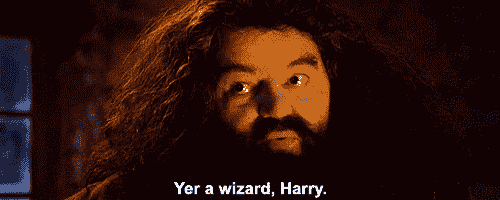

# 制作一个像里克·桑切斯一样说话的不和谐聊天机器人

> 原文：<https://www.freecodecamp.org/news/make-a-discord-bot-that-talks-like-rick-sanchez/>

你可以使用人工智能让一个不和谐的聊天机器人像你喜欢的角色一样说话。可能是瑞克和莫蒂的角色，哈利波特，粉红猪小妹，或者其他人。

我们刚刚在 freeCodeCamp.org YouTube 频道上发布了一个教程，教你如何创建一个不和聊天机器人，像你选择的角色一样说话。您将学习用 Python 和 JavaScript 创建机器人。

Lynn Zheng 创建了这个课程。Lynn 是 Salesforce 的一名软件工程师，也是一名游戏开发爱好者。她也是一个很棒的老师！

本课程包括以下几个部分:

*   收集数据
*   训练模型
*   部署模型
*   用 Python 构建不和谐机器人
*   用 JavaScript 构建不和谐机器人
*   保持机器人在线

创建这个令人敬畏的机器人会让你觉得自己像一个编程向导。

观看以下课程或 freeCodeCamp.org YouTube 频道上的[(1 小时观看)。](https://www.youtube.com/watch?v=UjDpW_SOrlw)

[https://www.youtube.com/embed/UjDpW_SOrlw?feature=oembed](https://www.youtube.com/embed/UjDpW_SOrlw?feature=oembed)

## 副本

(自动生成)

想制造一个说话像《瑞克和莫蒂》或《哈利·波特》中角色的不和谐机器人吗？也许你想像另一个喜欢的角色一样说话。

在本课程中，Lynn 将向您展示如何创建一个不和谐机器人，它使用人工智能像您选择的角色一样说话。

你好。我是林恩。我是一名软件工程师，业余游戏开发者，刚刚从芝加哥大学毕业。

在本教程中，我们将构建一个 discord AI 聊天机器人，它可以像你最喜欢的角色一样说话。

在我们开始之前，如果你还没有看过那个视频，请记住这个视频是不同的，更全面的。

所以继续看到底，最初的教程和我的第一个不和谐机器人是我和我的朋友在玩视频游戏时开的玩笑，它变得如此受欢迎真的让我惊讶，很多人都想基于那个教程建立自己的机器人。

因此，我决定更新该教程，以包括更多的角色，并向您展示如何找到您最喜欢的角色的数据。

我们将在此讨论的其他主题包括但不限于如何训练模型、如何部署模型、在此模型中可能会遇到的错误、训练和部署流程以及如何解决它们。

此外，我们将介绍如何用 Python 和 JavaScript 构建 bot。

最后，我们将介绍如何正确地将 bot 部署到一个不和谐的服务器上，并将其限制在特定的通道内，以及如何让 bot 无限期地运行。

我希望你很兴奋。

让我们进入教程。

首先，我们要为我们的角色寻找数据。

我最喜欢的来源不是 kaggle 抄本维基，而是从谷歌搜索出来的随机粉丝网站。

我的研究过程是这样的，我首先在 kaggle 上搜索，看看是否有预先制作的对话数据集。

例如，如果我们搜索 Rick 和 Morty，我们会得到这个格式良好的数据集，包括角色的名字和台词。

如果我们搜索哈利波特，这里有另一组数据，包括角色和他们说的句子。

因为我们正在构建一个聊天机器人，所以我们只需要数据中的这两列，设置角色名称并对齐他们的说话。

所以 kaggle 上的这些对话数据集非常符合我们的要求。

好了，如果我们成功地找到了一些关于 kaggle 的数据，我们就可以进入模型训练步骤了。

但是如果我们在 kaggle 上找不到我们角色的数据集呢？

比如我想找一个粉红猪小妹的数据集，看起来好像没有这个角色的数据集。

在这种情况下，我们可能需要找到媒体的原始记录，无论是视频游戏，还是节目中的卡通。

我发现抄本 wiki 有一些很棒的资源。

这里我们有一个电影节目、视频游戏、音乐剧和广告的列表。

例如，我找到了《粉红猪小妹》的剧本。

抄本维基上还有像蝙蝠侠这样的电影。

文字记录是这样的。

所以我们有他们的角色名，他们的动作或者他们说的台词。

我们将很快看到如何将这样的原始文本转换成我们在 kaggle 上看到的数据集。

除了抄本维基，你也可以用关键字抄本谷歌你的媒体名称。

比如我的第一个想法是基于游戏，单词结尾是你。

它在 kaggle 和抄本维基上都没有结果。

所以我所做的只是谷歌游戏名称和游戏副本。

碰巧这个 fandom 网站上有完整的游戏记录。

所以一定要利用你的谷歌搜索技巧来为你的角色寻找数据。

如果你对现实生活中的人物而不是虚构的人物更感兴趣，你可以搜索采访脚本作为你的数据来源。

如果你想创建一个聊天机器人，像你自己或你的朋友说话，你可以把你和你的朋友之间的短信视为对话，并手工制作你的数据集。

有很多方法可以为你的角色获取数据。

所以要有创意。

现在我们来看看如何将原始文本转换成数据集。

现在，假设我们已经找到了我们的原始抄本，让我们看看如何把它变成一个两列字符行数据集。

假设我们把这个粉红猪小妹的抄本复制到一个文本文件中。

现在我们去 Google colab 上传我们的数据文件。

现在我们创建了一个 Google colab 笔记本。

并用它们来解析我们的脚本。

所以我要把这个解析脚本命名为 ipnb。

而且我们打算从 Google colab 可以导入驱动，然后调用 drive 来挂载内容驱动。

这将允许我们从我们的谷歌驱动器读取数据。

好了，现在我们的驱动器已经安装好了，让我们导入操作系统，然后操作系统改变目录到内容，一个驱动器接一个驱动器。

然后我们看看里面有没有东西。

是的，我们有我们的 Peppa Pig dot txt。

因此，这里我们将导入正则表达式来解析我们的脚本，将解析结果放入 panda 的数据框中，并导出为 CSV 文件，就像我们在 kaggle 上看到的那样。

这将是我们的正则表达式模式。

你不必是一个专业的正则表达式来理解这一部分。

如果我们把模式带到这个网站，我们的测试是粉红猪小妹，你会看到我们有两个匹配捕获组，第一个是角色的名字，第二个是台词。

对于第二句台词“猪妈妈”,我们有了角色的名字和台词。

对，所以没关系，正则表达式。

现在，让我们定义一个存储数据的字典。

因此，我们知道我们需要结果数据框中的列名和列行，然后我们打开并读取每行的文件，将它与正则表达式模式进行匹配。

如果有匹配，我们从这个正则表达式匹配中提取 name 和 light，然后在这里把它追加到我们的字典中。

然后我们把这个字典转换成一个数据框架。

现在我们可以检查数据框，引用。

所以我们有名字叫粉红猪小妹说我是粉红猪小妹。

乔治发出猪妈妈发出的声音很好听。

我们也可以计算属于我们角色的行数。

所以我们做了一些 F 的名字等于粉红猪小妹。

我们看到 Peppa Pig 在我们的整个数据框架中有 38 行。

因此，我们的数据帧长度超过 100，Peppa Pig 有 1/3 的行。

最后一步是导出数据框。

所以 df.to，CSV，名字就叫粉红猪小妹。

csv 和我们将删除索引。

酷毙了。

现在我们应该有一个粉红猪小妹超负荷运转。

听到这个名字和台词。

这就是我们如何将这些原始抄本解析到一个文件中，该文件可以在我们的模型训练中使用。

接下来，让我们进行激动人心的台阶模型训练。

现在我们要训练模型。

进入我的 GitHub 库，链接到下面的描述并下载内容。

我们将使用这些模型火车上传工作流程 IP one MB，看起来像这样。

好了，现在我们的文件已经下载，我们解压内容。

这里我们有一个模型培训上传工作流程 dot ipnb。

我们将这个笔记本文件上传到 Google Drive，并在 Google colab 中打开它。

我们将训练一个 GPT 模型，这是创成式预训练变压器的缩写。

在运行时改变运行时类型。

确保选择 GPU，因为这将加速我们的模型训练。

现在我们在这里安装驱动器。

我们安装将要使用的变压器模块。

我们把目录换成我的驱动器。

这里是我们正在导入的所有模块。

如果我们使用来自 kaggle 的数据集，我们需要从 kaggle 获得我们的 API 密钥。

所以去我们的卡格尔个人资料，去帐户。

向下滚动到 API 密钥部分。

创建一个新的 API 令牌，并将该文件下载为 kaggle dot JSON。

我们回到 Google Drive，上传 kaggle dot JSON。

现在我们可以从 kaggle 下载我们的数据集，我们将使用哈利波特数据集作为例子。

因此，获取这些用户名和数据集名称。

我们的文件在这里第一部分. CSV。

不是因为文件名中有空格，而是因为文件名中有特殊字符。

因此，让我们检查一下数据文件的内容。

嗯，CSV 文件通常用逗号分隔，因此得名 CSV。

但是，这个看起来像是用分号隔开的。

因此，我们需要注意将数据读入熊猫数据框时的分号。

所以分隔是分号而不是逗号。

酷毙了。

因此，让我们对数据进行采样，看看里面有什么。

好了，我们有了角色和句子。

注意，这两个列名并不是我们所需要的。

我们希望将数据框的两列命名为 name 和 line，就像在此单元格中使用的一样，因此我们需要更改列的名称。

好吧，让我们重新采样数据。

看起来我们已经成功地更改了我们的列名。

现在让我们看看我们的数据有多大。

所以他只有 1000 左右的台词。

让我们看看我们的角色有多少行。

我们的角色有 155 行。

所以在这里我们把我们的角色名字改成哈利。

我们现在运行这个单元来创建一个上下文数据帧，它包括我们的角色正在说的当前行，以及该行前面的几行。

上下文数据框在这里很有用，因为我们正在创建一个对话聊天机器人。

我们希望根据对话上下文生成响应。

让我们对上下文数据框进行采样。

所以在清晰的背景下，我们的角色回应的一些事情没有问她似乎是一种遗憾。

很好，现在我们有了数据集，它将数据集分为训练集和测试集。

这是因为我们不想过度拟合模型。

在过度拟合的情况下，模型只会记住数据集中的线条，并使用准确的线条与我们对话，我们不希望我们希望对话更加有机。

因此，我们只在训练集上训练模型，并在测试集上评估模型。

所以我们继续运行这些单元来建立数据集，缓存检查点，在这里我们建立了模型。

我们将通过微调微软预先训练的 GPT small 来构建我们的模型。

这里的小是指模型中参数的个数。

还有中号和大号的。

一般来说，模型越大，训练的时间越长，但是模型可以变得越聪明。

我建议训练一个中等的模型，因为它很聪明，也不太难改变。

我的生产聊天机器人目前运行在一个有 1000 多个用户的服务器上，也是一个中型模型。

为了节省时间，在本教程中，我只训练了一个小模型。

你可以看到它正在下载模型。

这可能需要一些时间，因为它基本上是 300 兆字节。

这里有一些可能对你有用的超级参数。

例如，num train aprox 是训练 aprox 的数量。

这里定义为 4，这是模型在训练集中循环的次数。

只要模型没有过度拟合，增加训练时期的数量通常会产生更智能的模型。

因为该模型有更多的时间来循环通过数据集，并挑选出本质的细节。

还有一个超级参数叫做批量大小。

这是模型在更新其渐变之前将在批处理中看到的训练示例的数量。

我不建议改变这一点，除非你知道你在做什么，因为其他超参数，如学习率和温度可能对批量大小的变化很敏感。

但是，如果您在较大的数据集上训练较大的模型，并且遇到了内存错误，那么消除错误可能有助于减少批处理大小。

其余像元已配置为获取我们创建的上下文数据框，训练模型并将其保存到名为 output small 的文件夹中。

现在让我们运行这个主函数。

训练需要一些时间，我训练了我的中型模型 12 个纪元，花了大约两个小时。

所以在模特训练的时候，请坐下来吃点零食。

你可以在进度条上看到进展。好了，我们又回到了一个令人困惑的癌症。

这通常是指模型有多混乱。

如果一个模型有很大的复杂性，这意味着该模型对于选择哪些词来响应给定的情况感到非常困惑。

这个模型可能不是很聪明。

在我们的例子中，我们的数据集非常小。

它只有 150 多行。

因此，困惑是有意义的高，以减少困惑，我们可能需要训练更多的时代。

酷毙了。

但是现在训练已经完成，我们可以在这里加载并与模型聊天。

你好，作家朋友的名字改了。

所以让我们暂停一下。

魁地奇。

没有烂作家这种东西。

太好了，看起来我们的聊天机器人能够进行并保持对话。

现在，我们可以将模型推至 Huggy face，并开始构建我们的 discord 聊天机器人。

好了，现在让我们把目录改成内容文件夹。

因为我们会在那里努力。

我们做 pip 安装拥抱脸命令行客户端。

然后我们使用我们的凭据登录。

就在给 logging 分配了这个令牌之后，我们需要获取这个令牌来获取我们之后需要做的歌曲。

因此，我们可以创建一个存储库来存储来自命令行的所有模型，我的将被称为小哈利波特的对话。

我们的空模型库就在这里。

除了 get attributes 文件之外什么都没有，但是我们很快就会添加模型文件。

现在我们仍然有 Fs，它代表获取大文件存储，这堵墙允许我们推拉所有模型。

而且我们已经把这个代币换成了刚刚从上面复制的外卖。

这是我的用户名和令牌。

我们称之为我们的训练结果存储在这个输出小目录中。

然后，我们将目录更改为我们的对话框向上的小目录，因为我们需要从那里进行 git 添加和许可，我们看到了 get Fs 并检查了我们当前目录的内容，该目录应该是 dialogue GPT，small 她的父亲，并且还打印出了工作目录，以确保我们在内容内部。

酷毙了。

现在我们检查 Git 上的文件状态。

所以这些文件不是我们需要添加才能得到的。

所以我们做了一个 git add，这需要一些时间，因为 pytorch 模型的点很大。

我们还配置了全局用户名和用户电子邮件。

这些只是我的拥抱和基础凭证。

这将与消息初始注释一起出现。

最后，我们将推动模型。

大概是 400 兆因为 pytorch 模型本身也是 400 兆左右。

好了，看来推进完成了。

现在我们可以看到 pytorch 模型。

然而，在我们可以与 Huggy face 上的模型对话之前，我们还需要做一件事。

也就是说，你看这里，它被标记为文本生成。

然而，我们知道我们正在训练一个聊天机器人模型，我们希望我们的模型是对话式的。

为此，我们需要编辑模型卡。

因此，我们在这里创建了一个模型车，我们把我们想要的模型税，所以我们的税是会话。

我们用我们的模型卡来。

现在我们的模型被正确地标记为对话型。

如果我们进入主模型页面，我们可以在这里开始与模型聊天。

好了，现在我们已经把我们的模型推到了拥抱脸，我们准备在我们的不和谐聊天机器人中使用它。

现在我们有了模型，让我们在不和谐上建造不和谐机器人。

我有我的服务器租赁开发实验室。

我有两个通道，一个用于 Python 机器人，另一个用于机器人的工作。我们之所以为机器人提供单独的通道，是因为我们不希望机器人互相交谈。

因此，在我们建立了机器人之后，我们将学习如何正确地设置他们的权限，以便他们不会超出他们的专用通道。

所以我们去 discord，开发者页面，创建一个应用程序，我们需要每个机器人一个应用程序。

所以我们的名字就聊到 Python 了。

所以我们在这里创造了一个机器人。

而且我要把这个命名为哈利波特，bot，Python 并上传一个图标。

我们将在这里使用这个 API 令牌。

当我们在 Python 中创建我们的 bot 时，我们将托管我们的 bot 我们的 rapida 它，因此注册 repple.id 并在这里创建一个新的 Python repple 来命名那些 chatty，但我认为在这里，我们将需要存储我们的 API 令牌，用于 Huggy face 强调我们的环境变量。

这是环境变量秘密的顶部。

所以第一个会是拥抱脸令牌。

对于值，我们将转到我们的拥抱脸配置文件或配置文件 API tokus，复制 API 令牌，返回到这里并填写该值。

接下来，我们将创建这个核心令牌。

对于这个值，将转到这个 discord 开发者门户并复制令牌。

第三，在这里添加令牌。

我们的环境变量都设置好了。

接下来，我的 GitHub 存储库中有一个名为 court bot . p y 的 Python 文件。

所以我们从这里带来了代码，我将逐行解释代码。

从第一行开始，我们首先导入 OS 模块，它将帮助我们读取环境变量。

接下来，我们导入对查询 Huggy 人脸模型有用的模块。

最后，我们将导入折扣模块。

这里我有指向我的用户名的 API URL。

并与寻找一个机器人如下。

在 init 函数中，它接受一个模型名，对我来说就是对话 GPT·小哈利·波特。

然后，我们通过连接这个 API URL 来存储这个 API 端点，这个 API URL 是我的概要文件与模型名称的链接。

现在我们通过查看 Oh 的点环境拥抱脸令牌从系统环境中检索秘密 API 令牌。

接下来，我们格式化标题，你知道对 Huggy face 的要求。

对于授权部分。

我们放了不记名和拥抱脸标志。

接下来，我们将定义接收有效负载的 quorum 方法。

我们将有效负载作为 JSON 字符串进行转储。

并使用请求模块通过我们定义的请求头向 API 端点发出 HTTP POST 请求，请求头包含我们的拥抱脸 API 键并传递数据。

一旦请求完成，它应该给我们一个响应对象，我们从 UTF 八解码，并加载结果作为美国率，并返回到字符串。

接下来，你会找到一个名为 always 的异步函数吗？

接下来的两个函数定义基于 discord API。

两者都是异步函数。

第一个已经是了，这个函数会在 bot 登录的时候调用。

因此，当机器人正在记录时，我们将打印出机器人的名称和机器人 ID，以便我们知道机器人正在运行。

接下来，因为我们的机器人是聊天机器人，它需要响应消息。

因此，我们的消息是一个方法，每次机器人在通道中看到消息时都会调用这个方法。

因此，给定消息，如果消息来自机器人本身，机器人会忽略该消息，并且不回复它。

否则，它将与消息内容一起形成韩国有效载荷。

并使机器人更加用户友好。

当机器人等待来自模型的 HTTP 响应时，我们将它的状态设置为 typing，这样用户就会知道机器人正在生成它的响应。

所以这是一个带有 message.channel.tv 的同步调用。

我们称之为使用有效负载的软查询，并获得响应。

如果有一个有效的生成响应，则在此响应中将有一个生成的税字段。

我们将能够把它作为机器人的反应。

否则，响应中可能会有错误，我们只需记录错误消息，以便稍后进行调试。

最后，我们使用另一种异步方法将机器人响应发送到使用消息点通道点发送的通道。

这就是我们对机器人的定义。

在我们刚刚创建的关于传递模型名称的主函数中。

所以对我来说，这是 gptc 风格的小哈利波特和美国客户端运行，从环境变量中查找分数令牌。

很好，现在我们的机器人应该都设置好了，看起来像是我们频道的机器人。

在 OAuth two 选项卡中，我们将选择 bot。

而对于机器人权限。

你唯一需要的就是发信息。

因此，我们复制这个网址，粘贴在一个新的浏览器窗口，并邀请到我的服务器。

好了，现在我们看到我们的机器人已经出现，但是，它显示为离线。

所以我们需要运行 repple。

所以我们在这里点击运行。

rapport 正在安装我们所有的依赖项和导入项。

很好，现在我们的机器人已经登录为关于 Python 的哈利波特，这是它唯一的 ID。

我们去服务器吧。

而且现在机器人上线了不希望机器人出现在通用频道。

所以我们去频道设置权限。

高级权限添加一个 bot，我们删除它发送消息和保存更改的权限。

现在，让我们看看会发生什么，如果我在通用通道中输入一些东西，应该不会发生什么，因为机器人不应该能够发送消息。

尽管机器人在线，但什么也没发生。

现在这个机器人应该在这个 Python 机器人通道中工作。

所以让我们打招呼吧。

我们短暂地看到没有输入提示。

酷毙了。

这就是我们如何用 Python 制作一个机器人。

有一点要知道，你知道，raphoe，虽然它不是，因为我们取消了机器人在通用通道中发送消息的权限，它显示了一个异常，这完全没问题。

如果您不喜欢看到这个异常，您可以使用 try，accept 块并注销这个异常。

太好了。

所以现在我们要为 JavaScript 机器人重复这个过程。

所以我们回到 discord 开发者门户，创建一个新的应用程序。

这一次，我将称之为聊天机器人，JavaScript。

我会创造一个机器人。

回到包装，我们创建一个 node.js 应用程序。

打算叫它 chadic，认为 js。

我们又创造了两个环境变量。

第一个是拥抱脸令牌，从我的个人资料编辑个人资料复制我的 API 令牌，放在这里，并复制我的不和谐机器人令牌。

称这个为宫廷令牌并增加价值。

太好了。

现在我们已经设置好了环境变量。

转到我的 GitHub 库，有一个 discord bots.js 文件，其中包含我们将用于这个 JavaScript 聊天机器人的代码。

让我们复制粘贴。

我会一行一行地检查代码。

因此，首先，我们为 JavaScript 模块导入 discord CPI。

我们导入 fetch 来发出 HTTP 请求，就像 Python 中的 fetch 一样。

我们初始化一个新的 discord 客户端，并将模型 URL 定义为我的用户名和模型名。

所以这家伙就是 LGBT 小哈利波特。

这是在机器人准备就绪时调用的同一个回调函数，就像我们在 Python 中看到的 already 函数一样。

所以当 bot 准备好并登录后，我们打印出作为客户端用户 dot Tak 登录的信息。

这是另一个回调。

这一次所有的消息，我们使用一个异步回调，因为我们正在进行 HTTP 请求。

与 Python 脚本中一样，如果消息来自机器人本身，我们会忽略该消息。

通过检查消息点作者是否是机器人。

现在我们形成了有效载荷。

因此，有效负载是一个字典，包含带有文本消息内容的输入，这是机器人收到的消息。

我们再次使用 Huggy face API 键形成了请求头。

因此，我们从环境中读取 Huggy face token，处理点 m 点拥抱 face token 并形成头部。

在我们开始发出 HTTP 请求之前，我们将 bot 状态设置为 typing。

现在记录一个服务器。

因此，响应是使用 HTTP POST 调用 fetch 的结果，给定有效负载作为主体，使用 Huggy face 标记作为头。

我们将响应转换成 JSON 格式，并提取出生成的文本字段。

如果在响应中没有生成一个文本字段，而是在响应中包含一个更窄的字段。

这意味着电路板遇到了一些错误，我们可能希望打印出错误以便进一步调试。

现在我们有了机器人的响应，我们可以清除他的输入状态，并将消息作为回复发送到通道。

这结束了我们的客户端 dot 消息调用的定义。

在这里，我们使用 discord 令牌登录。

现在让我们邀请老板到我们的服务器。

所以我们去找 o auth。

检查机器人，它唯一的权限是发送消息。

我们在一个新的浏览器窗口中复制这个粘贴，并邀请它到我们的服务器。

很好，看来我们又有一个机器人了。

记得点击保存更改。

否则，机器人图标不会显示。

然而，现在我们有了我们的机器人，它还没有登录。

所以我们需要回到 repple 来运行我们的脚本。

但是在我们运行 repple 之前，让我们确保机器人不能访问通用通道。

它也不能访问 Python 通道，因为它不应该去那里。

所以在权限中，我们发现了这个关于 JavaScript 的聊天。

取消其发送消息的权限。

并且永远记得保存更改。

我们在 Python 频道做了同样的事情，然后转到爵士频道。

这一次，我们需要删除的是 Python bot。

所以这个 Python bot 不应该能够向这个 JavaScript 通道发送消息。

现在我们回去运行我们的 raphoe dotnet。

如果你看到这个错误，这意味着 NPM 试图安装的不和谐版本是错误的。

你可以看到这些警告，最新的不和谐模块是不兼容的 rapida 其版本的节点，或 NPM。

所以我们需要手动修改 package dot JSON 中的一些东西。

所以在这里，我们只是使用旧版本，并重新运行它。

既然我们已经登录，开始谈论 JavaScript 1048，让我们回到我们的 discord 频道。

打电话聊天也是在线的。

让我们看看是否有回复。

好吧，好吧。

这是一条错误消息，告诉我们模型仍在加载。

加载模型通常需要一两分钟。

所以让我们给它一些时间。

很好，看起来我们的机器人在回应我们。

因为我们已经正确设置了机器人权限，所以 Python 机器人不会响应这里的任何消息。

JavaScript 机器人不应该在这里说话。

在我们的公共频道里，任何人都不允许在这里说话。

酷毙了。

所以现在我们已经成功地用 Python 和 JavaScript 构建了这个机器人。

需要注意的一点是，如果我关闭 Python 机器人的浏览器标签，机器人不再响应，尽管它仍然显示机器人在线。

因此，在下一部分中，我们将了解如何保持机器人在浏览器中无限期运行，即使我们关闭了浏览器选项卡。

为了让我们的 bot 无限期运行，我们需要在 raphoe dotnet 中创建一个 web 服务器，并设置一个名为 uptime robot 的服务来持续 ping web 服务器。

这是给 Python 机器人的。

我们创建了一个名为 people live dot p y 的新文件。

我们为这样的网络服务器添加代码。

在我们的 main.py 中，我们导入该部分。

在主函数中，就在机器人运行之前。

我们请求让它活着。

我们经营它。

当代码运行时，我们会在这个选项卡中看到一个 URL。

我们复制这个网址，并把它带到我们的正常运行时间机器人服务。

这是正常运行时间机器人网站。

我已经有账户了。

因此，我将转到我的仪表板，添加一个新的显示器。

Monitor montra type 将成为 HTTPS 的友好名称，这是一个法院，Python，但 URL 是我们从这里复制的。

货币水平将每五分钟一次，这应该足够了。

最后，我们创建、监控并关闭它。

现在让我们看看我们的 Python 机器人是否能够无限期运行。

好了，我要关闭这个包含我的 Python 脚本的顶部。

看起来我们的模型还在运行。

只是一段时间后，模型或 Huggy face 后端会重新加载，因为 bot 本身正在响应。

我们知道我们的 web 服务器方法已经成功了，现在让我们对 JavaScript bot 重复这个过程。

我们创建一个名为 server.js 的新文件，并复制粘贴基础代码，等待从我们刚刚创建的文件中导入这一部分。

最后，在买下 Roz 之前，我们要调用 keep alive。

停止此服务。

没错。

好了，服务器现在准备好了。

我们复制这个 URL，转到 uptime robot 并添加一个新的监视器。

又是 HTTP monitor 这根线。

js bot，而且网址是这样的。

我们创造了一个监视器。

现在，我们可以安全地关闭这个浏览器窗口，回到我们仍在运行的 discord chat。

太好了。

现在我们都完成了。

我们有一个很酷的 Python 聊天机器人和一个很酷的 JavaScript 聊天机器人，它们不能无限期运行。

我希望你喜欢这个视频。

请订阅更多像这样的内容，我们下一期再见。