# 通过构建自己的 Slack 应用程序来学习无服务器

> 原文：<https://www.freecodecamp.org/news/make-a-serverless-slack-app/>

无服务器架构是业界最新的流行语，许多最大的科技公司已经开始接受它。

在本文中，我们将了解它是什么以及为什么应该使用它。我们还将设置 AWS，创建我们的无服务器应用程序，并创建一个 slack 应用程序！

## 什么是无服务器？

无服务器是一种云计算模式，在这种模式下，开发人员不再需要担心维护服务器，他们只需要关注代码。

AWS 或 Azure 等云提供商现在通过动态分配资源来负责执行代码和维护服务器。多种事件可以触发代码执行，包括 cron 作业、http 请求或数据库事件。

开发人员发送到云的代码通常只是一个函数，所以很多时候，无服务器架构是使用函数即服务或 FaaS 来实现的。主要的云提供商为 FaaS 提供框架，比如 AWS Lambda 和 Azure 函数。

## 为什么没有服务器？

无服务器不仅允许开发人员专注于代码，而且还有许多其他好处。

由于云提供商现在负责执行代码，并根据事件触发器动态分配资源，您通常只需为每个请求或代码执行时付费。

此外，由于云提供商正在处理您的服务器，您不必担心扩展问题，云提供商会处理的。这使得无服务器应用程序成本更低，更易于维护，也更易于扩展。

* * *

## 设置 AWS Lambda

对于本教程，我将使用 AWS Lambda，所以首先，我们将创建一个 [AWS 帐户](https://aws.amazon.com/)。我发现 AWS 的用户界面很难理解和导航，所以我会为每个步骤添加截图。

登录后，您应该会看到以下内容:

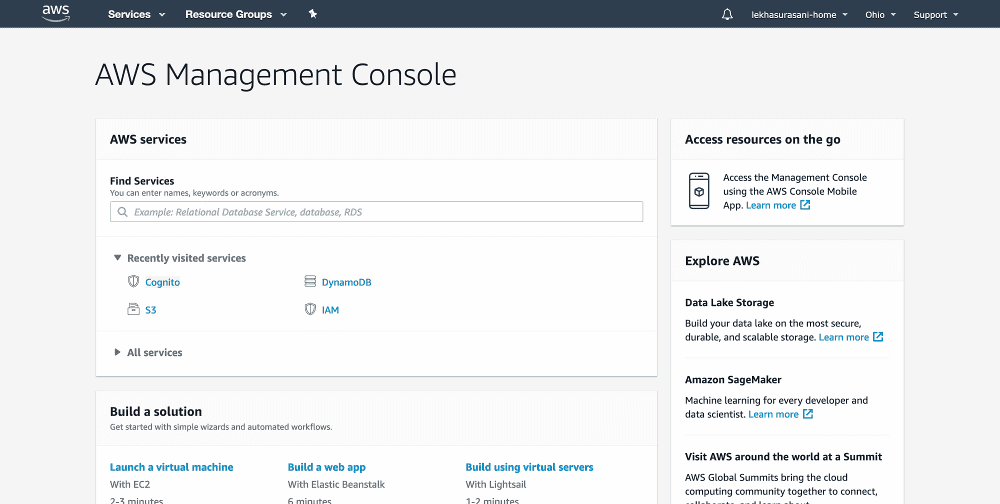

Main screen

接下来，我们将设置一个 IAM 用户。一个 [IAM](https://docs.aws.amazon.com/IAM/latest/UserGuide/id_users.html) (身份和访问管理)用户代表您与 AWS 及其资源进行交互。这允许您创建具有不同权限和目的的不同 IAM 用户，而不会损害您的 root 用户帐户的安全性。

单击页面顶部的“服务”选项卡，并在栏中键入“IAM ”:

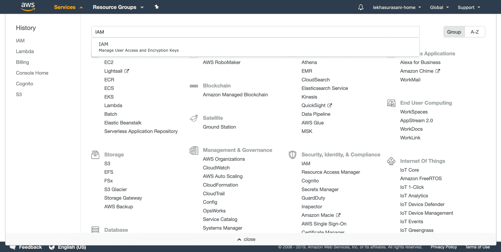

单击第一个结果，您会在左侧边栏中看到，您在仪表板上。单击“Users”选项，创建我们的新 IAM 用户。

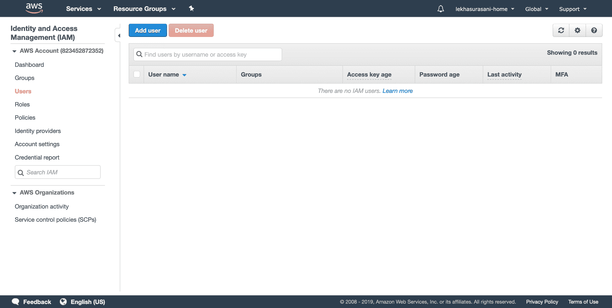

单击“添加用户”按钮创建新用户。按如下方式填写详细信息:

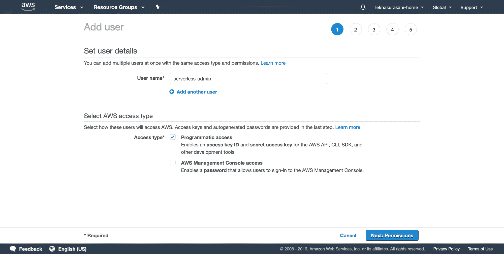

你可以给你的用户起任何你喜欢的名字，但是我选择了`serverless-admin`。确保您的用户对 AWS 有“编程访问权限”，而不是“AWS 管理控制台访问权限”。你可以为队友或者其他需要访问 AWS 的*人类*使用后者。我们只需要这个用户与 AWS Lambda 交互，所以我们可以只给他们编程访问。

对于权限，我选择附加现有策略，因为我没有任何组，也没有任何我想要复制权限的现有用户。在本例中，我将创建具有管理员权限的用户，因为这只是一个个人项目；但是，如果您要在实际的生产环境中使用无服务器应用程序，那么您的 IAM 用户应该只访问 AWS 中 Lambda 必需的部分。(说明可以在[这里](https://serverless.com/blog/abcs-of-iam-permissions/)找到)。

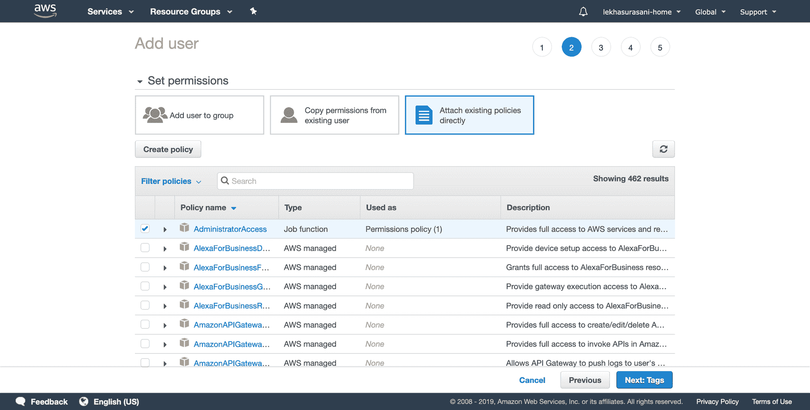

我没有添加任何标签，创建了用户。保存下一个屏幕上给你的信息是至关重要的-访问 ID 和秘密访问密钥。

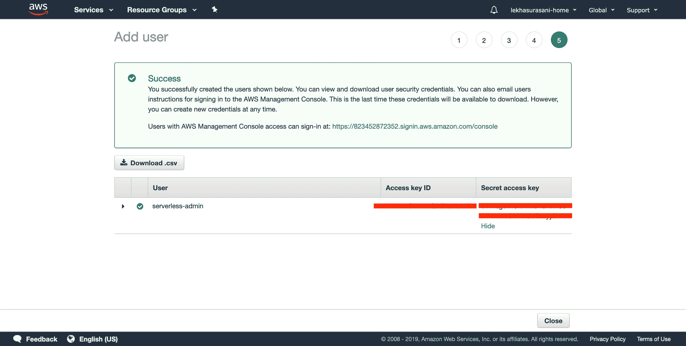

不要在没有抄下两者的情况下离开这个屏幕！在此屏幕后，您将无法再次看到秘密访问密钥。

最后，我们将把这些凭证添加到命令行 AWS 中。使用本[指南](https://docs.aws.amazon.com/cli/latest/userguide/cli-chap-install.html)进行 aws cli 设置。

通过运行`aws --version`确保您已经安装了它。您应该会看到类似这样的内容:

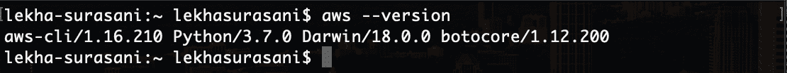

然后运行`aws configure`并填写提示:

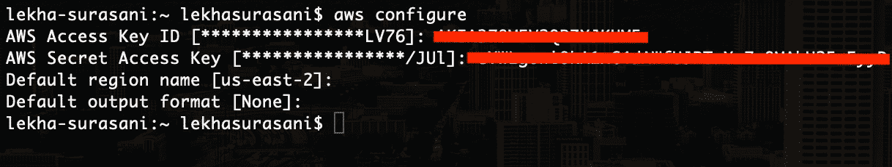

我已经设置了默认区域`us-east-2`，但是您可以使用[这个](https://docs.aws.amazon.com/AmazonRDS/latest/UserGuide/Concepts.RegionsAndAvailabilityZones.html)来确定您所在的区域。

为了确保您的凭证设置正确，您可以在终端中运行`cat ~/.aws/credentials`。

如果您想要配置一个非默认的概要文件，您可以运行如下命令:`aws configure --profile [profile name]`。

如果你在遵循这些步骤时有困难，你也可以查看 AWS 的文档。

* * *

## 设置无服务器

转到您的终端，使用`npm` : `npm i -g serverless`全局安装`serverless`包。([这里有更多关于无服务器的信息](https://serverless.com/) )
你的终端应该是这样的:

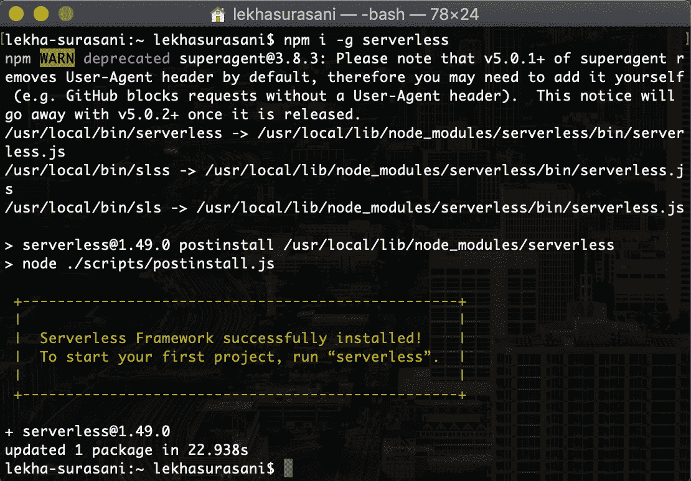

接下来，导航到您想要创建应用的目录，然后运行`serverless`并按照提示进行操作:

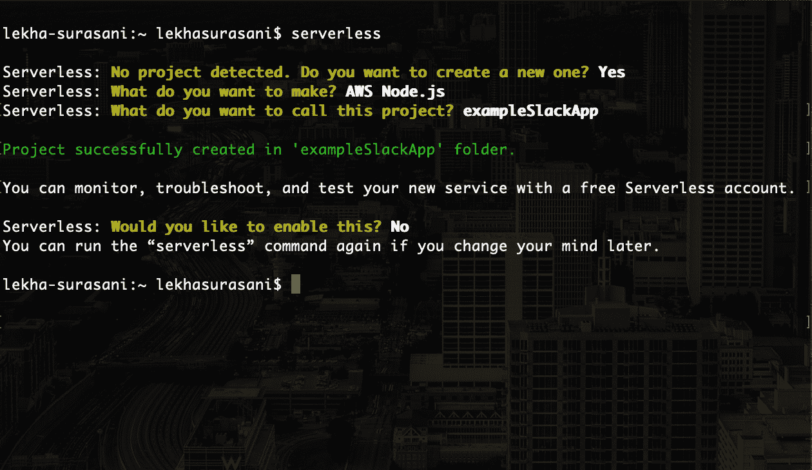

对于这个应用程序，我们将使用 Node.js。你可以给你的应用程序起任何你想要的名字，但是我已经把我的命名为`exampleSlackApp`。

打开您最喜欢的代码编辑器，查看`exampleSlackApp`中的内容(或者您称之为应用程序的任何内容)。

首先，我们来看看`serverless.yml`。您会看到这里有许多注释代码，描述了您可以在文件中使用的不同选项。一定要读一读，但我已经把它删掉了，只剩下:

```
service: exampleslackapp

provider:
  name: aws
  runtime: nodejs10.x
  region: us-east-2

functions:
  hello:
    handler: handler.hello
```

serverless.yml

我已经包含了`region`，因为默认的是`us-east-1`，但是我的 aws 配置文件是为`us-east-2`配置的。

让我们通过在`serverless`刚刚为我们创建的应用程序的目录中运行`serverless deploy`来部署我们已经拥有的东西。输出应该如下所示:

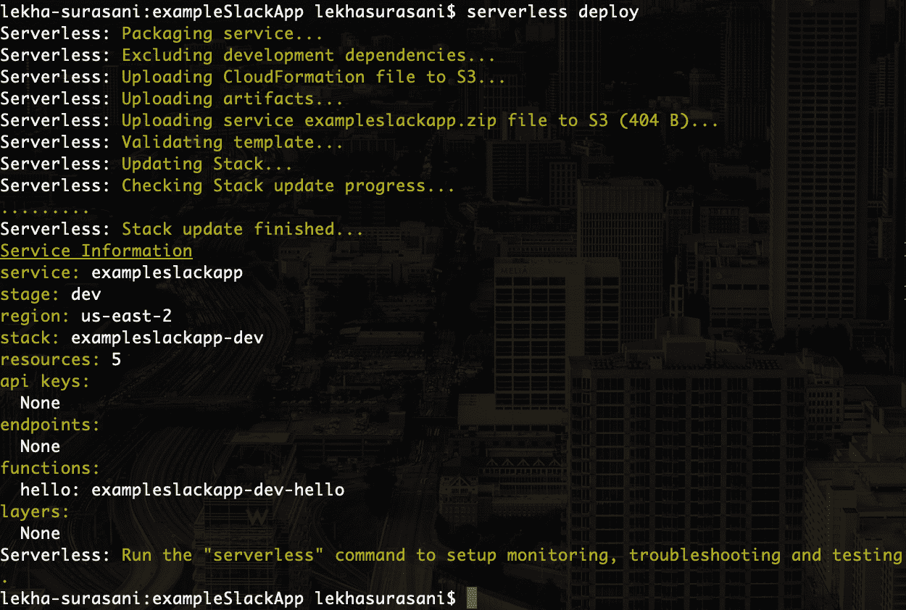

如果你在你的终端上运行`serverless invoke -f hello`，它会运行这个应用程序，你应该会看到:

```
{
    "statusCode": 200,
    "body": "{\n  \"message\": \"Go Serverless v1.0! Your function executed successfully!\",\n  \"input\": {}\n}"
}
```

为了进一步证明我们的 slack 应用程序是活的，你可以回到 AWS 控制台。转到 services 下拉菜单，搜索“Lambda”，然后单击第一个选项(“运行代码，不考虑服务器”)。

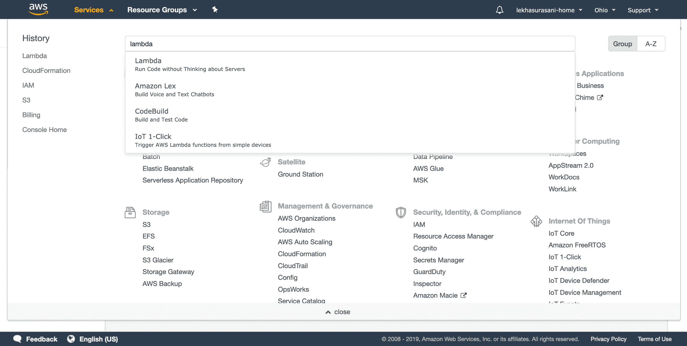

这是你的应用程序！

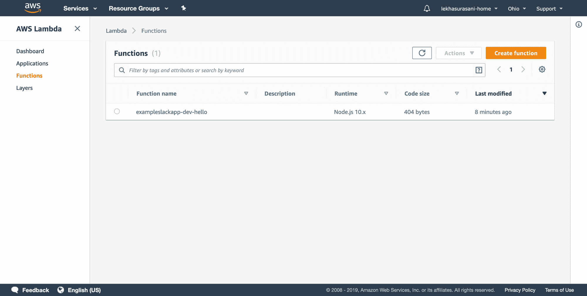

接下来，我们将通过构建我们的 slack 应用程序来探索实际使用无服务器。我们的 slack 应用程序将使用[斜线命令](https://api.slack.com/slash-commands)向 slack 发布随机[罗恩·斯旺森](https://en.wikipedia.org/wiki/Ron_Swanson)的报价，如下所示:

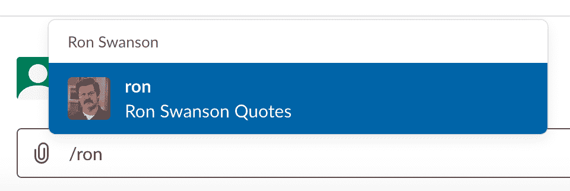

下面的步骤不一定要按照我做的顺序来做，所以如果你想跳过，请随意！

* * *

## 将 API 添加到代码中

我使用这个 API 来生成罗恩·斯旺森的引语，因为文档相当简单(当然，它是免费的)。要查看请求是如何发出的以及返回了什么，只需在浏览器中输入以下 URL:

[T2`https://ron-swanson-quotes.herokuapp.com/v2/quotes`](https://ron-swanson-quotes.herokuapp.com/v2/quotes)

您应该会看到类似这样的内容:

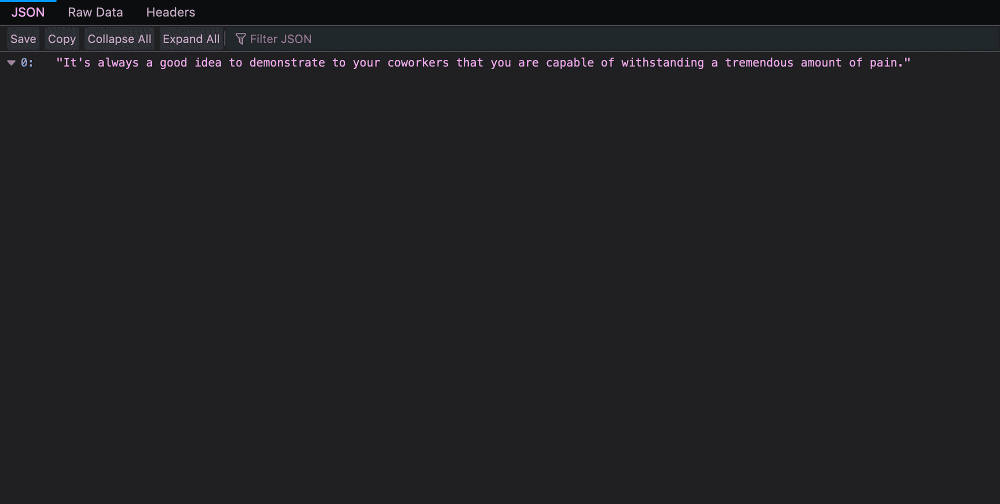

所以，我们可以这样修改我们的初始函数:

```
module.exports.hello = (event) => {
  getRon();
};
```

Note: I've removed the async portion

并且`getRon`看起来像:

```
function getRon() {
  request('https://ron-swanson-quotes.herokuapp.com/v2/quotes', function (err, resp, body) {
    console.log('error:', err)
    console.log('statusCode:', resp && resp.statusCode)
    console.log('body', body)
  })
}
```

现在，让我们检查它是否工作。在您的终端中本地测试此代码:`serverless invoke local -f hello`。您的输出应该类似于:

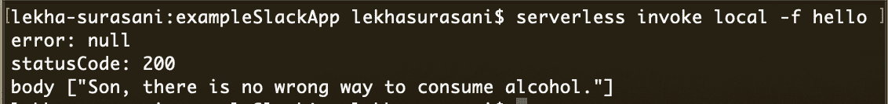

Spoiler: There was a wrong way to consume alcohol

会运行您已经部署的代码，正如我们在前面章节中看到的。然而，`serverless invoke local -f hello`运行您的本地代码，因此它对测试很有用。继续使用`serverless deploy`进行部署！

* * *

## 创建你的 Slack 应用

要创建您的 slack 应用程序，请点击此[链接](https://api.slack.com/apps?new_app=1)。它会让你首先登录到一个空闲工作区，因此请确保你是可以添加此应用的工作区的一部分。我已经为我的目的创建了一个测试。您将被提示这个模态。你可以填写任何你想要的，但这里是我的例子:

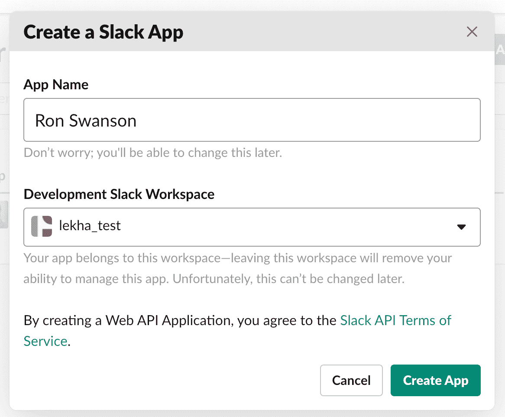

在那里，您将被带到应用程序的主页。你一定要浏览这些页面和选项。例如，我在我的应用程序中添加了以下定制:

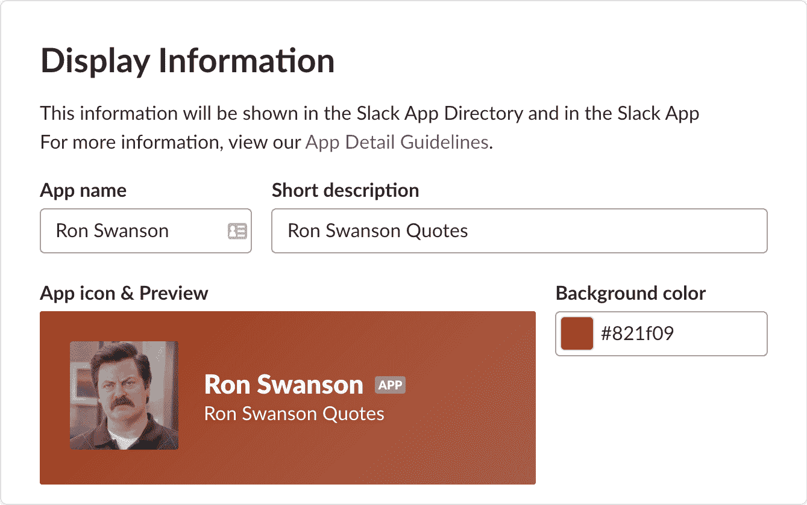

Display information can be found from the "Basic Information" tab on the app

接下来，我们需要为应用程序添加一些权限:

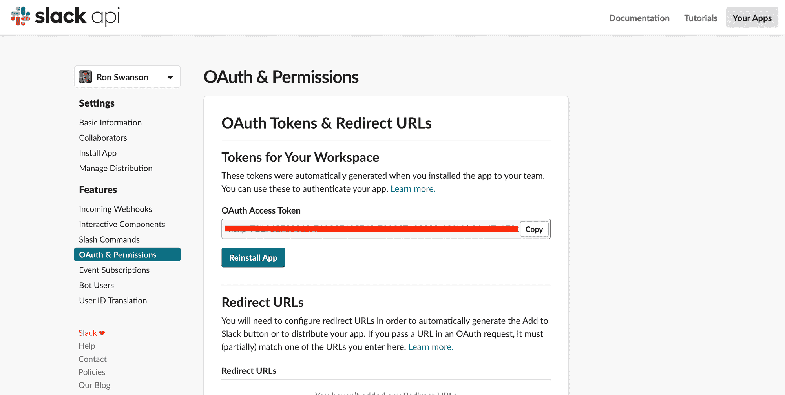

要获得 OAuth 访问令牌，您必须添加一些范围和权限，这可以通过向下滚动来完成:

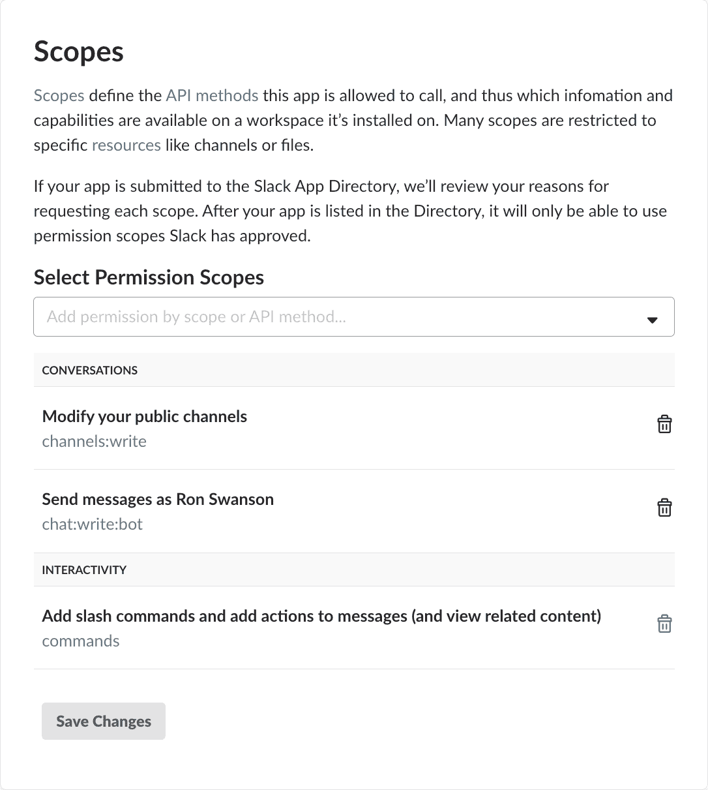

我添加了“修改你的公共频道”，这样机器人就可以写一个频道，“以罗恩·斯旺森的身份发送消息”，这样当消息发布时，看起来就像是一个叫罗恩·斯旺森的用户在发布消息，并删除命令，这样用户就可以“请求”一个报价，如本文开头的截图所示。保存更改后，您应该能够向上滚动到 OAuths & Permissions 以查看:

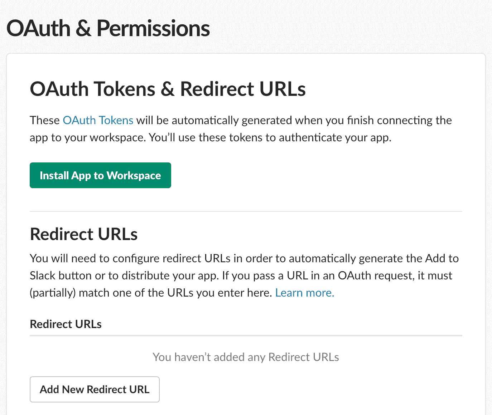

单击按钮将应用程序安装到 Workspace，您将拥有一个 OAuth 访问令牌！我们一会儿会回来，所以要么抄下来，要么记住它在这里。

* * *

## 连接代码和 Slack 应用

在 AWS Lambda 中，找到你的 slack app 函数。您的函数代码部分应该显示我们更新后的代码，并调用我们的 Ron Swanson API(如果没有，返回到您的终端并运行`serverless deploy`)。

滚动到下面显示“[环境变量](https://docs.aws.amazon.com/lambda/latest/dg/env_variables.html)”的部分，将您的 Slack OAuth 访问令牌放在这里(您可以随意命名该密钥):

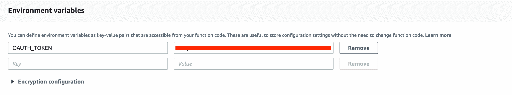

让我们回到我们的代码，在函数中添加 Slack。在文件的顶部，我们可以用新的 OAuth 令牌声明一个`const`:

`const SLACK_OAUTH_TOKEN = process.env.OAUTH_TOKEN`。

`process.env`只是抓住了我们的环境变量([补充阅读](https://nodejs.org/dist/latest-v8.x/docs/api/process.html#process_process_env))。接下来，让我们看看 [Slack API](https://api.slack.com/methods/chat.postMessage) 来弄清楚如何向通道发布消息。

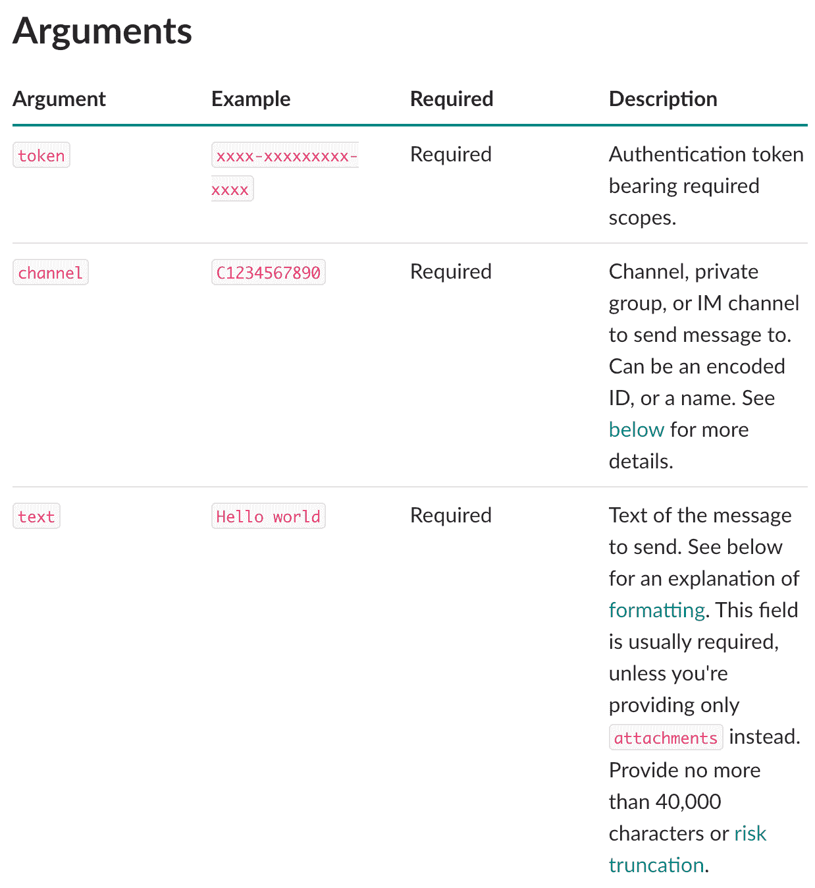

上面两张图片是我从 API 中截取的，与我们最为相关。因此，要发出这个 API 请求，我将通过传入一个名为`options`的对象来使用`request`:

```
 let options = {
    url: 'https://slack.com/api/chat.postMessage',
    headers: {
      'Accept': 'application/json',
    },
    method: 'POST',
    form: {
      token: SLACK_OAUTH_TOKEN,
      channel: 'general', // hard coding for now
      text: 'I am here',
    }
  }
```

我们可以提出请求:

```
 request(options, function(err, resp, body) {
    console.log('error:', err)
    console.log('statusCode:', resp && resp.statusCode)
    console.log('body', body)
  })
```

最后，我将把整个事情包装在一个函数中:

```
function postRon(quote) {
  let options = {
    url: 'https://slack.com/api/chat.postMessage',
    headers: {
      'Accept': 'application/json',
    },
    method: 'POST',
    form: {
      token: SLACK_OAUTH_TOKEN,
      channel: 'general',
      text: quote,
    }
  }

  request(options, function(err, resp, body) {
    console.log('error:', err)
    console.log('statusCode:', resp && resp.statusCode)
    console.log('body', body)
  })
}
```

我们可以这样称呼它:

```
function getRon() {
  request('https://ron-swanson-quotes.herokuapp.com/v2/quotes', function (err, resp, body) {
    console.log('error:', err)
    console.log('statusCode:', resp && resp.statusCode)
    console.log('body', body)
    postRon(body.substring(2, body.length - 2)) // here for parsing, remove if you want to see how/why I did it
  })
}
```

所以我们的代码应该是这样的:

```
'use strict';
let request = require('request');

const SLACK_OAUTH_TOKEN = process.env.OAUTH_TOKEN

module.exports.hello = (event) => {
  getRon();
};

function getRon() {
  request('https://ron-swanson-quotes.herokuapp.com/v2/quotes', function (err, resp, body) {
    console.log('error:', err)
    console.log('statusCode:', resp && resp.statusCode)
    console.log('body', body)
    postRon(body.substring(2, body.length - 2))
  })
}

function postRon(quote) {
  let options = {
    url: 'https://slack.com/api/chat.postMessage',
    headers: {
      'Accept': 'application/json',
    },
    method: 'POST',
    form: {
      token: SLACK_OAUTH_TOKEN,
      channel: 'general',
      text: quote,
    }
  }

  request(options, function(err, resp, body) {
    console.log('error:', err)
    console.log('statusCode:', resp && resp.statusCode)
    console.log('body', body)
  })
}
```

现在我们来测试一下！不幸的是，当我们运行`serverless invoke local -f hello`时，我们在 AWS Lambda 中的环境变量不可用。有几种方法可以实现这一点，但是对于我们的目的，您可以用实际的 OAuth 令牌替换`SLACK_OAUTH_TOKEN`的值(确保它是一个字符串)。但是一定要在将它升级到版本控制之前将其切换回来！

运行`serverless invoke local -f hello`，希望您会在#general channel 中看到这样的消息:

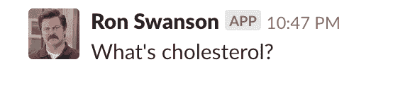

*请注意，我将我的频道名写为“general ”,因为这是我的测试工作区；然而，如果你在一个实际的工作空间中，你应该为测试应用程序创建一个单独的通道，并在测试时把消息放在那里。*

在您的终端中，您应该会看到类似这样的内容:

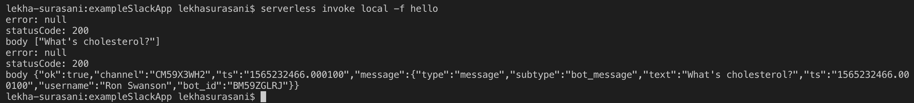

如果这有效，那么继续使用`serverless deploy`部署它。如果没有，最好的调试方法是调整代码并运行`serverless invoke local -f hello`。

* * *

## 添加斜线命令

最后一部分是添加一个斜杠命令！返回到 AWS Lambda 中函数的主页，寻找显示“添加触发器”的按钮:

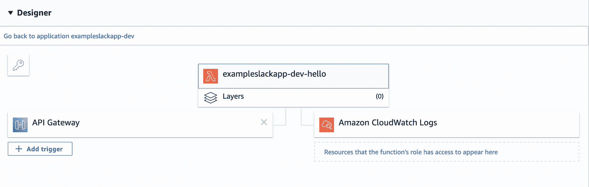

We're going to add an API Gateway (as I already have).

点击按钮进入“添加触发器”页面，并从列表中选择“API 网关”:

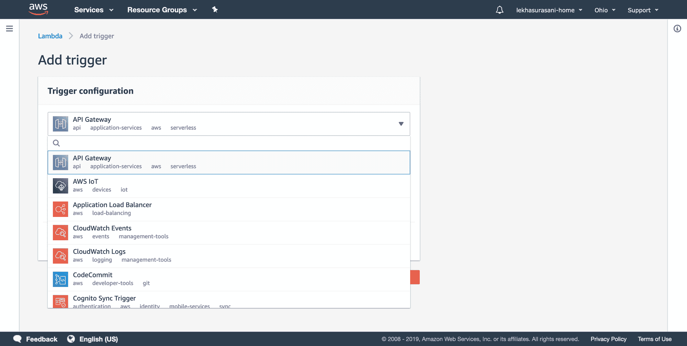

我主要根据默认值填写信息:

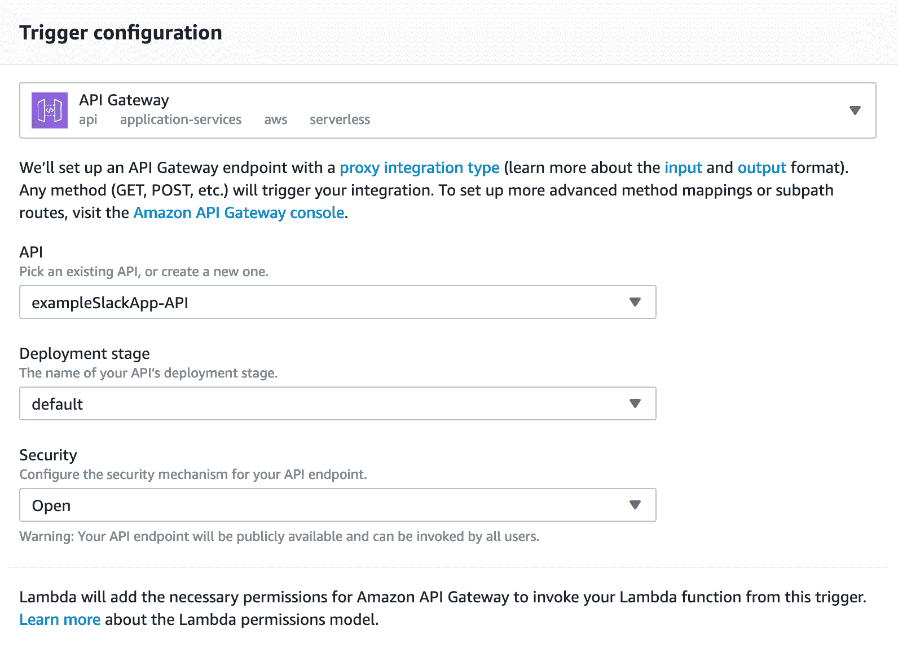

我也让这个 API 开放使用——但是，如果你在生产中使用它，你应该和你的团队讨论什么样的标准协议。“添加”API，您应该会收到一个 API 端点。拿着这个，因为我们下一步会用到它。

让我们切换回我们的 slack 应用程序，并添加一个斜杠命令:

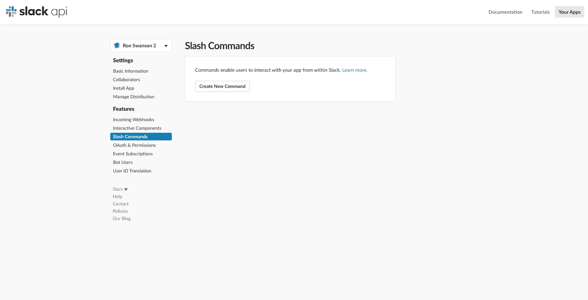

点击“创建新命令”,应该会弹出一个新窗口来创建一个命令。我是这样填写的:

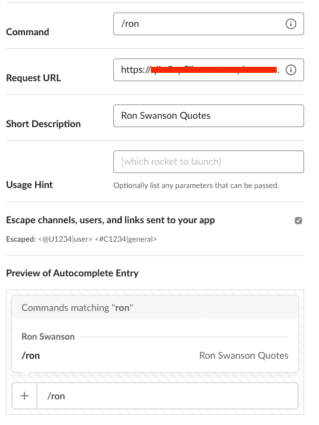

您可以为“命令”和“简短描述”输入您想要的任何内容，但是对于“请求 URL”，您应该将您的 API 端点。

最后，我们将回到代码中做一些最后的调整。如果您尝试使用 slash 命令，您应该会收到某种类型的错误返回——这是因为 slack 期望一个响应，而 AWS 期望您在到达端点时给出一个响应。所以，我们将改变我们的函数来允许一个`callback` ( [作为参考](https://docs.aws.amazon.com/lambda/latest/dg/nodejs-prog-model-handler.html)):

```
module.exports.hello = (event,context,callback) => {
  getRon(callback);
};
```

然后我们将更改`getRon`来处理`callback`:

```
function getRon(callback) {
  request('https://ron-swanson-quotes.herokuapp.com/v2/quotes', function (err, resp, body) {
    console.log('error:', err)
    console.log('statusCode:', resp && resp.statusCode)
    console.log('body', body)
    callback(null, SUCCESS_RESPONSE)
    postRon(body.substring(2, body.length - 2))
  })
}
```

其中`SUCCESS_RESPONSE`位于文件的顶部:

```
const SUCCESS_RESPONSE = {
  statusCode: 200,
  body: null
}
```

您可以将回调放在这里或`postRon`中——这取决于您回调的目的。

此时，我们的代码看起来像这样:

```
'use strict';
let request = require('request');

const SLACK_OAUTH_TOKEN = OAUTH_TOKEN

const SUCCESS_RESPONSE = {
  statusCode: 200,
  body: null
}

module.exports.hello = (event,context,callback) => {
  getRon(callback);
};

function getRon(callback) {
  request('https://ron-swanson-quotes.herokuapp.com/v2/quotes', function (err, resp, body) {
    console.log('error:', err)
    console.log('statusCode:', resp && resp.statusCode)
    console.log('body', body)
    callback(null, SUCCESS_RESPONSE)
    postRon(body.substring(2, body.length - 2))
  })
}

function postRon(quote) {
  let options = {
    url: 'https://slack.com/api/chat.postMessage',
    headers: {
      'Accept': 'application/json',
    },
    method: 'POST',
    form: {
      token: SLACK_OAUTH_TOKEN,
      channel: 'general',
      text: quote,
    }
  }

  request(options, function(err, resp, body) {
    console.log('error:', err)
    console.log('statusCode:', resp && resp.statusCode)
    console.log('body', body)
  })
}
```

你现在应该可以在 slack 中使用`/ron`命令，并得到罗恩·斯旺森的引用。如果没有，您可以使用 Cloudwatch 日志来查看哪里出错了:

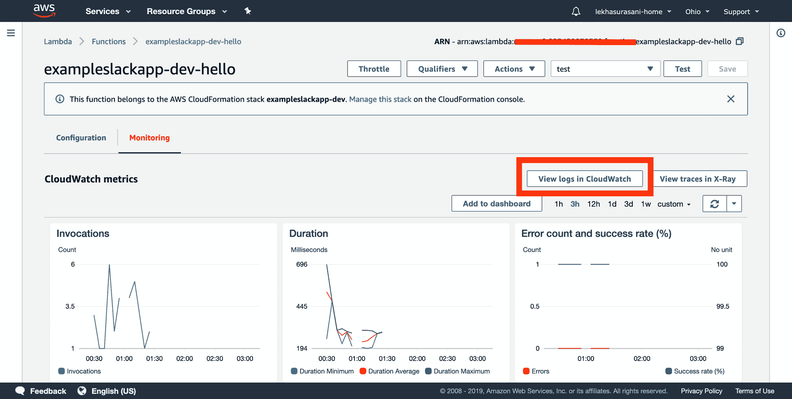

我们的代码现在的工作方式是，我们已经硬编码了通道名。但是，我们实际上想要的是在您使用`/ron`的消息中发布引用。

因此，我们现在可以使用函数的`event`部分。

```
module.exports.hello = (event,context,callback) => {
  console.log(event)
  getRon(callback);
};
```

使用`/ron`运行该函数，然后检查您的 Cloudwatch 日志，看看控制台记录了什么(您可能需要刷新)。检查最近的日志，您应该会看到类似这样的内容:

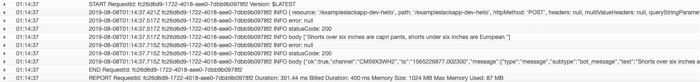

此列表中的第一项(其中显示“资源”、“路径”等)。)是事件，所以如果你展开它，你会看到一个很长的列表，但是我们要找的是底部的“body ”:

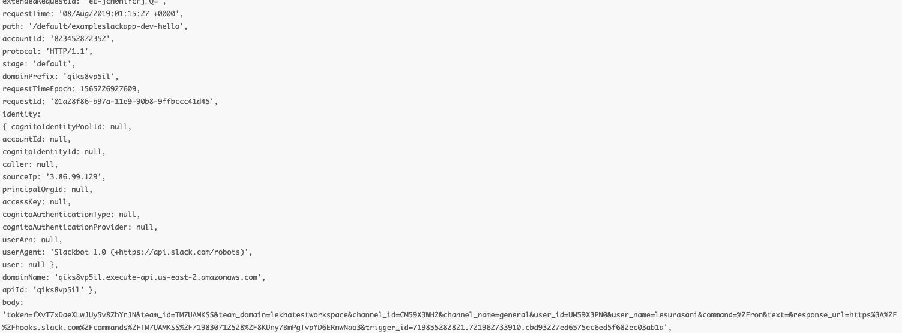

where's waldo: spot the param edition

Body 是一个字符串，其中包含一些相关信息，其中之一是“channel_id”。我们可以使用 channel_id(或 channel_name)并将其传递给创建 slack 消息的函数。为了方便起见，我已经解析了这个字符串:`event.body.split("&")[3].split("=")[1]`应该给出 channel_id。为了简单起见，我将 channel_id 硬编码在哪个条目(3)中。

现在，我们可以修改代码，将该字符串保存为变量:

`let channel = 'general'`(作为我们的退路)

```
module.exports.hello = (event,context,callback) => {
  console.log(event)
  channel = event.body.split("&")[3].split("=")[1]
  console.log(context)
  getGoat(callback);
};
```

而在`postRon`:

```
 let options = {
    url: 'https://slack.com/api/chat.postMessage',
    headers: {
      'Accept': 'application/json',
    },
    method: 'POST',
    form: {
      token: SLACK_OAUTH_TOKEN,
      channel: channel,
      text: quote,
    }
  }
```

options var in postRon

最后，如果您在工作区的任何通道中使用 slack 命令，您应该能够看到 Ron Swanson 的引用弹出来！如果没有，正如我之前提到的，我用来调试无服务器 app 最常用的工具是`serverless invoke local -f <function name>`和 Cloudwatch 日志。

* * *

希望您能够成功地创建一个功能正常的 Slack 应用程序！我在整篇文章中包含了资源和背景阅读，我很乐意回答你的任何问题！

*最终回购代码:*【https://github.com/lsurasani/ron-swanson-slack-app/ 