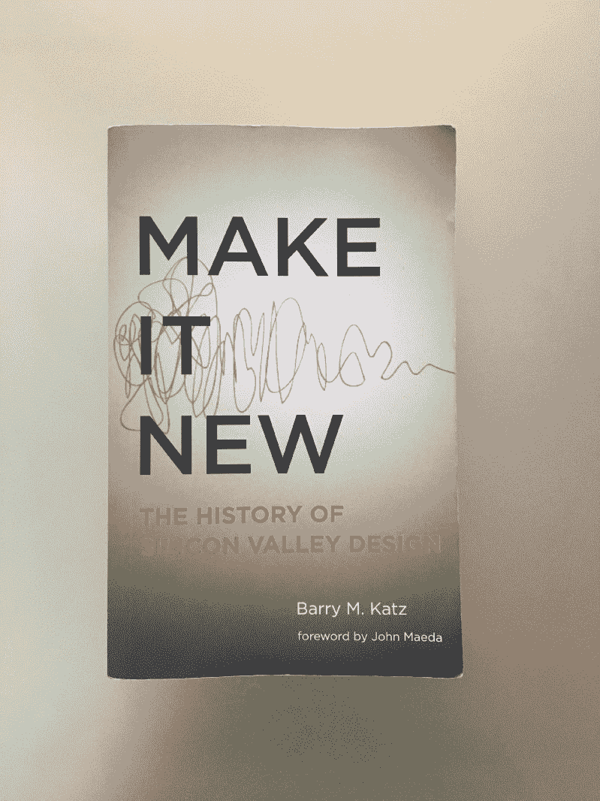

# 创新:硅谷设计史

> 原文：<https://www.freecodecamp.org/news/make-it-new-the-history-of-silicon-valley-design-6f64aae78203/>

作者 Lukasz Lysakowski

# 创新:硅谷设计史

我最近读了 Barry M. Katz 的《让它变新》，我确信这是任何数码产品设计师的必读之作。

#### 让它成为新的痕迹设计在硅谷的作用。

这是一个关于硅谷一群被排斥的设计师如何改变设计领域的故事。这就是他们如何倡导和推进从装饰硬件外壳到战略领导的设计。这是这些设计师如何在惠普、Ampex、苹果和一种新的产品设计咨询公司中定义新设计领域的历史。

硅谷设计师成为所有新领域的领导者:交互和(数字)产品设计。传统广告和平面设计忽视的领域。因此，他们可以自由探索物理计算机的人体工程学和虚拟界面的交互。以前的限制和传统并不适用。相反，他们的创造力通过将工程学与人文学科相结合，创造了互动体验的新领域。

硅谷的设计也被定义为设计师在研究机构、公司之间自由流动，并像 frog、IDEO 和 Lunar 一样开办自己的商店。这个机会网导致了整个行业知识的流动转移。在一个领域学到的新技能在下一个领域得到了发展。随着设计师们投身于新的机遇和合作，知识也在增长。完全不同的设计体验交叉并创造了新的交互模式和界面。

旧金山湾区设计创新的一个重要来源是西海岸高等教育。战后第一波设计师参加了洛杉矶艺术中心设计学院；一所专注于工业设计、插图、摄影和广告的学校。它培养了许多战后归来的老兵，他们成为了硅谷的第一代设计师。在南湾，彼此相距不远的斯坦福大学和圣何塞州立大学增加了理论和技术设计师。在奥克兰山和旧金山的 Dogpatch，加州艺术学院增加了一批受过互动和商业培训的新设计师。

硅谷的设计比史蒂夫·乔布斯和莫格里奇丰富得多。其中包括像卡尔·克莱门特这样的人，他在 1951 年是惠普的第一位设计师。他通过在所有产品中引入标准化，重新定义了惠普产品。硬件产品的最终界面诞生于他对产品流程的引入头脑风暴和用户调研。我们现在认为是标准的技术，但在 1951 年是革命性的。

当然，军方和政府是硅谷技术创新增长的关键角色。联邦政府无意中提供了帮助，因为它赞助了计算机的发展，反过来要求设计者更加人性化。让它成为塑造计算机基础的政府角色的新内容。

硅谷的设计历史是多元的，比大众媒体报道的更深入。《让它焕然一新》很好地概述了湾区设计的演变。这本书的结尾不是过去，而是现在，因为它触及了 AirBnB、脸书和初创公司在创造下一代湾区设计创新中的作用。

[*推陈出新:硅谷设计史*](https://mitpress.mit.edu/books/make-it-new) *巴里·m·卡茨著。麻省理工学院出版社 2015。280 页。*

[**推陈出新**](https://mitpress.mit.edu/books/make-it-new)
[*设计在硅谷创新生态系统形成中的作用。*mitpress.mit.edu](https://mitpress.mit.edu/books/make-it-new)