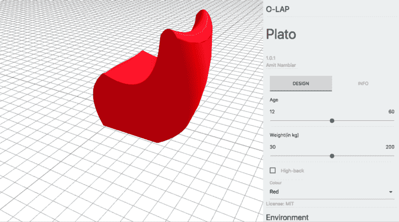
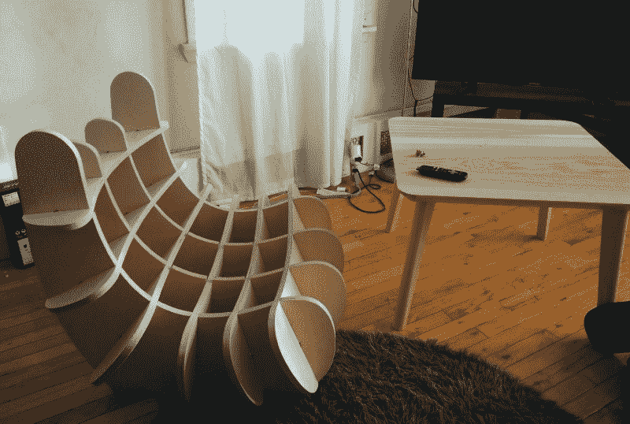
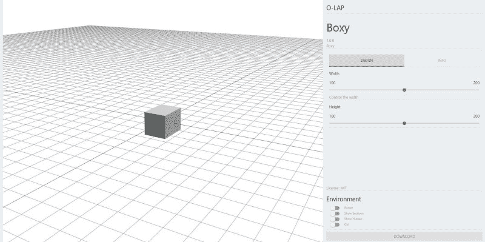
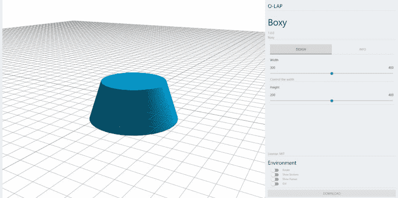
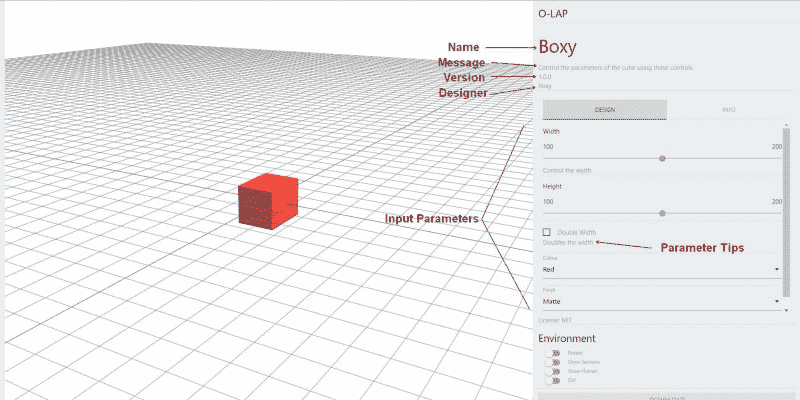

# 如何用 JavaScript 制作参数化家具

> 原文：<https://www.freecodecamp.org/news/make-parametric-furniture-with-javascript-50c835402e93/>

通过 O 圈

# 如何用 JavaScript 制作参数化家具



[Source](https://o-lap.org/app.html?a=amitlzkpa&r=o-lap_plato)

本指南将帮助您创建一件参数化家具。[从我们的图库中挑选一款你喜欢的设计。你可以在这里](https://o-lap.org/app.html?a=amitlzkpa&r=o-lap_plato)阅读更多关于项目[的信息。](https://o-lap.github.io/home)

本教程假设你对 Javascript、Git(基础)和 [ThreeJS](https://threejs.org/) 有所了解。(如果你只是和他们一起工作过一次就足够了)。

让我们开始吧。

### 正在设置

通过克隆`[https://github.com/O-LAP/starter_project.git](https://github.com/O-LAP/starter_project.git.)`获得启动项目。`starter_project`已经准备好文件，可以让你在开发环境中运行和测试你的设计。一旦你推它并注册到主应用程序，它也能和框架一起流畅地运行。

starter 项目被配置为显示一个简单的立方体，可以使用浏览器中的参数对其进行控制。本练习将使用我们自己的设计替换该立方体。

您可以在浏览器中打开`dev.html`文件，看看它当前的样子。

你可以改变右边的滑块来改变立方体的比例。你会在右下角的“环境”下看到一组控件。尝试启用“显示部分”开关。它显示了可以制作的立方体的截面。

我们可以用这些部分来制作实木立方体。

当你点击“下载”按钮时，它会给你一个 CAD 文件。你可以把它输入数控机床进行加工。你可以在这里阅读更多关于这个过程的信息[。](https://github.com/O-LAP/home/blob/master/faq.md)

这里有一个用这种技术制作的椅子的例子:



### 浏览代码

我们先做一个参数化的圆柱体(可以想象成小凳子)来代替立方体。`designs`文件夹包含设计所需的所有文件。

`Design.js`文件包含一些样本代码，展示了一个可以参数化修改的立方体。

`dev.html`文件是模拟 OLAP web 应用程序的开发工具。(以后在更新时，必须手动复制该文件。)

该框架要求设计逻辑被捕获到一个 JavaScript 对象中，该对象在`Design.js`文件中被称为`Design`。

```
Design.info = { ... };Design.inputs = { ... };Design.inputState = { ... };Design.init = async function() { ... };Design.updateGeom = async function(group, sliceManager) { ... };
```

`Design.inputs`是为设计指定参数的地方。它是为多维数据集配置的。让我们修改它，使它适合我们的领域。

我们将保持事情非常简单，只使用`height`和`weight`为我们的气缸。

更新`Design.inputs`所以看起来是这样的。

```
Design.inputs = {    "width": {         "type": "slider",        "label": "Width",        "default": 150,        "min": 100,        "max": 200    },    "height": {         "type": "slider",                               "label": "Height",        "default": 150,        "min": 100,        "max": 200    }}
```

现在，如果你打开`dev.html`，它应该看起来像这样:



### 在几何图形中添加

现在我们将创建一个圆柱体而不是立方体。

每次参数值改变和初始加载时，设计都会更新。
它传入一个空的`THREE.Object3D`和一个`SliceManager`，前者是你添加几何图形的容器，后者是你指定如何为设计制作“切片”的容器。来自前一个更新调用的引用被丢弃，并且使用每个调用的新实例。

```
Design.updateGeom = async function(group, sliceManager) { ... };
```

让我们看看立方体的`updateGeometry`方法是什么样子的。

```
Design.updateGeom = async function(group, sliceManager) {  var geometry = new THREE.BoxGeometry( 200, Design.inputState.height, Design.inputState.width * ((Design.inputState.doubleWidth) ? 2 : 1) );  var material = getMaterial(Design.inputState.colour, Design.inputState.finish);  var cube = new THREE.Mesh( geometry, material );  sliceManager.addSliceSet({uDir: true, start: -80, end: 80, cuts: 3});  sliceManager.addSliceSet({uDir: false, start: -90, end: 90, cuts: 4});  group.add( cube );}
```

您可以使用`Design.inputState`随时访问用户为参数设置的当前值。

例如，要访问`height`参数的值，可以使用`Design.inputState.height`。

前 4 行是纯粹的 [threeJS](https://threejs.org/) 代码，它基于参数值创建了一个简单的`BoxGeometry`。
这是您设计的主要部分，您将在下面的步骤中使用参数值修改它以创建一个设计。
之后的部分用`sliceManager` s 管理如何为您的设计创建截面轮廓。
关于切片的更多信息请见下文。

我们将修改这个方法，使它看起来像这样:

```
Design.updateGeom = function(group, sliceManager) {  var geometry = new THREE.CylinderGeometry( Design.inputState.width -100, Design.inputState.width, Design.inputState.height, 32 );  var material = new THREE.MeshStandardMaterial( {color: 0x00BFFF } );  var cylinder = new THREE.Mesh( geometry, material );  sliceManager.addSliceSet({uDir: true, start: -80, end: 80, cuts: 3});  sliceManager.addSliceSet({uDir: false, start: -90, end: 90, cuts: 4});  group.add( cylinder );}
```

我们将创建立方体的 3 条线替换为创建圆柱体的 3 条线。我们使用来自设计参数的宽度和高度以及固定的颜色。

我们保留与之前相同的切片设置，并更新最后一行以添加圆柱体而不是立方体。

点击保存并尝试刷新页面以查看更改。您应该会看到类似这样的内容。



试着调整参数，检查这个设计的剖面。您可以使用任何 threeJS 网格来定义设计的几何图形。

按照提供的设置，所有传递到`group`的几何图形被切片配置“切片”。

这一快速浏览演示了如何以手动方式构建基本的几何图形。您可以修改此逻辑来创建任何类型的参数化几何图形，这些几何图形可以装配到家具上。

查看[这篇](https://medium.com/@olapdesign/design-for-a-rocking-chair-8a1a1e109d7f)文章，了解计算技术在家具设计中的应用。

### 提交您的设计

一旦你有了满意的设计，如果你愿意，你可以提交你的设计。

为了快速开始，我们将把我们的设计提交给我们维护的测试图库。测试库中注册的所有设计都会被定期清除。

设计将通过拉动请求被接受到主/测试报告中。这将允许在添加/发布过程中进行有意义的讨论。

转到:

`[https://github.com/O-LAP/home/edit/master/data/TEST_DesignCollection.js](https://github.com/O-LAP/home/edit/master/data/TEST_DesignCollection.js.)`T1。

如果是你第一次添加设计，会要求你叉回购。动手吧。

将指向您的存储库的链接(例如`https://github.com/amitlzkpa/o-lap_plato`)添加到`TEST_DesignCollection`内的列表中。确保检查逗号的位置是否正确。

一次只做一个改变。任何有一处以上改动的提议都将被拒绝，即使其他一切都已就绪。单击以建议更改。它将由一个维护者主持，如果需要任何进一步的讨论，将在这个页面上进行。

如果你的设计被接受…万岁！我们正在制作米开朗基罗！您可以通过以下链接检查您的设计:`http://o-lap.org/test.html?a=<github-user-name>&r=<olap-r` epo-name >

测试报告的大部分提交将被接受。
作为一个社区，我们希望相同的流程将被用于审核不符合要求的设计。

投稿链接(主):`https://github.com/O-LAP/home/edit/master/data/OLAP_DesignCollection.js`
投稿链接(测试):`https://github.com/O-LAP/home/edit/master/data/TEST_DesignCollection.js`
设计图库(主):`https://O-LAP.github.io/home/designs.html`
设计图库(测试):`https://O-LAP.github.io/home/test.html`
App:`http://o-lap.org/app.html?a=<github-user-name>&r=<olap-repo-nam`e>&m =测试

### 如何发布设计更新

要更新设计文件，您不必同时更新文件。事实上，更好的做法是将您的更改作为单独的提交，一步一步地进行。每次提交时，都要包含一个有意义的描述，说明你做了哪些更改，以及你是如何和为什么做这些更改的。

更新`Design.js`文件，仅进行版本更新更改。

**修改`Design.js`***内`"version": "x.y.z",`(第 11 行)的版本号 x.y.z (x:重大修改；y:小改动；z:调整)(更多细节)[[https://semver.org/](https://semver.org/)]*

### 如何分叉另一个设计

打开 bash/终端/命令提示符到一个文件夹。跑`git clone <repo you want to fo` rk >。 `Open Des` ign.js 并进行更改。

*您可能想要将文件夹重命名为您想要命名的设计*。

完成更改后，通过修改`Design.js`内的`"version": "x.y.z"`(第 11 行)将设计版本重置为`1.0.0`。更新其他信息，如`name, short_desc, long_desc, message`等。

从现在开始把这个设计当成一个新的设计。

如果您想继续从父回购中提取变更，请遵循此[页面](https://gist.github.com/CristinaSolana/1885435)。按照`Submit Your Design`流程提交您的分叉设计作为新设计。

你准备好了！

### 再深入一点

到目前为止，我们已经快速浏览了一些内容。现在您已经有了更好的理解，我们将更深入地看一看。

#### 设计信息

在顶部，您将看到设计元信息，如下所示:

```
Design.info = {  "name": "Boxy",  "designer": "Roxy",  "version": "1.0.0",  "license": "MIT",  "short_desc": "Template design file demoing project setup.",  "long_desc": "",  "url": null,  "message": "Control the parameters of the cube using these controls.",  "tags": [ "", "" ]}
```

这用于显示画廊中有关设计的信息。



#### 输入类型

为了让您能够控制输入参数，您可以指定不同类型的输入。

```
Design.inputs = { ... };
```

您可以提供 4 种类型的参数— `slider`、`bool`、`select`和`text`。
`slider`用于允许用户从一个连续的范围内选择一个数值。这些值是整数。
`bool`允许用户从是/否值中选择。
`select`允许用户从值列表中选择一个。
`text`取输入的文本值。
要添加一个参数到您的设计中，您需要通过添加一个键值对到`Design.input`来注册它。

#### 限幅

切片是从你的设计中提取直线部分的过程，我们可以用它来制作设计。

阅读[常见问题解答](https://github.com/O-LAP/home/blob/master/faq.md)以了解流程。

使用`sliceManager`与框架交流你希望如何分割设计。

我们通过向 SliceManager 传递一个`config`对象来实现这一点。如果我们想在-80°处沿 X 轴创建切片，然后向上移动+80°并在该范围内均匀分布 3 个切片(所有距离都以毫米为单位)，我们可以传入一个如下所示的对象:

`{uDir: true, start: -80, end: 80, cuts: 3}`

要创建另一组沿 Y 轴的切片，从-90°开始，到+90°有 4 次切割，我们传入这样一个对象:

`{uDir: true, start: -90, end: 90, cuts: 4}`

*确保在添加几何图形之前指定切片配置。*一般来说，有两组方向相反的切片，你应该有可以制作的设计。但是你需要注意在你的设计中如何考虑这个问题。

阅读[设计指南](https://github.com/O-LAP/home/blob/master/guidelines.md)以更好地理解这一点。

### 后续步骤

本指南引导您完成获取正确文件、从头开始设计并提交设计的步骤。

要了解更多关于参数化家具设计的信息，请查看[设计文章](https://medium.com/@olapdesign/design-for-a-rocking-chair-8a1a1e109d7f)。对概念及其创造潜力进行实验(受限于物理生产限制)。

要向主画廊提交设计，请务必阅读[设计指南](https://github.com/O-LAP/home/blob/master/guidelines.md)。

*Amit Nambiar 为 O-lap 撰写的文章*