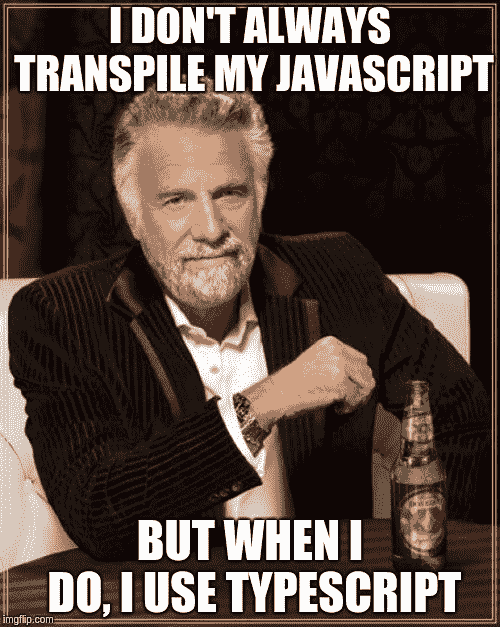
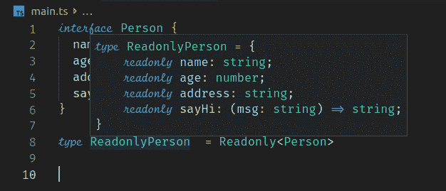
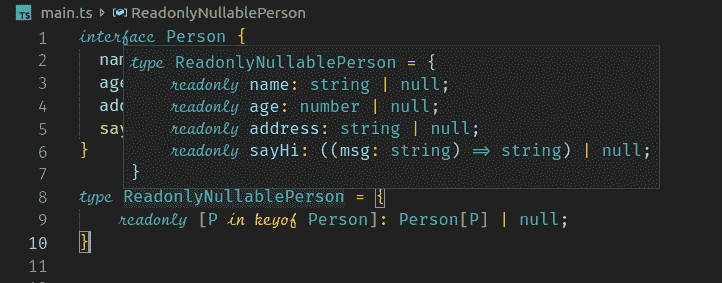

# 使用类型脚本映射和条件类型使 React 组件变得更好

> 原文：<https://www.freecodecamp.org/news/make-react-components-great-again-with-typescript-mapped-and-conditional-types-fa729bfc1a79/>

由 Deepu K Sasidharan

# 使用类型脚本映射和条件类型使 React 组件变得更好



你可能听说过 TypeScript。你可能听说过有人声称类型安全是多么伟大。

TypeScript 很棒。作为一个讨厌编译代码的人，如果必须的话，我肯定会用 TypeScript 来做。关于 TypeScript 已经说了很多，我真的没有什么新的东西可以添加。但是我相信类型安全并不意味着让你的代码到处都是类型定义。那么，我们如何才能编写类型安全的代码，而不必到处乱丢类型声明呢？

类型推断和高级特性如派生类型和动态类型就是答案。我们使用的编辑器和 ide 足够智能，可以优雅地处理推断类型的代码，而无需我们一直直观地看到类型。(当然，当您将鼠标悬停在一个推断类型上时，它们通常都会向您显示该类型。)

TypeScript 有一个非常好的类型推断。作为一个经验法则，你总是可以在没有为任何变量声明类型的情况下开始，看看编译器是否推断出它。使用像 VSCode 这样的现代编辑器，您可以立即看到这一点。因此，将您的 tsconfig 设置为严格模式。然后在编译器报错的时候开始声明类型。

此外，TypeScript 2.1 和 2.8 引入了一些很酷的查找类型。现在，您可以使用不同的技术动态推断类型，如交集类型、联合类型、索引类型、映射类型和条件类型。

### 索引类型

索引类型使我们能够使用`keyof T` ( ****索引类型查询操作符)**** 和 `T[K]` ( ****索引访问操作符**** )动态检查接口或类型的属性和类型。让我们以下面的界面为例。

```
interface Person {
  name: string;
  age: number;
  address: string;
  sayHi: (msg: string) => string;
}
```

`keyof T`操作符得到类型`T`的所有键名的联合类型，因此`keyof Person`将给出结果`'name' | 'age' | 'address' | sayHi'`。

`T[K]`操作符获取所提供的键的类型。`Person['name']`会导致`string`，`Person[**keyof** Person]`会导致`string | number | ((msg: string) => string)`。

### 映射类型

让我们看看什么是映射类型。假设我们有一个人的如下界面。

```
interface Person {
  name: string;
  age: number;
  address: string;
  sayHi: (msg: string) => string;
}
```

现在，在每个项目中，拥有特定接口的变体几乎总是一个常见的需求。例如，假设我们需要一个只读版本的 person，如下所示。

```
interface ReadonlyPerson {
  readonly name: string;
  readonly age: number;
  readonly address: string;
  readonly sayHi: (msg: string) => string;
}
```

在这种情况下，我们必须复制人员界面，并且必须手动保持它们同步。这就是映射类型派上用场的地方，因此让我们使用内置映射类型`Readonly`来实现这一点。

```
type ReadonlyPerson  = Readonly<Person>
```

如果您将鼠标悬停在`ReadonlyPerson`类型上，您可以看到如下所示的推断类型。



Inferred type view in VsCode

很酷，对吧？现在，我们可以从现有类型创建类型，而不必担心保持它们的同步。它是如何工作的，`Readonly<Person>`是做什么的？让我们来看看映射的类型。

```
type Readonly<T> = {
    readonly [K in keyof T]: T[K];
}
```

TypeScript 中的`in`操作符在这里起了作用。它将现有类型的所有声明映射到新类型中。`keyof`操作符为映射提供了我们类型中的键。让我们构建自己的映射类型。

假设我们需要一个只读的个人界面，其中所有的字段都可以为空。为此，我们可以构建一个如下所示的映射类型。

```
type ReadonlyNullablePerson = {
    readonly [P in keyof Person]: Person[P] | null;
}
```



让我们将它通用化，以便它可以用于任何接口。

```
type ReadonlyNullable<T> = {
    readonly [K in keyof T]: T[K] | null;
}

type ReadonlyNullablePerson  = ReadonlyNullable<Person>
```

TypeScript 包括`Readonly<T>`、`Partial<T>`、`Pick<T, K extends keyof T>`和`Record<K extends string, T>`作为内置的映射类型。选择和记录可以使用如下，检查他们在你的编辑器，看看他们产生什么类型。

```
type PersonMinimal = Pick<Person, 'name' | 'age'>

type RecordedPerson = Record<'name' | 'address', string>
```

对于其他用例，您可以构建自己的映射类型。

### 条件类型

> 条件类型根据表示为类型关系测试的条件，从两种可能的类型中选择一种。

让我们看一个例子。

```
type Foo<T, U> = T extends U ? string : boolean

interface Me {}
interface You extends Person {}

type FooBool = Foo<Me, Person> // will result in boolean
type FooString = Foo<You, Person> // will result in string
```

从`Foo<T, U>`动态推断的类型将是`string`或`boolean`，这取决于第一个泛型是从哪里扩展而来的。

让我们看看如何将条件类型和映射类型混合起来，从 Person 中推断出一个只包含非函数属性的新类型。

```
type NonFunctionPropNames<T> = {
  [K in keyof T]: T[K] extends Function ? never : K
}[keyof T];

type NonFunctionProps<T> = Pick<T, NonFunctionPropNames<T>>

type PersonProps = NonFunctionProps<Person>

// Produces the below type
// type PersonProps = {
//     name: string;
//     age: number;
//     address: string;
// }
```

我们首先从接口中获取所有非函数属性名。然后使用 ****选择**** 映射类型来从接口中选择那些来形成新的接口。

TypeScript 提供了以下内置条件类型:

*   `Exclude<T, U>`–从`T`中排除可分配给`U`的类型。
*   `Extract<T, U>`–从`T`中提取可分配给`U`的类型。
*   `NonNullable<T>`–从`T`中排除`null`和`undefined`。
*   `ReturnType<T>`–获取函数类型的返回类型。
*   `InstanceType<T>`–获取构造函数类型的实例类型。

### 让我们把它投入使用

当您将这些高级类型结合在一起时，它们会变得更加强大。让我们看看它在 React 中的一些实际应用。

#### ES6 中的反应组分和还原还原剂

让我们看一个简单的 React 组件，它带有一个用 ES6 编写的 reducer。看看下面代码沙盒里的 ***index.jsx*** :

[https://codesandbox.io/embed/40n3y52qlx?from-embed](https://codesandbox.io/embed/40n3y52qlx?from-embed)

如您所见，我们使用 prop-types 库来定义组件道具。这不是最有效的方法，因为它在开发过程中包含了相当大的开销。无论如何，它不提供完整的类型安全。

#### 类型脚本中的反应组件和还原器

现在让我们将这个简单的例子转换成 TypeScript，这样它就是类型安全的了。看看下面代码沙盒中的 ***index.tsx*** :

[https://codesandbox.io/embed/znv36k09op?from-embed](https://codesandbox.io/embed/znv36k09op?from-embed)

如您所见，代码现在更加类型安全了。即使没有 PropTypes 库和所有类型推断，它也要冗长得多。

#### 使用高级类型在 TypeScript 中反应组件并减少还原器

现在让我们应用我们所学的高级类型，使这个例子不那么冗长，甚至更加类型安全。看看下面代码沙盒中的 ***index.tsx*** :

[https://codesandbox.io/embed/zq7w69p57x?from-embed](https://codesandbox.io/embed/zq7w69p57x?from-embed)

如您所见，我们使用了`Readonly`和`ReturnType`映射以及一些其他类型推断技术来编写一个更加类型安全但不那么冗长的组件版本。

### 结论

如果您使用 React with TypeScript，那么这些是您必须应用的一些技术。如果您正在考虑 React 的类型系统，那么只需看看 TypeScript 即可。它有很棒的特性，很棒的工具，优秀的 IDE/编辑器支持和一个很棒的社区。

我为 Devoxx 2018 做了一个关于 TypeScript 的演讲，如果你喜欢，你可以在这里看到视频和幻灯片。

[https://www.youtube.com/embed/SBwGH4kbkms?feature=oembed](https://www.youtube.com/embed/SBwGH4kbkms?feature=oembed)

“TypeScript: Why you should love it!” Video from Devoxx 2018

[//speakerdeck.com/player/ffe22480dbfd4c1f83f66c380bba2283](//speakerdeck.com/player/ffe22480dbfd4c1f83f66c380bba2283)

如果你想了解用一个很棒的栈进行全栈开发，可以看看我在[亚马逊](https://www.amazon.com/Stack-Development-JHipster-Deepu-Sasidharan/dp/178847631X)和 [Packt](https://www.packtpub.com/application-development/full-stack-development-jhipster) 上的书“*用 JHipster* 进行全栈开发”。

如果你喜欢 JHipster，别忘了在 [Github](https://github.com/jhipster/generator-jhipster) 上给它一颗星。

如果你喜欢这篇文章，请留下一些掌声(你知道你可以多次鼓掌吗？？)

你可以在 [Twitter](https://twitter.com/deepu105) 和 [LinkedIn](https://www.linkedin.com/in/deepu05/) 上关注我。