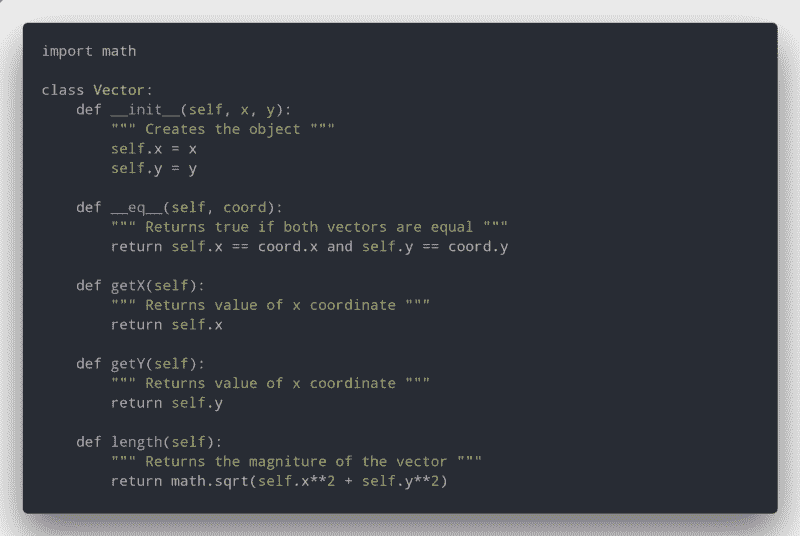
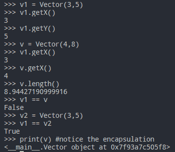
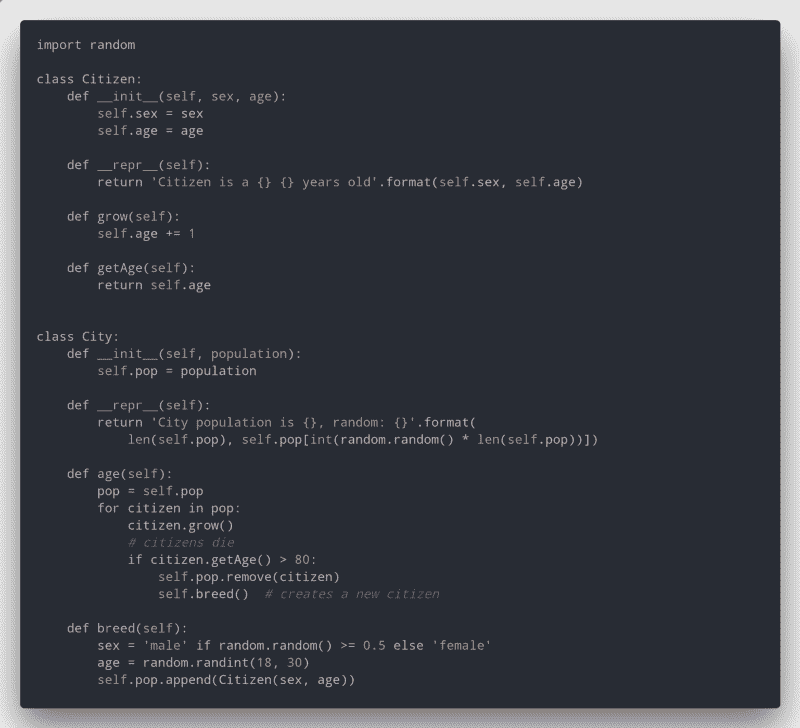
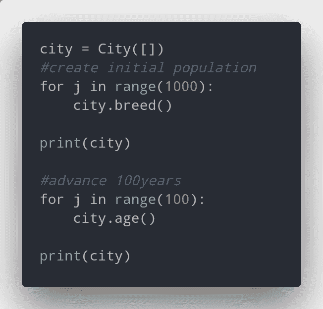
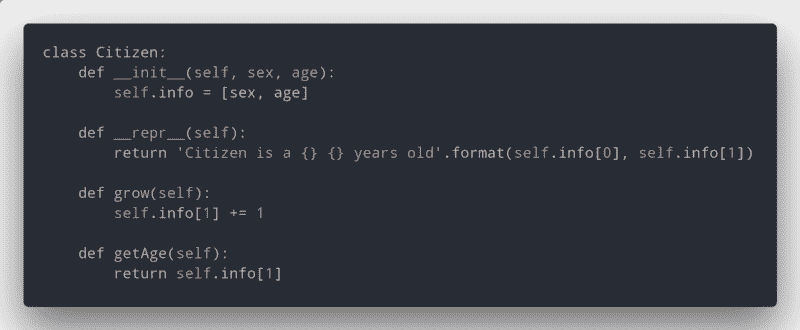

# 如何通过抽象让你的代码更具可读性

> 原文：<https://www.freecodecamp.org/news/make-your-code-understandable-by-using-abstraction-4b522307130c/>

由安特卫普

当你学习如何编程时，经常会看到人们使用一个叫做**抽象的术语。你开始问自己:什么是抽象，为什么它很重要？**

在这篇文章中，我将向你解释抽象的概念以及如何使用它，我将用 Python 给出一些例子。

### 首先:什么是抽象？

根据我的[编程老师](https://en.wikipedia.org/wiki/Jo%C3%A3o_Pav%C3%A3o_Martins)的基础:

> “抽象是一个实体的简化规范”

这意味着抽象是计算实体的表示。这是一种隐藏其特定信息的方法，只将最相关的信息提供给程序员。

抽象也是视情况而定的:每一个都适合一个需求，所以你可以把好的抽象和那个实体的特定用途联系起来。

让我们来看看二叉查找树的(如果你不知道他们是什么，看看我关于他们的[文章](https://medium.freecodecamp.org/trees-in-programming-the-oxygen-of-efficient-code-6c7c11a3dd64))。我们可以将节点定义为具有以下属性的实体:

```
A Node has:    Node * left    Node * right    int val
```

这里我们说一个节点有两个指向其他节点的指针和一个 int 值。但是**与函数`insert(node, value)`相比，这个**对某人有多大用处，它会正确地插入它吗？这样，你只需要调用它，它就完成了。简单。

这就是抽象的用处。你在程序中使用的所有库都使用它，所以使用一个库变得非常简单。

### 好吧，但是数据抽象有多好呢？

数据抽象允许我们将复杂的数据结构转换成简单易用的结构。这样做的效果是，一个代码复杂度很高的程序，可以转化成一个看起来接近英文的程序(姑且称之为*高级代码*)。

数据类型由两部分组成:属性和方法，可以是公共的，也可以是私有的。公共的是使用数据的唯一途径。它们应该涵盖您希望数据能够实现的所有功能。

如果你使用抽象代码会发生什么？只要这些方法仍然接收相同的参数，做和以前一样的事情，那么你的内部属性是否改变并不重要。如果有错，只需要改一次。

让我们选一个例子来使用它:向量

我们假设向量是:

*   具有两个值 x 和 y 的对象
*   x 和 y 都是非负数

这样向量就像(2，5)，(0，19)，等等。

创建抽象的一个好方法是使用对象。它们提供信息隐藏和表示匿名。这允许用户保留抽象。

让我们从定义我们的类开始(为了让代码更整洁，我不会定义类型验证，但是您应该这样做):



所以我们定义了多种方法，现在我们有很多东西可以做:



对于 2D 矢量来说，这似乎很简单。如果你开始在更大更复杂的程序中实现它，你会发现它们真的很方便。

现在让我们用相同的方法和不同的代码来实现不同的类 vector(改变它的内部状态):


The implementation is different, but the output is the same

如果我们运行相同的命令，输出仍然是相同的。这是因为我们使用了抽象，即使代码完全改变了。这就是为什么使用抽象非常重要。它允许您的代码具有灵活性，并且独立于其他人的代码。

现在让我们使用另一个例子，这次有两个类:City 和 Citizen。



A City is made of Citizens

我们得到了以下结果:



```
### OUTPUT ###City population is 1000, random: Citizen is a female 20 years oldCity population is 1000, random: Citizen is a male 74 years old
```

但是现在想象一下，我们想要改变公民阶层内部的工作方式。如果我们不使用抽象，我们将不得不改变整个代码！那是很大的工作量！



Now we’ve changed the Citizen class, really fast — and everything still works!

现在，如果代码再次运行，我们知道它在工作，尽管结果是不同的。正如你所看到的，我们改变了整个类，但一切正常！

### 包扎

起初，抽象可能看起来并不需要。你使用的语言级别越低，使用抽象就越重要。这避免了复杂的代码，并真正保持了简单。在像 C 这样的语言中，它真的非常有用。如果你怀疑，检查一下我做的这个项目，在那里我实现了抽象，很容易理解发生了什么。

如果你有任何问题或想谈论或讨论的事情，请在下面留下评论！

别忘了在 [Instagram](https://www.instagram.com/tm.antunes/) 和 [Twitter](https://twitter.com/tm_antune) 上关注我！