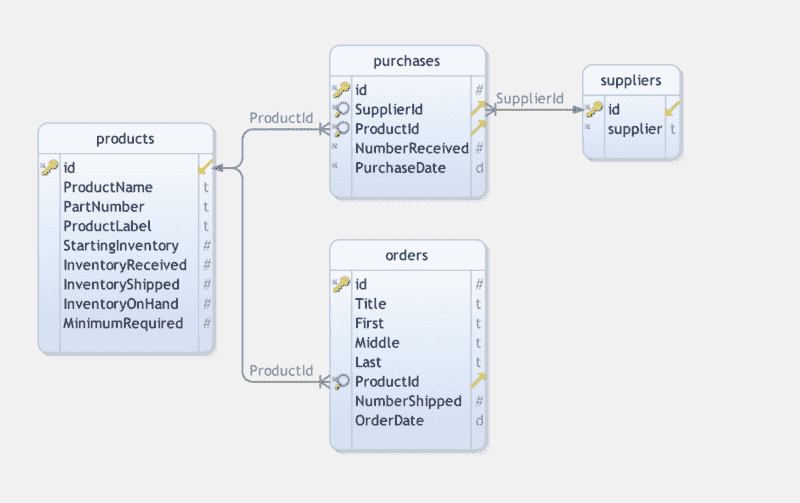
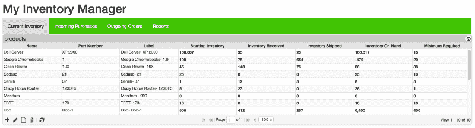
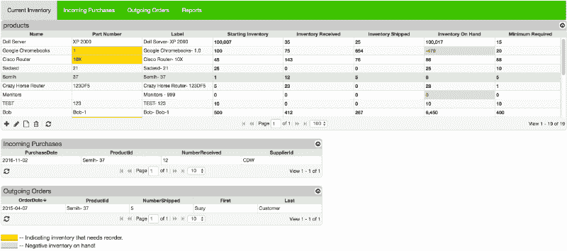
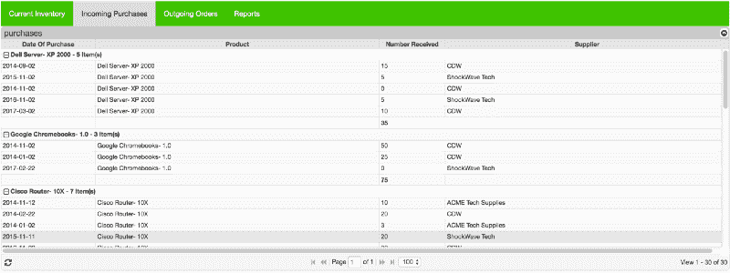
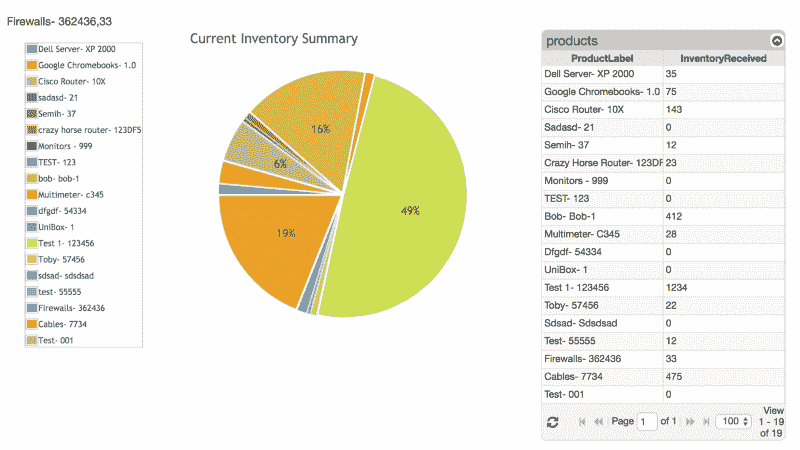
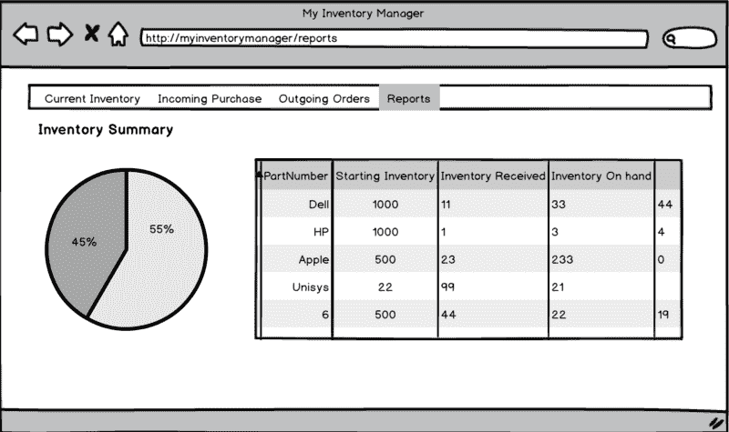

# 如何用 PHP 和 MySQL 制作一个很棒的库存管理应用程序

> 原文：<https://www.freecodecamp.org/news/making-an-awesome-inventory-management-application-in-php-and-mysql-from-start-to-finish-90bc5996680a/>

作者理查德

# 如何用 PHP 和 MySQL 制作一个很棒的库存管理应用程序


你不需要臃肿的企业软件来有效地跟踪你的库存。本教程将帮助您开发自己的定制库存跟踪应用程序，以便您可以根据及时准确的库存数据做出明智的库存决策。

### 系统需求

我们的库存系统需要标准的商业 phpGrid 和 phpChart 许可证。它需要两个组件的一些高级特性。

*   PHP 5.6+( **现在强烈推荐 PHP 7.x！**)
*   MySQL / MariaDB
*   phpGrid Lite(子网格)-或- phpGrid Enterprise(主细节，分组)
*   phpChart(用于报告)

### 什么是库存管理系统

库存管理系统有几个关键的组成部分。库存控制的核心是跟踪仓库的两个主要功能:接收(进货)和运输(出货)。还会发生其他活动，如库存的移动或重新定位。原材料减少，制成品增加。

*   进货
*   发出的订单
*   库存
*   供应商
*   [条形码扫描仪](https://medium.com/@chensformers/inventory-management-system-with-barcode-scanner-in-php-a-definitive-guide-d18fdc165511)(2019 年 1 月新！)

### 库存系统数据库设计

通常，库存系统有四个基本要素:产品、采购、订单和供应商。必须根据每个元素的位置、SKU 和数量对其进行跟踪。当前库存或现有产品通过跟踪进货和出货订单进行更新。可以将订单警报设置为当库存水平低于自定义的最低水平时触发。



### 设置库存管理器数据库

从本教程的 [GitHub repo](https://github.com/phpcontrols/inventory-manager) 下载`**InventoryManager.sql**` SQL 脚本，然后使用 MySQL 工具如 [MySQL Workbench](https://www.mysql.com/products/workbench/) 执行脚本。这将创建一个名为`**InventoryManager**`的新数据库以及本教程所需的表。

### ZenBase 的一个旁注

```
The Inventory Management System is also one of the many application templates readily available at ZenBase (built on the top of phpGrid) for anyone — with or without coding skills — to use and customize for their own needs.
```

### 设置 phpGrid

我们继续吧。

我们将通过 [phpGrid](https://phpgrid.com) 使用 datagrid 组件来处理所有内部数据库 **CRUD(创建、移除、更新和删除)**操作。

在继续之前，请务必[下载一份 phpGrid](https://phpgrid.com/download/) 副本。

要安装 phpGrid，请按照下列步骤操作:

1.  解压缩 phpGrid 下载文件。
2.  将`**phpGrid**`文件夹上传到 phpGrid 文件夹。
3.  通过配置`**conf.php**`文件完成安装。

在我们开始编码之前，我们必须在 phpGrid 配置文件`**conf.php**`中包含以下信息。

### 创建用户界面(UI)

我们的库存系统包括四个页面:

*   当前库存
*   进货
*   发货订单
*   报告


### 菜单

菜单的包含文件存储在名为`**menu.php**`的`**inc**`文件夹中。菜单的代码很简单。为了突出重点，我们就不赘述了。请随意查看`[**inc**](https://github.com/phpcontrols/inventory-manager/tree/master/inc)`文件夹中的代码。

我们还添加了一个名为`Reports`的菜单项。


### 页

我们将使用用于 [CRM](https://phpgrid.com/example/build-first-simple-crm-scratch/) 和[项目管理](https://phpgrid.com/example/build-project-management-application-scratch/)教程的相同页面模板。

#### 当前库存


让我们从当前的库存页面开始。

进货会增加库存，而出货会减少库存。从主-明细的角度来看，当前库存有两个明细数据网格，而不是一个——采购**(进货)和订单**(出货)。****

**因此，当前库存页面由一个主网格(当前库存)和两个详细网格(进货和出货)组成。我们可以使用 phpGrid 的一个主数据网格和多个细节数据网格特性轻松呈现这些关系。**

### **phpGrid Lite 与专业版和企业版**

> **主细节和分组功能需要 phpGrid 专业版或企业版。如果你在免费的 Lite 版本上，你仍然可以使用[子网格](https://phpgrid.com/documentation/set_subgrid/)来代替主细节，尽管不太先进。强烈推荐专业版或企业版。**

**如果你已经阅读了上一篇教程[从头开始构建捐赠管理器](https://medium.com/@chensformers/a-step-by-step-guide-to-building-a-donation-manager-from-scratch-in-php-part-i-514a7d34ee82)，你将不会对下面的代码有任何问题。**

**注意用于格式化整数的 [set_col_format()](https://phpgrid.com/documentation/set_col_format/) 函数的使用。**

**这就是当前库存数据网格。这是目前为止的情况:**

****

**现在，让我们做一些更改来增强我们的**产品**数据网格。**

**首先，我们将添加一些条件格式:每当 **InventoryOnHand** 被设置为零或负值时，它使用不同的背景颜色显示。为此，我们将使用 [set_conditional_format()](https://phpgrid.com/documentation/set_conditional_format/) 函数。**

**上面的代码添加了一个显示条件，以便每当`InventoryOnHand`字段的值小于(`lt`)1 时，文本颜色变为`red`，背景颜色变为深灰色(`#DCDCDC`)。**

**其次，每当`InventoryOnHand`小于`MinimumRequired`中显示的值时，我们希望通过用突出的背景色(如金色)显示来提醒用户。为了比较两个字段之间的值，我们必须切换到 Javascript，因为 [set_conditional_format()](https://phpgrid.com/documentation/set_conditional_format/) 函数只适用于单个字段。**

**下面的代码使用了一个`for`循环来遍历**产品**数据网格中的每一行。它将`inventoryOnHand`与`minimumRequired`进行比较，当条件满足时，它将使用`setCell`功能来改变背景颜色。**

**您可以在 phpGrid 支持网站上了解更多关于比较多个单元格值的信息。**

**接下来，在同一个页面上，我们需要看到特定产品的进货(**输入**)和订单输出(**输出**)。**

#### **采购明细网格(接收)**

#### **订单明细网格(传出)**

**两个细节网格使用相同的外键`ProductId`链接到主数据网格(**产品**)。**

**最后，我们管理**当前库存**页面的完整代码是:**

**这是清单页面的快照:**

****

### **进货**

****

**下一页是**进货**页面。它类似于我们在设置**当前库存**页面时看到的**采购明细网格**。我们按`ProductId`对购买进行分组，并在`NumberReceived`中显示总额。任何进货都会增加库存。**

> ****注意:分组功能仅在 phpGrid 专业版和企业版中可用。要过滤而不分组，使用[集成搜索](https://phpgrid.com/example/integrated-search/)。****

**完整代码:**

**这是我们启用分组的**进货**页面的截图:**

****

### **发出的订单**

****

**下一页是**外发订单**页。它类似于来自**当前库存**页面的**订单明细网格**。这里我们就介绍一个叫 [set_grid_method()](https://phpgrid.com/documentation/set_grid_method/) 的高级函数。**

### **摘要**

**本教程用不到 50 行代码构建了一个简单且可扩展的库存系统。这些教程的进步风格也有助于读者通过在每个教程中引入有限数量的新 phpGrid 特性，最终更加熟悉和熟悉 phpGrid。**

### **接下来是什么**

**这标志着创建本教程所需的数据网格的代码已经结束。然而，我们还没有完成。我们还需要创建一个页面—报告。我们将在跳跃之后报道那个。**

**没有某种类型的报告，库存系统有什么用？在本节中，您将学习如何使用[phpChart](http://phpchart.com/)——它与 phpGrid 无缝集成——为您的 Inventory Manager 应用程序创建视觉上令人愉悦且有用的报告。**

**这是我们的页面完成后的样子:**

****

**在开始之前，我们需要安装 phpChart。建议您获取 phpChart 的[完整版，因为免费版(phpChart Lite)仅支持折线图。](https://phpchart.com/download/)**

### **设置 phpChart**

**将 phpGrid 和 phpChart 放在不同的文件夹中很重要。下面是**推荐的**文件夹层次。**

```
`www    +-- Donation_Manager    |   |-- phpGrid    |   |   +-- conf.php    |   |-- phpChart    |   |   +-- conf.php    |   +-- ...`
```

### **报告设计**

**我们将在库存摘要网格旁边放置一个饼图。数据网格提供系列数据来绘制饼图。**

****

### **phpGrid 和 phpChart 集成**

**首先，在代码开头包含对两个`**conf.php**`文件的调用。**

```
`require_once("phpGrid/conf.php"); require_once("phpChart/conf.php");`
```

### **圆形分格统计图表**

**下面是创建饼图的完整代码:**

**让我们浏览一下代码。**

**第一行是构造函数。我们将`array(null)`作为系列数据传递，因为我们不希望一开始在饼图中显示任何数据。首次初始化图表时，用于绘制图表的库存数据尚不可用。稍后在 JSON 中，数据是从 datagrid 输入的。**

**我们还给图表起了一个独特的名字`PieChart`。**

**接下来，我们给它一个标题。这里没什么特别的。**

**一旦我们有了标题，我们就调用[系列默认的](https://phpchart.com/phpChart/docs/output/C_PhpChartX_set_series_default@.html)函数将`renderer`设置为`PieRenderer`。与条形图不同，饼图没有 Y 轴。**

**我们也可以设置`rendererOptions`属性。我们不会在这里详细讨论每个选项，但是您可以在[在线文档](https://phpchart.com/documentation/)中找到更多信息。**

**我们还想展示一个传奇。下面的 set_legend 命令将图例显示在饼图的西边(用`w`表示)或左边。**

**我们也将删除边界和背景。**

**最后，我们通过给定高度和宽度(以像素为单位)来绘制图表。**

**但是，如果您现在执行代码，您将看不到图表，因为用于呈现它的数据还不可用。**

### **库存摘要数据网格**

**这里，我们将使用与在**产品**页面中相同的库存数据网格。我们只需要添加一个东西——事件处理程序。**

**在 phpGrid 中，我们可以用 [add_event()](https://phpgrid.com/documentation/add_event/) 函数添加一个事件处理程序。add_event()将一个事件处理程序(本质上是一个 JavaScript 函数)绑定到一个特定的 phpGrid 事件。可以在[这里](https://phpgrid.com/documentation/add_event/)找到可能事件的列表。**

**因为我们必须在发送数据来绘制图表之前等待 datagrid 完成加载**，所以我们使用事件`jqGridLoadComplete`。****

****PHP grid 101—jqGridLoadComplete 事件****

**jqGridLoadComplete 是整个 datagrid 主体完成加载后发生的最后一个事件。请注意，如果用户更改列的排序顺序或设置过滤器，网格主体将被重新加载。**

#### **用 Javascript 发送数据**

**下面是`jqGridLoadComplete`的 Javascript 事件处理程序。**

**完整代码:**

**现在你有了。您刚刚使用 PHP 和 MySQL 从头开始构建了您的第一个库存管理系统！**

**感谢您的阅读！如果你喜欢这篇文章，请给我一些掌声，让更多的人看到它。**

### **编程新手？不要害怕！**

**如果你是编程新手，还不熟悉编码，你可能想看看构建在 phpGrid 之上的 ZenBase。库存管理系统只是[众多应用程序模板](https://getzenbase.com/templates/)中的一个，ZenBase 随时可以提供给任何人——*有或没有*编码技能——使用和定制他们自己的需求。**

### **在线演示**

*   **[当前库存](https://phpdatagrid.com/apps/inventory-manager/products.php)**
*   **[进货](https://phpdatagrid.com/apps/inventory-manager/incoming-purchases.php)**
*   **[外发订单](https://phpdatagrid.com/apps/inventory-manager/outgoing-order.php)**
*   **[报告](https://phpdatagrid.com/apps/inventory-manager/reports.php)(与数据网格并排)**

### **下一步:添加条形码扫描仪**

**[将条形码扫描仪添加到我们的库存管理系统中](https://medium.com/@chensformers/inventory-management-system-with-barcode-scanner-in-php-a-definitive-guide-d18fdc165511)**

****

### **在 Github 上下载源代码**

**[**PHP controls/Inventory-manager**](https://github.com/phpcontrols/inventory-manager)
[*Inventory-manager 源代码 PHP 和 MySQL 中自始至终的牛逼库存管理应用*github.com](https://github.com/phpcontrols/inventory-manager)**

### ****常见问题:****

****致命错误**:未捕获的错误:找不到类“phpGrid\C_DataGrid”**

**如何修复:
如果你使用的是免费的精简版，你可以把第一行注释掉**

```
`// use phpGrid\C_DataGrid;`
```

**—或者—**

**在构造函数前添加一个全局命名空间符号(单反斜线)**

```
`$dg = new \C_DataGrid(“SELECT * FROM orders”, “orderNumber”, “orders”);`
```

### **您可能也会对这些教程感兴趣:**

**[**从头构建项目管理应用**](https://phpgrid.com/example/build-project-management-application-scratch/)
[*什么是项目管理应用？*](https://phpgrid.com/example/build-project-management-application-scratch/) [**从头到尾构建一个简单的 CRM**](https://phpgrid.com/example/build-first-simple-crm-scratch/)
[*客户关系管理(CRM)是一个管理整个客户的客户交互和数据的系统…*](https://phpgrid.com/example/build-first-simple-crm-scratch/) [**在 PHP 中从头构建一个捐赠管理器**](https://medium.com/@chensformers/a-step-by-step-guide-to-building-a-donation-manager-from-scratch-in-php-part-i-514a7d34ee82)**

### **感谢阅读。如果你喜欢这篇文章，请点击那个按钮。帮助其他人找到它，并在 Twitter 上关注我。**

****

### **你想看更多这样的教程吗？向我的 [Twitter](https://twitter.com/midlifesaas) 发送请求或在下面留下评论！**