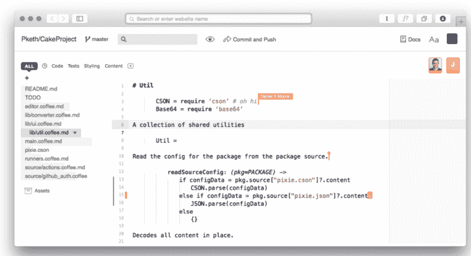
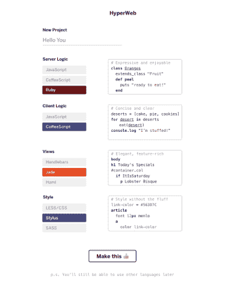
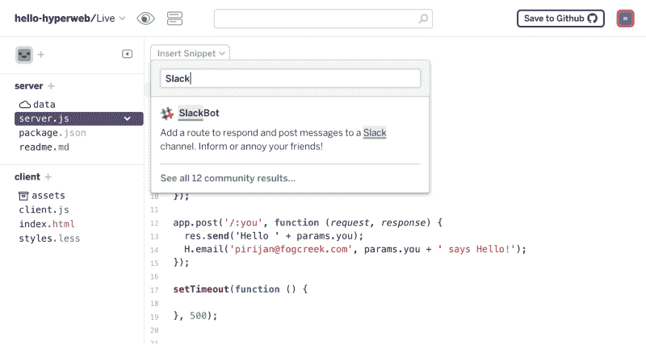
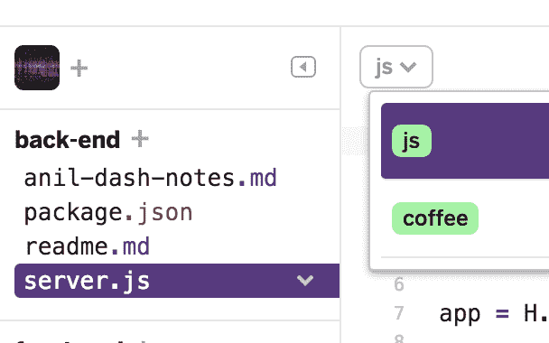

# 设计故障:我们如何解决 web 开发令人烦恼的复杂性

> 原文：<https://www.freecodecamp.org/news/making-learning-to-code-less-complicated-ad457e56a446/>

作者加雷斯·威尔逊

# 设计故障:我们如何解决 web 开发令人烦恼的复杂性

打个比方，放在开水里的青蛙会跳出来。但如果放在慢慢加热的冷水里，它不会感知到危险，会被煮死。

Web 开发者就像那些青蛙，慢慢沸腾。每天沉浸在代码和工具中，我们没有注意到复杂性的缓慢蔓延。但是用新的眼光来看待这个行业——例如，作为一个刚刚学习编码的人——你会发现有多少人甚至在输入一行代码之前就不知所措了。我从哪种编程语言开始？我使用什么库？哪个 IDE 最好？SQL 还是 NoSQL？合并还是改基？dyno 到底是什么？

正是这种复杂性促使我们在 Fog Creek 建立了 [Glitch](https://glitch.com) ，一个友好的社区，在这里你可以构建你梦想中的应用程序(或者实用的需求！)它删除了所有设置，因此您只需担心编写代码来构建 web 应用程序。因为尽管在超过 15 年的时间里，我们已经开发了数百万人使用的 web 产品，如 Stack Overflow 和 Trello，但我们意识到我们经常忽略作为开发人员每天都沉浸在其中的复杂性。

在 web 开发存在的这些年里，我们已经看到了旨在使 web 开发更容易的工具、语言、库和框架的激增。但是现在，在我们进入“Hello World”之前，我们必须完成复杂的配置服务器、运行 shell 命令、编译文件、建立构建管道和控制版本控制系统的工作。

结果是，如果你刚开始学习编码，有大量的*非编码的东西*你必须与之抗衡。这可能会分散学习核心编程概念的注意力。他们很可能会绊倒你，所以你把宝贵的一点点时间花在剃光众所周知的牦牛毛上，解决那些一旦解决了却没有教会你任何东西的问题。

我们对用户进行的研究越多——与编程新手交谈——像“感觉很蠢”和“感觉像个白痴”这样的短语就出现得越多。但是我们真的不应该那么惊讶。毕竟，如果一个像极限编程之父 Ron Jeffries 这样有经验的开发人员，仅仅为了让一个简单的应用程序运行起来而被[卡住*好几天*](http://ronjeffries.com/articles/016-0607/yaks/) ，那么我们其他人还有什么希望呢？

#### 消除 web 开发的一些复杂性

所以我们想尝试解决这个问题。然而，第一件事是真正明确我们要解决什么问题。Web 开发是一个极其复杂的领域，有一大堆问题，我们不能指望解决所有问题。

我们以[溪周](http://blog.fogcreek.com/how-we-embed-a-culture-of-innovation-with-creek-weeks/)开始。那就是我们从日常活动中抽出一周时间，完全专注于研究一个问题。Creek 周的主题是“抽象出开发中枯燥、难学的部分”，并提供一些东西，使人们能够“编写一个应用程序并将其部署到一个 URL 上，而不会感到单调乏味。”

这更具体一点，它有助于排除一些事情。首先，我们是“抽离”——而不是取代。我们并不希望让编程本身变得更容易。我们不仅仅是重新创造了[标志](https://en.wikipedia.org/wiki/Logo_%28programming_language%29)。

这个任务也有助于我们集中研究。我们查看了涉及这一领域但尚未解决问题的现有解决方案。IaaS、PaaS、快速应用开发和在线代码编辑器等解决方案。从中，我们学到了很多东西，包括一些我们认为应该避免的方法，例如通过创建一些可视化应用程序创建软件来尝试完全消除代码。这是一条常走的路，至今没有真正的赢家。我们希望保留编码的能力和灵活性，但只是让它更快更容易开始。

在 Creek 周期间，我们创建了一个证明概念，用于获得组织其他成员的认可，因此我们可以进一步探索这个问题。我们还创建了一些模型:

Initial Editor Mockup

Project Creation Screen Mockup

您会注意到一些方面，如“提交和推送”按钮、“主”分支和“测试”部分。我们还没有开始深入研究我们想用哪些技术来解决这个问题。我们需要变得更具体。

#### 原则主导的产品设计

为了做到这一点，就像[我们创建 Trello](http://blog.fogcreek.com/the-process-of-creating-trello-tech-talk/) 时一样，我们将自己的想法归结为一些产品原则。这些都是试图概述我们的方法，并概括我们对解决问题的最佳方式的意见。他们是:

*   以最快、最简单的方式获得您自己的 web 应用程序并开始使用它。
*   当你编辑你的应用时，你应该得到即时、直接的反馈。
*   你应该总是觉得编辑很安全，而且你可以在不破坏项目的情况下尝试一些想法。
*   这个编辑器应该使用起来很有趣，但是要快速且易于使用。

这些帮助我们更批判地提炼我们的想法。

因此，例如，牢记这些原则，重新评估上面的“项目创建屏幕”模型，我们可以看到，作为一个起点，这意味着用户将不得不提前做出许多关于技术的艰难选择。因此，你可能不得不去研究所提供的选项之间的差异，而不是仅仅开始做一些东西。这显然违背了我们的第一个产品原则，即让你快速入门，这更像是我们对编码的“最佳方式”过于固执己见的一个例子。

这些原则也意味着取消“提交和推送”按钮，因为这不仅假设你知道什么是“提交”,什么是“推送”,而且它也是即时反馈的障碍。此外，与人们谈论这些原则时，发现版本控制是许多焦虑和困惑的来源，大多数人只使用 Git 功能的一小部分。

类似地，虽然访问命令行提供的灵活性和控制是强大的，但它使用户面临可能需要几个小时才能解决的环境问题，并且他们通常从中学不到什么。然而，如果我们想成为“最简单的”,那么我们必须建立在现有的人们使用代码的方式上。所以从堆栈溢出中复制并粘贴一个答案应该就像在本地机器上一样。

有了这些产品原则，我们觉得我们现在有足够的理解来构建 MVP。研究和分析只能让我们到此为止。现在我们想知道这些想法在实践中是如何运作的。

#### 构建 MVP

接下来的几个月是开发、运行内部用户测试以及——为了让项目保持正轨——团队和创始人之间两周一次的会议。这些会议有助于提供那些没有参与项目日常事务的人的意见。正因为如此，它们成为了防止集体思维和陷入产品开发细枝末节的一种方式。

为了真正理解这一点，我们需要走出大楼，从我们组织之外的人那里获取信息。所以我们向 Recurse 中心和扁铁学校的朋友寻求帮助。我们向他们展示了产品，获得了反馈，还进行了多次一对一的产品测试，以获得进一步的定性反馈。

Inserting snippets screen

事实证明，这些测试有助于理解产品的哪些方面可能符合这些原则，但在实践中并不奏效。例如，为了更容易地完成常见的编码任务，我们允许您搜索和插入预先制作的代码片段。这在理论上是有意义的，但是在用户测试中，没有人使用它们，即使在他们被告知之后。他们提出了一些棘手的问题，比如这些片段来自哪里？谁来编写和维护它们呢？如果代码片段需要的话，我们应该把包添加到项目中吗？

On-the-fly language selection

另一个在测试版中存在了几个月的特性是文件的即时语言选择。理论上，这使得语言实验变得容易，并且是一种向用户展示我们当前支持的语言的上下文方式。为了实现这一点，我们必须创建许多库，我们认为这些库也有助于抽象出现有框架和语言所需的一些样板代码。

这非常符合我们的产品原则，但实际上，测试中发生的情况是，当人们看不到他们的初始化代码时，他们会感到不舒服。这不是他们期望看到的，这使得他们很难理解产品是如何工作的。因此，我们继续改进产品，使其更简单、更透明。

#### 我们交付了什么

最后一个阶段是获得大规模产品的使用数据和意见。所以我们开放了测试版供任何人使用，这就是我们目前的进展。但是，从消除 web 开发复杂性的宏伟愿景来看，我们实际上交付了什么呢？

嗯，如果你去[glitch.com](https://glitch.com/edit)，一个新的项目会自动启动，其中包含一个欢迎项目应用程序。该应用程序有自己的网址，你和任何与你分享它的人都可以立即访问。它是一个真正的 web 应用程序，包含服务器端和客户端代码。

然后，您可以编辑它，或者创建一个新项目，并构建您想要的任何 Node.js 应用程序(我们将很快添加对其他后端的支持！)，包括真正的、全功能的网络应用。但也许更有趣的是，你不需要做什么就可以启动并运行这个网络应用程序:

*   你没有做账。
*   您没有配置和设置 web 服务器。
*   你没有注册一个主机，等待域名服务器更新。
*   你没有安装操作系统，灯，节点或其他任何东西。
*   您没有提交、构建或部署您的代码。

您创建的应用程序由我们托管，即时处于活动状态，并始终与您的最新更改保持同步，因为更改会在您键入时部署。没有设置，像配置您的环境，设置您的构建管道，记忆 Git，或手动部署更新。您还可以邀请团队成员加入您的项目，这样您就可以一起协作编写代码，并查看所做的更改。

您可以通过重新混合现有的社区项目快速开始，每个项目都有一个用于编辑和查看的 URL，因此您可以共享您的代码或创作。

我们还有很长的路要走，但我们已经迈出了消除 web 开发复杂性的第一步。所以，下次你打算学习一个新的库，写一个快速脚本，或者设计一个产品原型，亲自尝试一下[看看写代码有多快。](https://glitch.com)