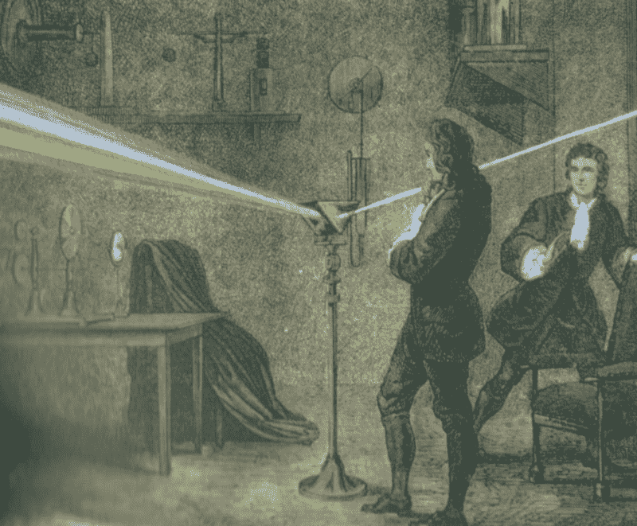
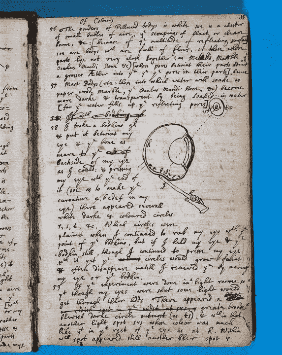

# 制造彩虹

> 原文：<https://www.freecodecamp.org/news/making-rainbows-8427d7c4bd90/>

吉尔·福斯特

# 制造彩虹

这是一个关于好奇心的故事。也是关于当你把针扎进眼睛时会发生什么。如果你碰巧此刻正在吃一把葡萄，也许过一会儿再来。

直到 17 世纪晚期，白光还被广泛认为是一种单一的不可约的物质。白光可能以某种方式由彩虹的所有颜色组成，这是神圣纯洁的象征，不仅是空想，而且可能是异端邪说。

然后有一天，牛顿把一根针扎进了他的眼窝。

说真的。

> 我拿起一块骨头，把它放在我的眼睛和骨头之间，尽可能靠近我的眼睛后面:用它的末端压住我的眼睛(以便使我的眼睛弯曲)，出现了几个白色的黑色和彩色的圆圈。当我继续用手指揉眼睛时，哪些圆圈是最清晰的，但如果我握住我的眼睛&手指不动，尽管我继续用它按压我的眼睛，但圆圈会变得模糊&常常消失，直到我移动我的眼睛或手指来恢复它们。*

通过一系列巧妙的棱镜实验，牛顿最终想出了一个更好、更安全、更简单的方法来研究光的组成。但它始于这一戏剧性的举动——部分精彩，部分疯狂——源于最非凡的创作冲动:好奇心。

[Newton’s notebook](http://www.lib.cam.ac.uk/exhibitions/Footprints_of_the_Lion/private_scholar.html) with his description of his eyeball experiment.

现在，听着:我不是说你应该去把一点钢塞进你的眼眶里，看看会发生什么。请不要这样做。尽管可能有些极端，但牛顿的实验生动地说明了不要轻信任何事物的重要性，以及发现和风险之间不可分割的联系。

我们认为我们知道一些事情，不是吗？我们称自己为专业人士、专家和(上帝帮助我们)古鲁或忍者。我们通过来之不易的经验和正规训练赢得了我们的军衔。从把事情做对和做错，从过去的错误中学习，同时犯新的错误，这样我们下次就有东西可学了。

但是，随着时间的推移，如果我们不小心，我们的经验有可能成为创新的障碍吗？

我们开始讨论最佳实践。我们陷入了解决问题的习惯方式。我们认为我们已经见过两次了，当它不可避免地出现第三次时，我们知道如何解决它。问题变得可预测，解决方案变得机械。

我们自以为了解的世界实际上是由无数“白光”假设组成的。我们认为我们知道事情是如何运作的，知道做某事的最佳方式，知道旅行的有效路径。但是很多我们认为不言自明的东西实际上只是习惯。你积累的所有经验和专业知识可能会对你不利，让你变得自满。

实验，就其本质而言，不会总是产生我们想要的结果。但是如果我们从不质疑我们相信的真理，如果我们不敢好奇，如果我们让我们的经历成为我们的安全地带，如果我们缺乏偶尔冒险的勇气…

…嗯，我们可能永远看不到隐藏在我们周围的白光中的新思想的彩虹。

*最初发布于[abc.gilfewster.com](http://abc.gilfewster.com/making-rainbows/)2015 年 10 月 29 日。*