# 理解 Azure 持久功能

> 原文：<https://www.freecodecamp.org/news/making-sense-of-azure-durable-functions/>

无状态无服务器云函数之上的有状态工作流——这是 Azure 持久函数库的精髓。在一句话中有很多新奇的词语，对于大多数读者来说可能很难理解。

请和我一起踏上旅程，我会试着解释这些流行语是如何组合在一起的。我将分三步完成:

*   描述依赖无服务器架构的现代云应用的背景；
*   确定用简单的构件组成应用程序的基本方法的局限性；
*   解释持久函数为这些问题提供的解决方案。

## 微服务

传统上，服务器端应用程序是以一种现在被称为 **Monolith** 的风格构建的。如果多个人和团队在开发同一个应用程序的一部分，他们大部分都贡献给了同一个代码库。如果代码库结构良好，它会有一些独特的模块或组件，一个团队通常会拥有每个模块:

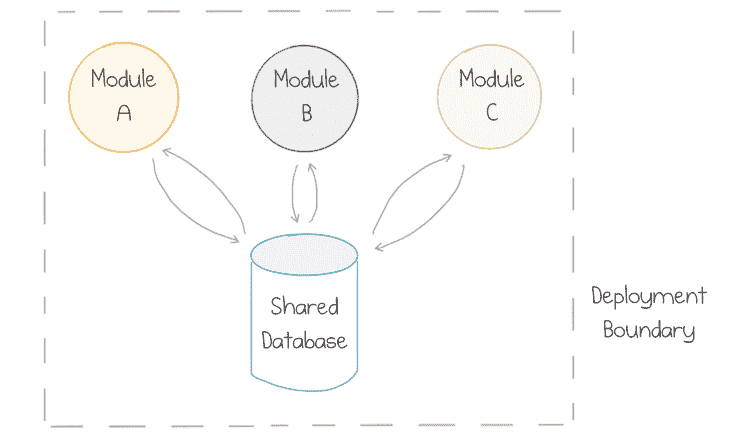

Multiple components of a monolithic application

通常，模块会在构建时打包在一起，然后作为一个单元部署，因此模块之间的大量通信会留在操作系统进程中。

尽管随着时间的推移，模块可以保持松散耦合，但耦合几乎总是发生在数据存储层，因为所有团队都将使用单一的集中式数据库。

这种模型非常适合中小型应用程序，但是随着应用程序的增长，团队开始妨碍彼此，因为贡献的同步需要越来越多的努力。

作为一种复杂但可行的替代方案，业界提出了一种经过修改的面向服务的方法，通常称为**微服务**。团队将大型应用程序分成围绕不同业务功能构建的“垂直部分”:

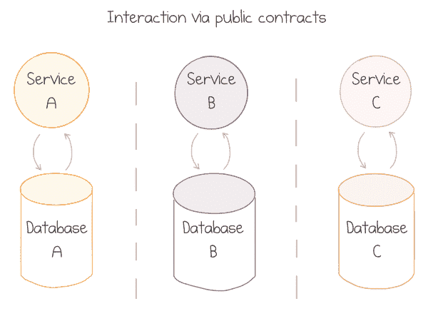

Multiple components of a microservice-based application

然后，每个团队都拥有一个完整的垂直领域——从公共通信合同，甚至 ui，一直到数据存储。强烈反对显式共享数据库。服务通过文档化和版本化的公共契约相互交流。

如果拆分的边界选择得很好——这是最棘手的部分——合同会随着时间的推移保持稳定，并且足够薄以避免过多的闲聊。这给了每个团队足够的自主权，以他们最好的速度进行创新，并做出独立的技术决策。

微服务的一个弊端就是部署模式的改变。这些服务现在被部署到通过网络连接的不同服务器上:

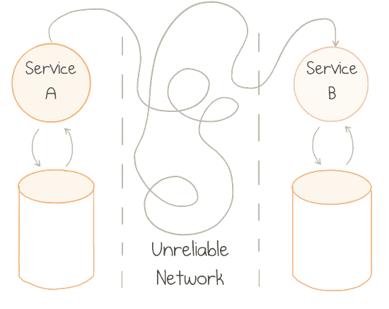

Challenges of communication between distributed components

网络从根本上来说是不可靠的:它们大部分时间都工作得很好，但是当它们出现故障时，就会以各种不可预测和最不可取的方式出现故障。有一些书籍是以分布式系统架构为主题的。TL；大卫:这很难。

许多微服务的新采用者倾向于忽略这种复杂性。HTTP(S)上的 REST 是连接微服务的主要方式。像任何其他同步通信协议一样，它使系统变得脆弱。

考虑当一个服务变得暂时不健康时会发生什么:可能它的数据库离线，或者它正在努力跟上请求负载，或者正在部署服务的新版本。对有问题的服务的所有请求开始失败——或者更糟——变得非常慢。从属服务等待响应，因此会阻塞所有自己的传入请求。错误会非常迅速地向上游传播，导致到处都是级联故障:

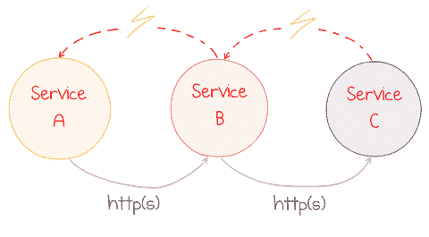

Error in one component causes cascading failures

应用程序已关闭。每个人都尖叫着开始指责战争。

## 事件驱动的应用

虽然 HTTP 通信的级联故障可以通过断路器和适度降级等模式来缓解，但更好的解决方案是切换到异步通信方式作为默认方式。某种持久排队服务被用作中介。

基于在服务间发送事件的应用架构风格被称为**事件驱动**。当一个服务做了一些有用的事情时，它会发布一个事件——一个关于其业务领域发生的事实的记录。另一个服务监听发布的事件，并根据这些事实执行自己的职责:

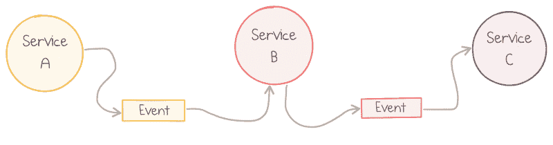

Communication in event-driven applications

产生事件的服务可能不了解消费者。随着时间的推移，可以引入新的事件订阅者。这在理论上比在实践中更有效，但是服务之间的耦合更少。

更重要的是，如果一个服务关闭，其他服务不会立即着火。上游服务不断发布事件，这些事件在队列中累积，但可以安全地存储几个小时或几天。下游服务可能没有为这个特定的流做任何有用的事情，但是它可以保持健康。

然而，另一个潜在的问题伴随着松散耦合而来:低内聚。正如马丁·福勒在他的文章
[中注意到的，“事件驱动”是什么意思](https://martinfowler.com/articles/201701-event-driven.html):

> 使用事件通知很容易实现良好的解耦系统，而不会意识到忽略了更大规模的流程。

鉴于许多组件发布和订阅大量事件类型，很容易只见树木不见森林。事件的组合通常构成按时间执行的渐进工作流。工作流不仅仅是其各个部分的总和，理解高层流程对于控制系统行为至关重要。

保持这个想法一分钟；我们过会儿将回到它。现在该说说*云*了。

## 云

公共云的诞生改变了我们设计应用的方式。它使许多事情变得更加简单:在几分钟而不是几个月内提供新资源，根据需求灵活扩展，以及全球范围的弹性和灾难恢复。

这让其他事情变得更加复杂。下面是全球 Azure 网络的图片:

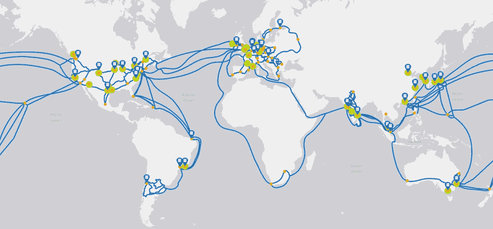

Azure locations with network connections

将应用程序部署到不止一个地理位置是有充分理由的:除其他外，通过靠近客户来减少网络延迟，以及通过地理冗余来实现弹性。公共云是最终的分布式系统。正如你所记得的，分布式系统是很难的。

还有更多。每个云提供商都有几十个托管服务，这是祸也是福。专业化服务非常适合为常见的复杂问题提供现成的解决方案。另一方面，每种服务在一致性、弹性和容错方面都有不同的属性。

在我看来，在这一点上，开发人员必须接受公共云，并在其上应用分布式系统设计。如果你同意，有一个很好的方法可以接近它。

## 无服务器

略带挑衅意味的术语**无服务器**用于描述不需要供应虚拟机、实例、工作人员或任何其他固定容量来运行定制应用的云服务。资源以动态、透明的方式分配，成本基于其实际消耗，而不是基于预先购买的容量。

无服务器更多的是关于系统的操作和经济属性，而不是技术本身。服务器确实存在，但它们是别人的事。您不需要管理无服务器应用的正常运行时间，而是由云提供商来管理。

最重要的是，你要为你使用的东西付费，类似于电力等其他商品资源的消耗。你可以从电力公司购买能源，而不是购买发电机来为你的房子供电。您会失去一些控制(例如，无法选择电压)，但这在大多数情况下是没问题的。最大的好处是不需要购买和维护硬件。

无服务器计算做同样的事情:它在按使用付费的基础上提供标准服务。

如果我们更具体地谈论像 Azure Functions 这样的功能即服务产品，它们提供了在云中运行小块代码的标准模型。你压缩代码或二进制文件，然后发送到 Azure 微软负责运行它所需的所有硬件和软件。基础架构会根据需求自动扩展或缩减，您需要为应用程序消耗的每个请求、CPU 时间和内存付费。没有使用-没有账单。

但是，总有“但是”。FaaS 服务带有应用程序必须遵循的自以为是的开发模型:

*   **事件驱动**:对于每个无服务器的函数，你必须定义一个特定的触发器——导致它运行的事件类型，可以是 HTTP 端点，也可以是队列消息；

*   **短命**:功能最多只能运行几分钟，最好是几秒或更短；

*   **无状态**:由于您无法控制何时何地提供或取消提供功能实例，因此无法在请求之间的流程中可靠地存储数据；必须利用外部存储器。

坦率地说，大多数现有的应用程序并不适合这种模式。如果你幸运地开发了一个新的应用程序(或者它的一个新模块)，你的状态会更好。

许多无服务器应用程序的设计可能看起来有点类似于这个来自[无服务器 360 博客](https://www.serverless360.com/blog/building-reactive-solution-with-azure-event-grid)的例子:

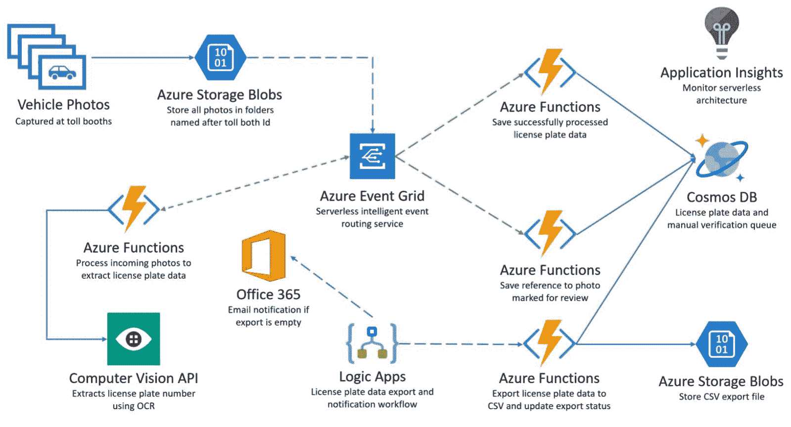

Sample application utilizing "serviceful" serverless architecture

这个应用程序中有 9 个托管 Azure 服务协同工作。它们中的大多数都有独特的用途，但服务都是用 Azure 函数粘合在一起的。一个图像被上传到 Blob 存储，一个 Azure 函数调用 Vision API 来识别车牌并将结果发送到事件网格，另一个 Azure 函数将该事件放入 Cosmos DB，等等。

这种风格的云应用有时被称为 **Serviceful** ，以强调由无服务器功能“粘合”在一起的托管服务的大量使用。

在没有任何托管服务的情况下创建一个类似的应用程序将是一项非常困难的任务，如果该应用程序必须大规模运行，情况就更是如此。此外，在自助服务的世界里，没有办法保持现收现付的定价模式。

上图所示的应用程序仍然非常简单。企业应用程序中的流程通常要复杂得多。

还记得马丁·福勒关于忽视大规模流动的引用吗？对于微服务来说是这样，但对于云功能的“纳米服务”来说更是如此。

我想深入一点，举几个相关问题的例子。

## 无服务器组合的挑战

在本文的其余部分，我将定义一个假想的业务应用程序，用于预订软件会议的行程。为了参加会议，我需要购买会议本身的门票，购买机票，并在酒店预订房间。

在这个场景中，创建三个 Azure 函数是有意义的，每个函数负责预订过程的一个步骤。由于我们更喜欢消息传递，每个函数都发出一个事件，下一个函数可以监听该事件:

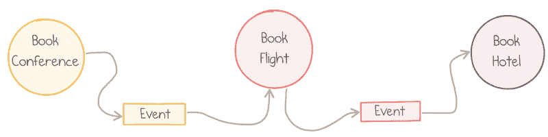

Conference booking application

这种方法是可行的，但是确实存在问题。

### 灵活排序

由于我们需要按顺序执行整个预订过程，Azure 函数通过配置一个函数的输出以匹配下游函数的事件源而一个接一个地连接起来。

在上图中，函数的顺序是硬定义的。如果我们要交换预订航班和预订酒店的顺序，这将需要更改代码——至少是输入/输出连接定义，但也可能是函数的参数类型。

在这种情况下，函数*真的*解耦了吗？

### 错误处理

如果预订航班功能变得不正常，可能是由于第三方航班预订服务中断，会发生什么情况？嗯，这就是我们使用异步消息传递的原因:在函数执行失败后，消息返回到队列，并被另一个执行再次拾取。

但是，对于大多数事件源，这种重试几乎会立即发生。这可能不是我们想要的:指数后退政策可能是一个更聪明的想法。此时，重试逻辑变为**状态**:下一次尝试应该“知道”先前尝试的历史，以决定重试时间。

还有更高级的错误处理模式。如果执行失败不是间歇性的，我们可以决定取消整个过程，并对已经完成的步骤运行补偿操作。

这种情况的一个例子是回退动作:如果航班是不可能的(例如，对于这个起点-目的地组合没有路线)，则流程可以改为选择预订火车:

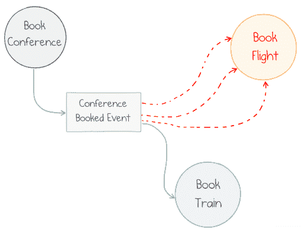

Fallback after 3 consecutive failures

用无状态函数实现这个场景并不容易。我们可以等到消息进入死信队列，然后从那里路由它，但是这很脆弱，不够有表现力。

### 平行动作

有时，业务流程不一定是连续的。在我们的预订场景中，我们先预订航班再预订酒店可能没有区别，反之亦然。可能需要并行运行这些操作。

通过事件总线的发布-订阅功能，动作的并行执行变得很容易:两个函数应该订阅同一个事件，并独立地对其进行操作。

当我们需要协调并行操作的结果时，问题就来了，例如，为了费用报告的目的计算最终价格:


Fan-out / fan-in pattern

没有办法将 Report Expenses 块实现为单个 Azure 函数:函数不能被两个事件触发，更不用说关联两个*相关的*事件了。

该解决方案可能包括两个函数，每个事件一个，以及它们之间的共享存储，以将关于第一个完成的预订的信息传递给最后一个完成的预订。所有这些连接都必须在自定义代码中实现。如果需要并行运行两个以上的函数，复杂性就会增加。

此外，不要忘记边缘案例。如果其中一个功能失效了怎么办？当读写共享存储时，如何确保没有竞争情况？

### 失踪的管弦乐手

所有这些例子都给了我们一个提示，我们需要一个额外的工具来将低级的单一用途的独立功能组织成高级的工作流。

这样的工具可以被称为 **Orchestrator** ，因为它的唯一使命是将工作委托给无状态的动作，同时维护流程的全局和历史。

Azure Durable Functions 旨在提供这样一个工具。

## Azure 持久功能介绍

### Azure 函数

Azure Functions 是微软的无服务器计算服务。函数是事件驱动的:每个函数定义一个**触发器**——事件源的确切定义，例如，存储队列的名称。

Azure 功能可以用[几种语言](https://docs.microsoft.com/en-us/azure/azure-functions/supported-languages)编程。用 C#实现的带有[存储队列触发器](https://docs.microsoft.com/azure/azure-functions/functions-bindings-storage-queue)的基本函数如下所示:

```
[FunctionName("MyFirstFunction")]
public static void QueueTrigger(
    [QueueTrigger("myqueue-items")] string myQueueItem, 
    ILogger log)
{
    log.LogInformation($"C# function processed: {myQueueItem}");
} 
```

`FunctionName`属性将 C#静态方法公开为一个名为`MyFirstFunction`的 Azure 函数。`QueueTrigger`属性定义了要监听的存储队列的名称。函数体记录关于传入消息的信息。

### 持久功能

[Durable Functions](https://docs.microsoft.com/azure/azure-functions/durable/durable-functions-overview) 是一个将工作流编排抽象引入 Azure Functions 的库。它引入了许多习惯用法和工具来定义有状态的、可能长期运行的操作，并在幕后管理许多可靠的通信和状态管理机制。

该库记录了 Azure 存储服务中所有操作的历史，实现了对故障的持久性和弹性。

耐久功能[开源](https://github.com/Azure/azure-functions-durable-extension)，微软接受外部贡献，社区相当活跃。

目前，您可以用 3 种编程语言编写持久函数:C#、F#和 Javascript (Node.js)。我所有的例子都是用 C#写的。对于 Javascript，检查[这个快速入门](https://docs.microsoft.com/en-us/azure/azure-functions/durable/quickstart-js-vscode)和[这些样本](https://github.com/Azure/azure-functions-durable-extension/tree/master/samples/javascript)。关于 F#请参见[示例](https://github.com/Azure/azure-functions-durable-extension/tree/master/samples/fsharp)、[特定于 F#的库](https://github.com/mikhailshilkov/DurableFunctions.FSharp)和我的文章[一个关于 F#和持久函数的童话](https://mikhail.io/2018/12/fairy-tale-of-fsharp-and-durable-functions/)。

工作流构建功能是通过引入另外两种类型的触发器来实现的:活动函数和编制器函数。

### 活动功能

活动功能是简单的无状态、单一用途的构建块，只完成一项任务，不知道更大的工作流。引入了一个新的触发器类型`ActivityTrigger`，以将功能公开为工作流步骤，如下所述。

下面是一个用 C#实现的简单活动函数:

```
[FunctionName("BookConference")]
public static ConfTicket BookConference([ActivityTrigger] string conference)
{
    var ticket = BookingService.Book(conference);
    return new ConfTicket { Code = ticket };
} 
```

它有一个公共的`FunctionName`属性，将 C#静态方法公开为一个名为`BookConference`的 Azure 函数。这个名称很重要，因为它用于从 orchestrators 调用活动。

`ActivityTrigger`属性定义了触发器类型，并指向活动期望为每次调用获取的输入参数`conference`。

该函数可以返回任何可序列化类型的结果；我的示例函数返回一个名为`ConfTicket`的简单属性包。

活动函数几乎可以做任何事情:调用其他服务，从数据库加载数据和将数据保存到数据库，以及使用任何。网络图书馆。

### Orchestrator 函数

Orchestrator 函数是持久函数引入的一个独特概念。它的唯一目的是管理几个活动功能之间的执行流和数据流。

其最基本的形式是将多个独立的活动链接成一个单一的
顺序工作流。

让我们从一个例子开始，这个例子一个接一个地预订会议票、航班路线和酒店房间:

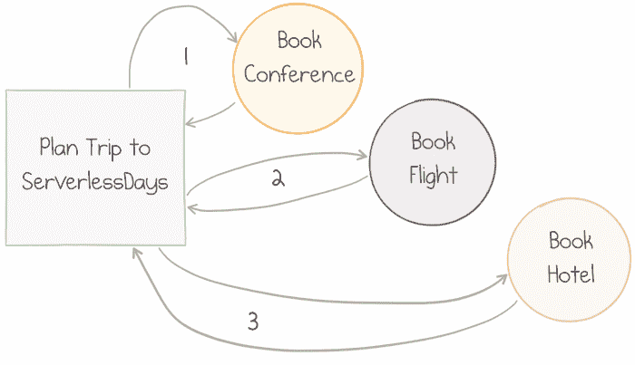

3 steps of a workflow executed in sequence

这个工作流的实现是由另一个 C# Azure 函数定义的，这次是用`OrchestrationTrigger`:

```
[FunctionName("SequentialWorkflow")]
public static async Task Sequential([OrchestrationTrigger] DurableOrchestrationContext context)
{
    var conference = await context.CallActivityAsync<ConfTicket>("BookConference", "ServerlessDays");
    var flight = await context.CallActivityAsync<FlightTickets>("BookFlight", conference.Dates);
    await context.CallActivityAsync("BookHotel", flight.Dates);
} 
```

同样，属性用于描述 Azure 运行时的功能。

唯一的输入参数的类型为`DurableOrchestrationContext`。这个上下文是支持编排操作的工具。

特别是，`CallActivityAsync`方法被使用了三次，一个接一个地调用三个活动。对于任何使用基于`Task`的 API 的 C#代码来说，方法体看起来都非常典型。然而，行为完全不同。我们来看看实现细节。

## 在幕后

让我们浏览一下上面顺序工作流的一次执行的生命周期。

当 orchestrator 开始运行时，第一个`CallActivityAsync`调用是预订会议票。这里实际发生的是一个队列消息从 orchestrator 发送到 activity 函数。

队列消息触发相应的活动函数。它完成它的工作(订票)并返回结果。activity 函数序列化结果，并将其作为队列消息发送回 orchestrator:

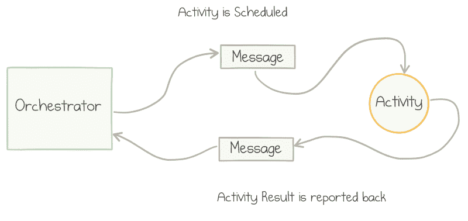

Messaging between the orchestrator and the activity

当消息到达时，orchestrator 再次被触发，可以继续进行第二个活动。循环往复——消息被发送到预订航班活动，它被触发，完成它的工作，然后将消息发送回编排器。同样的消息流发生在第三次调用中。

### 停止-恢复行为

如前所述，消息传递旨在及时分离发送方和接收方。对于上面场景中的每条消息，都不期望立即得到响应。

在 C#级别，当执行`await`操作符时，代码不会阻塞整个 orchestrator 的执行。相反，它只是退出:orchestrator 停止活动，其当前步骤完成。

每当活动返回消息时，orchestrator 代码就会重新启动。它总是从第一行开始。是的，这意味着同一行被执行多次:直到发送给 orchestrator 的消息数。

然而，orchestrator 将其过去执行的历史存储在 Azure 存储中，因此第一行的第二次传递的效果是不同的:它不是向活动发送消息，而是已经知道该活动的结果，因此`await`返回该结果并将其分配给`conference`变量。

由于这些“重放”，编排器的实现必须是确定性的:不要使用`DateTime.Now`、随机数或多线程操作；更多详情[此处](https://docs.microsoft.com/en-us/azure/azure-functions/durable/durable-functions-checkpointing-and-replay#orchestrator-code-constraints)。

### 活动采购

Azure 函数是无状态的，而工作流需要一个状态来跟踪它们的进度。每当执行工作流的新动作发生时，框架会自动在表存储中记录一个事件。

每当 orchestrator 因为新消息从其活动到达而重新开始执行时，它就从存储中加载这个特定执行的完整历史。持久上下文使用此历史来决定是调用活动还是返回先前存储的结果。

将状态更改的完整历史存储为只附加事件存储的模式称为事件源。事件存储提供了几个好处:

*   **持久性**—如果运行编排的主机出现故障，历史记录将保留在永久存储器中，并由重新开始编排的新主机加载；
*   **可扩展性**—仅附加写入快速且易于分布在多个存储服务器上；
*   **可观察性**—不会丢失任何历史记录，因此即使在工作流程完成后也可以直接进行检查和分析。

以下是在我们的连续工作流程中记录的值得注意的事件:

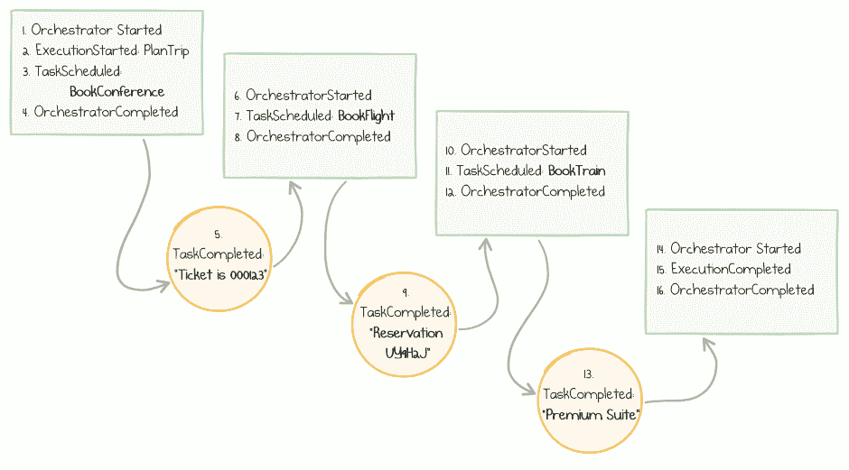

Log of events in the course of orchestrator progression

### 演员表

基于无服务器消费的计划上的 Azure 功能按执行+执行持续时间计费。

持久编制器的停止-重放行为导致单个工作流“实例”多次执行相同的编制器功能。这也意味着要为几次短暂的执行付出代价。

然而，与阻塞对活动的同步调用的潜在成本相比，总费用通常要低得多。每次 100 毫秒的 5 次执行的价格明显低于 30 秒的 1 次执行的成本。

顺便说一下，每月的第一个百万次执行是免费的，所以很多情况下 Azure Functions 服务不会产生任何费用。

另一个需要记住的成本是 Azure 存储。后台使用的队列和表格向最终客户收费。根据我的经验，对于低负载到中等负载的应用程序，这个费用接近于零。

当心你的编排器中无意的永恒循环或不确定的递归扇出。如果你让它们失去控制，它们会变得很贵。

## 错误处理和重试

当工作流中间某处发生错误时会发生什么？例如，第三方航班预订服务可能无法处理该请求:

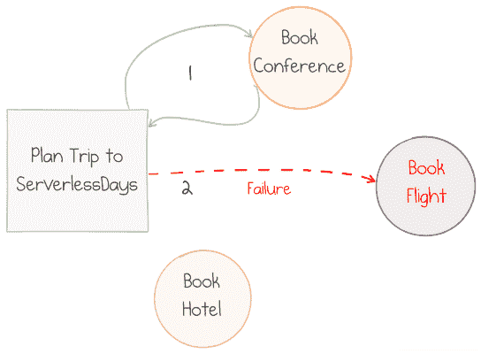

One activity is unhealthy

这种情况是持久函数所期望的。activity 函数不会无声无息地失败，而是将包含错误信息的消息发送回 orchestrator。

orchestrator 反序列化错误详细信息，并在重放时从相应的调用中抛出一个. NET 异常。开发人员可以自由地在调用周围放置一个`try .. catch`块并处理异常:

```
[FunctionName("SequentialWorkflow")]
public static async Task Sequential([OrchestrationTrigger] DurableOrchestrationContext context)
{
    var conf = await context.CallActivityAsync<ConfTicket>("BookConference", "ServerlessDays");
    try
    {
        var itinerary = MakeItinerary(/* ... */);
        await context.CallActivityAsync("BookFlight", itinerary);
    }
    catch (FunctionFailedException)
    {
        var alternativeItinerary = MakeAnotherItinerary(/* ... */);
        await context.CallActivityAsync("BookFlight", alternativeItinerary);
    }
    await context.CallActivityAsync("BookHotel", flight.Dates);
} 
```

上面的代码是预订另一个旅程的“备用计划”。另一个典型的模式是运行一个补偿活动来取消任何先前操作的效果(在我们的例子中是取消会议预订),并使系统保持干净的状态。

通常，错误可能是暂时的，因此暂停后重试失败的操作可能是有意义的。持久函数提供了一个专用的 API，这是一个非常常见的场景:

```
var options = new RetryOptions(
    firstRetryInterval: TimeSpan.FromMinutes(1),                    
    maxNumberOfAttempts: 5);
options.BackoffCoefficient = 2.0;

await context.CallActivityWithRetryAsync("BookFlight", options, itinerary); 
```

上面的代码指示库

*   最多重试 5 次
*   在第一次重试前等待 1 分钟
*   在每次后续重试之前，将延迟增加 2 倍(1 分钟、2 分钟、4 分钟等。)

重要的一点是，orchestrator 在等待重试时不会阻塞。呼叫失败后，将在未来的某个时刻安排一条消息来重新运行 orchestrator 并重试呼叫。

## 副指挥

业务流程可能由许多步骤组成。为了使编排器的代码易于管理，持久函数允许嵌套编排器。“父”编制器可以通过`context.CallSubOrchestratorAsync`方法调用子编制器:

```
[FunctionName("CombinedOrchestrator")]
public static async Task CombinedOrchestrator([OrchestrationTrigger] DurableOrchestrationContext context)
{
    await context.CallSubOrchestratorAsync("BookTrip", serverlessDaysAmsterdam);
    await context.CallSubOrchestratorAsync("BookTrip", serverlessDaysHamburg);
} 
```

上面的代码预定了两个会议，一个接一个。

## 扇出/扇入

如果我们想并行运行多个活动呢？

例如，在上面的例子中，我们可能希望预订两个会议，但是预订顺序可能无关紧要。尽管如此，当两个预订都完成后，我们希望将结果结合起来，为财务部门生成一个费用报告:

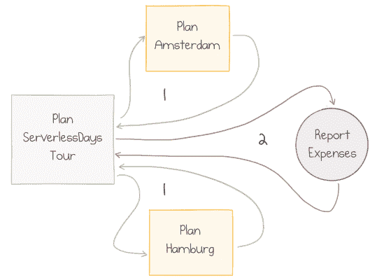

Parallel calls followed by a final step

在这个场景中，`BookTrip` orchestrator 接受一个带有会议名称的输入参数，并返回费用信息。`ReportExpenses`需要接收两项费用的总和。

这个目标可以通过调度两个任务(即发送两个消息)而不用分别等待它们来容易地实现。我们使用熟悉的`Task.WhenAll`方法来等待两者并合并结果:

```
[FunctionName("ParallelWorkflow")]
public static async Task Parallel([OrchestrationTrigger] DurableOrchestrationContext context)
{
    var amsterdam = context.CallSubOrchestratorAsync("BookTrip", serverlessDaysAmsterdam);
    var hamburg   = context.CallSubOrchestratorAsync("BookTrip", serverlessDaysHamburg);

    var expenses = await Task.WhenAll(amsterdam, hamburg);

    await context.CallActivityAsync("ReportExpenses", expenses);
} 
```

记住，等待`WhenAll`方法不会同步阻塞 orchestrator。它第一次退出，然后在收到来自活动的回复消息时重新启动两次。第一次重启再次退出，只有第二次重启才过了`await`。

`Task.WhenAll`返回结果数组(每个输入任务一个结果)，然后传递给报告活动。

并行化的另一个例子是向数百个收件人发送电子邮件的工作流。对于普通的队列触发函数来说，这样的扇出并不难:只需发送数百条消息。然而，如果工作流程的下一步需要，合并结果是相当具有挑战性的。

对于耐用的 orchestrator 来说很简单:

```
var emailSendingTasks =
    recepients
    .Select(to => context.CallActivityAsync<bool>("SendEmail", to))
    .ToArray();

var results = await Task.WhenAll(emailSendingTasks);

if (results.All(r => r)) { /* ... */ } 
```

在活动之间往返数百次可能会导致 orchestrator 的多次重放。作为一种优化，如果多个活动功能几乎同时完成，orchestrator 可以在内部成批处理几个消息，并且每批只重新启动 orchestrator 功能一次。

## 其他概念

持久函数支持更多的模式。下面是一个快速列表，可以让你了解一些情况:

*   等待集合中第一个*完成任务(而不是他们中的所有*)使用`Task.WhenAny`
    方法。适用于超时或竞争动作等情况。**
**   暂停工作流一段时间或直到截止日期。*   等待外部事件，例如，将人工交互引入工作流。*   当流程重复运行直到满足特定条件时，运行循环工作流。*

 *进一步的解释和代码示例在[文档](https://docs.microsoft.com/en-us/azure/azure-functions/durable/durable-functions-overview)中。

## 结论

我坚信，由于快速的开发流程和适当的计费模式，利用广泛的托管云服务的无服务器应用程序对许多公司都非常有益。

无服务器技术还很年轻；需要出现更多的高级架构模式来实现大型业务系统的可表达和可组合的实现。

Azure Durable Functions 给出了一些可能的答案。它将顺序 RPC 风格代码的清晰性和可读性与事件驱动架构的强大功能和弹性结合在一起。

关于持久功能的文档非常好，有大量的例子和操作指南。了解它，在您的真实生活场景中尝试它，并让我知道您的意见——我对无服务器的未来感到兴奋！

## 承认

非常感谢[凯蒂·清水](https://twitter.com/kashimizMSFT)、[克里斯·吉勒姆](https://twitter.com/cgillum)、[埃里克·弗莱明](https://twitter.com/efleming18)、[KJ·琼斯](https://twitter.com/KevinJonesD)、[威廉·利本伯格](https://twitter.com/William_DotNet)、[安德里亚·托萨托](https://twitter.com/ATosato86)审阅本文草稿并提出宝贵的意见和建议。*