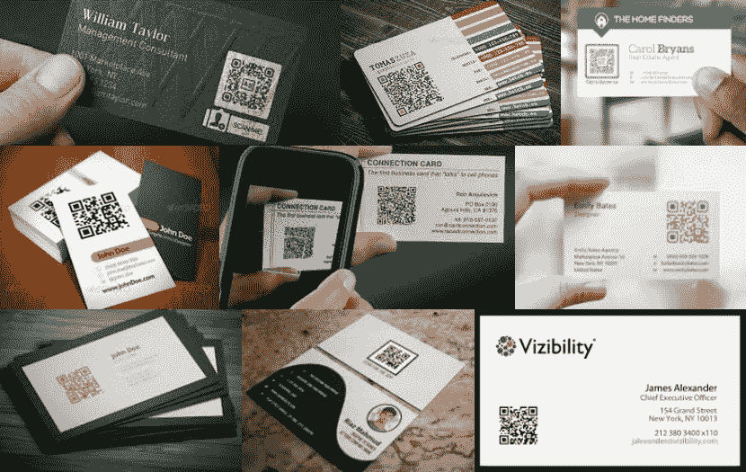
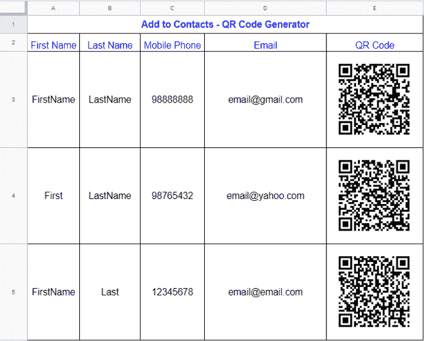
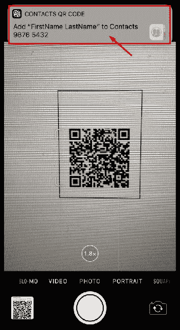
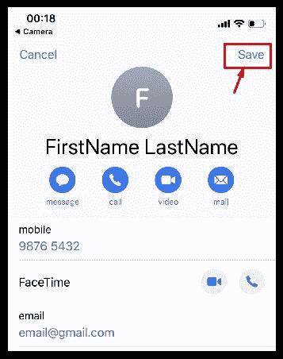
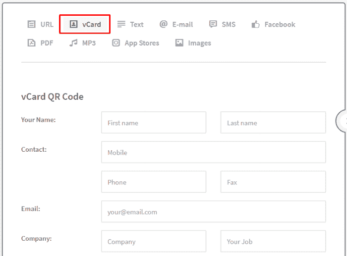

# 如何使用二维码进行有效的营销和推广

> 原文：<https://www.freecodecamp.org/news/making-use-of-qr-codes-for-effective-marketing-and-reach/>

****高效**** 意思是把事情做对。 ****有效**** 就是做正确的事情。

我提倡效率和效果。当我遇到新的业务联系人时，除了手动将详细信息输入到我的手机中之外，必须有更有效的方式来共享详细联系信息。



Name cards with QR Code

# 通过扫描二维码在手机上添加新联系人

当谷歌在 2017 年推出 ****谷歌联系人**** 应用时，用户可以用二维码分享联系信息。要添加新联系人，只需扫描某人的二维码，将其联系信息保存在您的手机上。

我个人认为，这样一种保存联系方式的有效方式应该在名片和营销手册上实现。

这一趋势似乎没有起飞，可能是因为人们一开始不知道如何创建二维码。

## 创建自定义联系人二维码列表

我使用了一个 ****Google Sheets**** 模板来生成联系二维码。

在另一个选项卡中打开模板([模板链接此处](https://docs.google.com/spreadsheets/d/1jJdBgqQvYuQM-Bo0An2W7CUS5c4EQKjyRkHYZln3Wr0/edit?usp=sharing))。然后点击“文件- >制作副本”保存到自己的“我的驱动器”(Google Drive 账号)。



Google Sheets template to generate the contact QR codes

请注意，这个 Google Sheets 模板似乎只适用于桌面，不适用于手机。

您可以通过更新 ****名字********姓氏********手机**** 号码 ****邮箱**** 来使用该模板。联系人二维码将根据这 4 个字段在下一栏中生成。

```
=image(“https://chart.googleapis.com/chart?chs=150x150&cht=qr&chl=BEGIN:VCARD%0AN:" & A3 & “%20” & B3 & “%0ATEL;CELL:” & C3 & “%0AEMAIL:” & D3 & “%0AEND:VCARD”)
```

然后，另一个人可以扫描生成的二维码，将联系方式添加到他们的手机中。



New iOS and Android versions are equipped with QR Code scanner in camera mode

扫描后，只需点击“保存”将信息添加到联系人。



Scan QR code and save contact

当您在团队或交易会上结识新朋友，并希望收集每个人的详细联系信息时，此联系人列表二维码模板将非常有用。

## 创建单个定制联系人二维码

转到 [QR 码生成器](https://www.qr-code-generator.com/)，并选择“vCard ”,在这里您可以自定义各种字段。记得测试一下，因为有些字段不允许特殊字符，如“，”或“@”。



[https://www.qr-code-generator.com/](https://www.qr-code-generator.com/)

您也可以将此二维码添加到您的名片和营销手册中。然后，客户和商务人士可以轻松地扫描您的联系信息并保存到他们的手机上。

# 通过扫描二维码访问网站

较新版本的 iPhone 和 Android 手机在相机应用程序中配备了二维码扫描。只需打开相机，悬停在二维码上进行扫描。然后，您可以单击弹出窗口转到嵌入的网址 URL。

比如试着扫描这个二维码:


Web URL embedded [https://www.qrcode-monkey.com](https://www.qrcode-monkey.com/)

## 创建您自己定制的二维码

我一般会去[二维码猴](https://www.qrcode-monkey.com/)创建一个定制的二维码。使用 既友好又 ****免费，如果你想还有更多选择:****

*   中间加一个 logo 图片(这个可以是你的 ****公司 logo**** ！)
*   设置颜色(跟随您的 ****企业标识**** )
*   使用一些其他的定制设计

所以现在你可以用你公司网站的二维码轻松制作营销材料。


Marketing materials with QR codes

* * *

## 名片和营销手册的二维码

我希望上面的建议对更高效、更有效地完成工作有用。祝您的营销和推广工作一切顺利！

感谢您的阅读！