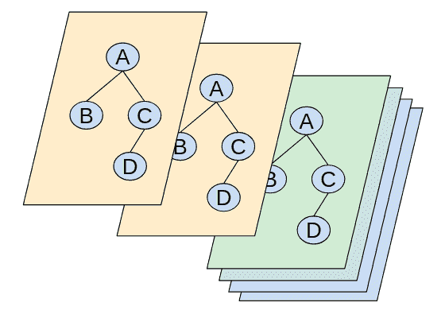
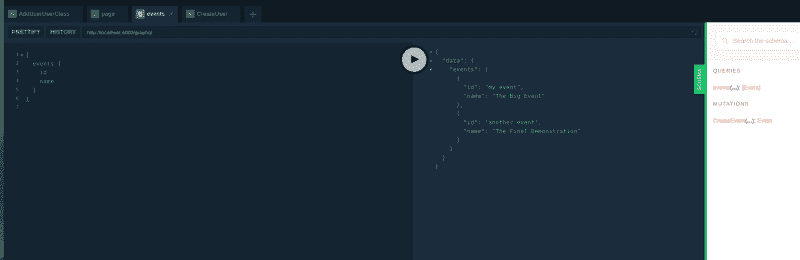

# 如何在一天内从 MVP 到生产服务器

> 原文：<https://www.freecodecamp.org/news/making-your-full-graph-stack-production-quality-ec231a938551/>

作者:Yisroel Yakovson

# 如何在一天内从 MVP 到生产服务器

在这篇文章之前，还有两篇文章是关于创建完整的图形堆栈的。现在查看[如何构建一个前沿服务器](https://medium.freecodecamp.org/meet-the-full-graph-stack-d32150308a87)以获得该方法的概念性介绍。[一小时内发布你的 MVP 服务器](https://medium.freecodecamp.org/building-a-full-graph-stack-f95590ade5af)引导你建立一个开发质量栈。本文解释了如何将这个堆栈转换成一个健壮的、永久的应用程序。



### 开发栈有什么问题？

第二篇文章中的步骤反映了 [GRANDstack 视频:](https://github.com/grand-stack/grand-stack-starter)

*   数据库是一个 [Neo4j 沙箱](https://neo4j.com/sandbox-v2/)
*   APIC 服务器现在运行在[和](https://zeit.co/now)上。

对于 MVP 或初始原型来说，这已经足够了，但是你很快就要继续前进了。最大的初始限制是数据库。沙盒最多能活十天。

即使你建立了一个永久的数据库，现在也很难建立一个永久的家。理论上，如果你不经常修改你的服务器，这是可能的。您可以用一个单独的主机设置您的永久 API，并将其作为 Now 端点的别名。问题在于，每次您上传修订时，Now 端点都会发生变化。这意味着你必须不断更新你的别名。

安全也是一个挑战。通常会创建一个允许访问数据库的 IP 白名单，并将该名单限制在您的 API 服务器上。因此，如果服务器的 IP 地址经常改变，您必须根据每次修改来更新列表。在我写这篇文章的时候，我看不到可行的方法来做到这一点。(有请联系我！)

所以问题是，解决这些限制的最好方法是什么？

### 在最前沿

事实是，这篇文章已经搁置了几个星期了。问题是 neo4j-graphql-js 还没有准备好支持生产。但在过去几周，这一切都变了。该团队解决了几个基本问题:

*   中间件在两周前变得可支持。该团队为生成的 reducers 添加了对抛出中间件错误的支持。这使您的服务器能够作为中间件运行一般的身份验证和授权功能。
*   一周前,[突变](https://graphql.org/learn/queries/#mutations)的修改成为可能。在那之前，你被产生的突变所困扰。现在，您可以添加必要的业务逻辑或副作用。
*   自动生成的密钥变得可用。该团队昨天报告了一个新的@autogenerate 指令。将指令放在一个键之后将导致自动生成 UUID。以前，前端必须为键传递值，这对于生产服务器来说是最不常见的。

2018 年 8 月 19 日，这篇文章出现在许多其他预期的修复中。特别有趣的是，该团队计划发布一些指令来简化 auth。此外，我希望我们将很快看到嵌套突变。我在这里写的很多东西很快就会过时。但是我决定现在描述这个包是值得的，因为它已经很有用了。请在下面张贴更新或更正作为评论。

### 选择

当你离开沙盒世界时，你有选择。我认为总的规律是今天大多数人都很好。重要的是向前看。

但是我在下面讨论的三个基本步骤可能是通用需求。它们可能是您后端所需的全部。

两条初步意见:

*   你不需要从第一天就把事情做得完美。曾经有一段时间，像你的机器或者你的主机的大小这样的决定有着长远的意义。如今，任何明智的团队都在云中工作。大多数决定是可逆的。Auth 可能是一个例外，但即使这样也可能会改变。获取一些活的东西并开始旋转！
*   如果你按照[中的步骤在一小时内](https://medium.freecodecamp.org/building-a-full-graph-stack-f95590ade5af)发布你的 MVP 服务器，你会有一个惊人的小后端。您将需要三个组件:您的微型服务器应用程序、您的数据库和认证服务。您甚至不必将它们存储在同一个主机上。

### 内容

1.  [设置授权](#0241)
2.  [旋转你的数据库](#6511)
3.  [创建您的服务器](#6f99)

### 设置授权

每个项目的授权需求都不同，但是已经出现了一些基础。你需要两样东西:

1.  En 外部认证服务。两种常见的选择是 Cognito 和 Auth0。
2.  大多数服务器也需要授权或访问控制。您必须决定是否允许某个特定用户做某件事。

#### 设置中间件功能

处理 Auth 的首选方式是通过中间件或指令[。截至目前为止，GRANDstack starter 中还没有包含 auth。](https://graphql.org/graphql-js/authentication-and-express-middleware/)

starter 包中`api/src/index.jx`使用的服务器目前是`ApolloServer`。但是你可以用`apollo-server-express`里的`graphalExpress`来代替。

您必须更改两个文件:

*   `api/src/index.js`
*   `api/package.json`

您还应该添加一个`auth.js`文件。

这里有一个目前与中间件一起工作的`index.js`版本:

```
import express from 'express';import { graphqlExpress, graphiqlExpress } from 'apollo-server-express';import cors from 'cors';import { makeExecutableSchema } from 'graphql-tools'import expressPlayground from 'graphql-playground-middleware-express';import bodyParser from 'body-parser';require('dotenv').config();import { v1 as neo4j } from "neo4j-driver";import { augmentSchema } from "neo4j-graphql-js";import { typeDefs, resolvers } from "./graphql-schema";import { authenticateUser, authorize } from './auth';// augmentSchema will add autogenerated mutations based on types in schemaconst schema = makeExecutableSchema({  typeDefs,  resolvers});const augmentedSchema = augmentSchema(schema);const driver = neo4j.driver(  process.env.NEO4J_URI,  neo4j.auth.basic(    process.env.NEO4J_USER,    process.env.NEO4J_PASSWORD  ));const app = express();app.use(bodyParser.json()); // support json encoded bodiesapp.use(cors());app.use('/graphql i apollo-server-expressql', graphiqlExpress({  endpointURL: '/graphql'}));app.get('/', expressPlayground({ endpoint: '/graphql' }));// app.use('/', authenticateUser, authorize);app.use('/graphql', bodyParser.json(), graphqlExpress(req => {  return {    context:  {      auth: req.auth,      driver    },    endpointURL: '/graphql',    schema: augmentedSchema  }}));app.listen(process.env.GRAPHQL_LISTEN_PORT, '0.0.0.0');console.log(`GraphQL Playground at ${process.env.GRAPHQL_LISTEN_PORT}`);
```

请注意:

1.  我们使用 apollo-server-express，它支持中间件
2.  中间件有两个功能:认证用户和授权。两个定义都出现在 auth.js 中。
3.  我还添加了 cors，我们需要它来解决一些 CORS 问题。

project.json 文件必须包含适当的依赖项。在撰写本文时，以下是我正在使用的版本:

```
{  "name": "grand-stack-express",  "version": "0.0.1",  "description": "API app for GRANDstack with express",  "main": "src/index.js",  "license": "MIT",  "dependencies": {    "apollo-server-express": "^1.3.6",    "babel-cli": "^6.26.0",    "babel-core": "^6.26.3",    "babel-polyfill": "^6.26.0",    "babel-preset-env": "^1.7.0",    "babel-preset-stage-0": "^6.24.1",    "babel-watch": "^2.0.7",    "body-parser": "^1.18.3",    "cors": "^2.8.4",    "dotenv": "^6.0.0",    "express": "^4.16.3",    "express-graphql": "^0.6.12",    "graphql-playground-middleware-express": "^1.7.1",    "graphql-tag": "^2.9.2",    "graphql-tools": "^3.0.4",    "neo4j-driver": "^1.6.3",    "neo4j-graphql-js": "^0.1.32",    "node-fetch": "^2.1.2",    "nodemon": "^1.17.5"  },  "resolutions": {    "neo4j-graphql-js/graphql": "v14.0.0-rc.2"  },  "scripts": {    "test": "echo \"Error: no test specified\" && exit 1",    "dev": "babel-watch --exec babel-node --presets env,stage-0 src/index.js",    "start": "nodemon --exec babel-node --presets env,stage-0 src/index.js"  },  "devDependencies": {    "nodemon": "^1.17.5"  }}
```

下面是一个 starter auth.js 文件，可以添加到您的项目中并完成:

```
import gql from 'graphql-tag'import { v1 as neo4j } from 'neo4j-driver';import { INSPECT_MAX_BYTES } from 'buffer';require('dotenv').config();const driver = neo4j.driver(  process.env.NEO4J_URI,  neo4j.auth.basic(    process.env.NEO4J_USER,    process.env.NEO4J_PASSWORD  ));const resolveUser = () => {  //a placeholder  return 0;}/* * middleware functions follow */export const authenticateUser = async (req, res, next) => {  req.auth={};  try {    const response = await resolveUser();    req.auth.user=response  } catch(err) {    req.error=err.message  }  next();}export const authorize = async (req, res, next) =&gt; {  if (req.error) {    console.log(req.error);    next();    return;  }  // placeholder, allows every authenticated request  next();}
```

1.  首先将您的旧版本提交给 git，并可能创建一个新分支。`git add .`然后`git commit -m "works without auth"`然后`git checkout -b auth`。然后你会看到
    的回应`Switched to a new branch ‘auth’`
2.  将您的`api/src/index.js`和`api/project.json`文件替换为以上版本，并将`auth.js`文件添加到`api/src`中。
3.  移动您当前的 node_modules: `mv node_modules node_modules.old`
4.  再次运行`npm install`，然后运行`npm start`。通过运行查询来确保它能够工作。



#### 添加您的认证服务

您可以根据您使用的任何授权软件的 SDK 来填写详细信息。

你可能需要在快速应用程序中使用 async/await 函数来研究[，但是这并不太难学。](https://dev.to/geoff/writing-asyncawait-middleware-in-express-6i0)

1.  取消注释`index.js`中的行`app.use(‘/’, authenticateUser, authorize);`。
2.  为您的认证服务安装适当的节点 js SDK。然后添加需要的代码，重写`auth.js`中的函数`authenticateUser`来调用它。当认证失败时，记得将`req.error`设置为适当的错误消息。
3.  通过向 HTTP 头添加一个有效的令牌来练习。注意，在 Playground 中，HTTP HEADERS 面板使这变得非常简单。

#### 添加授权

文件`auth.js`包括数据库驱动程序。该驱动程序支持通过查询来确定用户对特定数据的访问权限。例如，您的数据库可以存储数据的读/写权限。每当一个请求测试失败时，您可以通过设置`req.error`来指定失败的原因。`neo4jgraphql`解析器函数将返回错误消息。

请注意，您可以向中间件添加更多的功能。例如，您可以添加一个检查，检查当前用户是否已全额付款。

#### 增强增强架构

对`index.js`文件中的`augmentSchema`的调用会在您的模式中产生突变。如上所述，最近的一项增强功能允许您添加突变。您也可以覆盖生成的文件。

一种简单的方法是在突变声明中使用@cypher 指令:

```
type Mutation { UpdateFoo(id: ID, name: String): Foo @cypher(statement:”MATCH (f:Foo {id: $id}) SET f.name = $name”}
```

然后，对于解析器，只需使用`neo4jgraphql`:

```
Mutation: { UpdateFoo: neo4jgraphql}
```

### 数据库托管

你有一些选择。首先是一些[托管服务](https://neo4j.com/developer/neo4j-cloud-hosting-providers/)。我对此印象不深，因为自己创建一个数据库服务器并不难。但是，与团队的时间相比，成本只是沧海一粟。如果你一个月花几百美元让某个东西开始运行，而你没有担心，你可能会做得更糟。

#### 基本托管

我决定转而构建一个 AWS EC2 实例。我要写我在那里做了什么。

1.  决定你的区域。可能没什么关系，但是如果你在某个地方，那就去吧。
2.  让 AWS CLI 在您的计算机上运行。
3.  找一个合适的朋友。你可以在 AWS 商店上搜索，或者查看有什么可用的。
4.  在这里做[的步骤(直到最后一个)。请务必保存您的密钥文件，因为您将需要它来设置 APOC。](https://neo4j.com/developer/neo4j-cloud-aws-ec2-ami/)
5.  然后你需要去页面，登录，修改密码。但是去哪个端口和密码可能不一样。对于我的 AMI，密码是“neo4j”(就像用户名一样)。我不得不去[https://[IP]:7473/browser/](https://[IP]:7473/browser/)(不是页面上给出的例子中的 http，也不是 7434)。
6.  在本地上更改您的代码，以确保您可以连接到它。在您的本地主机上检查它:4000。

#### 建立 APOC

要使用`@cypher`指令，或者任何 [APOC](https://neo4j-contrib.github.io/neo4j-apoc-procedures/) 函数，你必须在服务器上安装 APOC jar 文件。您需要 ssh 到您的数据库服务器。截至 2 个月前，它不包括在非盟驻苏特派团。

1.  您将需要使用在 AWS 上的 EC2 上托管 Neo4j 的命令:`ssh -i $KEY_NAME.pem ubuntu@[PublicDnsName]`
2.  您必须将 jar 文件添加到 neo4j 插件目录中。[按照手册说明](https://github.com/neo4j-contrib/neo4j-apoc-procedures#manual-installation-download-latest-release)找到最新版本，并确定插入位置。
3.  您还需要找到 neo4j.conf 文件，并在其中插入调用这些函数的权限。以下作品:`dbms.security.procedures.unrestricted=apoc.*`
4.  然后你必须重启:`sudo systemctl restart neo4j.`

### API 部署

您可以在任何支持 NODE js 应用程序的系统上部署。我用的是 [AWS 弹性豆茎](https://aws.amazon.com/elasticbeanstalk/):

1.  运行`api`目录中的命令`zip -r api.zip . -x node_modules/**\*`。这将创建一个没有目录本身和 node_modules 的 zip 文件。
2.  前往控制台中的 [AWS Elastic Beanstalk](https://console.aws.amazon.com/elasticbeanstalk/home?region=us-east-1#/welcome) 并确保您在您选择的地区。
3.  如果你能到达欢迎页面，我发现它是最容易的。你点击**开始**，并按照说明进行操作。他们马上给我安排了我需要的东西。你只需上传上面压缩的文件。
4.  在**弹性豆茎**环境配置下，进入**修改软件**。进入**容器选项**，设置**节点命令**为`npm start`。
5.  大约 10 分钟后，就好了。你可以点击**端点 URL** 来查看。
6.  使用 Route53 将您自己的 api 域别名化为 Elastic Beanstalk 端点，这样就万事俱备了。

### 结论

如果您已经了解了这么多，那么恭喜您。你比许多经验丰富的后端设计师更了解如何构建一个[完整的图形堆栈](https://medium.com/p/d32150308a87/edit)。

对于已经做过几次的人来说，这些文章中描述的过程可能需要一个小时。对于其他人来说，这些文章有望减少额外的研究时间。随着这些工具的改进，开发时间应该会下降得更多。

但是简单和方便只是一个好处。完整的图形堆栈在技术上也是合理的。

*   这里创建的服务器是健壮的。
*   一般来说，图形数据库的伸缩性非常好。
*   堆栈使用非常少的资源。
*   您可以将后端移植到不同的主机或服务，从而减少锁定和费用。

让我们共同努力，推动这项技术向前发展。请留下评论或提出其他改进意见。祝你自己的项目好运！