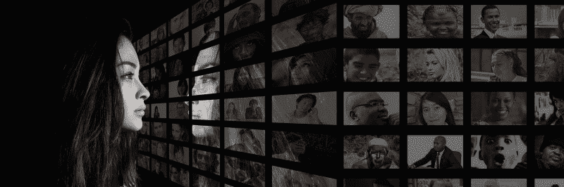
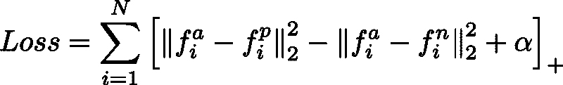
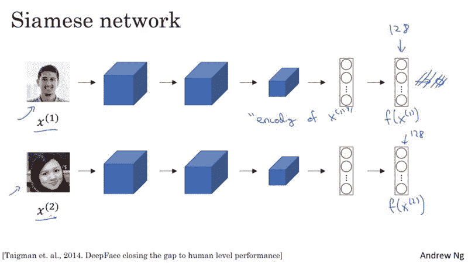
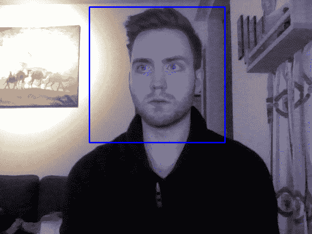

# 制作自己的人脸识别系统

> 原文：<https://www.freecodecamp.org/news/making-your-own-face-recognition-system-29a8e728107c/>

由 sigurður skúli

# 制作自己的人脸识别系统



人脸识别是用户认证的最新趋势。苹果最近发布了新的 iPhone X，它使用 Face ID 来验证用户身份。OnePlus 5 即将从 theOnePlus 5T 获得[面部解锁功能](https://gadgets.ndtv.com/mobiles/news/oneplus-5-face-unlock-feature-oxygenos-open-beta-3-now-available-download-1794682)。并且[百度正在使用人脸识别代替身份证来允许他们的员工进入他们的办公室](https://www.youtube.com/watch?v=wr4rx0Spihs)。对许多人来说，这些应用程序似乎很神奇。但是在本文中，我们旨在通过教您如何用 Python 制作自己的简化版人脸识别系统来揭开这个主题的神秘面纱。

[Github 链接给那些不喜欢阅读只想要代码的人](https://github.com/Skuldur/facenet-face-recognition)

### 背景

在我们进入实现的细节之前，我想讨论一下 FaceNet 的细节。这是我们将在系统中使用的网络。

#### FaceNet

FaceNet 是一种神经网络，它学习从人脸图像到紧凑的[欧几里得空间](https://en.wikipedia.org/wiki/Euclidean_space)的映射，其中距离对应于人脸相似性的度量。也就是说，两张人脸图像越相似，它们之间的距离就越小。

#### 三重损失

FaceNet 使用一种称为三重损失的独特损失方法来计算损失。三重损失最小化锚和包含相同身份的正片图像之间的距离，并且最大化锚和包含不同身份的负片图像之间的距离。



Figure 1: The Triplet Loss equation

*   **f(a)** 指锚点的输出编码
*   **f(p)** 指正的输出编码
*   **f(n)** 指负的输出编码
*   **alpha** 是一个常数，用于确保网络不会试图向 **f(a) - f(p) = f(a) - f(n) = 0 优化。**
*   **[…]+** 等于 **max(0，sum)**

#### 暹罗网络



Figure 2: An example of a Siamese network that uses images of faces as input and outputs a 128 number encoding of the image. Source: [Coursera](https://www.coursera.org/learn/convolutional-neural-networks)

FaceNet 是一个暹罗网络。连体网络是一种学习如何区分两个输入的神经网络架构。这使他们能够了解哪些图像相似，哪些不相似。这些图像可以包含人脸。

暹罗网络由两个相同的神经网络组成，每个神经网络的权重完全相同。首先，每个网络取两个输入图像中的一个作为输入。然后，每个网络的最后一层的输出被发送到确定图像是否包含相同身份的函数。

在 FaceNet 中，这是通过计算两个输出之间的距离来实现的。

### 履行

既然我们已经阐明了理论，我们可以直接进入实现了。

在我们的实现中，我们将使用 [Keras](https://keras.io/) 和 [Tensorflow](https://www.tensorflow.org/) 。此外，我们正在使用从 [deeplearning.ai 的 repo](https://github.com/shahariarrabby/deeplearning.ai/tree/master/COURSE%204%20Convolutional%20Neural%20Networks/Week%2004/Face%20Recognition) 获得的两个实用程序文件来抽象与 FaceNet 网络的所有交互。：

*   **fr_utils.py** 包含向网络提供图像并获取图像编码的函数
*   **inception_blocks_v2.py** 包含准备和编译 FaceNet 网络的函数

#### 编译 FaceNet 网络

我们要做的第一件事是编译 FaceNet 网络，以便我们可以将其用于我们的人脸识别系统。

```
import osimport globimport numpy as npimport cv2import tensorflow as tffrom fr_utils import *from inception_blocks_v2 import *from keras import backend as K
```

```
K.set_image_data_format('channels_first')
```

```
FRmodel = faceRecoModel(input_shape=(3, 96, 96))
```

```
def triplet_loss(y_true, y_pred, alpha = 0.3):    anchor, positive, negative = y_pred[0], y_pred[1], y_pred[2]    pos_dist = tf.reduce_sum(tf.square(tf.subtract(anchor,               positive)), axis=-1)    neg_dist = tf.reduce_sum(tf.square(tf.subtract(anchor,                negative)), axis=-1)    basic_loss = tf.add(tf.subtract(pos_dist, neg_dist), alpha)    loss = tf.reduce_sum(tf.maximum(basic_loss, 0.0))       return loss
```

```
FRmodel.compile(optimizer = 'adam', loss = triplet_loss, metrics = ['accuracy'])load_weights_from_FaceNet(FRmodel)
```

我们首先用(3，96，96)的输入形状初始化我们的网络。这意味着红-绿-蓝(RGB)通道是馈送到网络的图像体积的第一维。并且输入网络的所有图像必须是 96×96 像素的图像。

接下来我们将定义三重态损失函数。上面代码片段中的函数遵循我们在上一节中定义的三重损耗方程的定义。

如果您不熟悉用于执行计算的任何 Tensorflow 函数，我建议您阅读文档(我已经为每个函数添加了链接)，因为这将提高您对代码的理解。但是将该函数与图 1 中的等式进行比较就足够了。

一旦我们有了损失函数，我们就可以使用 Keras 编译我们的人脸识别模型。我们将使用 [Adam 优化器](https://keras.io/optimizers/#adam)来最小化由三重损失函数计算的损失。

#### 准备数据库

既然我们已经编译了 FaceNet，我们将准备一个我们希望系统识别的个人数据库。我们将使用我们的*图像*目录中包含的所有图像作为我们的个人数据库。

*注意:在我们的实现中，我们将只使用每个人的一个图像。原因是 FaceNet 网络足够强大，只需要一个人的图像就能认出他们！*

```
def prepare_database():    database = {}
```

```
 for file in glob.glob("images/*"):        identity = os.path.splitext(os.path.basename(file))[0]        database[identity] = img_path_to_encoding(file, FRmodel)
```

```
 return database
```

对于每个图像，我们将把图像数据转换成 128 个浮点数的编码。我们通过调用函数 **img_path_to_encoding** 来实现这一点。该函数接收一个图像路径，并将图像输入到我们的人脸识别网络。然后，它从网络返回输出，恰好是图像的编码。

一旦我们将每张图像的编码添加到我们的数据库中，我们的系统终于可以开始识别个人了！

#### 认出一张脸

如背景部分中所讨论的，FaceNet 被训练成最小化同一个人的图像之间的距离，并且最大化不同个人的图像之间的距离。我们的实现使用该信息来确定馈送给我们系统的新图像最有可能是哪个个体。

```
def who_is_it(image, database, model):    encoding = img_to_encoding(image, model)        min_dist = 100    identity = None        # Loop over the database dictionary's names and encodings.    for (name, db_enc) in database.items():        dist = np.linalg.norm(db_enc - encoding)
```

```
 print('distance for %s is %s' %(name, dist))
```

```
 if dist < min_dist:            min_dist = dist            identity = name        if min_dist > 0.52:        return None    else:        return identity
```

上面的函数将新图像输入到一个名为 **img_to_encoding** 的实用函数中。该函数使用 FaceNet 处理图像，并返回图像的编码。现在我们有了编码，我们可以找到图像最可能属于的个人。

为了找到这个个体，我们通过我们的数据库并计算我们的新图像和数据库中每个个体之间的距离。然后选择与新图像距离最小的个体作为最可能的候选。

最后，我们必须确定候选图像和新图像是否包含同一个人。因为在循环结束时，我们只确定了最可能的个体。这就是下面的代码片段发挥作用的地方。

```
if min_dist > 0.52:    return Noneelse:    return identity
```

*   如果距离大于 0.52，那么我们确定新图像中的个体在我们的数据库中不存在。
*   但是，如果距离等于或低于 0.52，那么我们确定他们是同一个人！

现在这里棘手的部分是，值 0.52 是我代表我的特定数据集通过反复试验得到的。最佳值可能低得多，也可能高得多，这取决于您的实现和数据。我建议尝试不同的值，看看什么最适合你的系统！

### 建立一个使用人脸识别的系统

现在我们知道了如何使用人脸识别算法识别一个人的细节，我们可以开始享受它了。

在我在本文开头链接的 Github 存储库中，有一个使用笔记本电脑的网络摄像头向我们的人脸识别算法提供视频帧的演示。一旦算法识别出帧中的个人，演示就会播放一条音频消息，欢迎用户使用数据库中他们图像的名称。图 3 显示了一个运行中的演示示例。



Figure 3: An image captured at the exact moment when the network recognised the individual in the image. The name of the image in the database was “skuli.jpg” so the audio message played was “Welcome skuli, have a nice day!”

### 结论

到目前为止，您应该已经熟悉了人脸识别系统是如何工作的，以及如何使用 python 中预先训练好的 FaceNet 网络版本来制作自己的简化人脸识别系统！

如果您想在 Github 资源库中体验一下演示，并添加您认识的人的图片，那么就继续前进，转到资源库。

体验演示的乐趣，用您出色的人脸识别知识打动您所有的朋友！