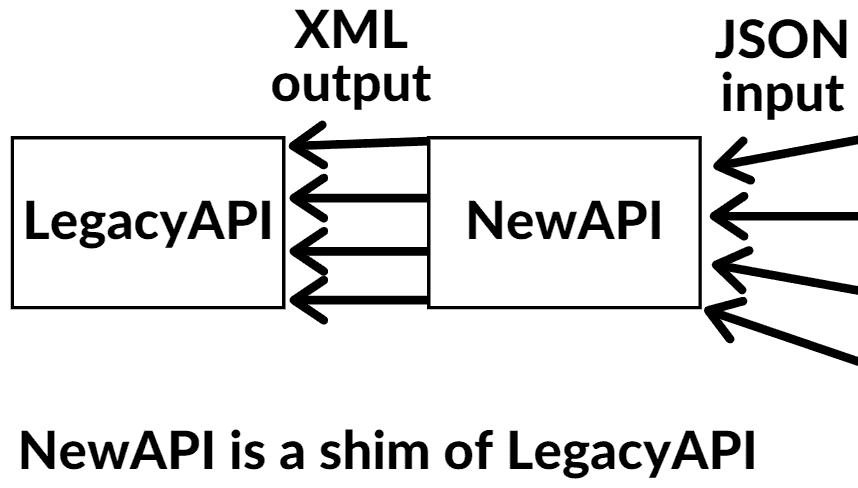

# 如何通过游泳你的抽象来管理代码依赖

> 原文：<https://www.freecodecamp.org/news/manage-code-dependencies-by-shimming-your-abstractions/>

依赖是任何足够成熟的代码库中非常常见的一部分。干净地处理程序运行所依赖的任何第三方代码也很重要。

有多种方法可以包含和更新第三方代码。我最近读了一些东西，这很容易成为我最喜欢的方式，所以我必须分享它。

这个方法是为了**总是填补你的抽象。**

为了正确地分解这意味着什么，在我们谈论它包含的更大的想法之前，让我们定义每个词。

## 抽象

开发人员经常在代码中使用抽象来简化系统。

抽象是一种隐藏复杂代码的方式，它们通常提供一个简单的接口来使用它。

举个例子，假设我们有一些复杂的代码，最终会做很多非常具体的数学运算。我们可以把所有的逻辑打包成一个函数，提供一个非常简单的接口，你只需要输入你的数字，函数就会完成工作。

我们本质上不会强迫使用我们代码的人去担心实现细节。他们只需调用函数，就能得到答案——他们不必担心函数在“幕后”做什么。

*那是*在你的代码中抽象出细节的力量。

你可以在众多的数据结构或代码架构中抽象出的东西。而且你可以抽象出里面一个原型、类、函数或者更多的实现细节。

如果你必须理解一个大代码库中的每一行代码(比如说一个 200 万行代码库)，你将永远无法开始编码。

通过将某些细节抽象成正确的模块/分离出你的代码，你可以创建一个可重用的、简单易懂的、容易改变的代码库。

### 代码抽象如何工作

抽象出逻辑的一个例子是:想象一下，如果你正在为你的用户制造一台煮咖啡的机器。可能有两种方法:

#### 如何用抽象来创造它

*   有一个标题为“制作咖啡”的按钮

#### 如何在没有抽象的情况下创建它

*   有一个标题为“烧水”的按钮
*   有一个标题为“给水壶加冷水”的按钮
*   有一个标题为“向一个干净的杯子里加入一勺研磨咖啡”的按钮
*   有一个标题为“清理脏杯子”的按钮
*   和所有其他按钮

你能看出当我们使用抽象概念时，我们并不期望用户知道机器是如何制作咖啡的吗？但是在没有**抽象**的机器中，用户必须知道按下每个按钮的顺序，这迫使用户理解咖啡是如何制作的。

在我们继续前进并理解我在开始介绍的概念之前，我们需要覆盖一个定义(总是填补你的抽象)，那就是填补。

## 填隙

**填补**是将某物放在另一物的前面以拦截正在传递的数据的行为。

让我们来看一个它是如何工作的例子。

假设一家银行有一个非常旧的 API，由于一些技术遗留缺陷，它不接受 JSON。相反，它只能接受 XML。我们称之为 **LegacyAPI** 。

但是想打这个银行 API 的开发者有很高比例想发 JSON。银行拒绝更改 LegacyAPI，因为风险太大，可能会破坏 API。他们的系统很大程度上依赖于它，如果他们犯了一个错误，他们不能冒险做许多新的开发和关闭他们系统的大部分。

如果他们不想在 LegacyAPI 上做新的开发，他们可以随时填补。

他们可以通过创建一个位于 LegacyAPI“前面”的 API 来做到这一点。我们称之为 **NewAPI** 。

“在前面”这个词只是指谁先处理网络请求的顺序。我们所说的“在前面”只是指 NewAPI 将第一个接收网络请求。

你可以告诉开发人员，他们现在可以用 JSON 访问 NewAPI，NewAPI 会将 JSON 转换成 LegacyAPI 的 XML，这样双方都会满意。

银行现在可以通过 NewAPI 扩展他们的服务(例如，他们可以接受 JSON ),而不需要改变他们担心会改变的旧的遗留 API。

这只是**匀场**的一个例子。回顾一下，它本质上是在其他东西前面添加一些东西，就像中间的人一样将数据传递给其他东西。



A diagram of how **NewAPI** intercepts **LegacyAPI** network requests.

希望你很好地理解了什么是匀场和什么是抽象。让我们把这两个定义放在一起，来定义我们所说的**总是填补你的抽象**。

## 为什么你应该总是填补你的抽象

### 问题是

每当我们需要管理我们的依赖项时，我们都希望确保阻止第三方代码“泄漏”到我们的主代码中。

我所说的“泄漏”是指依赖关系代码被多次导入到代码中需要它的不同位置。

如果您让一个依赖“入侵”您的源代码，那么每次您导入它时，您都变得越来越紧密地与它耦合在一起。

这可以(有时！)意味着您将被迫按照库选择的方向编码，因为您与库紧密耦合。这可能会导致巨大的认知开销，因为您越来越多地尝试在代码中使用这个库，但是它与您的其他架构决策不一致。

这使得你需要做的任何重构都比你孤立它花费更长的时间。例如，如果依赖关系改变了，在依赖关系中创建一个对象需要接受什么参数？

除了很难让你的构建很好地工作于依赖之外，如果它不再适合你的需要或者你找到了更好的库来代替它，你的重构实际上变得更加难以摆脱它。

### 解决方案

为了尝试阻止以上所有情况的发生，首先让我们把我们需要的任何依赖项放到它们自己的模块中，在你的代码库中它们只被引用一次。

这实质上是我们的**垫片**。

每当您需要第三方依赖时，您只需导入我们放在它周围的包装器模块，就像一个“中间人”，在我们调用第三方依赖之前提供一个级别。

这个 **shim** 模块也允许我们进行依赖**抽象**。需要使用我们的第三方依赖的开发者可以只使用一个抽象而不是(你可能最终只是把它包装在一个函数或简单的类中)。您将把参数默认为合理的默认值，并尽可能多地删除实现细节。

任何需要这种依赖的地方都会加载你的模块，然后在需要的地方注入这个模块。

**为什么？**我们已经讨论过的一个重要原因是它阻止了你的依赖和你的代码过于紧密的耦合。

当你只在一个模块中拥有它时，这是有效的。只要加载你的模块的每个人都遵守该模块的接口/数据协定，其他任何地方都“免费得到它”。然后你只需要改变一个模块就可以访问很多其他的地方。

这允许我们更容易地进行修改，并在代码中保持关注点的清晰分离。

我们在这里只谈到了一个依赖项——但是你可以看到，如果你依赖于 25 个其他的定制库，并且你需要了解它们是如何工作的，情况会变得多么糟糕。这通常会是一个非常脆弱的代码库，并且会有代码味道。

## HTTP 依赖示例

让我们来看一个依赖关系的例子，这个例子可以用来创建一个简单的 HTTP 客户端。

这是一个基本的依赖关系，它允许你访问端点，并将 JSON 等作为数据传递。

让我们想象一下，我们目前在 Node 中使用 **Fetch** ，我们想要使用 **Axios** (我们现在想要切换到的另一个 HTTP 客户端)。我们已经决定放弃 Fetch ，转而使用 Axios ，因为我们的应用程序越来越复杂，我们发现 Axios 现在更适合我们的用例。

如果 Fetch 已经泄漏到了我们的代码库，那么我们的重构将会比它需要的要困难得多。

我们现在不得不去每一个使用函数调用的地方，而不是仅仅去我们的一个模块。这在源代码中产生了多米诺骨牌效应，这种效应不可避免地会在多处更改某些内容时发生。

```
// You're now going to have to find any place you imported fetch
// Any place you alias'd it
// And deal with any source code failures wrapping around where you have used it once it's removed
// Which might be more complex than just simply searching for
const fetch = require('node-fetch');
```

我们可以通过将依赖性包装到一个适当的**填充抽象**中并将其使用隔离到一个地方来改进这一点。

入职时你也能获得成功。他们将能够看到被称为`API`或`DataStore`的抽象，这些抽象成为你的类做什么的清晰路标(而不是开发者可能不熟悉的库)。

```
// In your abstractions, you get the power to give it a descriptive
// name, if the current name isn't clear in your code too, maybe like:

var Money = require('dinero')
```

对于像 **Express** 或 **Lodash** 这样众所周知的依赖关系来说，这可能不是问题。但是我对每一个 NPM 包裹和他们做的事情没有完美的记忆。

当你已经正确地用**填充了**它之后，如果你使用的是 Fetch 或者 Axios “引擎盖下”，对使用你的填充程序的开发者来说甚至都没有关系。如果你改变它，他们永远不会知道区别，只要你对垫片敏感。

# 结论

我希望这很好地概述了**填充**的好处，以及它如何帮助您维护您的依赖性。

这整篇文章受到了莎拉·达扬的作品的影响，在这里找到了，并在她的同意下分享。

如果你喜欢这篇文章并想看更多，我在 Twitter 上分享我的文章。