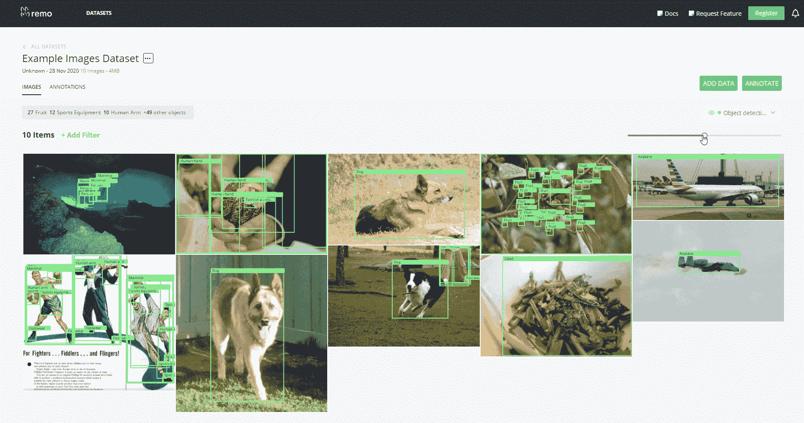
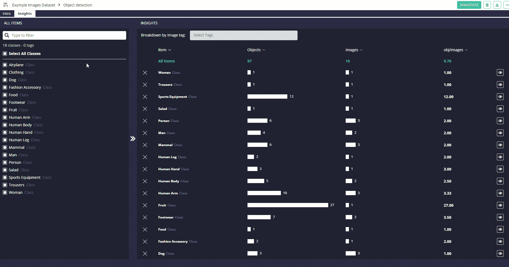

# 如何用 Remo 在 Python 中管理计算机视觉数据集

> 原文：<https://www.freecodecamp.org/news/manage-computer-vision-datasets-in-python-with-remo/>

计算机视觉是机器学习最重要的应用之一。计算机视觉的一些常见商业应用包括:

*   工业基础设施、油气管道和商业房地产的预测性维护
*   质量保证自动化
*   基于卫星图像和无人机镜头的景观库存和地块管理

完成这些任务最常用的一些技术是:

*   图像分类
*   目标检测
*   实例分割

在过去的十年中，许多框架，如 TensorFlow，Keras 和 PyTorch，已经被开发出来，以便更容易地开发基于计算机视觉的模型。

但是由于必要的图像预处理、标记和注释可视化，处理图像数据仍然相对困难。

作为本文的一部分，我将向您介绍 [Remo](https://remo.ai/) ，这是一个免费的 Python 库，旨在帮助开发人员处理计算机视觉任务。Remo 可以帮助您:

*   组织和可视化图像和注释
*   高效注释
*   作为一个团队在数据方面进行工作和协作

Remo 既可以在 Jupyter 笔记本中使用，也可以在 Google Colab 环境中使用。在本文中，所有的代码都将基于 Google Colab 的设置，完整的笔记本可以通过[这个链接免费获得。](https://colab.research.google.com/drive/1G0X6ieL9_O5jbdpPPG72nulNhxKELwzd?usp=sharing)

## Remo 如何改进图像管理

有许多传统的开放图像注释工具可供使用。LabelImg 是最受欢迎的一种。

与这些工具相比，Remo 提供了更高效的注释智能工具(例如，快捷方式和 xclick draw)以及帮助您协作和组织工作的功能。您可以将图像标记为完成或待办事项，对它们进行排序和搜索，等等——这在您处理成千上万的图像时非常有用。

但是数据集管理是 Remo 非常创新的地方。目前，计算机视觉项目中的图像通常以平面文件的形式存储在本地硬盘或一些云存储中，注释保存为原始的 XML/JSON/csv 文件。

为了将它们可视化，通常要么单独打开每个文件并尝试想象注释在哪里，要么用 Python 一个一个地绘制它们。

相反，Remo 让您可以完全控制和查看所有数据。

## 演示 Remo 如何工作

首先，我们需要安装所有必要的依赖项。这可以通过运行下面两行代码在 Google Colab 中轻松完成:

```
!pip install remo
!python -m remo_app init --colab
```

一旦我们安装了 Remo，我们就可以使用 Amazon Web Services 上免费提供的一些示例图像创建一个数据集。

```
import remo
import pandas

link = ['https://remo-scripts.s3-eu-west-1.amazonaws.com/open_images_sample_dataset.zip']

df = remo.create_dataset(name = 'Example Images Dataset',
                    urls = link, 
                    annotation_task = "Object Detection")

# Output
# Acquiring data - completed                          
# Processing annotation files: 1 of 1 files                                  
# Processing data - completed       
# Data upload completed
```

通过运行 Remo**list _ datasets()***命令，我们可以轻松地检查我们当前有哪些可用的数据集。*

```
*`remo.list_datasets()

# Output
# [Dataset  1 - 'Example Images Dataset' - 10 images]`*
```

*我们现在准备使用 Remo 的图形界面来检查我们的数据集，并查看可用的不同选项。*

*在图 1 中，您将看到一个简单的例子，说明使用 Remo 可视化和注释我们的数据是多么容易。*

```
*`df.view()`*
```

*

Figure 1: Remo's GUI Data Pre-processing* 

*使用 Remo 的另一个重要优势是，它允许您通过 Python 代码或用户界面快速获得关键数据集统计数据。*

*当您试图理解注释如何在不同的图像之间分布，以及总体类别分布是否平衡时，这可能特别有用。*

```
*`df.get_annotation_statistics()

# Output
# [{'AnnotationSet ID': 1,
#  'AnnotationSet name': 'Object detection',
#  'creation_date': None,
#  'last_modified_date': '2020-11-28T22:04:48.263767Z',
#  'n_classes': 18,
#  'n_images': 10,
#  'n_objects': 98,
#  'top_3_classes': [{'count': 27, 'name': 'Fruit'},
#   {'count': 12, 'name': 'Sports equipment'},
#   {'count': 10, 'name': 'Human arm'}]}]`*
```

*使用 Remo 的图形界面可以看到类似的结果(图 2)。*

```
*`df.view_annotation_stats()`*
```

*

Figure 2: Remo's Statistics Functionalities* 

*最后，如果您使用 Remo 接口向数据集的不同图像添加注释，这些注释可以以 CSV 格式自动导出。这允许您以后使用它们，并利用 Remo 的**export _ annotations _ to _ file()**函数。*

```
*`df.export_annotations_to_file('images_annotations.zip', annotation_format='csv', export_tags = False)`*
```

## *结论*

*总而言之，Remo 提供的一些关键功能有:*

*   *数据集管理功能*
*   *计算机视觉任务支持多种文件格式*
*   *用户友好的界面和增强的注释工具*
*   *轻松的项目协作*
*   *支持虚拟机的使用*

*如果你有兴趣了解更多关于 Remo 的信息(比如如何将 Remo 与 PyTorch 等其他框架集成)或者如何在 Jupyter 笔记本环境中设置这个工作流，那么[Remo 官方文档](https://remo.ai/docs/)是一个很好的起点。*

*****希望你喜欢这篇文章，谢谢阅读！*****

## 联系我

如果你想了解我最新的文章和项目[，请通过媒体](https://medium.com/@pierpaoloippolito28?source=post_page---------------------------)关注我，并订阅我的[邮件列表](http://eepurl.com/gwO-Dr?source=post_page---------------------------)。以下是我的一些联系人详细信息:

*   [Linkedin](https://uk.linkedin.com/in/pier-paolo-ippolito-202917146?source=post_page---------------------------)
*   [个人博客](https://pierpaolo28.github.io/blog/?source=post_page---------------------------)
*   [个人网站](https://pierpaolo28.github.io/?source=post_page---------------------------)
*   [帕特里翁](https://www.patreon.com/user?u=32155890)
*   [中等轮廓](https://towardsdatascience.com/@pierpaoloippolito28?source=post_page---------------------------)
*   [GitHub](https://github.com/pierpaolo28?source=post_page---------------------------)
*   [卡格尔](https://www.kaggle.com/pierpaolo28?source=post_page---------------------------)

来自 [Remo 文档的封面照片。](https://remo.ai/)