# 如何使用 psql 从命令行管理 PostgreSQL 数据库

> 原文：<https://www.freecodecamp.org/news/manage-postgresql-with-psql/>

现在是学习关系数据库和 SQL 的好时机。从 web 开发到数据科学，它们无处不在。

在 [Stack Overflow 2021 调查](https://insights.stackoverflow.com/survey/2021#most-popular-technologies-database-prof)中，专业开发人员使用的五大数据库技术中有四项是关系数据库管理系统。

PostgreSQL 是学习第一个关系数据库管理系统的绝佳选择。

1.  它被广泛应用于工业领域，包括优步、网飞、Instagram、Spotify 和 Twitch。
2.  它是开源的，所以你不会被某个特定的供应商所束缚。
3.  它已经有超过 25 年的历史，在这段时间里，它赢得了稳定和可靠的声誉。

无论您是在学习 freeCodeCamp [关系数据库认证](https://www.freecodecamp.org/learn/relational-database/)还是在自己的计算机上试用 PostgreSQL，您都需要一种创建和管理数据库、向其中插入数据以及从其中查询数据的方法。

虽然有几种与 PostgreSQL 交互的图形应用程序，但使用 psql 和命令行可能是与数据库通信的最直接的方式。

## psql 是什么？

psql 是一个让您通过终端界面与 PostgreSQL 数据库进行交互的工具。当您在计算机上安装 PostgreSQL 时，会自动包含 psql。

psql 允许您编写 sql 查询，将它们发送到 PostgreSQL，并查看结果。它还允许您使用元命令(以反斜杠开头)来管理数据库。您甚至可以编写脚本并自动执行与数据库相关的任务。

现在，在您的本地计算机上运行数据库并使用命令行起初可能看起来令人生畏。我是来告诉你其实没那么糟。本指南将教您从命令行管理 PostgreSQL 数据库的基础知识，包括如何创建、管理、备份和恢复数据库。

## 先决条件–安装 PostgreSQL

如果您的计算机上尚未安装 PostgreSQL，请遵循[官方 PostgreSQL 文档](https://www.postgresql.org/download/)上针对您的操作系统的说明。

安装 PostgreSQL 时，会要求您输入密码。请将它保存在安全的地方，因为您将需要它来连接到您创建的任何数据库。

## 如何连接到数据库

使用 psql 连接数据库时，您有两种选择:可以通过命令行或使用 psql 应用程序进行连接。两者都提供了几乎相同的体验。

### 选项 1–使用命令行连接到数据库

打开一个终端。您可以通过键入`psql --version`来确保 psql 已安装。您应该看到`psql (PostgreSQL) version_number`，其中`version_number`是安装在您机器上的 PostgreSQL 的版本。我的情况是 14.1。

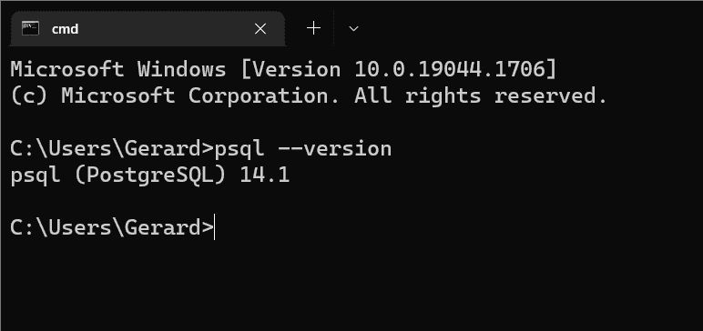

Checking psql version via the command line

连接到数据库的模式是:

```
psql -d database_name -U username
```

`-d`标志是`--dbname`的简称，而`-U`是`--username`的简称。

当您安装 PostgreSQL 时，会创建一个默认的数据库和用户，都称为`postgres`。所以输入`psql -d postgres -U postgres`作为`postgres`超级用户连接到`postgres`数据库。

```
psql -d postgres -U postgres
```

系统将提示您输入密码。输入您在计算机上安装 PostgreSQL 时选择的密码。您的终端提示符将会改变，显示您现在已经连接到了`postgres`数据库。

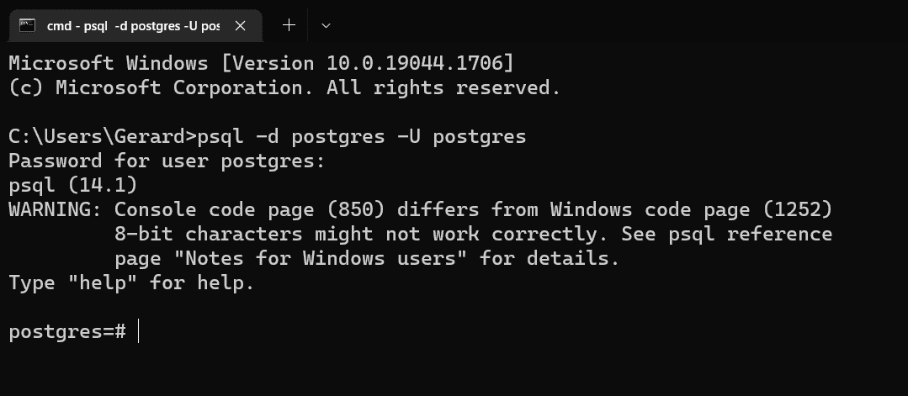

Connecting to a database from the command line with psql

如果您想以自己的身份(而不是以`postgres`超级用户的身份)直接连接到数据库，请输入您的系统用户名作为用户名值。

### 选项 2–使用 psql 应用程序连接到数据库

启动 psql 应用程序——它将被称为“SQL Shell (psql)”。系统会提示您输入服务器、数据库、端口和用户名。您只需按 enter 键选择默认值，即`localhost`、`postgres`、`5432`和`postgres`。

接下来，系统会提示您输入安装 PostgreSQL 时选择的密码。一旦你输入这个，你的终端提示将会改变，显示你已经连接到了`postgres`数据库。

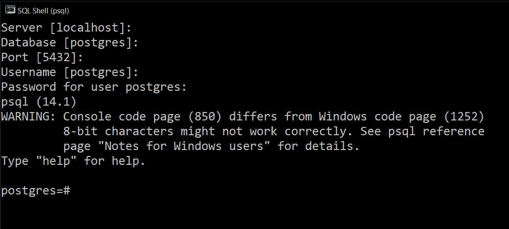

Connecting to a database with the psql application

**注意:**如果您在 Windows 上，您可能会看到类似“控制台代码页(850)不同于 Windows 代码页(1252) 8 位字符可能无法正常工作”的警告。有关详细信息，请参见 psql 参考页“Windows 用户注意事项”。现阶段不需要担心这个。如果你想了解更多，请看 [psql 文档](https://www.postgresql.org/docs/current/app-psql.html)。

## 如何在 psql 中获得帮助

要查看所有 psql 元命令的列表，以及它们所做工作的简要总结，可以使用`\?`命令。

```
\?
```

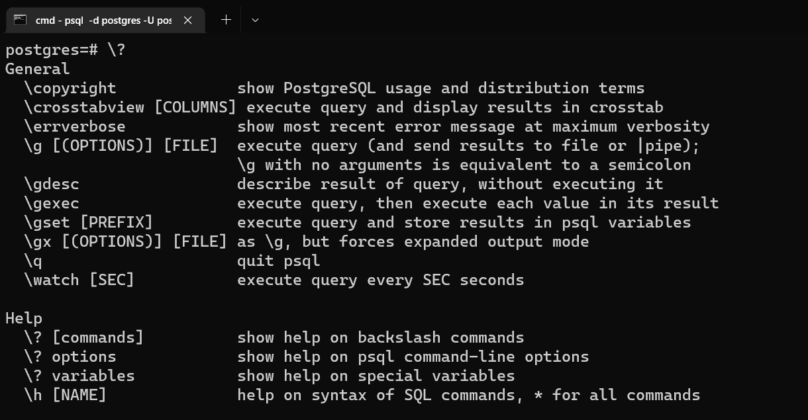

psql's help command

如果您需要 PostgreSQL 命令的帮助，请使用`\h`或`\help`和命令。

```
\h COMMAND
```

这将为您提供命令的描述、语法(可选部分在方括号中)以及 PostgreSQL 文档相关部分的 URL。

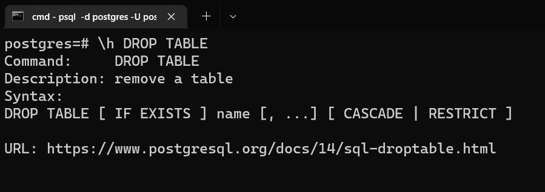

psql describing the DROP TABLE statement

## 如何退出 psql 中的命令

如果你运行一个命令花费了很长时间或者在控制台上打印了太多的信息，你可以通过键入`q`来退出。

```
q
```

## 如何创建数据库

在管理任何数据库之前，您需要创建一个数据库。

**注意:** SQL 命令应该以分号结尾，而元命令(以反斜杠开头)不需要。

创建数据库的 SQL 命令是:

```
CREATE DATABASE database_name;
```

在本指南中，我们将使用书籍数据，所以让我们创建一个名为`books_db`的数据库。

```
CREATE DATABASE books_db;
```

## 如何列出数据库

您可以使用 list 命令查看所有可用数据库的列表。

```
\l
```

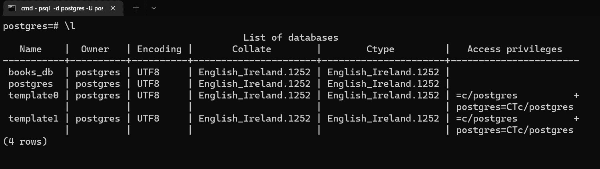

Listing all databases

你应该会看到`books_db`，以及`postgres`、`template0`和`template1`。(`CREATE DATABASE`命令实际上是通过复制名为`template1`的标准数据库来工作的。您可以在 [PostgreSQL 文档](https://www.postgresql.org/docs/current/manage-ag-templatedbs.html)中了解更多相关信息。)

使用`\l+`将显示额外的信息，比如数据库及其表空间的大小(文件系统中存储代表数据库的文件的位置)。

```
\l+
```

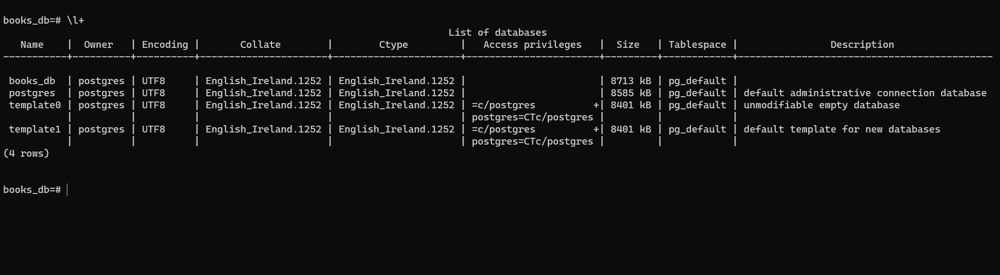

Listing all databases with additional information

## 如何切换数据库

您当前仍然连接到默认的`postgres`数据库。要连接到一个数据库或在数据库之间切换，使用`\c`命令。

```
\c database_name
```

所以`\c books_db`会把你连接到`books_db`数据库。请注意，您的终端提示符会发生变化，以反映您当前连接到的数据库。

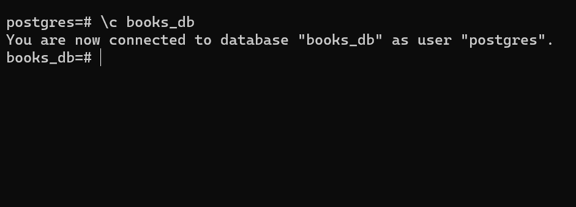

Switching databases

## 如何删除数据库

如果你想删除一个数据库，使用`DROP DATABASE`命令。

```
DROP DATABASE database_name;
```

只有当您是超级用户(如`postgres`)或者您是数据库的所有者时，才允许您删除数据库。

如果您试图删除一个不存在的数据库，您将得到一个错误。用`IF EXISTS`取而代之得到通知。

```
DROP DATABASE IF EXISTS database_name;
```

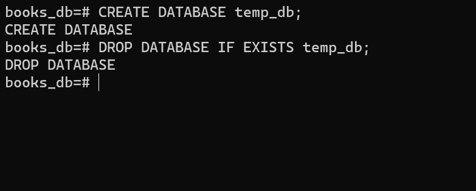

Deleting a database

不能删除有活动连接的数据库。因此，如果您想删除当前连接的数据库，您需要切换到另一个数据库。

## 如何创建表格

在管理表之前，我们需要创建一些表并用一些示例数据填充它们。

创建表格的命令是:

```
CREATE TABLE table_name();
```

这将创建一个空表。还可以将列值传递到括号中，以创建包含列的表。至少，一个基本表应该有一个主键(区分每一行的唯一标识符)和一个包含一些数据的列。

对于我们的`books_db`，我们将为作者创建一个表，为书籍创建另一个表。对于作者，我们将记录他们的名和姓。对于书籍，我们将记录书名和出版年份。

我们将确保作者的`first_name`和`last_name`以及书籍的`title`不为空，因为这是了解它们的非常重要的信息。为此，我们包含了`NOT NULL`约束。

```
CREATE TABLE authors(
	author_id SERIAL PRIMARY KEY, 
	first_name VARCHAR(100) NOT NULL, 
	last_name VARCHAR(100) NOT NULL
);

CREATE TABLE books(
	book_id SERIAL PRIMARY KEY, 
	title VARCHAR(100) NOT NULL, 
	published_year INT
);
```

如果表格创建成功，您将看到`CREATE TABLE`打印到终端。

现在让我们通过向 books 添加一个外键来连接这两个表。外键是引用另一个表的主键的唯一标识符。当然，书可以有多个作者，但是我们现在不打算讨论多对多关系的复杂性。

使用以下命令向`books`添加一个外键:

```
ALTER TABLE books ADD COLUMN author_id INT REFERENCES authors(author_id);
```

接下来，让我们向表中插入一些示例数据。我们从`authors`开始。

```
INSERT INTO authors (first_name, last_name) 
VALUES (‘Tamsyn’, ‘Muir’), (‘Ann’, ‘Leckie’), (‘Zen’, ‘Cho’);
```

从`authors`选择一切，以确保插入命令有效。

```
SELECT * FROM authors;
```

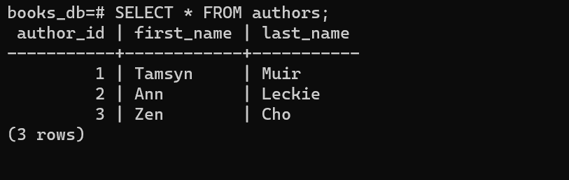

Querying all data from the authors table

接下来，我们将一些书籍数据插入到`books`中。

```
INSERT INTO books(title, published_year, author_id) 
VALUES (‘Gideon the Ninth’, 2019, 1), (‘Ancillary Justice’, 2013, 2), (‘Black Water Sister’, 2021, 3);
```

如果你运行`SELECT * FROM books;`，你会看到图书数据。

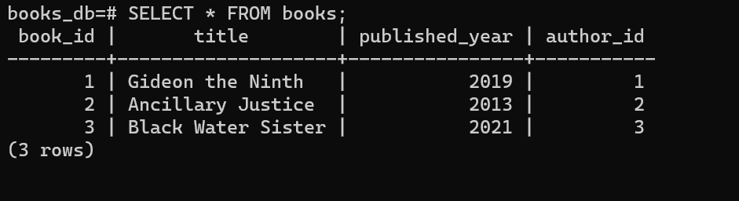

Querying all data from the books table

## 如何列出所有表格

您可以使用`\dt`命令列出数据库中的所有表格。

```
\dt
```

对于`books_db`，你会看到`books`和`authors`。你还会看到`books_book_id_seq`和`authors_author_id_seq`。这些函数跟踪表中用作 id 的整数序列，因为我们使用了`SERIAL`来生成它们的主键。

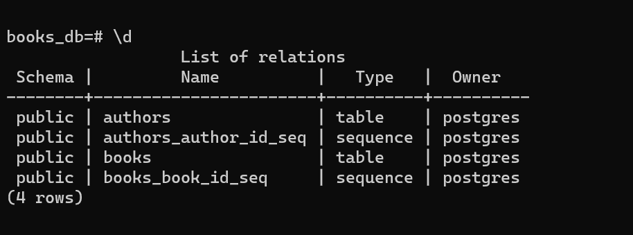

Listing all tables in a database

## 如何描述表格

要查看特定表格的更多信息，可以使用 describe table 命令:`\d table_name`。这将列出列、索引以及对其他表的任何引用。

```
\d table_name
```

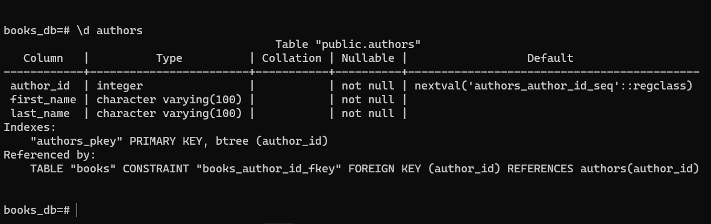

Describing the authors table

使用`\dt+ table_name`将提供更多的信息，比如关于存储和压缩的信息。

## 如何重命名表格

如果你需要改变一个表的名字，你可以用`ALTER TABLE`命令重命名它。

```
ALTER TABLE table_name RENAME TO new_table_name;
```

## 如何删除表格

如果你想删除一个表，你可以使用`DROP TABLE`命令。

```
DROP TABLE table_name;
```

如果您试图删除一个不存在的表，您将得到一个错误。您可以通过在语句中包含`IF EXISTS`选项来避免这种情况。这样你反而会收到通知。

```
DROP TABLE IF EXISTS table_name;
```

## 如何管理更长的命令和查询

如果您正在编写更长的 SQL 查询，命令行并不是最符合人体工程学的方式。将您的 SQL 编写在一个文件中，然后让 psql 执行它，这可能更好。

如果您正在使用 psql，并且认为您的下一个查询会很长，您可以从 psql 打开一个文本编辑器并在那里编写它。如果您有一个现有的查询，或者可能想要运行几个查询来加载示例数据，您可以从一个已经编写好的文件中执行命令。

### 选项 1–从 psql 打开一个文本编辑器

如果输入`\e`命令，psql 将打开一个文本编辑器。当您保存并关闭编辑器时，psql 将运行您刚刚编写的命令。

```
\e
```

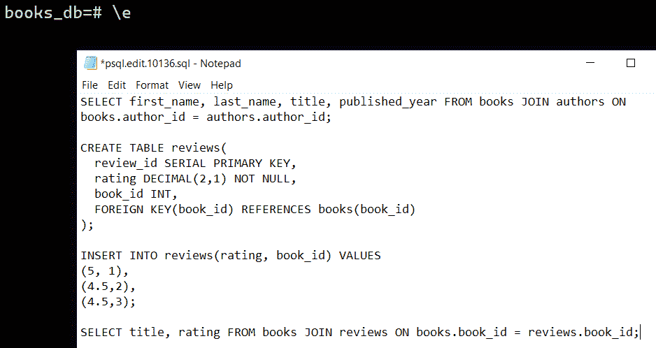

Writing commands in a text editor

在 Windows 上，psql 的默认文本编辑器是记事本，而在 MacOs 和 Linux 上是 vi。您可以通过在您的计算机的环境变量中设置`EDITOR`值来将其更改为另一个编辑器。

### 选项 2–从文件执行命令和查询

如果您有特别长的命令或者想要运行多个命令，那么最好提前在一个文件中编写 SQL，并在准备好之后让 psql 执行该文件。

`\i`命令让您可以从文件中读取输入，就像您在终端中输入一样。

```
\i path_to_file/file_name.sql
```

**注意:**如果您在 Windows 上执行这个命令，您仍然需要在文件路径中使用正斜杠。

如果您不指定路径，psql 将在您连接到 PostgreSQL 之前所在的最后一个目录中查找该文件。

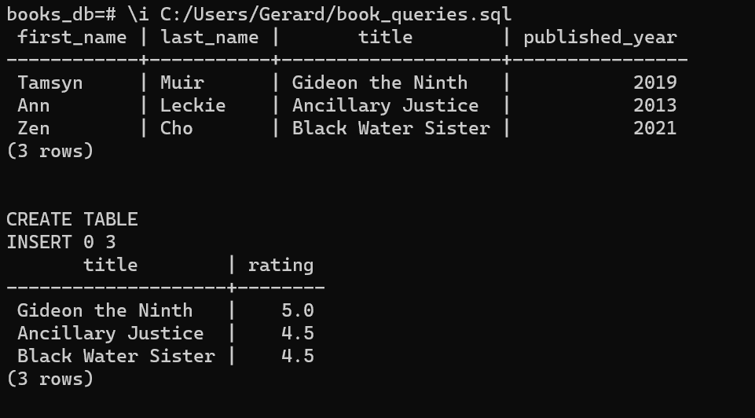

Executing SQL commands from a file

## 如何为查询计时

如果想知道查询需要多长时间，可以打开查询执行计时。

```
\timing
```

这将以毫秒为单位显示完成查询所需的时间。

如果您再次运行`\timing`命令，它将关闭查询执行计时。

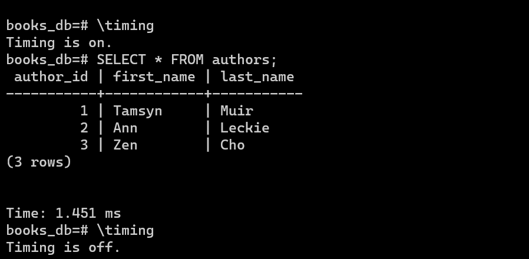

Using query execution timing

## 如何从 CSV 文件导入数据

如果您有一个包含数据的 CSV 文件，并且希望将它加载到 PostgreSQL 数据库中，那么您可以使用 psql 从命令行完成此操作。

首先，用下面的结构创建一个名为`films.csv`的 CSV 文件(不管你用的是 Excel、Google Sheets、Numbers 还是其他什么程序)。

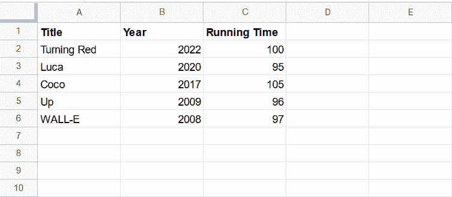

A spreadsheet with Pixar film data

打开 psql 并创建一个`films_db`数据库，连接到它，并创建一个`films`表。

```
CREATE DATABASE films_db;

\c films_db

CREATE TABLE films(
	id SERIAL PRIMARY KEY,
	title VARCHAR(100),
	year INT,
	running_time INT
);
```

然后，您可以使用`\copy`命令将 CSV 文件导入到`films`中。您需要提供 CSV 文件在计算机上的绝对路径。

```
\copy films(title, year, running_time) FROM 'path_to_file' DELIMITER ‘,’ CSV HEADER;
```

`DELIMITER`选项指定在导入的文件的每一行中分隔列的字符，`CSV`指定它是一个 CSV 文件，`HEADER`指定文件包含一个标题行，标题行中有列的名称。

**注意:**`films`表的列名不需要与`films.csv`的列名相匹配，但是它们的顺序必须相同。

使用`SELECT * FROM films;`查看过程是否成功。

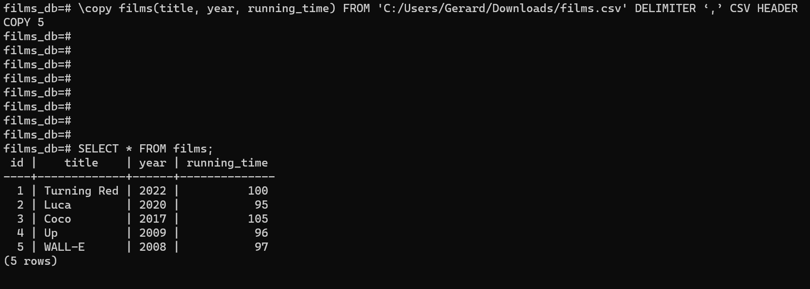

Importing data from a .csv file

## 如何用`pg_dump`备份数据库

如果您需要备份数据库，`pg_dump`是一个实用程序，它允许您将数据库提取到 SQL 脚本文件或其他类型的归档文件中。

首先，在命令行上(不在 psql 中)，导航到 PostgreSQL `bin`文件夹。

```
cd "C:\Program Files\PostgreSQL\14\bin"
```

然后运行下面的命令，使用`postgres`作为用户名，并填写您想要使用的数据库和输出文件。

```
pg_dump -U username database_name > path_to_file/filename.sql
```

使用`postgres`作为用户名，系统会提示您输入`postgres`超级用户的密码。`pg_dump`将创建一个`.sql`文件，包含重建数据库所需的 SQL 命令。

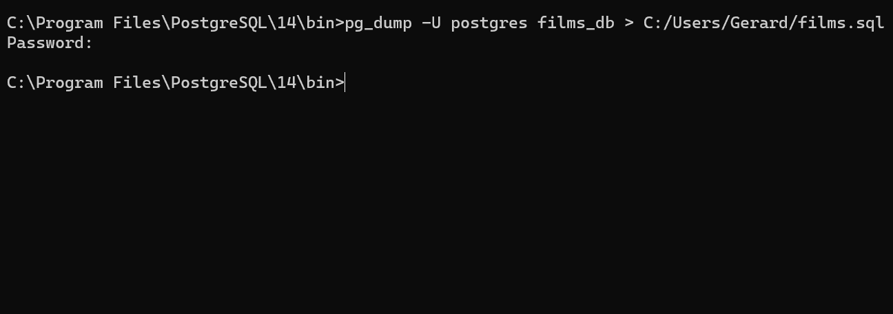

Backing up a database to a .sql file

如果不为输出文件指定路径，`pg_dump`会将文件保存在连接到 PostgreSQL 之前的最后一个目录中。

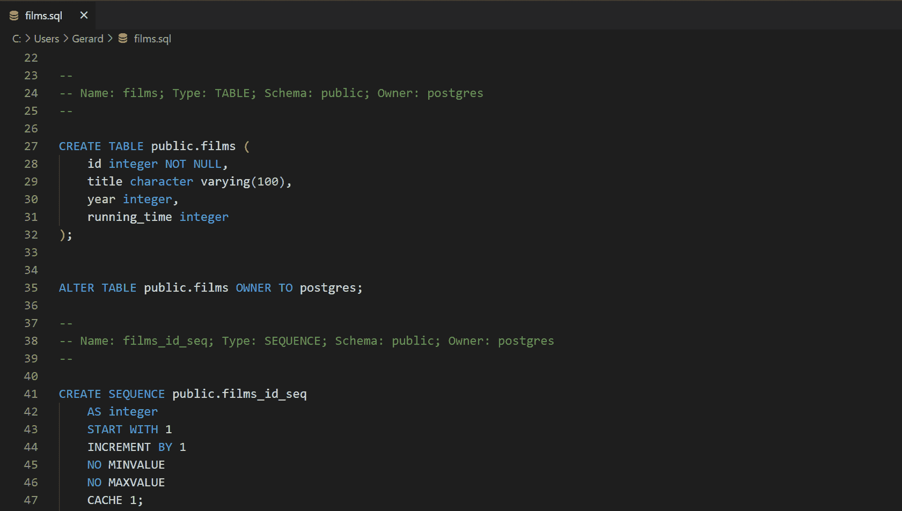

Contents of films.sql backup file

你可以将`-v`或`--verbose`标志传递给`pg_dump`来查看`pg_dump`在每一步做什么。

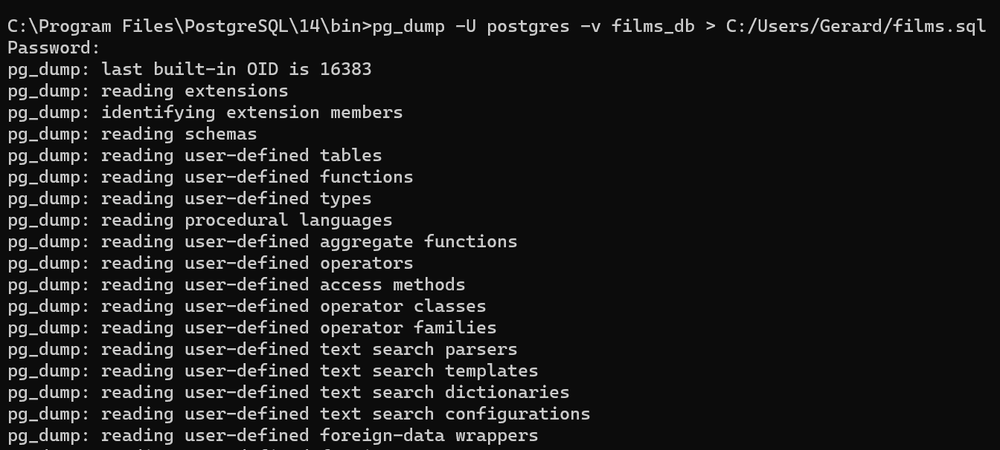

Running pg_dump in verbose mode

您还可以将数据库备份为其他文件格式，例如`.tar`(一种存档格式)。

```
pg_dump -U username -F t database_name > path_to_file/filename.tar
```

这里的`-F`标志告诉`pg_dump`你将要指定一个输出格式，而`t`告诉它它将会是`.tar`格式。

## 如何恢复数据库

您可以使用 psql 或`pg_restore`实用程序从备份文件中恢复数据库。选择哪一个取决于要从中还原数据库的文件类型。

1.  如果您将数据库备份为明文格式，比如`.sql`，请使用 psql。
2.  如果您将数据库备份为归档格式，如`.tar`，请使用`pg_restore`。

### 选项 1–使用 psql 恢复数据库

要从一个`.sql`文件恢复一个数据库，在命令行上(所以不在 psql 中)，使用`psql -U username -d database_name -f filename.sql`。

您可以使用之前使用的`films_db`数据库和`films.sql`文件，或者创建一个新的备份文件。

为要将数据恢复到的文件创建一个空数据库。如果您使用`films.sql`来恢复`films_db`，最简单的方法可能是删除`films_db`并重新创建它。

```
DROP DATABASE films_db;

CREATE DATABASE films_db;
```

在一个单独的终端中(不在 psql 中)，运行下面的命令，传入`postgres`作为用户名，以及您正在使用的数据库和备份文件的名称。

```
psql -U username -d database_name -f path_to_file/filename.sql
```

`-d`标志将 psql 指向一个特定的数据库，而`-f`标志告诉 psql 从指定的文件中读取。

如果您没有为备份文件指定路径，psql 将在您连接到 PostgreSQL 之前所在的最后一个目录中查找该文件。

你将被提示输入超级用户的密码，然后当 psql 重新创建数据库时，你将看到一系列的命令被打印到命令行。

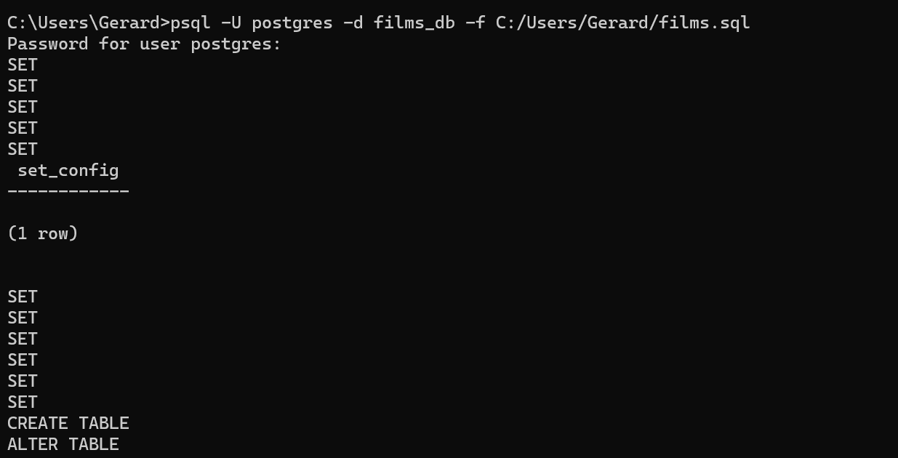

Restoring a database using psql

此命令会忽略恢复过程中出现的任何错误。如果您想在发生错误时停止恢复数据库，请传入`--set ON_ERROR_STOP=on`。

```
psql -U username -d database_name --set ON_ERROR_STOP=on -f filename.sql
```

### 选项 2–使用`pg_restore`恢复数据库

要使用`pg_restore`恢复数据库，请使用`pg_restore -U username -d database_name path_to_file/filename.tar`。

为要将数据恢复到的文件创建一个空数据库。如果你从一个`films.tar`文件中恢复`films_db`，最简单的方法可能是删除`films_db`并重新创建它。

```
DROP DATABASE films_db;

CREATE DATABASE films_db;
```

在命令行上(不在 psql 中)，运行下面的命令，传入`postgres`作为用户名，以及您正在使用的数据库和备份文件的名称。

```
pg_restore -U username -d database_name path_to_file/filename.tar
```

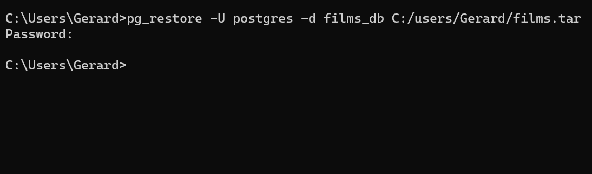

Restoring a database using pg_restore

你也可以传入`-v`或`--verbose`标志来查看`pg_restore`在每一步做什么。

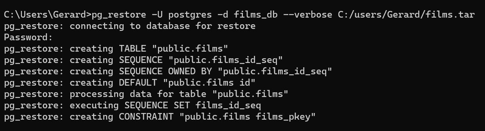

Using pg_restore in verbose mode

## 如何退出 psql

如果您已经完成 psql 并想退出，请输入`quit`或`\q`。

```
\q
```

这将关闭 psql 应用程序(如果您正在使用它),或者返回到常规的命令提示符(如果您正在从命令行使用 psql)。

## 从这里带它去哪里

使用 psql 可以做更多的事情，比如管理模式、角色和表空间。但是本指南应该足以让您从命令行开始管理 PostgreSQL 数据库。

如果你想了解更多关于 PostgreSQL 和 psql 的知识，你可以试试 freeCodeCamp 的[关系数据库证书](https://www.freecodecamp.org/learn/relational-database/ )。官方 [PostgreSQL 文档](https://www.postgresql.org/docs/current/)全面， [PostgreSQL 教程](https://www.postgresqltutorial.com/postgresql-administration/psql-commands/)提供了几个深度教程。

我希望本指南对您继续学习 PostgreSQL 和关系数据库有所帮助。