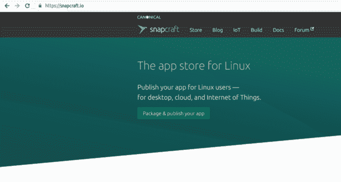

# 如何管理 Ubuntu 快照:没人告诉你的事情

> 原文：<https://www.freecodecamp.org/news/managing-ubuntu-snaps/>

Canonical 的快照绝对是真货。安全和便携的 Linux 包管理系统不仅仅是一个展示你的技术信用的极客工具。想想[越来越多的公司已经购买并通过 snaps 提供他们的桌面软件，包括 Blender、Slack、Spotify、Android Studio 和微软(Microsoft！)Visual Studio 代码。不要忘记，snap 系统的真正增长是在物联网设备和服务器领域，而不是桌面。](https://snapcraft.io/store)



The snapcraft.io site: where snap developers and users meet

但是随着 snap 越来越受欢迎——一些新的 Linux 发行版默认安装了 snapd 服务——您可能会想知道应该如何让它们工作。不要误解我的意思:有各种各样的基于 web 的指南来查找、安装和删除 snaps。开发人员可以从一些地方获得帮助，将他们的应用程序构建成快照。但是现在我要说的是*配置*他们的行为或者*在出现问题时排除*故障。

请注意，您可以使用以下命令来搜索要安装的新快照:

```
snap find aws
```

当您找到您喜欢的软件包时，您可以使用以下方式安装它:

```
snap install aws-cli
```

哦，你用删除键删除它们。

```
snap remove aws-cli
```

那里。你不能说我什么都没教过你。但这不是本文要讨论的内容。我们将要讨论的是真正的管理内容，比如更改配置或排除故障。

## 了解快照文件系统

那么，这和你通常在 Linux 上做的方式有什么不同呢？配置文件通常会放在 */etc/* 中，进程会通过 *systemctl* 透露它们最深的秘密，日志会找到它们的 */var/log/* 中。

别着急，朝圣者。在 Snapland，事情并不总是这样。你看，快照实际上只不过是一个压缩文件(用*命名)。snap* 扩展名)包含运行包所需的整个文件系统。这些文件实际上从未被解压缩和“安装”，而是在运行时动态挂载，并作为虚拟环境向用户公开。

这意味着程序使用的资源可能实际上不存在于主机系统中。因此，例如，Nextcloud snap 为其后端创建了自己的 Apache 和 MySQL 版本。所以，比方说，如果你想在*/etc/Apache 2/sites-available/*中配置一个新的虚拟主机，或者以传统方式创建一个新的 MySQL 用户，你就不走运了。

这种方法的优点是显著的:安装和设置通常会更加顺利，并且您不太可能遇到依赖性问题和冲突。但这也至少意味着你对驱动你软件的重要器官的接触更少了。

那么，所有爽快的事情都发生在哪里？亲自查看一下您的主机文件系统:您可能会发现比您所能看到的更多的快照目录(如果您愿意的话)。以下是快照安装过程可能创建的目录:

/snap/
/var/snap/
/var/lib/snapd/
/home/username/snap/

这么多？为什么让我们一次过一遍。请随意使用您自己的 Linux 机器来亲眼看看这一切。

实际的*。快照*文件保存在 */var/lib/snapd/snaps/* 目录下。运行时，这些文件将挂载在根目录 */snap/* 下。看那边——在/snap/core/子目录中——您会看到看起来像一个普通的 Linux 文件系统。它实际上是活动快照使用的虚拟文件系统。

```
ls /snap/core/current
bin   dev  home  lib64  meta  opt   root  sbin  srv  tmp  var
boot  etc  lib   media  mnt   proc  run   snap  sys  usr  writable
```

这里是一个子目录，包含 Nextcloud snap 使用的(只读)配置文件。当然，这只有在你安装了 next cloud(*snap install next cloud*)的情况下才会出现。

```
ls /snap/nextcloud/current/conf/
httpd.conf  mime.types  ssl.conf
```

好的。现在 */var/snap/* 呢？与 */var/* 的传统居民非常相似， */var/snap/* 中的文件包含各种形式的用户数据和日志文件——应用程序在操作期间生成和使用的数据。此示例显示了一些桌面相关快照使用的数据目录，包括 AWS CLI 和 Slack team communication tool。(好吧，从技术上讲，AWS CLI 不是桌面工具。)

```
ls /var/snap
aws-cli  core18           gnome-system-monitor  gnome-calculator
brave    gnome-3-26-1604  gnome-characters      gtk-common-themes
core     gnome-3-28-1804  gnome-logs            slack
```

深入研究您机器上的 */var/snap/* 子目录，看看您能发现什么。

这样，至少在某些 Linux 文件系统上，用户的主目录中只剩下 *~/snap* 目录。它将包含使用您将在/var/snap 中看到的一些名称的目录。里面发生了什么事？

```
ls ~/snap
aws-cli  brave  gnome-calculator  slack
```

据我所知，这些目录旨在存储与您的用户帐户使用的设置相关的版本化数据。

## 快照管理工具

到目前为止，我已经向您展示了如何找到保存在配置文件(在 */var/snap/* )、虚拟文件系统( */snap/* )和用户设置集合( *~/snap* )中的各类数据。我还向您展示了哪里需要查看*而不是*—*/var/lib/snapd/*——也就是。快照文件本身是活的；这里没什么可看的，快走吧。

那么实际的管理呢？这有点复杂。一些快照(如 Nextcloud)公开了功能全面的管理界面。我在[我的管理下一个云的快照文章](https://www.freecodecamp.org/news/snapd-nextcloud/)中谈到了这一点。但似乎快照的简单性有时意味着没有多少实际配置是可能的。

然而，情况并不总是如此。但是首先，您需要了解*快照服务*。一些更复杂的应用需要多层软件堆栈。例如，Nextcloud 创建并管理自己的 Apache、MySQL、PHP 和 Redis 版本。用通俗的话说，这些“层”中的每一层都被称为服务。

如果您的计算机上安装的任何快照都有自己的服务，您可以使用以下 snapd 命令列出它们及其状态:

```
snap services
Service                    Startup  Current   Notes
nextcloud.apache           enabled  active    -
nextcloud.mdns-publisher   enabled  active    -
nextcloud.mysql            enabled  active    -
nextcloud.nextcloud-cron   enabled  active    -
nextcloud.nextcloud-fixer  enabled  inactive  -
nextcloud.php-fpm          enabled  active    -
nextcloud.redis-server     enabled  active    -
nextcloud.renew-certs      enabled  active    -
```

您还可以控制服务的运行和启动状态。这个例子将停止 Nextcloud 的 Apache 服务，并确保它不会在系统重新启动时启动(尽管，请记住，这将禁用 next cloud——您可能不想这样做):

```
snap stop --disable nextcloud.apache
```

您还可以使用 systemctl 来管理快照服务进程:

```
systemctl status snap.nextcloud.apache
```

如果您的快照至少包括一项服务，您可以使用 snapd 查看其日志:

```
snap logs nextcloud
```

您还可以指定特定的服务:

```
snap logs nextcloud.mysql
```

对于某些快照(如 Nextcloud)，snapd 可以从命令行进行有用的配置。您可以使用 *snap get* 显示可用设置:

```
snap get nextcloud
Key        Value
mode       production
nextcloud  {...}
php        {...}
ports      {...}
private    {...}
```

通过添加特定设置的名称来下拉一个级别。这个例子向我们展示了 Nextcloud 目前只监听端口 80 (HTTP)和 443 (HTTPS)。

```
snap get nextcloud ports
Key          Value
ports.http   80
ports.https  443
```

您可以使用 *set* 命令更改设置。这将告诉 Nextcloud 在端口 8080 上监听不安全的 HTTP 请求，而不是 80。

```
snap set nextcloud ports.http=8080
```

Snapd 还提供了一些系统范围的配置设置，在这里描述了这些设置[，在这里](https://docs.snapcraft.io/system-options/87)维护了[环境变量的文档，在这里](https://docs.snapcraft.io/environment-variables/7983)可以找到关于[保持快照更新的信息。](https://docs.snapcraft.io/keeping-snaps-up-to-date/7022)

当事情需要解决的时候，所有这些都会让你开始。所以开始吧。

*寻找更多？你可能会喜欢我的关于 Linux、AWS 和 Docker 相关主题的* [*书籍和 Pluralsight 课程*](https://bootstrap-it.com/) *。*