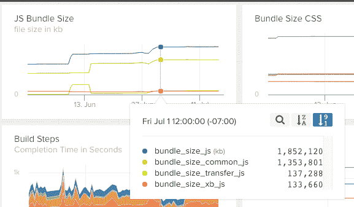
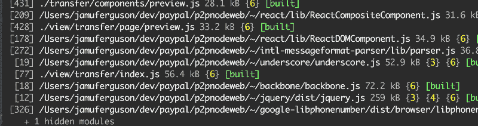
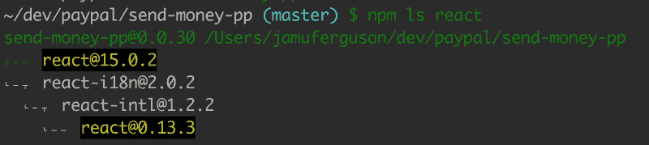

# 手动调整 Webpack 版本

> 原文：<https://www.freecodecamp.org/news/manually-tuning-webpack-builds-284923f47f44/>

贾蒙·弗格森

# 手动调整 Webpack 版本



早在 4 月份，我在 PayPal 的工作转变为平台/架构师角色。我的任务是关注稳定性、性能和质量。我做的第一件事是绘制 JavaScript 包大小随时间变化的图表。

几个星期后，我注意到我们的构建规模在几个点上有相当大的峰值，加起来接近 1mb。看着它，我发现我们到处都在复制东西。

NPM 使得安装许多版本的模块变得非常容易。这在服务器代码中是没问题的，但是在为 web 进行捆绑时，这是一个大问题。Webpack 提供了一些用于检查构建文件的基本工具，但是要理解这些数据需要一些额外的 shell 命令:

让我来告诉你这里发生了什么:

*   **display-modules** 是 **webpack** 上的一个标志，它将显示被拉入捆绑包的所有节点模块。
*   **awk** 对列重新排序并删除不需要的信息。
*   grep 正在从输出中删除非常小的文件。
*   sort -n 将最大的文件放在底部
*   **tail** 只显示最后(最大)的 100。

有了这种魔力，你会得到这样一个列表:

**编辑:**原来 webpack 内置了这样的东西。

```
webpack --display-modules --sort-modules-by size
```

输出有点混乱，但是它确实以正确的方式排序了！



#### 调查重复的来源

一旦您怀疑您有一个模块的多个版本，使用 **npm ls** 来确定该模块如何包含在您的项目中。



虽然 **npm ls** 显示了您的 **node_modules** 文件夹中的所有内容，但是 **webpack** 可能没有将这些文件都包含在包中。它只包括在你的代码中某处被 **require()** 的文件。

#### 停止疯狂复制

在这一点上，你可能会感到有点极度疲劳。您已经输入了许多命令，但是您实际上如何调整您的构建呢？

在上面的例子中，这个项目直接依赖于 **React 15，**，但是它的一个依赖项依赖于[**React-intl**](https://github.com/yahoo/react-intl)**@ 1 . 2 . 2**，而后者又依赖于 **React 0.13** 。

这种情况下的解决方案是用一个支持 react 新版本的国际化库取代我们对 **react-intl** 的依赖。这是一个不小的工作量，因为我们实际上最终编写了一个简化的替代方案。

谢天谢地，我们构建中的许多其他问题都比较容易解决。这里有几个例子:

**我的 lodash 太大了**

```
244kB  /Users/.../dev/paypal/web/~/lodash/dist/lodash.compat.js
```

有几个插件可以调整您的 lodash 构建，以包含您实际使用的 pat。这可以显著减小文件大小。如果你在用巴别塔，我建议你去 https://github.com/lodash/babel-plugin-lodash，否则你可以去 https://github.com/lodash/lodash-webpack-plugin 的 T2。

在这些插件出现之前，我们实际上使用了 ESLint[**no-restricted-module**](http://eslint.org/docs/rules/no-restricted-modules)**规则来禁止 **lodash** 进入我们的 **public/** 文件夹(支持下划线)。这就阻止了我们将他们两个都带入项目中。**

****我有太多的 jQuery****

```
`259kB  /Users/jamuferguson/dev/paypal/web/~/jquery/dist/jquery.js273kB  ./lib/jquery-1.10.2.js`
```

**在这种情况下，我们有一个已经使用了很久的 jQuery 本地版本，但我们也有另一个明确依赖于 jQuery 最新版本的模块。**

**解决这个问题最简单的方法是删除您的本地副本，并依赖在 NPM 安装的版本。尽可能使用最新版本，因为将来的依赖项也可能使用该版本。**

**如果因为浏览器兼容性问题无法升级到最新版本的 jQuery 怎么办？如果这对你来说是一个问题，尝试一下 jQuery Migrate 插件,或者鼓励模块维护者(通过 github 问题)在他们的 package.json 文件中包含更多内容。**

```
`"jquery": "^1 || ^2"`
```

**该语法允许包依赖版本 1 或版本 2。在许多情况下，这将允许您需要的向后兼容性。**

****把它压扁****

**我的团队使用这些技术将我们的*精简版* JavaScript 包的文件大小减少了近 800kb。其他人报告说[成功使用 webpack 插件将 Moment.js](http://stackoverflow.com/questions/25384360/how-to-prevent-moment-js-from-loading-locales-with-webpack) 缩小了数百 kb。**

**你在保持你的 webpack 小版本上有问题吗？你还见过其他什么方法来降低构建规模？**