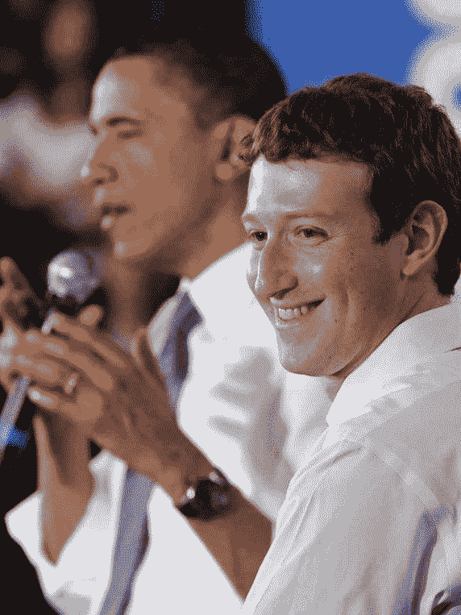
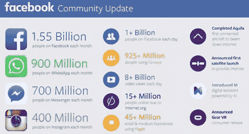
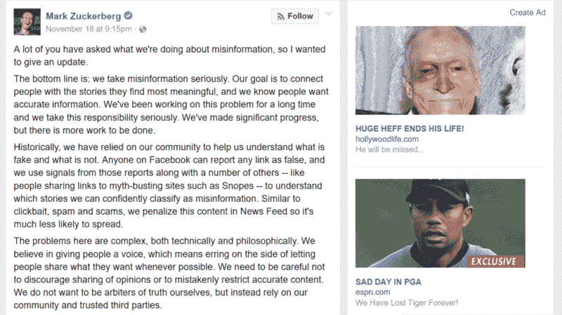
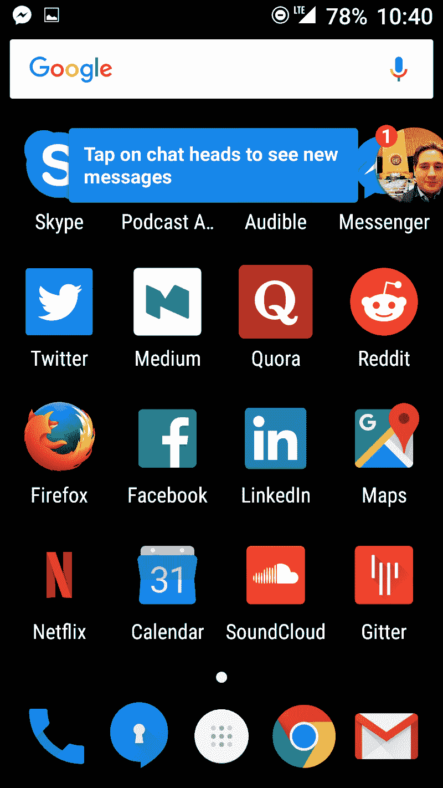
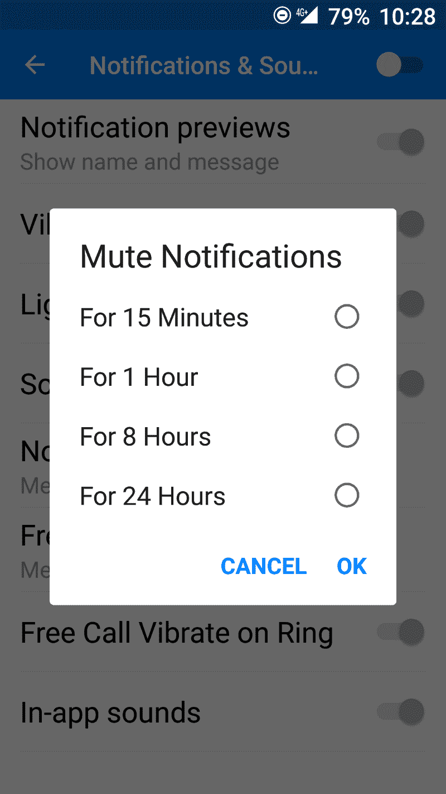

# 我不能眼睁睁看着袖手旁观和马克·扎克伯格毁掉互联网。

> 原文：<https://www.freecodecamp.org/news/mark-zuckerberg-is-the-most-powerful-person-on-earth-but-is-he-responsible-5fbcaeb29ee1/>

> “权力越大，责任越大”——本叔叔

脸书的首席执行官马克·扎克伯格可能是当今最有权力的人。他甚至可能是有史以来最有权力的人。

传统上，美国总统被认为是地球上最有权力的人。毕竟，奥巴马总统控制着这个星球上最强大的军队，对 18 万亿美元的美国经济有着相当大的影响力。

但奥巴马总统受制于制约其权力的系统:国会和最高法院、任期限制(他将于明年 1 月被迫退休)，以及美国选民的意愿。

马克·扎克伯格没有这些限制。他的权力来自脸书，这个世界上市值第七大的公司，他拥有 18%的股份和 60%的投票权。

32 岁时，他可以继续担任脸书的首席执行官 50 年。

但金融只是脸书如此强大的一小部分原因。以下是它支配人类注意力的一些方式:

1.  每天有超过 10 亿人使用脸书。花在互联网上的时间有 1/4 是用脸书度过的。
2.  对许多人来说，脸书就是互联网。这是大多数人宣布婚礼、出生、死亡和其他重大生活事件的第一个地方。
3.  脸书越来越成为人们消费其他形式媒体的地方。

通过它的免费基础程序，脸书实际上已经成为世界上穷人的互联网(这些人必须付费才能访问脸书以外的网站)。

脸书还利用其对人类注意力的垄断来控制什么新闻给谁看，从幕后影响公众舆论。

脸书比地球上任何一家公司或政府都更了解人类和个人。每天有 500 的个人数据流入脸书。

到目前为止，扎克伯格主要利用脸书的力量来进一步发展脸书。他收购了脸书最强劲的竞争对手:Instagram 和 WhatsApp。他现在在视频方面与 YouTube 竞争，在实时交流方面与 Twitter 竞争。

他甚至在创造人工智能和发射卫星(尽管他的第一颗卫星最终在发射台爆炸)。

但是随着脸书成为有史以来最大的公司，扎克伯格的计划可能会改变。

尽管他承诺在有生之年捐出 99%的脸书股票，但他仍将保留对董事会的控制权。他的权力不是来自他的数十亿美元，而是来自他获得我们的关注和数据。

他在塑造人类方面的作用如此重要，以至于甚至有一个大学教授团队记录并分析扎克伯格所说的每一句话，希望了解他的动机和未来计划。

在他的余生中，扎克伯格将能够利用脸书不可思议的力量来实现他想要的任何目标。

### 但他有责任吗？

这是扎克伯格最近关于他正在做什么来阻止脸书假新闻的帖子，他在帖子中说，“底线是:我们认真对待错误信息。”

就在扎克伯格的帖子旁边，有两个假新闻故事的广告。

假新闻可能在美国总统选举的结果中发挥了巨大作用，最近的许多选举也是如此。

即使是虚假的标题——通常用来欺骗人们点击无关产品的广告——也会造成损害。标题是大多数人懒得去读的新闻故事的唯一部分。就其本身而言，标题可以极大地左右公众舆论。

假新闻并不是本周脸书唯一的主要争议。

昨天，脸书内部人士向《纽约时报》透露，脸书正在积极研发一种复杂的审查工具。

扎克伯格的明显目标是重新进入中国市场，脸书自 2009 年以来一直被封锁在中国市场。

扎克伯格利用公司的巨额财富和软件工程师大军来审查网络，这是一种负责任的权力运用吗？这样他就能获得更多的市场份额？

### 脸书无处不在

脸书已经在我们的电话和电脑上，不停地通知我们。

例如，每当有人给你发消息时，Facebook Messenger 就会出现在你正在做的事情的顶部。

如果你试图关闭 Facebook Messenger 中的通知，这里有几个选项可供选择:

没错——一次关闭这些烦人的通知超过 24 小时的唯一方法是一直到操作系统级别。

扎克伯格不会仅仅停留在我们的生活中。他希望脸书成为我们的存在。

这里有一个脸书社交虚拟现实的演示，建立在 Oculus 之上，Oculus 是他在 2014 年收购的一家公司:

[https://www.youtube.com/embed/YuIgyKLPt3s?feature=oembed](https://www.youtube.com/embed/YuIgyKLPt3s?feature=oembed)

这一切看起来是如此平凡，令人震惊。你可以去任何地方，做任何事情，但相反，你要快速旅行到你的客厅，并与你的狗自拍？但是我跑题了。

扎克伯格已经明确表示，他打算创造——然后货币化——人为的稀缺。他设想了一个未来，在虚拟现实转播的体育赛事中，你可以花额外的钱买到更好的座位。

VR 中前排座位的供应技术上应该是无限的。虚拟现实体验中的露天看台不受正常的空间和时间规则的约束。但是你必须支付额外的费用来防止其他头像挡住你的视线。

此外，在虚拟现实中，广告几乎无处不在。有了眼球追踪，你就无法将视线从他们身上移开。

随着脸书不断增长的关于你的数据资料库——以及其为股东实现价值最大化的资本主义使命——这些广告将继续变得越来越令人毛骨悚然。

### 脸书对开放网络是一个威胁

像脸书这样的东西在脸书是不可能出现的。它需要一个开放的网络来孕育。

尽管如此，脸书正在有意识地努力——像免费基础服务一样——摧毁开放网络。它正在破坏使其存在成为可能的环境。

谷歌联合创始人谢尔盖·布林(Sergey Brin)谴责了脸书，并承认谷歌自己无法在脸书创建的“围墙花园”网络中取得成功:

> “你必须遵守他们的规则，这些规则非常严格。我们开发谷歌的环境，我们能够开发搜索引擎的原因，是网络是如此开放。一旦规则太多，就会扼杀创新。”

通过封锁网络，脸书不仅吸走了人类越来越多的醒着的时间——它还在毒化这口井。

否则，最终会出现挑战脸书主导地位的组织，将永远无法找到它们首先需要扎根的沃土。

### 你能做些什么呢？

许多人的本能反应是删除他们的脸书账户，并简单地忽略它。

我认识不少这样做的人，只是为了让骗子伪造他们的账户。

相反，我建议保留你的脸书账户，取消所有人的好友关系，删除你所有的帖子，或者将它们设置为私有。(即使你删除了你的旧帖子，我怀疑脸书会从他们的服务器上删除它们。)

我还建议把脸书的应用程序(WhatsApp、Instagram、脸书和 Facebook Messenger)从你的手机上移除。手机操作系统本来就没有笔记本电脑/台式机那么隐私，甚至让这些应用程序在后台运行也可能是在与脸书共享各种数据。

最后，让你自己了解网络是如何工作的，以及为什么一个开放的网络如此重要。阅读这本关于网络中立和正在进行的互联网之战的优秀书籍。

在外面注意安全。