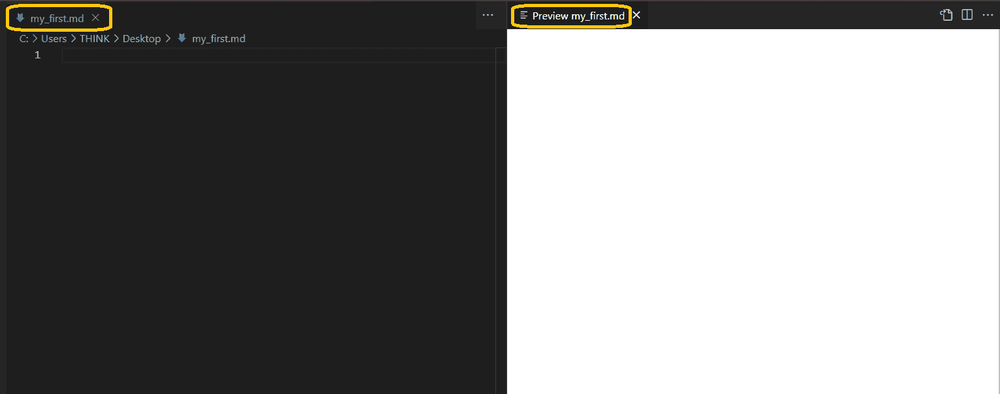
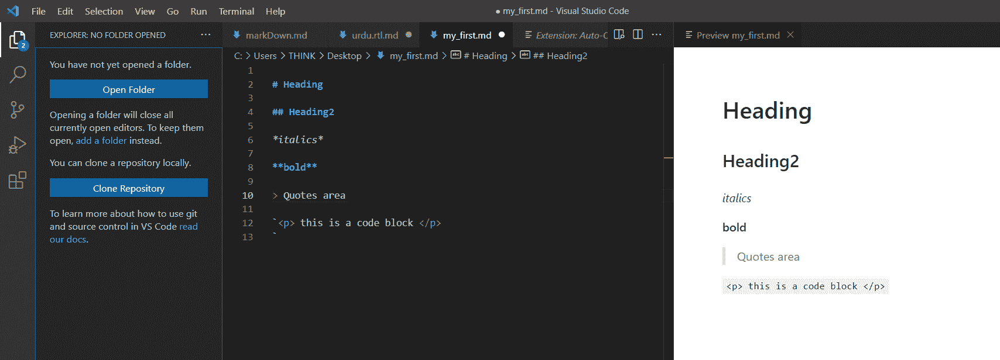
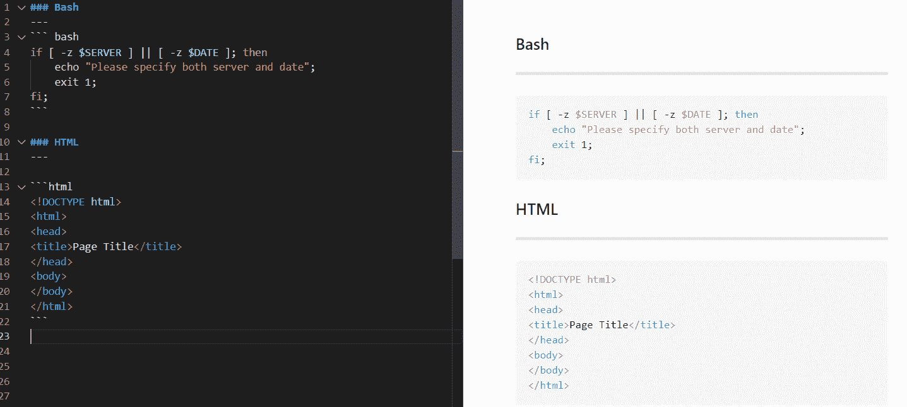
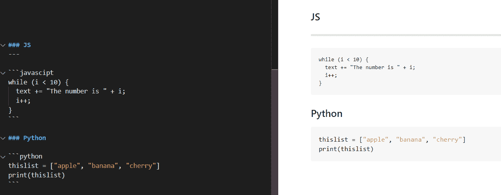

# 减价备忘单——如何用例子写减价

> 原文：<https://www.freecodecamp.org/news/markdown-cheat-sheet/>

Markdown 之所以广受欢迎，是因为它易于使用，并且在各种平台上被广泛接受。

您可以使用 markdown 来编写可以用纯文本传达的内容。博客帖子就是一个很好的例子。

在本文中，您将了解什么是降价以及如何使用它。

## 什么是降价？

Markdown 是一种像 HTML 一样的标记语言。我们用它来解析文本并将其转换成特定的格式。你也可以把它想象成一个文本到 HTML 的转换工具。

许多开发人员喜欢用 markdown 编写，因为这给了他们对文本和代码的细粒度控制。我们将在接下来的段落中看到如何以及为什么。

## 在本指南中，我们将涵盖以下主题。

*   如何创建你的第一个降价文件？
*   为减价创建备忘单
*   讨论如何在 VS 代码中呈现 markdown

## 支持降价的工具

Markdown 可以在任何浏览器中工作，即使你使用一个简单的记事本。但是有一些工具可以通过并排提供实时视图(markdown 和富文本)来帮助提高您的生产力。

以下是一些支持使用 markdown 的工具:

*   VSCode(我们将在本文中讨论这一点)
*   原子
*   哈罗帕德
*   崇高的文本
*   标记板

## 如何使用减价

### 下载 VSCode 并启用插件

VSCode 是一个类似记事本的文本编辑器，但是它有更多的功能。你也可以用它来编码，它支持多种编程语言。

我们将使用 VSCode 来编写和呈现 markdown 文件。

你可以从[这里](https://code.visualstudio.com/download\)下载 VSCode。

下载完成后，激活以下扩展:

VS code extension

### 如何创建你的第一个减价文件

要使用 markdown，只需用扩展名`.md`保存文本文件。之后，您将能够应用降价语法。

创建文件并激活插件后，工作区应该看起来像这样。

### 降价行动

在 markdown 中，我们使用特定的语法来表示标题、粗体文本、列表和其他文本格式。

有关基本降价语法的概述，请参考下表:

| 工作 | 降价语法 |
| --- | --- |
| 标题 1 | # |
| 标题 2 | ## |
| 标题 3 | ### |
| 斜体字 | *斜体* |
| 大胆的 | **粗体* * |
| 罢工 | ~~插入文字~ ~ |
| 批量报价 | > |
| 链接 | [链接名称](link.com) |
| 无序列表 | *列表项目*列表项目 |
| 码组 | `在此插入代码' |

只需开始在您的`.md`文件中写入内容，然后并排查看结果。

### 如何在 Markdown 中编写代码块

在 VSCode 中，许多编程语言都有语言支持。

这里有一些用不同语言编码的例子。

【HTML 和 Bash 的代码块

**Python 和 JS 的代码块**

### markdown 中的转义字符

如果您希望浏览器忽略语法并保留字符，可以使用反斜杠`\`对字符进行转义。

例如，\*不会将后续字符解析为斜体。

## 降价的实际应用

您可以在电子邮件模板中使用 markdown，它非常适合技术文档。

GitHub README.md 文件是 markdown 的一个很好的例子。在那里，代码块很容易与格式良好的文本结合在一起。

## 下载减价备忘单

我已经把你在这里学到的所有技巧都整理在一张小抄里了。

你可以点击下载备忘单[。](https://github.com/zairahira/Markdown-cheatsheet/blob/main/README.md)

## 包扎

到目前为止，我希望你有足够的信心来写你自己的降价。一旦你掌握了窍门，就很容易了。除了简单之外，它还非常强大，被广泛接受。

如果你觉得这篇文章有帮助，请分享:)

看看我的其他[博客帖子。](https://www.freecodecamp.org/news/author/zaira/)让我们在[推特](https://twitter.com/hira_zaira)上连线。