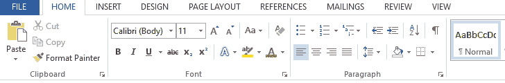
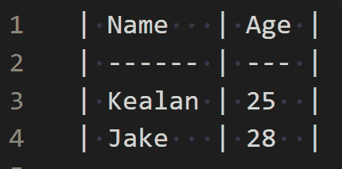

# 减价备忘单——如何用减价语言写文章

> 原文：<https://www.freecodecamp.org/news/markdown-cheatsheet/>

作为一名开发人员，你可能听说过 [HTML](https://en.wikipedia.org/wiki/HTML) ，它代表**H**yper**T**ext**M**arkup**L**语言。

你可能知道 HTML 是一种用来创建网站的语言——但是**标记**是什么意思呢？

[标记语言](https://techterms.com/definition/markup_language)是使用标签来定义文本文档中不同元素的语言。大多数人都熟悉**富文本编辑器**——允许用户向他们的文档添加额外的格式、图像和链接的程序。



A screenshot of the GUI of the Microsoft Word software (a Rich Text Editor).

但是标记语言使用标签，比如:

*   是一个段落标签。
*   使文字加粗。

像 [XML](https://en.wikipedia.org/wiki/XML) 、 [HTML](https://en.wikipedia.org/wiki/HTML) 以及本文主题: **Markdown** 这样的标记语言还真不少。

开发人员通常将 markdown 用于文档——并且它通常包含在大多数存储库中。比如我用 markdown 在 freeCodeCamp 上写的这篇文章。

因此，让我们来看看我们能用降价做些什么。

**免责声明:**没有统一的机构或规范来标准化降价，只有一些被广泛接受的最佳实践。因此，根据您在这个备忘单中使用的 markdown 解析器，您的收获可能会有所不同。

# 减价备忘单

以下是在 markdown 中操作文本的一些最常用的方法。

# 如何在 Markdown 中创建标题

有六次低射头球，H1 彻底传给了 H6。我将向您展示它是如何可视化显示的，以及您使用 markdown 创建它的方式。

H1 的是最大的，通常是“主要”头球，H1 之后的每个头球都会变小。

# H1 标签

`# H1 tag`

## H2 标签

`## H2 tag`

### H3 标签

`### H3 tag`

#### H4 标签

`#### H4 tag`

##### H5 标签

`##### H5 tag`

###### H6 标签

`###### H6 tag`

# 如何在 Markdown 中添加排版强调

你通常用粗体、斜体和删除线来强调文本。过多的强调会使单词变得不清楚，所以要仔细选择你想要如何强调每一个文本。

例如，你也可以用下标和上标符号来书写各种化合物的名称。你也可以用它们作为数学符号的一部分。

**如何使文本加粗:**

在文本周围添加双星号。它会使文本显示为粗体。像这样:`**Bold text**`

*如何让你的文字变成斜体:*

在文本周围添加单个星号，使其以斜体显示，如下:`*Italics*`

如何~~删除~~某些文本:

如果你想在文本中“划掉一些东西”，使用删除线方法，就像这样:`~~Strike through~~`。

### 如何在 Markdown 中写下标

例如，如果你想写水的化学符号，你可以通过键入`H~2~0`来做一个下标“2”。

这导致:H [2] 0。

### 如何在 Markdown 中写上标

假设你想写一个指数或者上标。你这样做:`X^2^`结果是:X ² 。

# 如何在 Markdown 中制作清单

markdown 中有多种类型的列表。例如，可以有有序列表和无序列表。

当你想按照一定的顺序执行步骤时，通常使用有序列表(比如按照食谱:烹饪鸡肉...上菜)。但是无序列表适用于不需要顺序步骤的东西，比如菜谱(比如购物清单)。

### 如何在 Markdown 中制作无序列表

这就是无序列表的样子。

*   辣椒油
*   米
*   葱

这就是你如何在 markdown 中创建它:

```
- Chili oil
- Rice
- Spring onions
```

### 如何在 Markdown 中制作有序列表

这是有序列表的外观。

1.  第一次
2.  第二项

这就是你如何在 markdown 中创建它:

```
1\. First item 
2\. Second item
```

# 如何在 Markdown 中创建链接

在 markdown 文档中链接事物的两种最常见的方式是通过超链接或图像。两者都有助于让你的文章更清晰、更有说服力，应该在适当的时候使用。

下面是文本中超链接的样子:

[凯阿兰的网站](https://www.kealanparr.com)

下面是你如何在 Markdown 中创建链接:

`[Kealan's site](https://www.kealanparr.com)`

您将想要链接的文本放在方括号中(这里是“Kealan 的站点”)，然后在它们后面紧跟包含 URL 的括号。

假设您想在文章中包含一张图片。让它看起来像这样:


您只需使用以下符号:

```

```

它类似于一个普通的链接，但是你要在括号前加上感叹号。

## 如何在 Markdown 中使用 HTML

您可以在 Markdown 文档中使用常规 HTML(取决于正在使用的解析器)。

所以请随意输入你喜欢的任何有效的 HTML。

## 如何在 Markdown 中添加间距

如果您想添加一条水平线来分隔文档的各个部分，您可以这样做:

* * *

像这样用三个破折号:

```
---
```

## 如何在 Markdown 中创建表格

表格在你的文章中会派上用场。要制作如下所示的表格:

| 名字 | 年龄 |
| --- | --- |
| 凯阿兰 | Twenty-five |
| 上等的 | Twenty-eight |

这是你会用到的符号:

```
| Name   | Age |
| ------ | --- |
| Kealan | 25  |
| Jake   | 28  |
```

在制作减价表时，你必须意识到的唯一真正的“陷阱”是保持竖线(|)垂直对齐。然后你的减价表就会出现在本文中。一个更清晰的图像是:



A markdown table is displayed, with Name and Age as the headers and Kealan, Jake and 25 & 28 as the values.

## **如何在 Markdown 中添加代码和语法**

例如，如果您正在为开发人员创建文档，那么在 markdown 中添加代码片段会非常有用。

下面是一个非常简单的 JavaScript 例子，但是几乎所有的现代编程语言都被支持(语法高亮等等)。

```
console.log('example log')
```

` ` JavaScript
console . log('示例日志')
` '

只需键入三个反勾号，后跟编程语言，然后回车开始编写代码。用三个反勾号结束代码块。

# 如何在 Markdown 中添加报价

当你引用别人的作品时，称赞他们是合乎情理的，也是礼貌的。一个简单的方法就是引用他们。

如果您想在 markdown 中添加报价:

> “这是一段引语，来自一个非常聪明的人”——匿名

只需添加这个符号，它就像上面的引用一样:

`> "This is a quote, from someone who is very wise" - Anonymous`

# 结论

我希望这对你是一个有用的参考，并且你已经学会了你以前没有见过的 markdown 的一个新特性。

还有更多的特性(甚至没有计算您可以创建的所有 HTML 变体)，但是本文已经涵盖了最常用的特性。