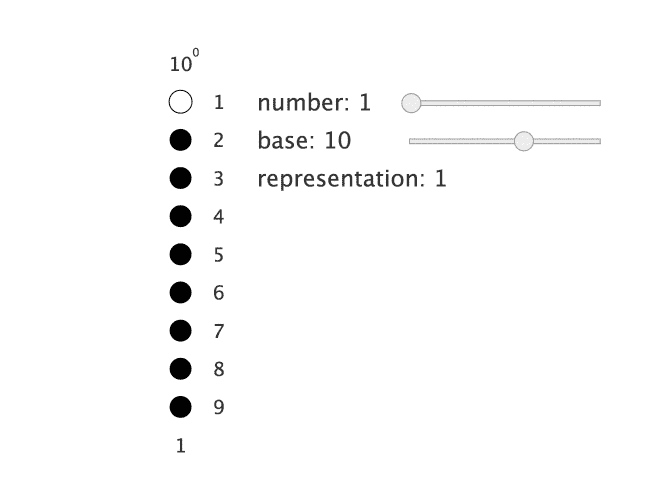
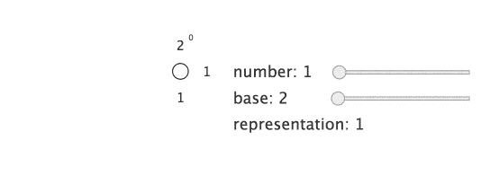
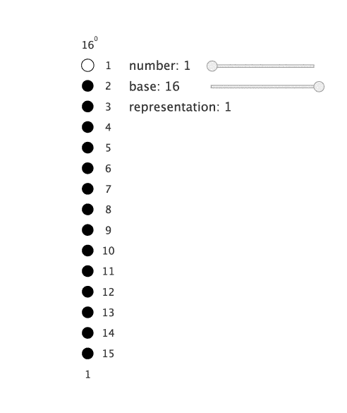
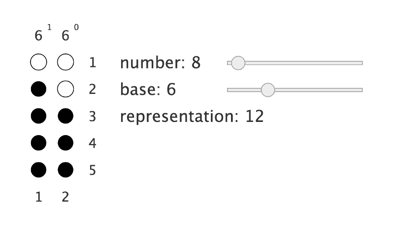
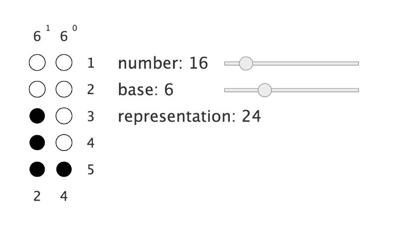
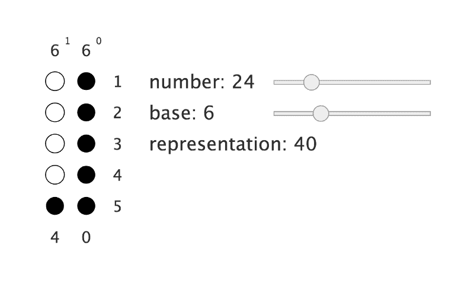

# 火星数学

> 原文：<https://www.freecodecamp.org/news/martian-math-812a029e2ea0/>

切特·科尔科斯

# 火星数学

我们将通过解开我最喜欢的一个谜语来探索数字系统。

> 你是第一个登上火星的探险家，你发现了一个刻在岩石上的数学方程式:12 + 24 = 40。火星人有几根手指？

我喜欢这个谜语，因为它让你重新思考你对数字的全部理解。这也表明了学校数学教学方式的一个问题——我们被教导如何通过考试，而不是教授基本的理解。因此，我们停留在对简单概念如数字的肤浅理解上！不过说教够多了，还是学点东西吧。

从概念上讲，数字只是数量，但我们如何表示这些数量可以有所不同。我们通常用十进制来表示数字。这意味着数字中的每一位都代表 10 的幂。也就是说，数字 123 代表 1×10 + 2×10 + 3×10⁰.然而，*有可能*使用不是基于 10 的幂的数字系统。很难想象生活在一个使用非十进制数字系统的世界，但在现实中，数字的表示方式是完全任意的！那么，为什么我们要使用以 10 为基础的数字系统呢？你猜对了——我们有 10 根手指！

这是一个以 10 为基数的数字系统如何工作的一个小小的形象化例子。请注意，每当一列填满时，我们会在下一列中再增加一列。

这种看待数字的方式的美妙之处在于，数量的概念对于所有的数字系统都是自然的，而不仅仅是以 10 为基数的。所以让我们探索一些其他的数字系统。

计算机用二进制表示数字，二进制是以 2 为基数的数字系统。这是相同的概念，除了不是在 9 个点填满后滚动到下一列，而是在 1 个点后滚动。

程序员经常使用十六进制的数字系统来表示数字。他们这样做是因为二进制不是很紧凑——需要 4 个二进制数字来表示数字 16——并且因为 16 是 2 的幂，这使得两种数字系统之间的转换很容易。

因为当我们写出一个像 12 这样的数字时，如果它只代表一位，那会很奇怪，所以我们通常在 9 之后开始向上计数。即 *A* 代表 10， *B* 代表 11， *C* 代表 12，以此类推。

现在是我们的谜语！第一，看你自己想不明白。如果你愿意，你可以[自己使用可视化工具](http://aprt.us/editor/?load=https://gist.githubusercontent.com/ccorcos/5bae90fda25c82f924cd59c475608f30/raw/c39ecec1e3ccb2e79b7f6a8f665ab80f6962a8ff/Number%2520System.json&fullScreen=1)。

我已经给了你一个很大的提示——我们有一个基于 10 的数字系统，因为我们有 10 个手指！因此，如果我们能找到一个数系，其中那些*符号*代表满足等式的*数*，那么我们就解决了这个谜题。

有一种更直接的方法可以找到答案，但是让我们用我们的好朋友“猜一猜”既然每个流行文化中的每个火星人都有 6 个手指，让我们试试吧。

我们来回忆一下等式做参考:12 + 24 = 40。

如你所见，在以 6 为基数的数字系统中，8 代表 12。那是因为 8 = 1×⁶ + 2×⁶⁰.

在这里，你可以看到在以 6 为基数的数字系统中，16 被表示为 23。

最后，在以 6 为基数的数字系统中，24 表示为 40。因此，如果我们将这个等式转换成以 10 为基数的数字系统，我们将得到 8 + 16 = 24。所以这个谜题有了答案——火星人有 6 根手指！

很难理解这个方程，因为这就是我们学习机械解决数学问题的方式。但是我们实际上每天都在使用非十进制的数字系统。我打赌这个等式对你来说很有意义:0:30 + 1:45 = 2:15。时间是一个非十进制数字系统的完美例子。如果你住在美国，不得不使用我们糟糕的测量系统，你会发现到处都是奇怪的数字系统。

最终，我希望您从本文中获得的是对数量等概念和我们用来编码这些概念的符号表示之间的差异的理解。像这样微妙的概念比在纸上把两个数字相加的死记硬背要重要得多。

附:检查[器械](http://aprt.us/)！这是一款创建交互式图表的神奇软件。

如果你对这类东西感兴趣，你可能会喜欢阅读我每周的时事通讯，里面有我觉得有趣的东西。你可以[在这里](http://news.chetcorcos.com/)订阅。