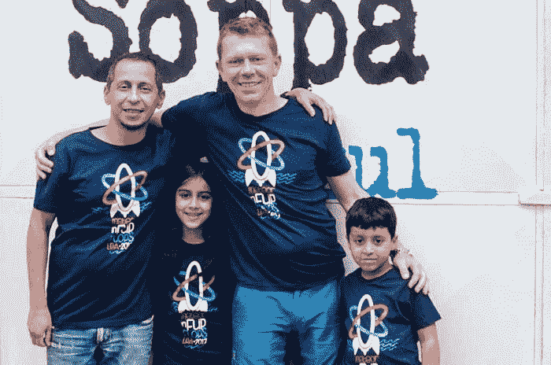
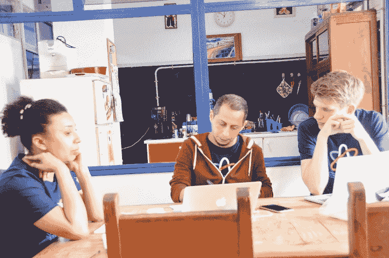
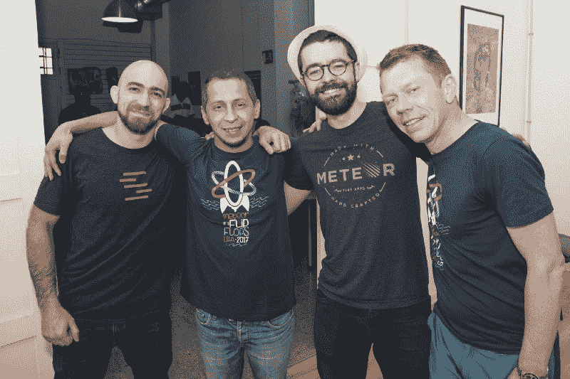

# 马尔万的故事:从开发者到难民

> 原文：<https://www.freecodecamp.org/news/marwans-story-from-developer-to-refugee-ddf73199253e/>

萨沙·格里菲

# 马尔万的故事:从开发者到难民

上个月，我有机会参加了大加那利岛拉斯帕尔马斯的一个编码训练营。

如果你不熟悉这个概念，训练营是一个专注于学习新技术的强化课程——在这种情况下， [GraphQL](http://graphql.org) 和 [Apollo](http://apollostack.com) 在 [Meteor](http://meteor.com) 应用的背景下。哦，我有没有提到这个故事发生在摩洛哥海岸的一个美丽的小岛上？

我是以导师的身份参加训练营的，所以我提前几天到了那里。一天，当新的与会者开始到达时，我遇到了一个我以前没有见过的学生。由于已经快中午了，我很自然地邀请他和他的家人(他由他的两个孩子陪着)和我以及我的妻子一起吃午饭。

Hard at work leaning Apollo and GraphQL

我当时并没有意识到，但在那短暂的一瞬间，我已经对我的新朋友做了很多假设。因为他参加了一个编码训练营，他可能是一个有着相当稳定工作的程序员伙伴。因为他会说西班牙语，还带着两个年幼的孩子，我猜想他一定是当地的一名开发人员，在参加夏令营的时候，一直在做保姆的工作。

但是，一旦马旺开始告诉我他的故事，这些假设很快就破灭了。

### 马尔万的故事

Marwan Ghabin 的确是一名程序员。事实上，他是一个相当成功的人，之前在利比亚拥有自己的公司。但我很快了解到战争改变了这一切:因为这场冲突，Marwan 不仅失去了他的公司，还失去了他的家，甚至是亲密的朋友和家人。

他现在和他的两个孩子持临时签证在西班牙以难民身份生活，一边攻读博士学位，一边打零工支付账单。但是现在，他的签证快到期了，他无处可去。训练营的组织者 Maciej 邀请他免费参加，同时他想出了下一步的计划。

### 让它成真

我们一直听说全球难民危机，但在那之前，它对我来说一直是遥远和抽象的，我很难理解。毕竟，典型的难民一无所有，而我有一份工作，一个银行账户，一个家庭…

然而，遇见马旺让我意识到，所有这些我认为理所当然的东西都可能在一夜之间被夺走。也许我们站立的地方并不总是像我们想象的那样坚实…

From left to right: me, Marwan, Xavier, and Maciej

### 你能提供什么帮助

现在，我很抱歉把马旺降为难民。毕竟，他没有让他的不幸来定义他，所以我觉得把这么多的注意力放在他生活的这个单一方面是不公平的。

但我今天写这些的原因是马旺和他的孩子的时间不多了。他的签证很快就要到期了，在那之后，他要么不得不回到利比亚，面临酷刑甚至死亡，要么像其他许多人一样被困在难民营的地狱边缘。或者他可以作为一个非法移民试试运气，剥夺他的孩子稳定生活和教育的机会。

好消息是可能有出路:如果马尔万能在西班牙或欧洲其他地方找到一份为期一年的程序员合同，他可能会留下来。

也许你可以做点什么。Maciej 已经建立了一个网站，在那里你可以了解更多关于 Marwan 的信息，并找到如何提供帮助:

#### [helpmarwan.org](http://www.helpmarwan.org/)

我知道，与全球数百万流离失所的家庭相比，这可能只是沧海一粟。但至少写这个帖子和传播 Marwan 的故事是我能为真正需要帮助的人做的具体事情。也许这是一个开始。