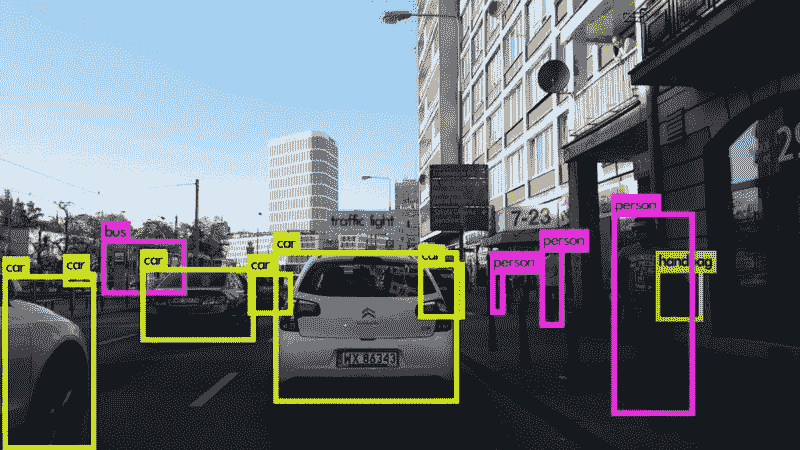
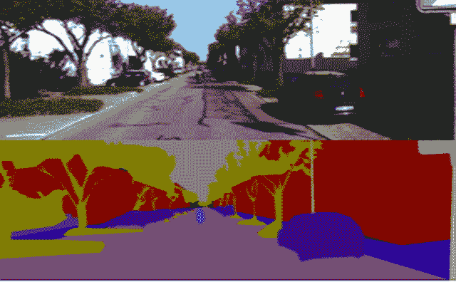
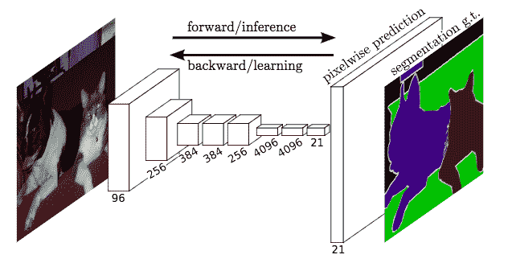
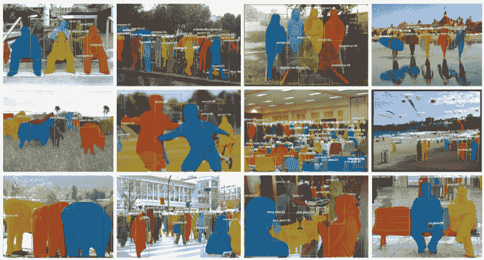
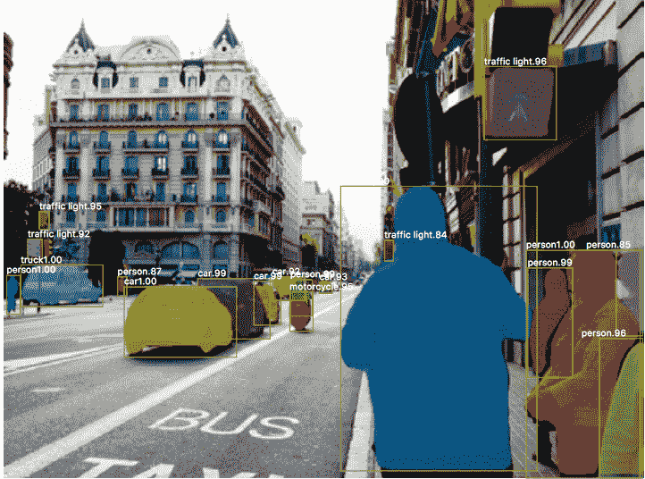
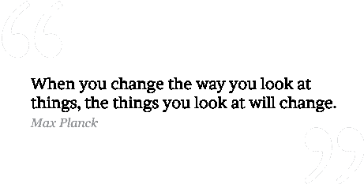

# 深度学习的最新进展:Mask R-CNN 简介

> 原文：<https://www.freecodecamp.org/news/mask-r-cnn-explained-7f82bec890e3/>

#### 介绍

从我作为一名时间旅行者的经历来看，我可以自信地说，自动驾驶现在/过去/将来都会成为时尚。从数学上来说，围绕计算机视觉的宣传作为普朗克时间迭代指数的函数呈指数增长。开玩笑的。

无论如何，在这篇文章中，我们将深入研究深度学习在计算机视觉方面的一些最新发展，并最终建立一个名为“Mask R-CNN”的模型。这篇文章应该是相当直观的，但我希望你知道一些更基本的计算机视觉模型。如果你认为你准备好了，让我们开始吧。

### 对象检测、语义分割和实例分割

在这篇文章中，我假设你熟悉基本的深度学习任务和特定于计算机视觉的模型，如卷积神经网络(CNN)、图像分类等。如果这些术语对你来说听起来像是行话，那就继续读这篇文章吧。

好了，现在让我们继续有趣的事情。除了我们大多数人在深度学习过程中建立的传统的狗与猫分类器，我们还可以利用神经网络的相同想法做更多的事情。

例如，我们可以训练 CNN 告诉我们图像的哪一部分说服了它做出决定，而不是仅仅告诉我们图像中有什么。要了解这为什么有用，一定要看看这个 [Ted 演讲](https://www.youtube.com/watch?v=TRzBk_KuIaM)。这可以通过让 CNN 在对象周围画一个方框来实现，如下图所示:

Source: [https://i.ytimg.com/vi/EhcpGpFHCrw/maxresdefault.jpg](https://i.ytimg.com/vi/EhcpGpFHCrw/maxresdefault.jpg)

在深度学习语言中，这个任务被称为对象检测，并且它真的相当容易实现。首先，在准备数据时，我们需要使用工具在图像周围绘制边界框。使用免费的在线工具很容易做到。然后，我们将 CNN 的最终/输出图层更改为 softmax 图层，该图层具有 4 + k 个输出-边界框的 x 坐标、边界框的 y 坐标、边界框的高度、边界框的宽度以及 k 个类的类概率分数。

你可能会问的第一件事是，为什么我们选择奇怪的东西来学习，比如 x，y 坐标和高度，宽度。我们不能只学习盒子每个角的(x，y)坐标吗？嗯，我们可以——但是，如果我们学习 4 对变量，我们必须学习总共 8 个来表示盒子。但是，如果我们使用这种技术，我们只需要使用 4。

我们可以解决的另一个有趣的任务是语义分割。再说一次，这只是一个花哨的词，指的是像儿童涂色书中那样给图像着色。

Source: [http://adas.cvc.uab.es/elektra/wp-content/uploads/sites/13/2016/05/CVC10_Frame3.png](http://adas.cvc.uab.es/elektra/wp-content/uploads/sites/13/2016/05/CVC10_Frame3.png)

与对象检测的情况类似，可以使用免费工具来手动给图像着色，这被用作准备数据集的基本事实示例。在这里，我们的神经网络被训练成将输入图像中的每个像素映射到特定的类。粗略地说，可以通过使用一种叫做全卷积网络(FCN)的东西来实现。这个网络只是一系列卷积层。

Source: [https://cdn-media-1.freecodecamp.org/images/1*wRkj6lsQ5ckExB5BoYkrZg.png](https://cdn-media-1.freecodecamp.org/images/1*wRkj6lsQ5ckExB5BoYkrZg.png)

因此，FCN 将学习(通过深度学习的神秘黑暗艺术)从输入图像到它的“彩色”版本的映射，这突出了图像中的不同类别。

需要注意的一件重要事情是，语义分段并没有不同地突出一个类的单个实例。例如，如果一幅图像中有 3 头奶牛，模型会突出显示它们所占据的区域，但它无法区分每头奶牛。如果我们想要添加这个功能，我们需要扩展任务，并引入另一个术语来使深度学习已经非常庞大的词汇变得复杂——实例分割。

好吧，其实也没那么糟，对吧？这个术语很容易理解。我们的目标是分割或分离图像中一个类的每个“实例”。这将有助于您了解我们正在努力实现的目标:

Source: [https://cdn-media-1.freecodecamp.org/images/1*lMEd6AcDmpH0mDzBHyiERw.png](https://cdn-media-1.freecodecamp.org/images/1*lMEd6AcDmpH0mDzBHyiERw.png)

我们用来解决这个问题的实际模型实际上比你想象的要简单得多。实例分段基本上可以通过两个步骤解决:

1.  执行一个版本的对象检测，在类的每个实例周围绘制边界框
2.  对每个边界框执行语义分割

这个惊人的简单模型实际上表现得非常好。这是可行的，因为如果我们假设步骤 1 具有高精度，那么步骤 2 中的语义分割提供了一组图像，这些图像保证只有一个主类的实例。步骤 2 中模型的工作是只接受一个只有一个主要类别的图像，并预测哪些像素对应于主要类别(猫/狗/人等)。)，以及哪些像素对应于图像的背景。

另一个有趣的事实是，如果我们能够独立解决多包围盒问题和语义分割问题，我们也基本上解决了实例分割的任务！好消息是，已经建立了非常强大的模型来解决这两个问题，并且将这两者放在一起是一个相对琐碎的任务。

这个特殊的模型有一个名字——Mask R-CNN(“区域卷积神经网络”的缩写)，它是由脸书人工智能研究团队(FAIR)在 2017 年 4 月建立的。

Mask R-CNN 的工作原理也非常简单。他们(研究人员)所做的只是将两个先前存在的艺术模型缝合在一起，并与线性代数(简而言之，深度学习研究)一起玩。该模型可以大致分为两个部分——区域建议网络(RPN)和二元掩模分类器。

第一步是获得一组可能包含相关对象的边界框。今天的热门词汇是 RoI Align。RoI Align 网络的工作原理是对象检测(上面讨论过，你已经忘了吗！)，但是它输出多个*可能的*边界框，而不是一个确定的边界框。这些框使用另一个回归模型来细化，我们在这里不讨论。更多关于 RoI Align 网络的详细信息，请点击[这里](https://medium.com/@steve101777/roi-pooling-and-roi-align-dd13bfece1df)。

第二阶段是实际上*做*上色。与人们可能认为的相反，这一步也很容易！你所需要做的就是将现有的语义分割模型应用到每个边界框中。酷的部分是，由于我们保证每个盒子中最多有 1 个类，我们只是像二进制分类器一样训练我们的语义分割模型，这意味着我们只需要学习从输入像素到 1/0 的映射。1 代表物体的存在，0 代表背景。然后，为了增加趣味性，我们可以对映射到 1 的每个像素进行着色，以获得看起来很时髦的结果，如下所示:

Source: [https://cdn-media-1.freecodecamp.org/images/1*E_5qBTrotLzclyaxsekBmQ.png](https://cdn-media-1.freecodecamp.org/images/1*E_5qBTrotLzclyaxsekBmQ.png)

#### 结论

这项技术的应用非常广泛。一些更有利可图的用例包括动作捕捉、自动驾驶和监控系统。但是我们将把这项技术的所有应用留在读者的脑海中。

在很大程度上，实例分割现在是完全可以实现的，现在是时候开始思考创新的方法来使用这种在像素级别上进行计算机视觉算法的想法了。一个很好的例子就是一个叫做 DensePose 的很酷的新算法。由于某种未知的原因，这种模式没有得到很多媒体的关注。但是势大于黑洞的引力！

简而言之，把 DensePose 想象成廉价的 kinect。它基本上可以做任何先进的运动捕捉系统可以做的事情，而成本只是一小部分。理论上，你可以在 10 美元的设备上运行这个模型，比如 raspberry pi！

从理论的角度来看(也就是更酷的那个)，这项技术可以扩展到其他类型的神经网络(除了 CNN 和 FCNs)。这里的主要思想是获取一些数据的最基本部分(在这种情况下是一个像素)，并决定它对整体结构的贡献。

假设，我们可以对信号中的每个样本进行分类，并决定它对音乐序列的贡献。如果我们更有雄心，我们可以识别音乐序列中最吸引人的部分，并将其与其他歌曲中吸引人的部分相结合，从而以一种新颖的方式将我们最喜爱的歌曲融合在一起！

更严肃地说，我们可以对更重要的数据使用相同的技术。例如，我们可以训练一个 Mask R-CNN 模型来突出 MRI 扫描的哪些*确切的*区域与某些行为/心理模式相关，或者哪些 DNA 子序列对应于一些特定的特征，这可能会导致医学人工智能的突破。

Mask R-CNN 模型的核心是将数据分解成最基本的构件。作为人类，我们看待世界的方式存在固有的偏见。另一方面，人工智能有潜力以我们人类甚至无法理解的方式看待世界，正如一位掌握了寻找最基本真理的艺术的人曾经说过的那样:

