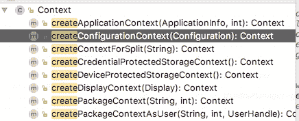

# 掌握 Android 环境

> 原文：<https://www.freecodecamp.org/news/mastering-android-context-7055c8478a22/>

作者:高拉夫

# 掌握 Android 环境

Android 中的上下文是使用和滥用最多的对象之一。但是网络上的大多数文章都集中在它是什么的定义上。我找不到给我洞察力和帮助我理解更大图景的好资源。所以我试着用这篇文章简化事情。


Which Context to use? Image Credit: Pexels

### 前言

我这篇文章的任务是帮助你掌握 Android 环境。这是 Android 开发的核心主题之一，几乎没有任何开发人员完全按照设计的方式使用上下文。

我最初在我的[网站](https://gaurav-khanna.in/)上发表了这篇文章，共四篇。如果你有兴趣一章一章地阅读，[可以在那里随意阅读](https://gaurav-khanna.in/blogs/android/mastering-android-context/)。

### 入门指南

你有没有遇到过这样的问题:`getContext()`、`this`、`getBaseContext()`、`getApplicationContext()`有什么区别？如果是的话，这篇文章将有助于澄清你的大部分困惑。

**注意:**你应该知道 Android 开发的基础知识，比如活动、片段、广播接收器和其他构建模块。如果你是一个刚刚开始 Android 世界之旅的新开发者，这可能不是最好的起点。

### 背景到底是什么？

让我们面对现实吧，上下文是 Android API 中设计最差的特性之一。你可以称它为“上帝”物体。

Android 应用程序或应用程序包套件(APK)是一个组件包。这些组件在清单中定义，主要由活动(UI)、服务(后台)、广播接收方(动作)、内容提供方(数据)和资源(图像、字符串等)组成。

开发人员可以选择使用意图过滤器向系统公开这些组件。例如:发送电子邮件或分享图片。他们也可以选择只向应用程序的其他组件公开组件。

类似地，Android 操作系统也被设计为公开组件。一些著名的是 WifiManager、振动器和 PackageManager。

上下文是组件之间的桥梁。您使用它在组件之间通信、实例化组件和访问组件。

#### **您自己的组件**

我们使用上下文来实例化包含活动、内容提供者、广播接收者等等的组件。我们也用它来访问资源和文件系统。

#### **您的组件和一个系统组件**

上下文充当 Android 系统的入口点。一些常用的系统组件是 WifiManager、振动器和 PackageManager。您可以使用`context.getSystemService(Context.WIFI_SERVICE)`访问 WifiManager。

同样，您可以作为操作系统中的用户，使用上下文来访问应用程序专用的文件系统。

#### **你自己的组件和其他应用的组件**

如果您使用意图过滤方法，那么您自己的组件和其他应用程序组件之间的通信几乎是相同的。毕竟每个组件在安卓都是平等的公民。

下面是一个用于发送电子邮件的意图示例。所有提供这个意图动作的组件都将提供给用户，用户可以选择使用什么。
`Intent emailIntent = new Intent(android.content.Intent.ACTION_SEND);`

#### 摘要

让我们认同 Android 中的一切都是组件。上下文是组件之间的桥梁。您使用它在组件之间通信、实例化组件和访问组件。我希望这个定义现在已经很清楚了。

### 不同类型的上下文

有很多方法可以让你抓住上下文(**糟糕的设计被发现**)。

大多数情况下，当我们需要上下文时，我们会使用以下选项之一:

```
- Application instance as context- Activity	- Instance of your activity (this)	- getApplicationContext() in Activity	- getBaseContext() in Activity- Fragment	- getContext() in Fragment- View	- getContext() in View- Broadcast Receiver	- Context received in broadcast receiver- Service	- Instance of your service (this)	- getApplicationContext() in Service- Context	- getApplicationContext() in Context instance
```

我把上下文类型分为两类: **UI 上下文**和**非 UI 上下文**。这种区别会帮助你更好地理解`*n-ways*`。

#### UI 上下文

实际上，只有 [ContextThemeWrapper](https://developer.android.com/reference/android/view/ContextThemeWrapper) 是 UI 上下文——这意味着**上下文+你的主题**。

活动扩展`ContextThemeWrapper`。这就是为什么当你展开任何 XML 时，你的视图都是主题化的。如果你用非用户界面的上下文来扩展你的布局，你的布局将不会被主题化。来吧，试试看。

当您使用 Activity 作为上下文的占位符时，您肯定会使用 UI 上下文。如果您从 Fragment 中使用 getContext 方法，您就间接使用了 activity(如果您通过 Activity 中的 fragmentManager 附加了 Fragment)。

但是`view.getContext()`不保证是 UI 上下文。

如果视图是使用 Layout Inflater 实例化的，并传递了 UI 上下文，则可以获得 UI 上下文。但是，如果它是通过不传递 UI 上下文来实例化的，则可以获得另一个上下文。

```
UI Context- Activity	- Instance of your activity (this)- Fragment	- getContext() in Fragment- View	- getContext() in View (if View was constructed using UI-Context)
```

#### 非用户界面上下文

除了 UI 上下文之外的任何内容都是非 UI 上下文。从技术上讲，任何不是 ContextThemeWrapper 的东西都是非 UI 上下文。

非 UI 上下文被允许做**几乎**UI 上下文可以做的一切事情(**发现了**糟糕的设计)。但是正如我们上面指出的，你失去了主题。

```
Non-UI Context- Application instance as context- Activity	- getApplicationContext() in Activity- Broadcast Receiver	- Context received in broadcast receiver- Service	- Instance of your service (this)	- getApplicationContext() in Service- Context	- getApplicationContext() in Context instance
```

**提示**:除了应用程序上下文，所有的上下文类型都应该是短命的。这是您从应用程序类或使用`getApplicationContext()`方法(当您有上下文访问权时)获得的。

#### 摘要

我们通过将上下文放在两个桶中来简化它。UI Context 是 Context + Theming，从技术上讲，任何属于`ContextThemeWrapper`子类的类都属于这个范畴。非 UI 上下文是所有其他类型的上下文。

### 在哪里使用什么

问题出现了:如果你在错误的地方使用上下文，什么会出错？以下是几个场景:

#### 场景 1

假设您正在展开一个布局，并且使用了非 UI 上下文。什么可能出错？在这种情况下你可以猜测:你不会得到一个主题化的布局。还不错吧。这是可以忍受的。

#### 场景 2

您将 UI-Context 传递到某个地方，在那里它只需要资源访问或文件系统访问。能有什么不对？简而言之:没有。记住，UI-Context = Context + Theme。它会很乐意作为你的背景。

#### 场景 3

您将 UI-Context 传递到某个地方，在那里它需要的只是资源访问或文件系统访问**，但是**这是一个后台的长时间操作。比如下载一个文件。现在什么会出错呢？简单回答:内存泄漏。

如果幸运的话，下载很快完成，对象被释放，一切正常。阳光明媚，鸟儿啁啾。这是开发人员最常犯的错误之一。他们将 UI-Context 的引用传递给长期存在的对象，有时它没有副作用。

然而，有时 Android 想要为你的下一个组件的需求或另一个组件的需求要求内存，哇！！！您的应用程序内存不足。别担心，我会解释的。

#### 内存泄漏或崩溃！就是这样。

是的，当你在错误的地方使用上下文时，这是最坏的情况。如果你是应用程序开发世界的新手，让我分享一些智慧。内存泄漏与你的经验成反比。每个 Android 开发者都有内存泄露的时候。这样做并不可耻。

羞耻是当你再次重复错误，并以同样的方式泄露。如果你每次都以不同的方式泄漏内存，那么恭喜你正在成长。我已经用一个小故事[解释了什么是内存泄漏。](https://gaurav-khanna.in/blogs/android/mastering-android-context/chapter-3/)

#### 好的，我明白了，但是这里上下文的关系是什么？

大声说出来，“发现坏设计”。

Android 中的几乎所有东西都需要访问上下文。天真的开发人员传递 UI 上下文，因为这是他们非常容易访问的内容。它们将短期上下文(通常是活动上下文)传递给长期对象，在内存/资金返回系统之前，它们遇到了危机。哇哦。！！

处理这个问题最简单的方法是使用异步任务或广播接收器。但是讨论它们不在本文的范围之内。

#### 摘要

*   你需要访问 UI 相关的东西吗？使用用户界面上下文。膨胀视图和显示对话是我能想到的两个用例。
*   否则，使用非 UI 上下文。
*   确保不要将短寿命的上下文传递给长寿命的对象。
*   传递知识，帮助人们，种树，请我喝杯咖啡。

### 提示和技巧

`this`、`getApplicationContext()`、`getBaseContext()`有什么区别？

这是每个 Android 开发者在生活中都会遇到的一个问题。我会尽量简化。让我们后退一步，重温一下基础知识。

我们知道移动设备中有许多因素。例如，配置一直在变化，语言环境可以显式或隐式地变化。

所有这些变化都会触发应用程序进行重新创建，以便它们能够选择与当前配置最匹配的资源。纵向、横向、平板、中文、德文等等。你的应用需要最好的资源来提供最好的用户体验。负责提供那些最佳匹配资源的是上下文。

试着回答这个问题:
用户的配置目前是纵向的，你想访问横向资源。或者用户区域设置是`en`并且您想要访问`uk`资源。你会怎么做？

以下是一些来自上下文的神奇方法:



createX 方法有很多，但我们主要对`createConfigurationContext`感兴趣。你可以这样使用它:

```
Configuration configuration = getResources().getConfiguration();configuration.setLocale(your_custom_locale);context = createConfigurationContext(configuration);
```

你可以得到你想要的任何类型的上下文。当您在刚刚获得的新上下文上调用任何方法时，您将根据您已经设置的配置获得对资源的访问。

我知道这很神奇。你可以寄感谢卡给我。

类似地，您可以创建一个主题化的上下文，并使用它来扩展具有您想要的主题的视图。

```
ContextThemeWrapper ctw = new ContextThemeWrapper(this, R.style.YOUR_THEME);
```

让我们回到上面提出的棘手问题，讨论活动背景。

`**this**`**`getApplicationContext()`**`**getBaseContext()**`**有什么区别？**

当你在`Activity`范围内的时候，这些是你可以得到上下文的可能方法。

`this` 指向活动本身、我们的 UI 语境和短暂的生活语境。`getApplicationContext()`指向你的应用实例，它是非 UI 的长生命上下文。

`**baseContext**`是您的活动上下文的基础，您可以使用委托模式对其进行设置。您已经知道您可以用任何您想要的`xyz`配置创建上下文。您可以将您的`xyz`配置知识与基本上下文结合起来，您的活动将根据您的需要加载资源。

以下是您可以使用的方法:

```
@Overideprotected void attachBaseContext (Context base) {super.attachBaseContext(useYourCustomContext);}
```

一旦附加了`BaseContext` ,您的活动将把调用委托给这个对象。如果你没有附加到 Activity，它仍然是`baseContext`，当你调用`getBaseContext`时你得到 Activity。

### 结论

我们可以说上下文是你的 android 应用的生命。从 Android 的角度来看，它是你的 app。没有上下文，你几乎什么也做不了。没有它，你的应用就是普通的 Java 代码。

#### 上下文+ Java 代码=> Android

无论好坏，这是我们的设计，我们必须充分利用它。从本文的第一部分，我们了解到我们使用它在组件之间通信、实例化组件和访问组件。

在下一部分中，我们了解到上下文可以是 UI 或非 UI，短期的或长期的。

接下来，我们了解到您需要仔细选择上下文，否则您必须处理内存泄漏和其他 UI 问题。

最后，您看到了 Context 负责为您的应用程序加载最佳匹配资源，您可以根据需要对其进行配置。我们还学习了`this`、`applicationContext`和`baseContext`的区别。

许多开发人员会建议你只使用应用程序上下文。不要因为害怕内存泄漏而到处使用应用程序上下文。了解根本原因，并始终在正确的地方使用正确的上下文。

你，我亲爱的朋友，现在是安卓语境的大师了。你可以提出下一个你想了解的话题。[点击此处建议](https://goo.gl/forms/Du4zTz1MleQsWHHu2)。

以下是我博客上原创系列[](https://gaurav-khanna.in/blogs/android/mastering-android-context/)****的链接。****

#### ****[第 1 章](https://gaurav-khanna.in/blogs/android/mastering-android-context/chapter-1/)****

****背景到底是什么？为什么我们需要它？在日常开发中有哪些不同的用例？****

#### ****[第二章](https://gaurav-khanna.in/blogs/android/mastering-android-context/chapter-2/)****

****简化上下文。我们将讨论有多少种类型的上下文，你应该使用哪一种。****

#### ****[第三章](https://gaurav-khanna.in/blogs/android/mastering-android-context/chapter-3/)****

****哪里使用 UI 上下文，哪里使用非 UI 上下文。在错误的地方使用上下文可能会导致内存泄漏。****

#### ****[第四章](https://gaurav-khanna.in/blogs/android/mastering-android-context/chapter-4/)****

****我的 UI 上下文也为我提供了多种类型的上下文。让我们来回答这个问题，看看如何避免常见的陷阱。****

#### ****[训练](https://gaurav-khanna.in/training/)****

****你知道很多时候你的应用程序崩溃是因为你的开发者没有正确使用上下文吗？让我们一起学习。我提供 Android、Java 和 Git 方面的培训。****

****想掌握[安卓主题](https://gaurav-khanna.in/blogs/android/mastering-android-themes/)？查看我们超过 3000 次投票的系列。****

****欢迎分享您的反馈和问题。快乐编码。****

****在[媒体](https://medium.com/@gaurav.khanna)和[推特](https://twitter.com/khanna2402)上关注我的更新。****