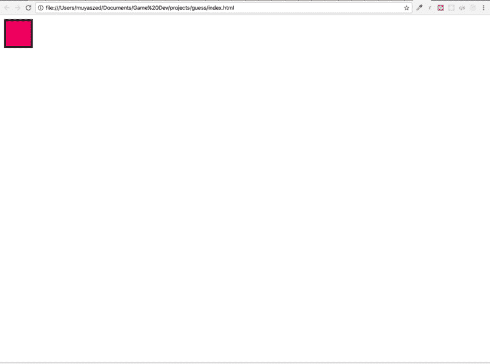
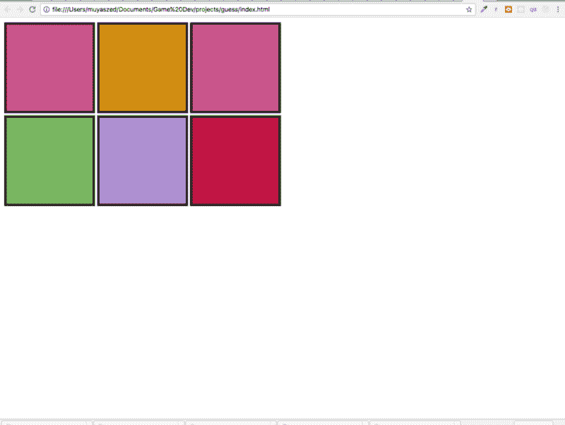
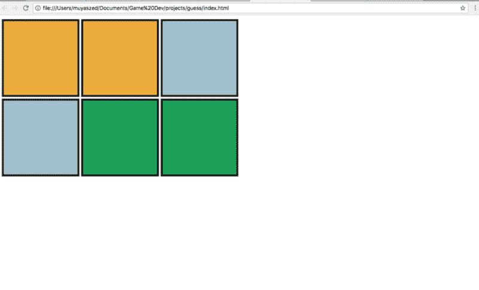
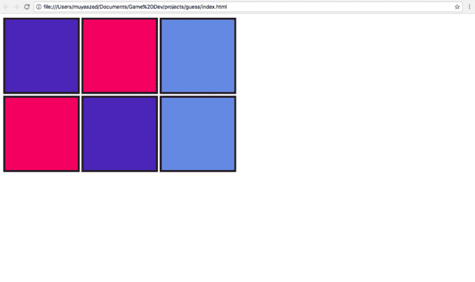
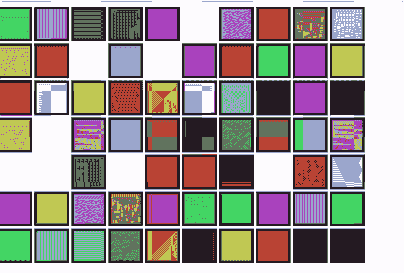

# 如何在空闲时间用 Easel.js 构建一个匹配游戏

> 原文：<https://www.freecodecamp.org/news/matching-game-with-easel-js-free-time-series-cf803c094a9f/>

作者:亚兹德·贾马尔

# 如何在空闲时间用 Easel.js 构建一个匹配游戏

我在编程世界的旅程的一部分是学习游戏开发。我尝试过几种语言，如 Java 和 C++，但最终我想用 Javascript。在使用 JS 之前，我已经开发了一个游戏。这款游戏名为 [Pong Ping](http://yazedjamal.com/pongping/) ，是游戏 Pong 的克隆版。这个游戏完全是用原生 Javascript 构建的。

但今天我想基于一个名为 Easel.js 的 Javascript 游戏框架来构建一个游戏，我要构建的游戏其实是一个非常简单的游戏:我们翻转方块，如果它们是相同的颜色，它们就会消失。当每种颜色都匹配时，游戏就结束了。下面的视频里有一个游戏的例子，但是他们用的是图片。

**第一步**

我将创建 index.html 文件并引用 easel.js 库。为此，我选择使用 CDN(内容分发网络)。我还需要引用 main.js，我所有的 Javascript 代码都在那里。

```
#index.html<!DOCTYPE html><html><head> <title>Pairing Game</title> <script src="https://code.createjs.com/easeljs-0.8.2.min.js"></script><script src="js/main.js"></script></head><body onload="init()"> <canvas id="myCanvas" width="960" height="600"></canvas></body></html>
```

在执行 Javascript 之前，我需要确保所有的 DOM 元素都被完全加载，所以我使用 onload 方法通过函数 init()绑定 Javascript。

**第二步**

然后，我将创建 main.js 文件并设置 easel.js 环境。

```
#js/main.jsvar squarHeight = 200;var squareWidth = 200;
```

```
function init() { var stage = new createjs.Stage("myCanvas"); var square = drawSquare();
```

```
stage.addChild(square); stage.update();}
```

Easel 使用一个名为 Stage 的类作为容器，向定义的画布显示任何元素。现在我将通过 drawSquare 函数画一个正方形。我将利用 easel.js 中所有可用的 API

```
#js/main.jsfunction drawSquare() { var graphics = new createjs.Graphics().setStrokeStyle(5).beginStroke("rgba(20,20,20,1)") graphics.beginFill(randomColor()).rect(5,5,squareWidth,squareHeight); var shape = new createjs.Shape(graphics); return shape;}
```

```
function randomColor() { var num1 = Math.floor(Math.random()*255); var num2 = Math.floor(Math.random()*255); var num3 = Math.floor(Math.random()*255); return "rgba("+num1+","+num2+","+num3+",1)"; }
```

首先，我将定义我想使用的笔画大小。然后，我将应用特定颜色的笔画，定义正方形的颜色，并创建正方形。正方形的颜色是从函数 random color 生成的随机颜色。下面是它在浏览器中的样子。



**第三步**

在我成功地用随机颜色渲染了一个正方形后，我需要设计有多少行和多少列供正方形填充。我还需要设计算法在每一列和每一行中呈现一个正方形

```
#js/main.js##upated codesvar squarHeight = 200;var squareWidth = 200;var squareGap = 10;var column = 3;var row = 2;
```

```
function init() { var stage = new createjs.Stage("myCanvas"); var square;
```

```
for(i=0; i < column*row; i++) {    square = drawSquare();  square.x = (squareWidth+squareGap)*(i%column);  square.y = (squarHeight+squareGap)*Math.floor(i/column);   stage.addChild(square);  stage.update();   }
```

```
}
```

```
function drawSquare() { var graphics = new createjs.Graphics().setStrokeStyle(5).beginStroke("rgba(20,20,20,1)") graphics.beginFill(randomColor()).rect(5,5,squarHeight,squareWidth); var shape = new createjs.Shape(graphics); return shape;}
```

```
function randomColor() { var num1 = Math.floor(Math.random()*255); var num2 = Math.floor(Math.random()*255); var num3 = Math.floor(Math.random()*255); return "rgba("+num1+","+num2+","+num3+",1)"; }
```

从上面的代码中，我将得到一个类似这样的 HTML:



有许多方法可以实现正方形渲染。我们可以在多维数组中使用循环，或者我们可以用一些数学函数来控制正方形的大小。在这种情况下，我将稍后使用。但是如果你想使用多维方法，这里有一个算法:

```
#alternativevar positionX =0; var positionY = 0;
```

```
for(i=0;i<row;i++) {  for(j=0;j<column;j++) {      square = drawSquare();   square.x = positionX;   square.y = positionY;   stage.addChild(square);   stage.update();   positionX += squareWidth+squareGap;   console.log(positionX);  }  positionX = 0;  positionY += squarHeight+squareGap; }
```

**第四步**

同样，这个游戏的目标是将一对颜色搭配在一起。因此，我需要修改代码，以便它能够成对地生成颜色组。为此，我将使用 if else 逻辑来确保在正方形渲染过程中使用两种相似的颜色。

```
#js/main.jsvar temp;var genOnce = false;
```

```
function drawSquare() {var color = randomColor();var graphics = new createjs.Graphics().setStrokeStyle(5).beginStroke("rgba(20,20,20,1)")
```

```
 if(!genOnce) {  graphics.beginFill(color).rect(5,5,squarHeight,squareWidth);  temp = color;  genOnce = true; }else {  graphics.beginFill(temp).rect(5,5,squarHeight,squareWidth);  genOnce = false; }
```

```
 var shape = new createjs.Shape(graphics); return shape;}
```

这将呈现一组正方形，如下所示:



**第五步**

接下来，我希望每一个方块都呈现在一个随机的位置上，这样每一对方块就彼此分开了。这可以通过首先创建一个包含所有方块索引的数组来实现，然后对数组进行洗牌，使索引号随机放置。

```
#js/main.jsvar squarePlacement = [];
```

```
##function to generate array with all the squares indexfunction randomDoubleColor() { for(i=0; i<totalTiles;i++) {  squarePlacement.push(i); }  squarePlacement = shuffleArray(squarePlacement);  return squarePlacement;
```

```
}
```

```
##function of the array random shufflingfunction shuffleArray(array) {    for (var i = array.length - 1; i > 0; i--) {        var j = Math.floor(Math.random() * (i + 1));        [array[i], array[j]] = [array[j], array[i]];    }    return array;}
```

然后我需要改变我如何渲染正方形。我将遍历随机打乱的数组，而不是遍历总方块的长度。

```
#js/main.jsfunction init() {  var stage = new createjs.Stage("myCanvas"); var square; randomDoubleColor();
```

```
for(i=0; i < squarePlacement.length; i++) {      square = drawSquare();  square.x = (squareWidth+squareGap)*(squarePlacement[i]%column);  square.y = (squarHeight+squareGap)*Math.floor(squarePlacement[i]/column);   stage.addChild(square);  stage.update();   }
```

```
}
```

这会得到一组像这样的方块:



如果渲染更多的方块，我可以看到更好的效果:


**第六步**

我现在的目标是创建一个函数来比较随后将要选择的两个方块。

```
#js/main.jsvar highlight = createjs.Graphics.getRGB(255, 0, 0);var tileChecked;
```

我将从定义一个可变高光开始。这将用于突出显示第一个选择的方块和一个变量 tileChecked 来存储相同的方块。

```
#js/main.jsfor(i=0; i < squarePlacement.length; i++) {      square = drawSquare();  square.x = (squareWidth+squareGap)*(squarePlacement[i]%column);  square.y = (squarHeight+squareGap)*Math.floor(squarePlacement[i]/column);   stage.addChild(square);  square.addEventListener("click", handleOnPress);  stage.update();   }
```

```
}
```

然后，我将创建一个事件侦听器，它将响应鼠标单击并触发定义的函数 handleOnPress。现在我将函数定义如下:

```
function handleOnPress(e) {  var tile = e.target;  if(!!tileChecked === false) {   tile.graphics.setStrokeStyle(5).beginStroke(highlight).rect(5, 5, squareWidth, squarHeight);   tileChecked = tile;  }else {   if(tileChecked.graphics._fill.style === tile.graphics._fill.style && tileChecked !== tile) {    tileChecked.visible = false;    tile.visible = false;   }else {    console.log("not match");    tileChecked.graphics.setStrokeStyle(5).beginStroke("rgba(20,20,20,1)").rect(5, 5, squareWidth, squarHeight);   }   tileChecked = null;  }    stage.update();
```

```
}
```

基本上，该函数将首先检查变量 tileChecked。如果未定义，选中的方块将被高亮显示。选中的正方形对象将保存在变量 tileChecked 中。否则(我希望在第二次单击时发生)，将比较当前选中的正方形和存储在变量 tileChecked 中的正方形之间的颜色。

在第二次比较中，如果颜色匹配，我会让两个方块都消失。如果不匹配，我将取消高亮显示，并将变量 tileChecked 重置为 undefined。



**第七步**

要创建一个真正的益智游戏，不应该显示所有的颜色。我会用灰色的方块覆盖这些方块，当每一个被点击时，它就会显示颜色。所以当它不匹配时，灰色方块将再次覆盖盒子。

为了使它更具可玩性，我将确保在比较过程中其他方块不可点击。我还会在显示第二种颜色和两个方块消失或变成灰色之间设置一些延迟。为了让一切正常工作，需要做一些修改

```
function init() {  var stage = new createjs.Stage("myCanvas");  randomDoubleColor();
```

```
for(i=0; i < squarePlacement.length; i++) {    var color =randomColor();  console.log(color);  var square = drawSquare(color);  console.log(square);    square["color"] = square.graphics._fill.style;  square.graphics._fill.style = "rgb(140, 136, 136)";    square.x = (squareWidth+squareGap)*(squarePlacement[i]%column);  square.y = (squareHeight+squareGap)*Math.floor(squarePlacement[i]/column);   stage.addChild(square);  square.addEventListener("click", handleOnPress);  stage.update();   }  function handleOnPress(e) {    var tile = e.target;
```

```
tile.graphics.beginFill(tile.color).rect(5,5,squareHeight,squareWidth);  console.log(tile.mouseEnabled);  tile.mouseEnabled = false;  console.log(tile.mouseEnabled);
```

```
if(!!tileChecked === false) {      tileChecked = tile;  }else {
```

```
stage.mouseChildren = false;   tile.graphics.beginFill(tile.color).rect(5,5,squareHeight,squareWidth);
```

```
setTimeout(function() {    console.log("in");    console.log(tile);    console.log(tileChecked);       if(tileChecked.color === tile.color && tileChecked !== tile) {         tileChecked.visible = false;     tile.visible = false;                }else {    console.log("not match");    tile.graphics.beginFill("rgb(140, 136, 136)").rect(5,5,squareHeight,squareWidth);    tileChecked.graphics.beginFill("rgb(140, 136, 136)").rect(5,5,squareHeight,squareWidth);
```

```
}   tile.mouseEnabled = true;   tileChecked.mouseEnabled = true;   stage.mouseChildren = true;   tileChecked = null;
```

```
stage.update();      }, 1000);              }    stage.update();
```

```
}
```

```
}
```

```
function drawSquare(color) {     var graphics = new createjs.Graphics().setStrokeStyle(5).beginStroke("rgba(20,20,20,1)")
```

```
if(!genOnce) {  graphics.beginFill(color).rect(5,5,squareHeight,squareWidth);  temp = color;  genOnce = true; }else {  graphics.beginFill(temp).rect(5,5,squareHeight,squareWidth);  genOnce = false; }    var shape = new createjs.Shape(graphics); return shape;}
```

以下是游戏的视频:

这个游戏可以通过添加输赢规则来进一步增强，或者可以通过添加一个计时器来记录每个玩家的完成时间。目前，我将停止开发，直到这一点。完整的代码可以在下面的 GitHub 上找到，任何人都可以免费将其用于任何其他项目。

[**muyaszed/Matching-game-using-Easel.js**](https://github.com/muyaszed/Matching-game-using-Easel.js)
[*在 GitHub 上创建账号，为 Matching-game-using-easel . js 开发做贡献。*github.com](https://github.com/muyaszed/Matching-game-using-Easel.js)

[演示](http://yazedjamal.com/guess/)

**注释**:可能有很多方法来实现这个功能，但是这个方法对我来说是最简单的。任何人都可以自由评论我可以应用的任何错误或改进。这个指南最初是为了让我学习和记住我所做的事情。尽管如此，如果你觉得有帮助的话，任何人都欢迎遵循这个指南。