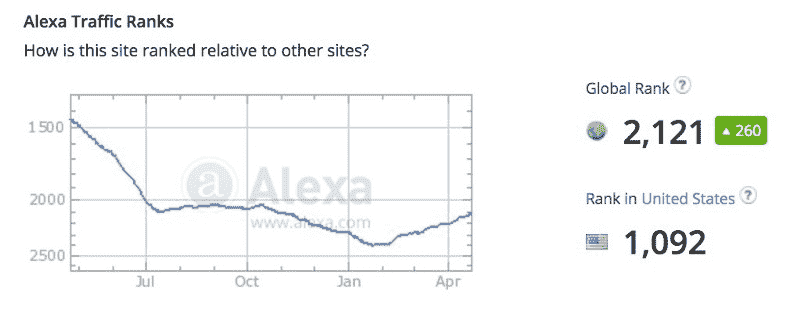
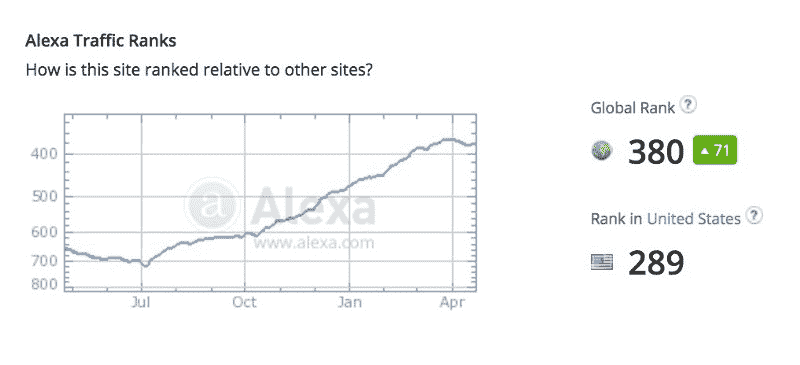

# 媒介不仅仅是创业的人

> 原文：<https://www.freecodecamp.org/news/medium-isn-t-just-startup-people-30a3752b09b9/>

几天前，我写了一篇媒体文章，鼓励博客们考虑放弃他们的博客，转而使用媒体写作。

最常见的批评回应是，媒体大多是创业人士，我们开源社区的媒体出版物发展如此之好，主要是因为创业人士希望[学习编码](https://www.freecodecamp.com)。

对于大多数新技术，早期市场将是“想要新事物的人”

最终，这项技术将“跨越鸿沟”为大多数人所用。看起来 Medium 已经开始这么做了。

创业人士肯定是媒体的早期采用者。这从 72，000 人关注 Medium 的“startup”标签这一事实中可以清楚地看出。

但是越来越多的人开始关注其他媒体标签。这里列出了一些最受欢迎的媒体标签，以及它们的追随者数量:

*   启动— 72k
*   寿命— 50k
*   旅行— 45k
*   教育— 42k
*   设计— 41k
*   政治— 39k
*   书写— 38k
*   技术— 36k
*   诗歌— 31k
*   营销— 31k
*   音乐— 30k
*   商务— 25k
*   摄影— 24k
*   食物— 21k
*   艺术— 19k
*   关系— 18k
*   生产力— 17k
*   体育— 16k
*   编程— 13k
*   时尚— 10k
*   科学— 9k
*   健身— 9k
*   新闻业— 9k
*   心理学— 9k
*   历史— 7k
*   经济学— 6k
*   游戏— 6k

这里也有很多教师、政治迷、音乐家、摄影师和美食家。

没有这些人，Medium 永远不会达到现在的流量水平。

最受创业人士欢迎的网站是黑客新闻(YCombinator 的新闻栏目)。根据全球排名，YCombinator 的流量如下:

以下是 Medium 流量的全球排名情况:

这两个网站之间的全球排名差异转化为总流量的一个数量级的差异。

换句话说，Medium 的所有访客中，只有一小部分可能是创业者。他们是直言不讳的少数——而不是大多数。

如果你写的是大众感兴趣的话题，比如食物、音乐、摄影，或者学术话题，比如科学或心理学，那么 Medium 上有相当多的读者。

我只写编程和技术。如果你在推特上关注我，我不会浪费你的时间。？