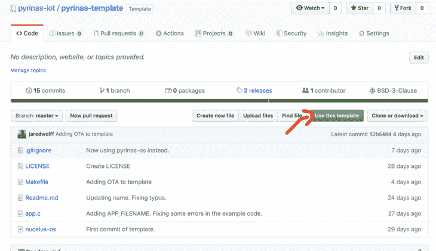
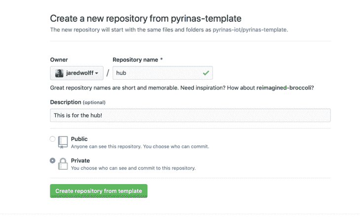
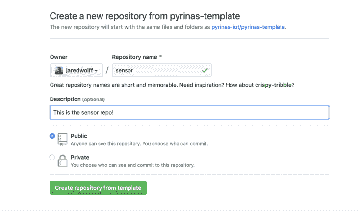
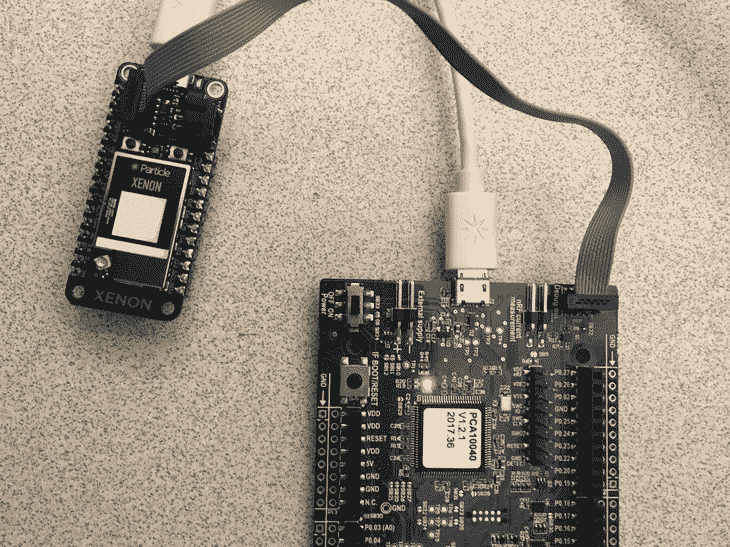

# 认识 py rinas——用于粒子氙的物联网开发套件

> 原文：<https://www.freecodecamp.org/news/meet-pyrinas-an-iot-development-kit-for-your-particle-xenon/>

这个帖子有点长。如果你愿意，[在这里注册获取完整的 PDF 文件。](https://www.jaredwolff.com/files/pyrinas-intro/)？

在 [Particle 的网格废弃声明](https://www.jaredwolff.com/particle-mesh-deprecation-livestream/)之后，许多人被留下来想办法如何部署他们的低功耗传感器网络。总是有使用[粒子内置蓝牙栈](https://www.jaredwolff.com/how-to-use-particles-powerful-bluetooth-api/)的选项，但就目前的情况来看，它并不安全。

之前，我帮助组建了一个非常简单的基于 nRF SDK 的 hub 和 spoke 物联网部署。不幸的是，它关闭了源代码，公司也不存在了。

那么一个男人该怎么做呢？

建造另一个并打开它。(BSD 授权确切！对任何人开放和免费使用采用和改进。另外，如果你正在开发一个使用代码的产品，**你不必与任何人分享你的改进或专有代码。**

在这篇文章中，我将谈论如何开始使用 Pyrinas。它使用 Nordic 久经考验的 SDK 作为系统内核的基础。Pyrinas 的主要概念是将尽可能多的物联网资源抽象化，以便您可以专注于您的应用。

所以事不宜迟，我们来聊聊 Pyrinas 是什么，不是什么。

## Pyrinas 是什么

*   是一个嵌入式“内核”，用 c 语言编写。它是一个开放和宽松的物联网开发环境，您可以使用它做任何事情。说真的。它是 BSD 许可的，可以在闭源应用中使用。

*   使用蓝牙 5.0 远程功能，Pyrinas 允许您同时与许多外围设备通信。目前，Pyrinas 已通过 3 个同步外设连接进行了测试。理论上，它可以支持多达 20 个同时连接。(感谢[北欧的 S140 软设备](https://cm.nordicsemi.com//Software-and-tools/Software/Bluetooth-Software))

*   Pyrinas 通过两种方式传输数据

    *   在 Particle 使用的常见字符串格式中
    *   用于原始数据传输的自定义协议缓冲区。

    这样你就可以选择如何处理和发布你的数据！

## Pyrinas 不是什么

*   Pyrinas 不是 RTOS(实时操作系统)。如果您需要在嵌入式系统上运行多线程应用，Pyrinas 不适合您。
*   Pyrinas 目前不支持网格。
*   适用于市场上每一种蓝牙 SoC 的操作系统。由于与 Nordic 的 nRF SDK 紧密耦合，Pyrinas 只能与 Nordic 的 SOC 一起工作。
*   物联网交钥匙解决方案。Pyrinas 在 it 开发过程中处于早期阶段。我们的目标是让它成为任何人以自己喜欢的方式开发和发布物联网应用的可行选择。没有供应商锁定。没有惊喜。

## 你需要的东西

要开始使用 Pyrinas，您需要几样东西。

*   至少 2 个粒子异种
*   至少 1 个 nRF 开发板或 J-link 编程器
*   相关的 USB 电缆

## 从示例开始

Pyrinas 入门涉及两个存储库。

*   [操作系统存储库](https://github.com/pyrinas-iot/pyrinas-os)
*   [模板](https://github.com/pyrinas-iot/pyrinas-template)

OS 目录包含了使用 Pyrinas 所需的所有源代码、SDK 依赖项和工具链。

模板是您添加所有应用程序代码的地方。该模板为您和您的项目提供了一个起点。

以下是所有事情的来龙去脉:

将操作系统目录克隆到您机器上的某个位置:

```
git clone https://github.com/pyrinas-iot/pyrinas-os.git --recurse-submodules 
```

完成后，将目录更改为`pyrinas-os`并运行`make setup`

```
cd pyrinas-os
make setup 
```

这将下载您的工具链和 SDK 依赖项。

为了使用 OTA DFU，您还需要为流程生成 DFU 密钥:

```
make gen_key 
```

稍后将使用此过程生成的文件。

接下来，我们将使用该模板创建两个新项目。在本例中，我们将有一个“集线器”和一个“传感器”只需导航到[模板库](https://github.com/pyrinas-iot/pyrinas-template)并点击**使用该模板**按钮。



然后命名您的新存储库。当您对一切都满意时，单击**从模板**创建存储库按钮。



然后将您的存储库克隆到与`pyrinas-os`相同的目录中。确保用你自己的替换掉`<your username>`和`<repo name>`。

```
cd ..
git clone https://github.com/<your username>/<repo name>.git hub 
```

完成之后，返回并从模板创建一个新的存储库。我们将把这个用于*传感器*节点。



一旦在与您的`hub`和`pyrinas-os`存储库相同的位置完成设置，就克隆这个存储库。

现在我们已经有了所有的存储库，让我们从传感器节点开始。

### 设置传感器节点存储库

使用类似微软 VS Code 的程序打开传感器库。如果您有命令行快捷方式，您可以使用`code`从终端打开它:

```
code sensor 
```

在我们做任何事情之前，我们需要建立到`pyrinas-os`的符号链接。确保你在`sensor`目录中，然后使用终端运行`ln -s ../pyrinas-os/`。

```
cd sensor
ln -s ../pyrinas-os/ . 
```

这允许您的项目使用`pyrinas-os`库中的所有代码、SDK 和工具链！作为额外的奖励，你可以想做多少次就做多少次。拥有多个 Pyrinas 项目？没问题。

好吧！现在，让我们来看看 Makefile。您将需要定制文件中的一些定义:

```
# Start: Your configuration!

# Set this to the directory of pyrinas-os
# If you used a symbolic link this points to
# the `pyrinas-os` folder in this repository
OS_DIR := pyrinas-os

# This should be the serial number of your Jlink programmer.
# To find simply run `jlinkexe`
PROG_SERIAL=1234678

# This is your debugger port for Jlink's RTT. If you
# have mulitple, you will have to change this on each app
# your're using
PROG_PORT=19021

# This is where you set your board type. Here are the supported boards:
# xenon - Particle Xenon
BOARD=xenon

# This is where you can name your app something. Make it specific
APP_FILENAME=pyrinas-template

# This determines whether or not you're using debug mode
# Comment this out or change to false
DEBUG=true

# End: Your Configuration 
```

例如，您可能想要设置您的编程器串行。这允许你同时使用多个程序员。(对同时调试两个设备非常有帮助)将程序员的串行插头插入开发板并运行`jlinkexe`。

```
jlinkexe
SEGGER J-Link Commander V6.62a (Compiled Jan 31 2020 12:59:22)
DLL version V6.62a, compiled Jan 31 2020 12:59:05

Connecting to J-Link via USB...O.K.
Firmware: J-Link OB-SAM3U128-V2-NordicSemi compiled Jan 21 2020 17:30:48
Hardware version: V1.00
S/N: 581758669
License(s): RDI, FlashBP, FlashDL, JFlash, GDB
VTref=3.300V

Type "connect" to establish a target connection, '?' for help
J-Link> 
```

找到**序列号**区域。这是你的序列号！

或者，您可以查看开发套件上的标签。它将包含您的设备的序列号。

对于`PROG_PORT`,你想为你同时调试的每个设备使用不同的端口。我发现 **19021** 和 **19020** 是大多数双设备调试会话的完美选择。

Makefile 还包括选择电路板的能力。在我们的例子中，只有一个选择:`xenon`。Pyrinas 的未来版本将有多种选择。

`APP_FILENAME`是您的应用程序的名称。我们将把我们的重命名为`pyrinas-sensor`

最后，`DEBUG`用于在出错或重启时暂停执行。对于生产，这应被注释掉或设置为`false`。我们可以暂时让它保持原样。

Makefile 还是开发过程中需要的一些最重要命令的来源:

*   `make build` -构建您的应用程序。
*   `make clean` -清除你的应用程序的所有残余。
*   `make debug` -打开`jlinkexe`调试器控制台。
*   `make erase` -清除你的编程器上的芯片。
*   `make flash` -将当前应用程序刷新到您连接的设备上。
*   `make flash_softdevice` -闪烁软设备
*   `make rtt` -打开调试控制台。
*   `make ota` -生成一个用于 BLE·DFU 的 zip 文件

### 基本传感器节点代码


现在我们已经了解了一些基本知识，让我们创建一个非常简单的应用程序，它按照设定的时间间隔发布。如果你看一下`app.c`，你会看到`setup()`函数中的一些代码。让我们删除所有注释掉的代码。(我们稍后会将它用于集线器)

您的代码现在应该类似于:

```
#include "app.h"

void setup()
{
  BLE_STACK_PERIPH_DEF(init);

  // Configuration for ble stack
  ble_stack_init(&init);

  // Start advertising
  advertising_start();
}

void loop()
{
} 
```

现在让我们创建一个计时器，我们将使用它在设定的时间间隔发布。在`#include "app.h"`下创建一个新的定时器:

```
#include "app.h"

timer_define(m_sensor_timer); 
```

我们还需要在`setup()`函数中设置它:

```
// Sensor timer
timer_create(&m_sensor_timer, TIMER_REPEATED, sensor_timer_evt); 
```

您会注意到`timer_create`引用了一个名为`sensor_timer_evt`的事件回调。我们还需要创造那个人:

```
static void sensor_timer_evt() {
	// We'll come back in a sec
} 
```

最后一件事是启动计时器。让我们在下面这样做:

```
// Start
timer_start(&m_sensor_timer, 1000); 
```

这将启动我们的重复计时器，时间间隔为 1 秒。(`timer_start`使用毫秒进行配置)

现在，我们将在`sensor_timer_evt`内部发布一些数据。首先，我们需要确保使用`ble_is_connected`连接蓝牙。

```
static void sensor_timer_evt
{
  // Check if we're connected
  if (ble_is_connected())
  {
    // Sends "ping" with the event name of "data"
    ble_publish("data", "ping");
  }
} 
```

在 if 语句中，我们将使用`ble_publish`。第一个参数是事件的名称，第二个参数是值。

接下来，为了从另一端接收消息，我们需要设置一个回调:

```
// Configuration for ble stack
ble_stack_init(&init);

// Setup BLE callback
ble_subscribe("data", ble_evt); 
```

我们将在文件的顶部定义`ble_evt`:

```
static void ble_evt(char *name, char *data)
{
  NRF_LOG_INFO("%s: %s", name, data);
} 
```

在这种情况下，我们将使用`NRF_LOG_INFO`来打印来自 hub 的消息。

最后，为了轻松获得 MAC 地址，我们必须在`setup()`中添加一个调用来将其打印出来。

```
// Print the address
util_print_device_address(); 
```

最后，您的文件应该看起来像这样:

```
#include "app.h"

timer_define(m_sensor_timer);

// Catch events sent over Bluetooth
static void ble_evt(char *name, char *data)
{
  NRF_LOG_INFO("%s: %s", name, data);
}

static void sensor_timer_evt()
{
  // Check if we're connected
  if (ble_is_connected())
  {
    // Sends "ping" with the event name of "data"
    ble_publish("data", "ping");
  }
}

void setup()
{
  BLE_STACK_PERIPH_DEF(init);

  // Configuration for ble stack
  ble_stack_init(&init);

  // Setup BLE callback
  ble_subscribe("data", ble_evt);

  // Start advertising
  advertising_start();

  // Sensor sensor timer.
  timer_create(&m_sensor_timer, TIMER_REPEATED, sensor_timer_evt);

  // Start
  timer_start(&m_sensor_timer, 1000);

  // Print the address
  util_print_device_address();
}

void loop()
{
} 
```

接下来，我们将它编程到一些硬件上！

### 闪烁基本传感器代码:

这一步你需要准备一个氙气灯。你还需要一个编程器、编程电缆和两根 Micro-B USB 电缆。这是一张所有相关事物的图片:



连接并通电后，运行以下命令:

```
make erase
make flash_softdevice
make flash
make debug 
```

然后在单独的终端窗口中运行

```
make rtt 
```

`make debug`和`make rtt`将创建一个调试会话。您也可以在`make debug`终端发出命令来控制设备。例如，`r`后跟`Enter`将重启设备。(目前为止我最常用的用例)。

如果你已经成功地刷新了一切，你的设备应该开始闪烁绿色。这是个好兆头！

此外，如果您看一下`make rtt`侧，您的输出应该类似于此:

```
###RTT Client: Connecting to J-Link RTT Server via localhost:19021 ...
###RTT Client: Connected.

SEGGER J-Link V6.62a - Real time terminal output
J-Link OB-SAM3U128-V2-NordicSemi compiled Jan 21 2020 17:30:48 V1.0, SN=581758669
Process: JLinkExe
<info> app_timer: RTC: initialized.
<info> app: Boot count: 4
<info> app: Pyrinas started.
<info> app: Address: 11:22:33:44:55:66 
```

记下上面显示的地址。我们需要它作为中枢代码！

### 设置中心存储库


如果还没有，请在本地克隆您的 hub 存储库。我们需要执行一些与传感器报告相同的步骤，例如:

*   设置符号链接
*   更新 Makefile
    *   设置您的`PROG_SERIAL`
    *   将`PROG_PORT`设置为传感器设置未使用的端口。`19020`在这种情况下还好。
    *   将`APP_FILENAME`设置为`pyrinas-hub`

如果您需要提醒这些步骤是如何工作的，请返回并回顾前面的部分。

接下来，我们想要打开`app.c`并取消对基于 central/hub 的代码的注释。另外，您可能希望删除默认的未注释代码。您的`setup()`应该是这样的:

```
void setup()
{
  // Default config for central mode
  BLE_STACK_CENTRAL_DEF(init);

  // Add an addresses to scan for
  ble_gap_addr_t first = {
      .addr_type = BLE_GAP_ADDR_TYPE_RANDOM_STATIC,
      .addr = {0x81, 0x64, 0x4C, 0xAD, 0x7D, 0xC0}};
  init.config.devices[0] = first;

  ble_gap_addr_t second = {
      .addr_type = BLE_GAP_ADDR_TYPE_RANDOM_STATIC,
      .addr = {0x7c, 0x84, 0x9d, 0x32, 0x8d, 0xe4}};
  init.config.devices[1] = second;

  // Increment the device_count
  init.config.device_count = 2;

  // Configuration for ble stack
  ble_stack_init(&init);

  // Start scanning.
  scan_start();
} 
```

您会立即注意到这里定义了两个客户端/设备。让我们去掉第二个。如果您将来想要连接更多设备，这是一个如何做到这一点的示例。

**提醒:**还要确保将`init.config.device_count`改为`1`。

然后，您需要更新`ble_gap_addr_t first`中的`.addr`字段，以匹配我们之前从`make rtt`获得的地址:

```
// Add an addresses to scan for
ble_gap_addr_t first = {
    .addr_type = BLE_GAP_ADDR_TYPE_RANDOM_STATIC,
    .addr = {0x11,0x22,0x33,0x44,0x55,0x66}};
init.config.devices[0] = first; 
```

地址字段使用原始字节，因此必须以这种方式表示。移除`:`并将`0x`放在每个字节的前面。我们最终从`11:22:33:44:55:66`到`{0x11,0x22,0x33,0x44,0x55,0x66}`

现在，在我们闪存任何东西之前，让我们也设置蓝牙事件处理器。和前面一样，我们将使用`ble_subscribe`来附加一个事件处理程序:

```
// Setup BLE callback
ble_subscribe("data", ble_evt);

Then place the function at the top of the file:

// Catch events sent over Bluetooth
static void ble_evt(char *name, char *data)
{
  NRF_LOG_INFO("%s: %s", name, data);

  ble_publish("data", "pong");
} 
```

您会注意到我们正在使用`NRF_LOG_INFO`打印消息。我们还以`ble_publish("data","pong");`的形式将信息*发送回*传感器，换句话说，我们在两台设备之间玩乒乓游戏！

最后，您的代码应该看起来像这样:

```
#include "app.h"

// Catch events sent over Bluetooth
static void ble_evt(char *name, char *data)
{
  NRF_LOG_INFO("%s: %s", name, data);

  ble_publish("data", "pong");
}

void setup()
{
  // Default config for central mode
  BLE_STACK_CENTRAL_DEF(init);

  // Add an addresses to scan for
  ble_gap_addr_t first = {
      .addr_type = BLE_GAP_ADDR_TYPE_RANDOM_STATIC,
      .addr = {0x11, 0x22, 0x33, 0x44, 0x55, 0x66}};
  init.config.devices[0] = first;

  // Increment the device_count
  init.config.device_count = 1;

  // Configuration for ble stack
  ble_stack_init(&init);

  // Setup BLE callback
  ble_subscribe("data", ble_evt);

  // Start scanning.
  scan_start();
}

void loop()
{
} 
```

**提醒:**确保您设置了`ble_gap_addr_t first`，否则两个设备将无法连接！

如前所述，将氙气灯连接到程序上进行编程。我们将使用与之前相同的方法来刷新它:

```
make erase
make flash_softdevice
make flash
make debug 
```

然后在单独的终端窗口中运行

```
make rtt 
```

然后看看每个`make rtt`屏幕。应该会有一些输出吧！对于集线器，它应该是这样的:

```
Process: JLinkExe
<info> app: Boot count: 4
<info> app: Pyrinas started.
<info> ble_m_central: Connected to handle 0x0
<info> ble_m_central: Protobuf Service discovered
<info> app: data: ping
<info> app: data: ping 
```

传感器这边是这样的:

```
Process: JLinkExe
<info> app_timer: RTC: initialized.
<info> app: Boot count: 4
<info> app: Pyrinas started.
<info> app: Address: 11:22:33:44:55:66
<info> ble_m_periph: Notifications enabled!
<info> app: data: pong
<info> app: data: pong 
```

ping 和 pong 消息应该会继续，直到您停止它们。厉害！如果您收到类似这样的警告:

```
Unable to write. Notifications not enabled! 
```

使用任一设备上的重置按钮。这应该可以解决问题。

**边注:**蓝牙的配对过程本来就是 ***不安全*** 。一旦配对过程完成，设备就安全了。(注意，没有人嗅探配对过程！)将来可能会在安全性方面有所改进。

* *恭喜！？* *如果您已经做到这一步，您已经部署了您的第一个 Pyrinas hub 和传感器客户端！

关于 Pyrinas 能做什么的更多信息，你应该看看`pyrinas-os/include/`下面的头文件。此外，Pyrinas 可以做任何你通常可以用 Nordic 的 SDK 做的事情。 [Nordic 的信息中心](https://infocenter.nordicsemi.com/topic/struct_sdk/struct/sdk_nrf5_latest.html?cp=7_1)是了解 SDK 所能提供的更多信息的绝佳资源。

## Pyrinas 的未来会怎样？


Pyrinas 未来的所有任务都在 Github Repo 上公开分享。以下是路线图中的一些高级改进:

*   粒子硼+ LTE 支持——没错！手机将会来到皮瑞纳斯。在撰写本文时，支持 Pyrinas LTE 的第一块电路板将是 Particle 的 Boron。
*   MQTT(通过 TLS)和 HTTPS 支持——一旦我们有了蜂窝网络，我们就需要一些东西来进行通信。这就是 MQTT 和 HTTPS 的用武之地。它们是当今物联网最流行的一些协议。
*   内置远程 OTA 支持——目前，用 Pyrinas 编程的设备使用 Nordic 的安全引导程序。这意味着它们可以通过附近的电脑或手机无线更新。但是这对于长期部署来说是不可持续的！相反，您将能够通过云将更新推送至 Pyrinas 设备。没错。没有理由离开您的沙发，您可以从任何地方部署您的更新。
*   动态配置和管理——在 Pyrinas 系统中添加和删除设备目前需要花费一些精力。在未来的版本中，动态添加和删除设备将变得更加容易。这使得远程设备管理没有任何麻烦。
*   支持基于 Nordic 的 nRF52840 的预认证模块和其他开发板。目前氙是唯一支持的板。不过，开发板并不适合全面生产。请继续关注来自像 [Fanstel](https://www.fanstel.com/bluenor-summaries) 等厂商的预认证模块支持..
*   支持更多的开发环境。目前 Pyrinas 只支持 Mac *的*。

### 星星和手表！

这只是冰山一角！敬请关注更多更新，让你成为明星并观看[资源库](https://github.com/pyrinas-iot/pyrinas-os)。

或者，更好的是，寻求帮助？欢迎投稿！

**你可以在我的博客上阅读其他文章，[jaredwolff.com](https://www.jaredwolff.com/meet-pyrinas-a-new-way-to-use-your-xenon/)**