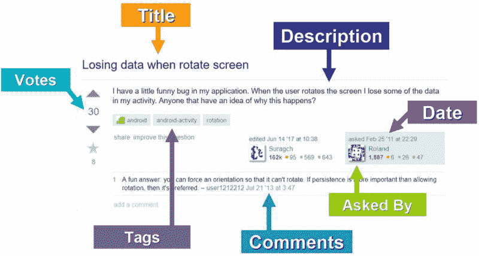
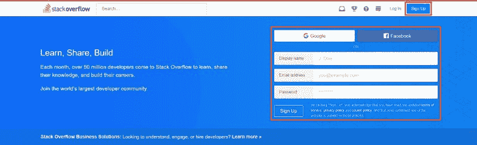
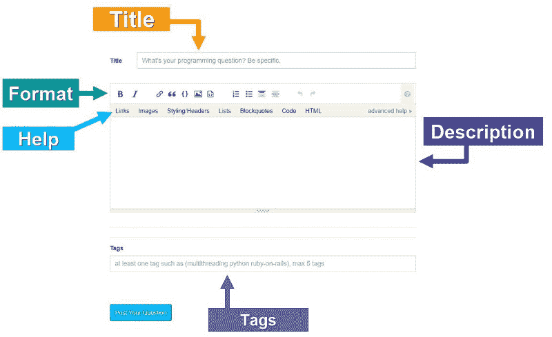
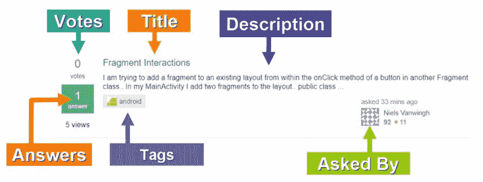

# 遇见栈溢出，你的编程和调试知识之路

> 原文：<https://www.freecodecamp.org/news/meet-stack-overflow-your-path-to-programming-and-debugging-knowledge-f8cb04c2acab/>

### 🌐无尽的知识？

你能想象一个平台，在那里你可以获得来自世界各地的开发者的建议和智慧吗？这正是堆栈溢出对于编程的意义，也是为什么它是开发人员的重要工具。

我认为 Stack Overflow 是一个在线论坛形式的“集体百科全书”,世界各地的开发人员可以分享知识和经验。开发人员帮助其他开发人员解决他们在软件开发项目中面临的问题。

这个平台是如此强大，以至于我觉得有必要把它介绍给那些和你完全一样的人，他们正在踏上学习计算机科学和编程的奇妙旅程。

协作让伟大的想法改变世界。堆栈溢出改变了全球开发人员解决问题和寻找项目所需信息的方式。

如果你试着用谷歌搜索你的代码抛出的一个错误，或者仅仅是一个与编码相关的问题，我 99.99%肯定你会发现一个非常相似的(如果不是相同的)问题，这个问题已经被可能离你千里之外的开发人员问过并回答了。

令人印象深刻，对吧？让我们更深入地了解一下为什么这个平台如此强大！


### ⭐️堆栈溢出的力量

当您能够在正确的时间为当前项目找到正确的信息时，您作为开发人员的真正潜力就会释放出来。只有这样，你才能完全自由地将你的新知识应用到新的领域，并有足够的信心创造出真正令人惊叹的东西。

**这就是堆栈溢出的真正威力所在:**它让你在学习和实验的同时尽可能地发挥创造力，而没有当你的问题没有答案时走进死胡同的风险。

通过将您在 Stack Overflow 上找到的现有答案应用到您自己的项目中，您将发展出一项非常有价值的技能。你将学会如何通过创造性地将现有资源应用于新环境来面对新挑战。

> 知识的唯一来源是经验。——阿尔伯特·爱因斯坦


### 💻什么时候需要堆栈溢出？

*   当你学习编程和新技术时，你需要大量的实践。这需要通过研究和自己尝试新事物来学习。堆栈溢出可以成为你最终解决难题的向导。
*   **当你在一个项目中工作并发现代码中的错误时，** Stack Overflow 将是你阅读类似场景并分析如何使现有解决方案适应你的项目的地方(相信我，你可以从这里学到很多！😃).
*   当你的代码抛出一个意外的错误并且你需要确定是什么导致了它以及如何修复它。
*   **当你有关于编程相关话题的问题**时。

### 🚩寻找答案

#### **在几秒钟内找到信息**

你最好的盟友将是谷歌搜索。使用下面的模式在 Google 搜索栏中输入您的问题。这将找到在该平台上已经被询问和回答的非常相似的问题的链接:

```
Stack Overflow <Language or Technology> <Question or Error>
```

例如:

```
Stack Overflow Android Activity not restoring information on rotation
```

****💡**** **注意:**可以复制/粘贴错误信息作为第三个元素。

#### 堆栈溢出问题的基本结构



[Question](https://stackoverflow.com/questions/5123407/losing-data-when-rotate-screen) asked by [Roland](https://stackoverflow.com/users/435267/roland), edited by [Suragch](https://stackoverflow.com/users/3681880/suragch) and commented by [user1212212](https://stackoverflow.com/users/1212212/user1212212)

#### ✅回答

在问题下面，你会找到其他开发者贴出的答案。带有**复选标记**的答案是提问者选择的最佳答案。

如果你觉得某个问题有帮助，就投赞成票，如果不正确，就投反对票。您可以通过在堆栈溢出时创建自己的帐户来做到这一点。这有助于其他开发人员找到正确的问题和问题的正确答案。

可以对多个问题和多个答案进行投票。也可以对评论进行投票。

****💡**** **注意:**一定要仔细检查提问和回答问题的日期。一些答案可能已经过时,如果这些答案是几年前发布的，并且技术已经发生了变化，那么这些解决方案可能不是最佳的。在这种情况下，我建议试着找找最近贴的类似问题。

### 💥找不到答案？问一个新问题。

如果您找不到您想要的答案，您可以通过创建您的帐户来提出新的问题。[进入 Stack Overflow](https://stackoverflow.com/) 并填写表格进行注册，或者使用您的谷歌或脸书账户进行认证。



**登录您的帐户**后，您可以自定义您的个人资料。然后，您可以通过点击位于搜索栏下方的这个**蓝色按钮**来提问:


点击此按钮后，您将看到提问最佳实践的简要总结。阅读它们，勾选复选框:“谢谢，我会在询问时记住这些提示”，然后继续。

**您将看到此表单，以输入您的问题:**



#### **🔎** **我们来分析一下各个元素:**

*   **标题:**标题必须尽可能具有描述性，以吸引那些愿意帮助你并回答你问题的潜在投稿人的注意力。
*   **描述:**在这里，您可以全面地描述您的问题，包括一个最小的工作代码示例，并解释您的思维过程和没有解决您的问题的想法。
*   **格式:**这是自定义描述外观的主栏。您可以将文本加粗和倾斜，添加链接、图像、引用、代码片段、列表、标题和横线来分隔您描述的主要思想。特别是，代码应该具有特定的格式。
*   **Help:** 如果你点击每个类别，你可以看到每个元素使用的语法和进一步定制格式的提示。
*   标签:它们是与您的问题相关的类别，可以帮助潜在的参与者找到问题。例如，如果您的问题与 Android 有关，您可以将“Android”作为标签之一。您最多可以添加五个标签。

💡N **注意:**在位于描述框下方的两个栏之间，您将看到一个帖子的预览，其格式与发布在平台上的完全一样。一个 **wesome，对不对？**

### 🏆询问堆栈溢出问题的最佳实践

*   **在发布新问题之前，彻底搜索**与您的问题相关的答案。在大多数情况下，您会发现一个与您的问题非常相关的问题，并且您将能够根据您的项目调整现有的解决方案。如果之前的问题过于相似，您的问题将被视为重复。
*   尽可能具体。包括一个非常具体的标题和错误描述、代码片段，以及你已经尝试过但没有解决问题的替代方法。
*   **选择相关标签。**这将有助于对您的问题进行分类，并找到合适的开发人员来帮助您。

💡注意:你可以在 S [tack 溢出帮助中心找到更多关于提问的最佳实践的信息。](https://stackoverflow.com/help/how-to-ask)

### 🌐成为堆栈溢出的贡献者

现在您已经创建了自己的帐户并提出了问题，您可以通过**回答问题**来为 Stack Overflow 社区做出贡献。

想一想，你的答案将会帮助全世界成千上万的开发者！这难道不令人兴奋吗？

要找到您可能想回答的问题，请进入**搜索栏**并输入关键词或主题:


您将看到以下格式的问题列表:



点击问题的标题，查看更多详细信息和以前的答案，并发布您的答案。

💡N **注意:**您也可以点击您感兴趣的特定标签，搜索将被过滤以显示带有此标签的问题。

#### 徽章

当您对 Stack Overflow 做出贡献时，您将获得声誉和徽章。它们是 Stack Overflow 认可您对平台和整个社区的贡献的一种非常棒的方式。有最低信誉级别来解锁堆栈溢出的一些功能。例如，向上投票至少需要 15 的声望。

徽章有多种类别，如问题徽章、答案徽章、参与徽章、标签徽章、审核徽章等等。

💡你可以在[栈溢出徽章文章中找到徽章及其描述的完整列表。](https://stackoverflow.com/help/badges)

随着你继续钻研栈溢出，你将会赢得你的开发伙伴的钦佩和尊重，谁知道呢？也许有一天你会成为平台的版主！

### 👋这只是开始！

学习计算机科学和编程是一个非常棒的旅程，总有新的东西要学。我敢肯定，作为一名开发人员，在您的未来，您将会非常喜欢 Stack Overflow。

非常感谢您花时间阅读我的文章。