# Meet Material-UI —您的新宠用户界面库

> 原文：<https://www.freecodecamp.org/news/meet-your-material-ui-your-new-favorite-user-interface-library-6349a1c88a8c/>

按代码领域

# Meet Material-UI —您的新宠用户界面库

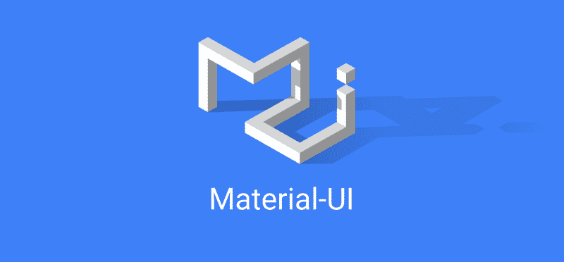

> **更新**(17/05/2018):Material-UI v 1 . 0 . 0 出来了！查看由 Olivier 撰写的[这篇文章](https://medium.com/material-ui/material-ui-v1-is-out-e73ce13463eb)。

啊？又一个图书馆？Bootstrap 怎么了？而为什么不是 v0.20？

很棒的问题！先简单介绍一下。简而言之，Material-UI 是一个开源项目，其特点是 [React](https://reactjs.org/) 组件实现了[谷歌的材料设计](https://material.io/guidelines/material-design/introduction.html)。

它在 2014 年 React 向公众发布后不久启动，从那以后[越来越受欢迎](https://hackernoon.com/the-coolest-react-ui-frameworks-for-your-new-react-app-ad699fffd651)。GitHub 上的[超过 35，000 颗星，Material-UI 是 React 的顶级用户界面库之一。](https://github.com/mui-org/material-ui)

然而，它的成功并非没有挑战。设计得更少，Material-UI v0.x 容易出现常见的 CSS 陷阱，比如全局范围，这导致项目走上了 [CSS-in-JS](https://speakerdeck.com/vjeux/react-css-in-js) 的轨道。2016 年`next`就是这么来的。

正如 Olivier Tassinari 所说的，通往更好风格的旅程始于内嵌风格，但它们次优的性能和有限的功能支持(想想伪选择器或媒体查询)，最终使团队过渡到了 T2 JSS。好家伙，他们做了一个明智的选择。

#### v1 版本的宣传是什么？

太糟糕了。它不仅解决了 LESS 固有的问题，还提供了大量出色的特性，包括

*   运行时生成的动态样式
*   带有直观覆盖的嵌套主题
*   通过代码分割减少加载时间

还有[更多](https://material-ui-next.com/getting-started/comparison/#styling-solution)。该库也足够成熟，可以在生产中使用，因此团队建议在[的所有新项目](https://github.com/mui-org/material-ui#should-i-start-with-v1-beta)中使用 v1。

#### 好吧，我们是要开发一个应用程序，还是什么？

很高兴你问了！对于这个演示，我们将构建一个简单的健身应用程序。反正现在每个人都厌倦了待办应用，对吧？

阅读固然很棒，但观看往往更有趣！如果你想开发一个更高级的应用程序，可以看看我在 YouTube 上制作的这个播放列表。

#### 好吧，你让我信服了。我如何开始？

我们将首先用 create-react-app 引导我们的应用程序

```
create-react-app mui-fitnesscd mui-fitnesscode .
```

#### 而 Material-UI 呢？

如果你有纱线，安装非常简单

```
yarn add @material-ui/core
```

否则，用`npm`

```
npm i @material-ui/core
```

不久前，我们会指定`@next`标签来引入最新的预发布版本(例如，它可能看起来像`v1.0.0-beta.47`)。现在 v1 和 v0.x 都在`material-ui`的范围内，我们需要用`/core`引用库的核心来定位最新的版本。不要错过最后一部分，否则你将以稳定的`0.20`依赖结束！

#### 等等，真的是这样吗？

差不多！最后一件事是字体。我们将使用谷歌 CDN 推荐的 [Roboto 字体](https://fonts.google.com/specimen/Roboto):

```
<link rel="stylesheet" href="https://fonts.googleapis.com/css?family=Roboto:300,400,500">
```

或者，你可以从 NPM 用

```
yarn add typeface-roboto# or npm i typeface-roboto
```

在这种情况下，您需要在项目的根目录下有一个导入

```
// Make sure you only load 300, 400, & 500 font weights though!import 'typeface-roboto'
```

#### 搞定了。接下来我该做什么？

好吧，在我们继续之前，让我们重构我们的`App.js`组件

```
import React, { Component } from 'react'
```

```
export default class App extends Component {  state = {    exercises: [],    title: ''  }
```

```
 render() {    return <h1>Exercises</h1>  }}
```

为什么不趁现在清理一下呢？

```
import React from 'react'import { render } from 'react-dom'import App from './App'
```

```
render(<App />, document.getElementById('root'))
```

请随意删除`src`下的剩余文件，因为我们不需要它们。

#### Material-UI 从何而来？

很公平，是时候看看它的实际效果了。让我们把难看的`h1`改成好看的`Typography`标题:

```
import Typography from '@material-ui/core/Typography'
```

```
...
```

```
 render() {    return (      <Typography variant='display1' align='center' gutterBottom>        Exercises      </Typography>    )  }}
```

> 注意，从 v1.0.0-rc.0 开始，MUI 移到了`@material-ui/core`并且[导入路径变平了](https://github.com/mui-org/material-ui/pull/11330)。这是预发行版中最后一个突破性的变化。

然后继续跑`yarn start`去看魔术。

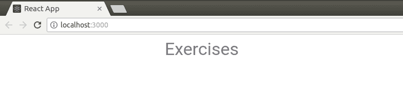

“Display 1” sized heading with bottom margin centered horizontally

我们有了一个好的开始！`Typography`组件带有一组预定义的[类型尺寸](https://material-ui-next.com/style/typography/#component)。其他的`variant`包括`body1`、`title`、`display2`等等。在其他内置的道具中有`align`，我们在这里使用它来水平居中文本，还有`gutterBottom`，它增加了底部边距。

为什么我们不把这扩展成一种形式，这样我们就可以创建自己的练习了？我们将从一个`TextField`开始，并将其绑定到状态上的`title`

```
import Typography from '@material-ui/core/Typography'import TextField from '@material-ui/core/TextField'
```

```
...
```

```
 handleChange = ({ target: { name, value } }) =>    this.setState({      [name]: value    })
```

```
 render() {    const { title } = this.state    return (      ...      <form>        <TextField          name='title'          label='Exercise'          value={title}          onChange={this.handleChange}          margin='normal'        />      </form>    )  }}
```

当然，我们需要通过用父元素包装`Typography`和`form`来让 React 开心。对于纸质卡片样的背景，还有什么更好的机会呢？那就让我们联系`Paper`

```
import Paper from '@material-ui/core/Paper'
```

```
...
```

```
 render() {      const { title } = this.state      return <Paper>        ...      </Paper>    }  }}
```

也是时候开始使用命名导入了(假设我们的 Webpack 设置允许树抖动):

```
import { Paper, Typography, TextField } from '@material-ui/core'
```

太棒了。没有提交按钮的表单有什么用？`Button` s 是 Material-UI 中的主要组件；你会在任何地方看到他们。举个例子，

```
import {  Paper,  Typography,  TextField,  Button } from '@material-ui/core'...        <Button          type='submit'          color='primary'          variant='raised'        >          Create        </Button>      </form>    </Paper>  }}
```

它应该读起来不错。`type`是一个常规的 React 道具，`color`和`variant`是特定于材质的 UI，组成了一个长方形的按钮。例如，另一个变体是浮动按钮的`fab`。

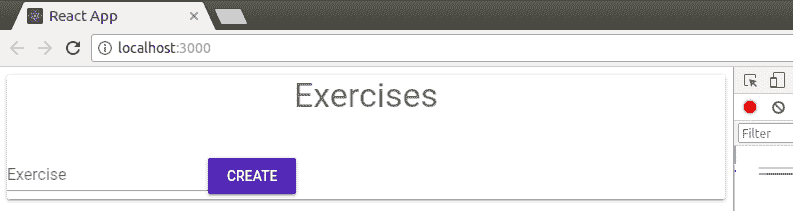

Not the world’s prettiest form, but we’ll make it look better in a moment!

虽然它没做多少。我们必须拦截表单提交事件

```
 return <Paper>      ...      <form onSubmit={this.handleCreate}>        ...      </form>    </Paper>  }}
```

然后用

```
 handleCreate = e => {    e.preventDefault()
```

```
 if (this.state.title) {      this.setState(({ exercises, title }) => ({        exercises: [          ...exercises,          {            title,            id: Date.now()          }        ],        title: ''      }))    }  }
```

哇哦。那个神秘的代码是什么意思？很快，我们

1.  防止默认页面重新加载
2.  检查`title`字段是否非空
3.  使用[更新函数](https://reactjs.org/docs/state-and-lifecycle.html#state-updates-may-be-asynchronous)设置状态，以减少异步更新
4.  从`prevState`对象上析构`exercises`和`title`
5.  用一个新的练习对象展开下一个状态的`exercises`
6.  重置`title`清除输入域

我想我应该提到我也爱上了 ES6。我们不都是吗？

#### 但是我们如何列出它们呢？

现在是时候了。有列表组件吗？当然，你这个笨鹅！

在一个`List`中，我们将循环遍历我们的`exercises`,并返回一个`ListItem`,其中每个都有一些`ListItemText`

```
import { List, ListItem, ListItemText } from '@material-ui/core'
```

```
...
```

```
 render() {    const { title, exercises } = this.state    return <Paper>          ...      <List>        {exercises.map(({ id, title }) =>          <ListItem key={id}>            <ListItemText primary={title} />          </ListItem>        )}      </List>    </Paper>  }}
```

让我们也对一些初始练习进行硬编码，以便在屏幕上显示一些内容。你猜对了，所有举重训练的三位一体，女士们先生们:

```
 state = {    exercises: [      { id: 1, title: 'Bench Press' },      { id: 2, title: 'Deadlift' },      { id: 3, title: 'Squats' }    ],    title: ''  }
```

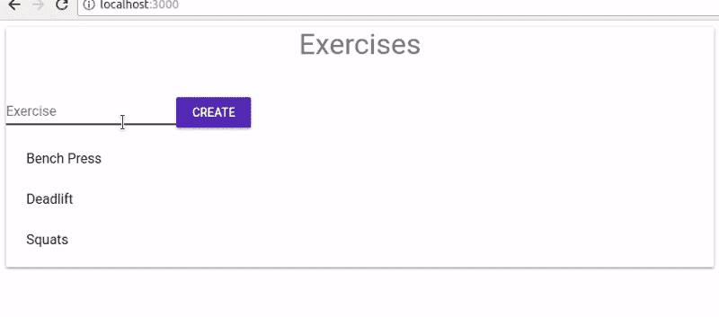

We can now create and list our exercises!

最后但并非最不重要的是，我们的用户很可能会打错字，所以我们最好在每个练习旁边添加一个删除按钮，这样他们就可以删除列表中不再需要的条目。

我们可以使用`ListItemSecondaryAction`来做到这一点。放在列表项的最右边，它可以容纳一个辅助控件元素，比如一个带有某些动作的`IconButton`

```
import {  /*...*/,  ListItemSecondaryAction,  IconButton} from '@material-ui/core'
```

```
...
```

```
 <ListItem key={id}>            <ListItemText primary={title} />            <ListItemSecondaryAction>              <IconButton                color='primary'                onClick={() => this.handleDelete(id)}              >                {/* ??? */}              </IconButton>            </ListItemSecondaryAction>          </ListItem>
```

```
...
```

我们也不要忘记删除处理程序:

```
 handleDelete = id =>    this.setState(({ exercises }) => ({      exercises: exercises.filter(ex => ex.id !== id)    }))
```

这将简单地将我们的练习过滤到那些与需要删除的练习的`id`不匹配的练习。

#### 我们可以在按钮里面放一个垃圾桶图标吗？

是的，那太好了！尽管你可以将谷歌 CDN 上的[材质图标](http://google.github.io/material-design-icons/#icon-font-for-the-web)直接与`Icon`或`SvgIcon`组件一起使用，但最好还是使用现成的预设。

幸运的是，有一个 Material-UI [包](https://www.npmjs.com/package/@material-ui/icons)可以解决这些问题

```
yarn add @material-ui/icons# or npm i @material-ui/icons
```

它将 900 多个官方材质图标作为 React 组件导出，图标名称几乎相同，如下图所示。

假设我们想添加一个垃圾桶图标。我们将首先前往[material.io/icons](https://material.io/icons/)寻找它的准确名称

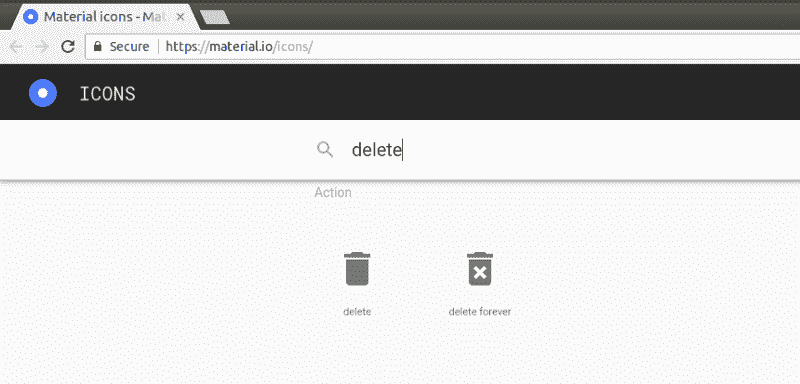

Google offers two variations of the trash icon, “delete” and “delete forever”

然后，我们在导入路径中将该名称转换成 PascalCase

```
import Delete from '@material-ui/icons/Delete'
```

就像 Material-UI 组件一样，如果您的设置启用了树抖动，您可以将导入缩短为

```
import { Delete } from '@material-ui/icons'
```

这在一次导入几个图标时特别有用。

现在我们有了垃圾桶图标，让我们把它显示在删除按钮中

```
<IconButton color='primary' onClick={() => this.handleDelete(id)}>  <Delete /></IconButton>
```

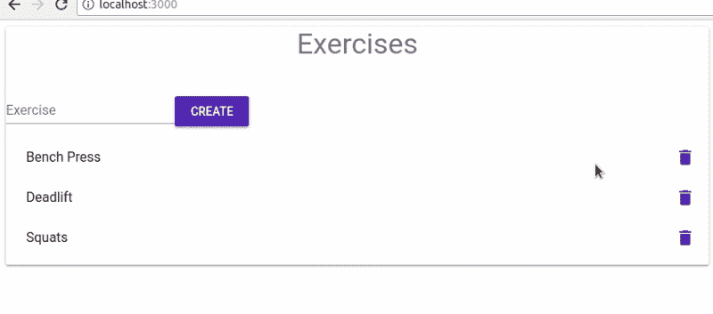

And with that, our CRUD app MVP can be considered done!

#### 怎样才能让窗体看起来不那么难看？

啊，造型。我以为你不会问了！轻轻碰一下 CSS 不会有什么坏处。那么，我们导入一个带有全局样式的外部样式表吗？或者，也许，使用 [CSS 模块](https://github.com/css-modules/css-modules)并给我们的元素分配作用域类名？不完全是。

在底层，Material-UI 派生出一个 CSS-in-JS 库，称为 [react-jss](https://github.com/cssinjs/react-jss) 。

这是同一作者 Oleg Isonen 对 JSS 图书馆的反应集成。还记得我们一开始提到的吗？它的基本思想是让您能够在 JavaScript 中定义样式。让 JSS 在[和其他库](https://github.com/MicheleBertoli/css-in-js#readme)中脱颖而出的是它对 SSR 的支持、小的捆绑包大小和丰富的插件支持。

让我们试一试！在我们的`App`组件中，创建一个样式对象，就像处理内联样式一样。然后，拿出一个键，例如`root`，引用根`Paper`元素，并在 camelCase 中写出一些样式

```
const styles = {  root: {    margin: 20,    padding: 20,    maxWidth: 400  }}
```

接下来，从`material-ui`导入`withStyles` HOC

```
import { withStyles } from '@material-ui/core/styles'
```

并用它包装`App`组件，将`styles`对象作为参数传递

```
export default withStyles(styles)(  class App extends Component {    ...  })
```

> 请注意，您也可以将`withStyles` HOC 用作[装饰器](https://babeljs.io/docs/plugins/transform-decorators/)。记住，create-react-react [还不支持现成的装饰器](https://github.com/facebook/create-react-app/issues/214)，所以如果你坚持使用它们，你需要弹出或者 [fork](https://www.youtube.com/watch?v=I22TW-33dDE) 来调整配置。

这将把一个`classes` prop 注入到`App`中，包含一个为我们的`root`元素动态生成的类名

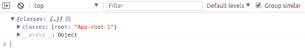

console.log(this.props) reveals a classes object

类名保证是唯一的，在生产版本中通常会被缩短。然后我们通过`className`属性将它分配给`Paper`

```
 render() {      const { title, exercises } = this.state      const { classes } = this.props
```

```
 return <Paper className={classes.root}>        ...      </Paper>    }
```

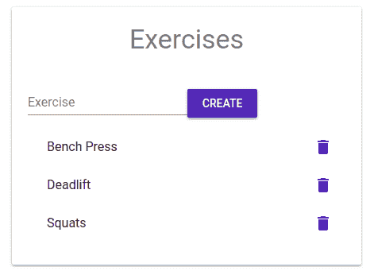

Paper component with basic styling applied

这个魔术是怎么运作的？原来，`withStyles`是负责脏活的。在幕后，它在`<sty` le >标签下向 DOM 注入了一组样式。如果你用开发工具挖掘 int `o the` <头像>，你就能发现它们

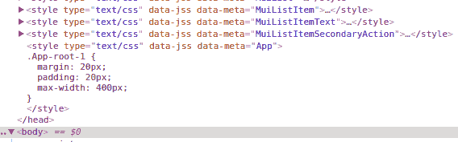

Aha! Here’s our styles for the App component.

您还可以看到其他与本地组件相关的`style`标签，比如我们之前导入的`ListItem`组件的`MuiListItem`。对于您导入的每个给定的 UI 元素，这些是根据需要自动注入的。

这意味着 *Material-UI 永远不会为我们不使用*的组件加载任何样式。因此，提高了性能和更快的加载时间。这与 [Bootstrap](https://getbootstrap.com/) 非常不同，后者需要加载整个单片 CSS 包，不管你是否碰巧使用了它的大量分类。

我们还要设计表单的样式，让它看起来更整洁

```
const styles = {  root: {    ...  },  form: {    display: 'flex',    alignItems: 'baseline',    justifyContent: 'space-evenly'  }}
```

这将使文本字段和按钮很好地隔开。如果您需要关于 Flexbox 布局的任何进一步说明，请随意参考 CSS-Tricks 中的 [align-items](https://css-tricks.com/almanac/properties/a/align-items/) 和 [justify-content](https://css-tricks.com/almanac/properties/j/justify-content/) 。

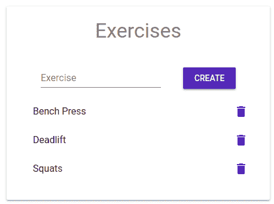

This will hopefully appease our hunger for esthetics.

#### 当然，但是主题化是怎么回事？

HOC 是为定制一次性组件而定制的，但它不适合应用程序范围的覆盖。每当你需要对 Material-UI 中的所有组件应用全局更改时，你的第一反应会是接触到`theme`对象。

主题旨在控制 UI 元素的颜色、间距、阴影和其他样式属性。Material-UI 带有内置的*亮*和*暗*主题类型，默认为亮。

如果我们将我们的`styles`转换成一个匿名函数，它将接收`theme`对象作为一个参数，因此我们可以检查它

```
const styles = theme => console.log(theme) || ({  root: ...,  form: ...})
```

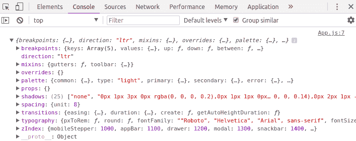

Default theme object with config variables, as seen in the console

你定制主题的方式是通过[配置变量](https://material-ui-next.com/customization/themes/#theme-configuration-variables)，像`palette`、`type`、`typography`等。要仔细查看所有嵌套的属性和选项，请访问 Material-UI 文档的[默认主题](https://material-ui-next.com/customization/default-theme/)部分。

假设我们想要将原色从`blue`更改为`orange`。首先，我们需要用`index.js`中的`createMuiTheme`助手创建一个主题

```
import { createMuiTheme } from '@material-ui/core/styles'
```

```
const theme = createMuiTheme({ /* config */ })
```

在 Material-UI 中，颜色在`theme`的`palette`属性下定义。调色板细分为意图，包括`primary`、`secondary`和`error`。要定制意图，只需提供一个颜色对象

```
import { orange } from '@material-ui/core/colors'
```

```
const theme = createMuiTheme({  palette: {    primary: orange  }})
```

应用时，将计算`light`、`main`、`dark`和`contrastText`变化的颜色。不过，为了更细粒度的控制，您可以传入一个带有这四个键中任何一个的普通对象

```
const theme = createMuiTheme({  palette: {    primary: {      light: orange[200] // same as '#FFCC80',      main: '#FB8C00', // same as orange[600]      dark: '#EF6C00',      contrastText: 'rgb(0,0,0)'    }  }})
```

如您所见，单个颜色可以表示为一个十六进制或 rgba 字符串(`#FFCC80`)和一个[色调/阴影对](https://material-ui-next.com/style/color/) ( `orange[200]`)。

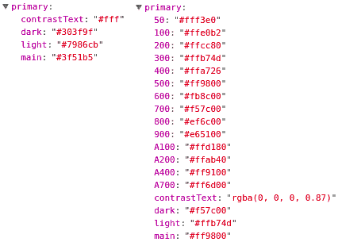

Primary intention with the default blueish colors (left) and orange color object (right)

仅仅创造一个主题是不够的。要覆盖默认主题，我们需要将`MuiThemeProvider`放在应用程序的根目录，并将自定义的`theme`作为道具传递

```
import { /*...*/, MuiThemeProvider } from '@material-ui/core/styles'
```

```
const theme = createMuiTheme({  palette: {    primary: orange  }})
```

```
render(  <MuiThemeProvider theme={theme}>    <App />  </MuiThemeProvider>,  document.getElementById('root'))
```

`MuiThemeProvider`将通过 React 上下文将`theme`传递给它的所有子元素。

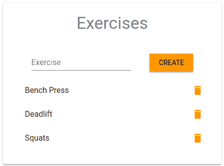

UI elements that inherit the primary color are now displayed in orange.

尽管改变一种颜色似乎需要做很多工作，但是请记住，这种覆盖将会传播到嵌套在提供者下的所有组件。除了颜色，我们现在可以微调视窗大小、间距、不透明度和许多其他参数。

在设计组件样式时使用配置变量将有助于应用程序 UI 的一致性和对称性。例如，我们可以依赖主题外的间距单位，而不是在我们的`Paper`组件上硬编码`margin`和`padding`的神奇值

```
const styles = ({ spacing: { unit } }) => ({  root: {    margin: unit,    padding: unit * 3,    maxWidth: 400  },  form: ...}
```

默认情况下,`theme.spacing.unit`来自`8px`,但如果它在整个应用程序中统一使用，当我们需要更新它的值时，而不是在整个代码库中搜索，我们只需要在一个地方更改它，即在我们传递给`createMuiTheme`的选项对象中。

主题变量是丰富的，如果您遇到内置主题对象没有覆盖的用例，您总是可以定义自己的[定制变量](https://material-ui-next.com/customization/themes/#custom-variables)。这是我们的健身应用程序的一个略微修改的版本，展示了调色板、主题类型和间距单位选项

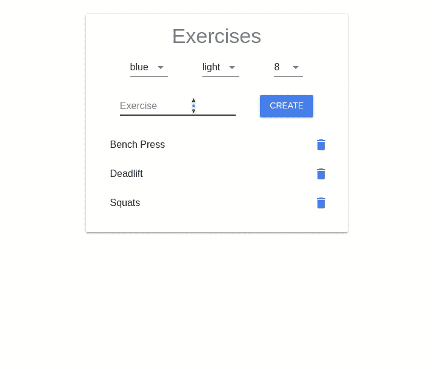

Switching between colors, types, and spacing units on the fly

注意，上面的例子只是一个演示。每当一个选项改变时，它都会重新创建一个新的主题，这导致一个新的 CSS 对象被重新计算并重新注入到 DOM 中。大多数情况下，你的主题配置将保持静态。

还有更多有趣的特性我们没有介绍。例如，Material-UI 带有一个选择加入的`CssBaseline`组件，该组件应用跨浏览器标准化，例如重置边距或字体系列(非常像 [normalize.css](http://necolas.github.io/normalize.css/) 所做的)。

至于组件，我们有标准的 12 列布局的`Grid`和五个视窗(`xs`、`sm`、`md`、`lg`和`xl`)。我们也有熟悉的组件，如`Dialog`、`Menu`和`Tabs`，以及元素，如`Chip`和`Tooltip`。事实上，还有很多其他的，幸运的是，它们都有来自 CodeSandbox 的可运行的演示代码


An example documentation page for the AppBar component [https://material-ui-next.com](https://material-ui-next.com)

除此之外，如果你喜欢的话，Material-UI Next 还可以和 [SSR](https://material-ui-next.com/guides/server-rendering/) 一起工作。此外，虽然它是 JSS 自带的，但它可以让我与任何其他的[库](https://material-ui-next.com/guides/interoperability/)一起工作，比如样式组件，甚至原始 CSS。

请务必查看官方文件以获取更多信息。

我希望你觉得这篇文章有用！如果你非常喜欢它，以至于你很想了解更多关于 Material-UI 或 React 的知识，那么看看我的 [YouTube 频道](https://www.youtube.com/c/CodeRealm)怎么样？

谢谢你的来访！非常感谢“呼叫所有人”的团队和所有帮助建造这个令人敬畏的❤️图书馆的支持者

干杯，

亚历克斯