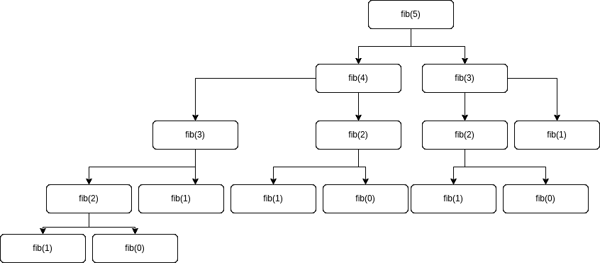
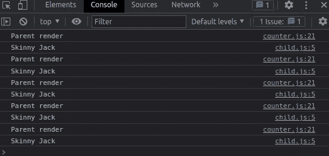
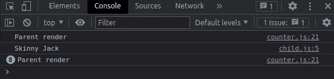
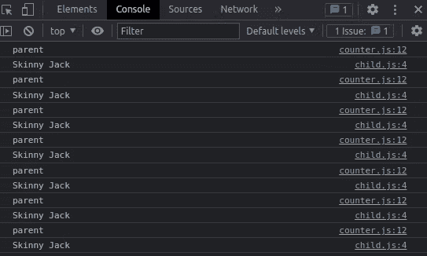

# 什么是记忆化？如何以及何时在 JavaScript 中记忆和反应

> 原文：<https://www.freecodecamp.org/news/memoization-in-javascript-and-react/>

大家好！在本文中，我们将讨论记忆化，这是一种优化技术，有助于提高繁重计算过程的效率。

我们将从讨论什么是记忆化以及何时实施记忆化最合适开始。稍后我们将给出 JavaScript 和 React 的实际例子。

## 目录

*   [什么是记忆](#what-is-memoization)
*   [记忆是如何工作的](#how-does-memoization-work)
*   [JavaScript 记忆示例](#javascript-memoization-example)
*   [反应记忆示例](#react-memoization-example)
    *   [纯组分](#pure-components)
    *   [纯组件类](#purecomponent-class)
    *   [备忘录高阶组件](#memo-higher-order-component)
    *   [何时使用 useCallback 挂钩](#when-to-use-the-usecallback-hook)
    *   [何时使用用户备忘录挂钩](#when-to-use-the-usememo-hook)
    *   [何时记忆](#when-to-memoize)
*   [综述](#round-up)

# 什么是记忆化？

在编程中，**记忆化是一种优化技术**,它使应用程序更有效，因此更快。它将计算结果存储在缓存中，并在下次需要时从缓存中检索相同的信息，而不是再次计算。

更简单地说，它包括在**缓存**中存储一个函数的输出，并在计算之前让函数检查每个所需的计算是否在缓存中。

一个**缓存**仅仅是一个临时的数据存储，用来保存数据，以便将来对该数据的请求可以得到更快的响应。

记忆化是一个简单但强大的技巧，可以帮助我们加速代码，特别是在处理重复和繁重的计算功能时。

# 记忆是如何工作的？

JavaScript 中记忆化的概念依赖于两个概念:

*   闭包:函数和声明该函数的词法环境的组合。你可以在这里和阅读更多关于 T2 和 T4 的信息。
*   **高阶函数**:对其他函数进行操作的函数，要么将它们作为参数，要么返回它们。你可以在这里阅读更多关于他们[的信息。](https://www.freecodecamp.org/news/higher-order-functions-in-javascript-examples/)

# JavaScript 记忆示例

为了澄清这个晦涩难懂的东西，我们将使用斐波那契数列的经典例子。

**斐波纳契数列**是一组数字，以 1 或 0 开始，后面跟着 1，并根据每个数字(称为斐波纳契数)等于前两个数字之和的规则进行。

看起来是这样的:

```
0, 1, 1, 2, 3, 5, 8, 13, 21, 34, 55, 89, 144, …
```

假设我们需要编写一个函数来返回斐波那契数列中的第 n 个元素。知道每个元素都是前两个元素的总和，递归解决方案可能如下:

```
const fib = n => {
  if (n <= 1) return 1
  return fib(n - 1) + fib(n - 2)
}
```

如果你不熟悉递归，它只是一个调用自身的函数的概念，带有某种避免无限循环的基本情况(在我们的例子中是`if (n <= 1)`)。

如果我们像`fib(5)`一样调用我们的函数，在后台我们的函数将像这样执行:



看到我们多次执行`fib(0), fib(1), fib(2) and fib(3)`。嗯，这正是记忆有助于解决的问题。

有了记忆化，没有必要一次又一次地重新计算相同的值——我们只需存储每次计算，并在需要时返回相同的值。

实现记忆化，我们的函数看起来像这样:

```
const fib = (n, memo) => {
    memo = memo || {}

    if (memo[n]) return memo[n]

    if (n <= 1) return 1
    return memo[n] = fib(n-1, memo) + fib(n-2, memo)
}
```

我们首先要做的是检查我们是否收到了作为参数的 **memo** 对象。如果没有，我们将它设置为一个空对象:

```
memo = memo || {}
```

然后，我们检查 memo 的键中是否包含作为参数接收的值。如果有，我们就返回。神奇的事情就发生在这里。一旦我们将值存储在 memo 中，就不需要更多的递归。=)

```
if (memo[n]) return memo[n]
```

如果我们还没有 memo 中的值，我们再次调用 **fib** ，但是现在传递 **memo** 作为参数，所以我们调用的函数将共享我们在“原始”函数中拥有的相同的记忆值。请注意，我们在返回最终结果之前将其添加到缓存中。

```
return memo[n] = fib(n-1, memo) + fib(n-2, memo)
```

就是这样！通过两行代码，我们实现了记忆化，并显著提高了函数的性能！

# 反应记忆示例

在 React 中，我们可以通过使用内存化来避免不必要的组件重新呈现，从而优化我们的应用程序。

正如我在另一篇关于在 React 中管理状态的文章[中提到的，组件的重新呈现有两个原因:状态的**变化或者道具**的**变化。这正是我们可以“缓存”的信息，以避免不必要的重新渲染。**](https://www.freecodecamp.org/news/how-to-manage-state-in-a-react-app/)

但是在我们跳到代码之前，让我们先介绍一些重要的概念。

## 纯成分

React 支持类组件或功能组件。功能组件是返回 JSX 的普通 JavaScript 函数，类组件是扩展 React 的 JavaScript 类。组件并在呈现方法中返回 JSX。

那么什么是纯成分呢？好吧，基于函数式编程范例中的纯概念，一个函数被认为是纯的，如果:

*   它的返回值仅由其输入值决定
*   对于相同的输入值，其返回值总是相同的

同样，如果 React 组件为相同的状态和属性呈现相同的输出，则它被认为是纯的。

一个功能性的纯组件可能是这样的:

```
// Pure component
export default function PureComponent({name, lastName}) {
  return (
    <div>My name is {name} {lastName}</div>
  )
}
```

看到我们传递两个道具，组件渲染那两个道具。如果道具是一样的，渲染也是一样的。

另一方面，比方说，我们在渲染之前给每个道具添加一个随机数。那么输出可能会不同，即使道具保持不变，所以这将是一个不纯的组件。

```
// Impure component
export default function ImpurePureComponent({name, lastName}) {
  return (
    <div>My "impure" name is {name + Math.random()} {lastName + Math.random()}</div>
  )
}
```

与类组件相同的示例有:

```
// Pure component
class PureComponent extends React.Component {
    render() {
      return (
        <div>My "name is {this.props.name} {this.props.lastName}</div>
      )
    }
  }

export default PureComponent
```

```
// Impure component
class ImpurePureComponent extends React.Component {
    render() {
      return (
        <div>My "impure" name is {this.props.name + Math.random()} {this.props.lastName + Math.random()}</div>
      )
    }
  }

export default ImpurePureComponent
```

## PureComponent 类

对于**类的纯组件**，React 提供了`PureComponent`基类来实现记忆化。

扩展了`React.PureComponent`类的类组件有一些性能改进和渲染优化。这是因为 React 为它们实现了`shouldComponentUpdate()`方法，并对道具和状态进行了**浅层比较。**

让我们看一个例子。这里我们有一个类组件，它是一个计数器，用按钮来改变计数器的加减数。我们还有一个子组件，我们向它传递一个字符串属性名。

```
import React from "react"
import Child from "./child"

class Counter extends React.Component {
    constructor(props) {
      super(props)
      this.state = { count: 0 }
    }

    handleIncrement = () => { this.setState(prevState => {
        return { count: prevState.count - 1 };
      })
    }

    handleDecrement = () => { this.setState(prevState => {
        return { count: prevState.count + 1 };
      })
    }

    render() {
      console.log("Parent render")

      return (
        <div className="App">

          <button onClick={this.handleIncrement}>Increment</button>
          <button onClick={this.handleDecrement}>Decrement</button>

          <h2>{this.state.count}</h2>

          <Child name={"Skinny Jack"} />
        </div>
      )
    }
  }

  export default Counter 
```

子组件是一个**纯组件**，它只是渲染接收到的道具。

```
import React from "react"

class Child extends React.Component {
    render() {
      console.log("Skinny Jack")
      return (
          <h2>{this.props.name}</h2>
      )
    }
  }

export default Child
```

请注意，我们已经将 console.logs 添加到了两个组件中，这样我们就可以在每次渲染时获得控制台消息。说到这里，猜猜当我们按下递增或递减按钮时会发生什么？我们的控制台将如下所示:



子组件正在重新渲染，即使它总是收到相同的道具。

为了实现记忆化并优化这种情况，我们需要扩展子组件中的`React.PureComponent`类，如下所示:

```
import React from "react"

class Child extends React.PureComponent {
    render() {
      console.log("Skinny Jack")
      return (
          <h2>{this.props.name}</h2>
      )
    }
  }

export default Child
```

之后，如果我们按下递增或递减按钮，我们的控制台将如下所示:



只有子组件的初始渲染，当道具没有改变时没有不必要的重新渲染。小菜一碟。；)

至此，我们已经涵盖了类组件，但是在功能组件中，我们不能扩展`React.PureComponent`类。相反，React 提供了一个特设和两个挂钩来处理记忆化。

## **备忘录高阶组件**

如果我们将前面的例子转换为功能组件，我们将得到以下结果:

```
import { useState } from 'react'
import Child from "./child"

export default function Counter() {

    const [count, setCount] = useState(0)

    const handleIncrement = () => setCount(count+1)
    const handleDecrement = () => setCount(count-1)

    return (
        <div className="App">
            {console.log('parent')}
            <button onClick={() => handleIncrement()}>Increment</button>
            <button onClick={() => handleDecrement()}>Decrement</button>

            <h2>{count}</h2>

            <Child name={"Skinny Jack"} />
        </div>                    
    )
}
```

```
import React from 'react'

export default function Child({name}) {
console.log("Skinny Jack")
  return (
    <div>{name}</div>
  )
}
```

如果不必要地重新呈现子组件，这将引发与以前相同的问题。为了解决这个问题，我们可以将我们的子组件包装在`memo`高阶组件中，如下所示:

```
import React from 'react'

export default React.memo(function Child({name}) {
console.log("Skinny Jack")
  return (
    <div>{name}</div>
  )
})
```

一个**高阶组件或 HOC** 类似于 javascript 中的一个高阶函数。高阶函数是以其他函数作为参数或返回其他函数的函数。React HOCs 将一个组件作为道具，在不改变组件本身的情况下操纵它达到某种目的。你可以把它想象成包装组件。

在这种情况下，`memo`做了与`PureComponent`相似的工作，避免了对它所包装的组件进行不必要的重新渲染。

## 何时使用 useCallback 挂钩

值得一提的是，如果传递给组件的属性是一个函数，memo 就不起作用。让我们重构我们的例子来看看这个:

```
import { useState } from 'react'
import Child from "./child"

export default function Counter() {

    const [count, setCount] = useState(0)

    const handleIncrement = () => setCount(count+1)
    const handleDecrement = () => setCount(count-1)

    return (
        <div className="App">
            {console.log('parent')}
            <button onClick={() => handleIncrement()}>Increment</button>
            <button onClick={() => handleDecrement()}>Decrement</button>

            <h2>{count}</h2>

            <Child name={console.log('Really Skinny Jack')} />
        </div>                    
    )
}
```

```
import React from 'react'

export default React.memo(function Child({name}) {
console.log("Skinny Jack")
  return (
    <>
        {name()}
        <div>Really Skinny Jack</div>
    </>
  )
})
```

现在我们的道具是一个总是记录相同字符串的函数，我们的控制台看起来又是这样的:



这是因为在现实中，每个父组件重新渲染时都会创建一个新函数。因此，如果一个新的函数被创建，这意味着我们有了一个新的道具，这意味着我们的子组件也应该重新呈现。

为了处理这个问题，react 提供了 **useCallback** 钩子。我们可以通过以下方式实现它:

```
import { useState, useCallback } from 'react'
import Child from "./child"

export default function Counter() {

    const [count, setCount] = useState(0)

    const handleIncrement = () => setCount(count+1)
    const handleDecrement = () => setCount(count-1)

    return (
        <div className="App">
            {console.log('parent')}
            <button onClick={() => handleIncrement()}>Increment</button>
            <button onClick={() => handleDecrement()}>Decrement</button>

            <h2>{count}</h2>

             <Child name={ useCallback(() => {console.log('Really Skinny Jack')}, [])  } />
        </div>                    
    )
} 
```

这解决了不必要的子元素重新渲染的问题。

useCallback 所做的是保持函数值不变，尽管父组件重新呈现，因此只要函数值保持不变，子属性也将保持不变。

要使用它，我们只需要将 useCallback 钩子放在我们声明的函数周围。在钩子中的数组中，我们可以声明变量，当变量发生变化时，这些变量将触发函数值的变化(与 useEffect 的工作方式完全相同)。

```
const testingTheTest = useCallback(() => { 
    console.log("Tested");
  }, [a, b, c]);
```

## 何时使用 useMemo 挂钩

**useMemo** 是一个非常类似于 useCallback 的钩子，但是它不是缓存一个函数，而是缓存一个函数的**返回值。**

在本例中，`useMemo`将缓存数字`2`。

```
const num = 1
const answer = useMemo(() => num + 1, [num]) 
```

而`useCallback`将缓存`() => num + 1`。

```
const num = 1
const answer = useMemo(() => num + 1, [num]) 
```

您可以使用与 memo HOC 非常相似的方式使用 useMemo。不同之处在于，useMemo 是一个带有依赖关系数组的钩子，而 Memo 是一个接受可选函数作为参数的特设函数，该函数使用 props 有条件地更新组件。

此外，useMemo 缓存呈现之间返回的值，而 Memo 缓存呈现之间的整个 react 组件。

## 什么时候回忆

React 中的内存化是一个很好的工具，但它不是你应该随处使用的东西。这些工具对于处理需要大量计算的功能或任务非常有用。

我们必须意识到，在后台，所有这三种解决方案也会增加我们代码的开销。因此，如果重新渲染是由计算量不大的任务引起的，那么用其他方式解决它或者不去管它可能会更好。

我推荐 Kent C. Dodds 的这篇文章，以获得更多关于这个话题的信息。

# **四舍五入**

就是这样，各位！一如既往，我希望你喜欢这篇文章，并学到一些新东西。如果你愿意，你也可以在 [LinkedIn](https://www.linkedin.com/in/germancocca/) 或 [Twitter](https://twitter.com/CoccaGerman) 上关注我。

干杯，下期再见！=D

