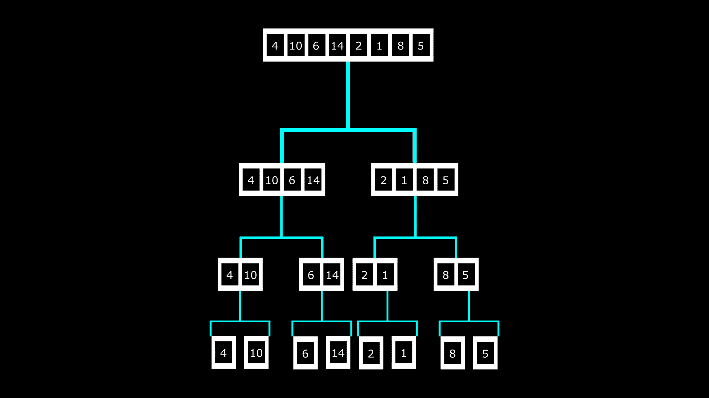
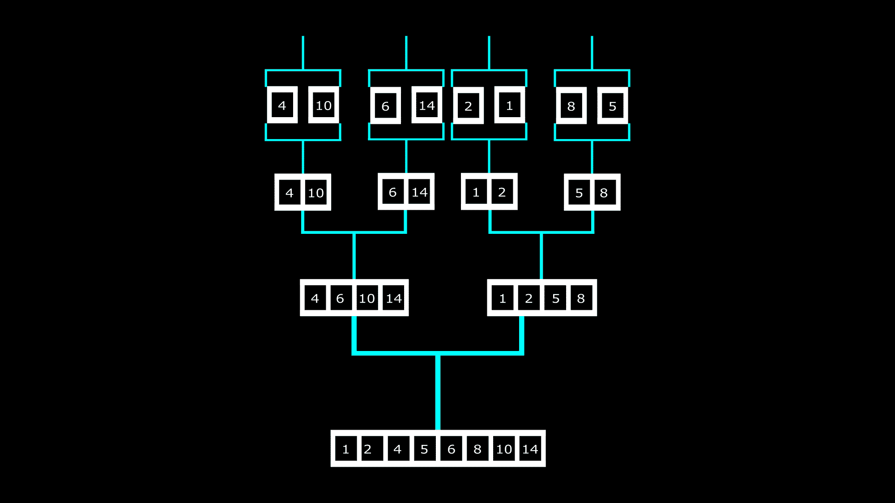
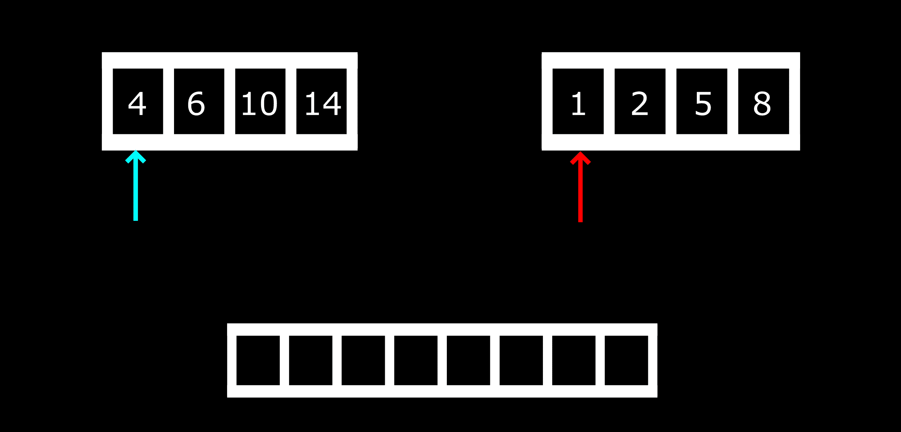
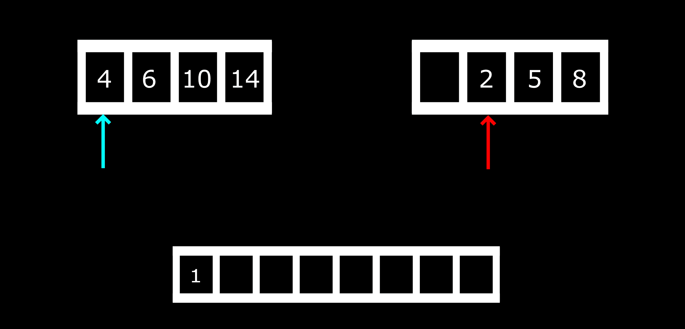
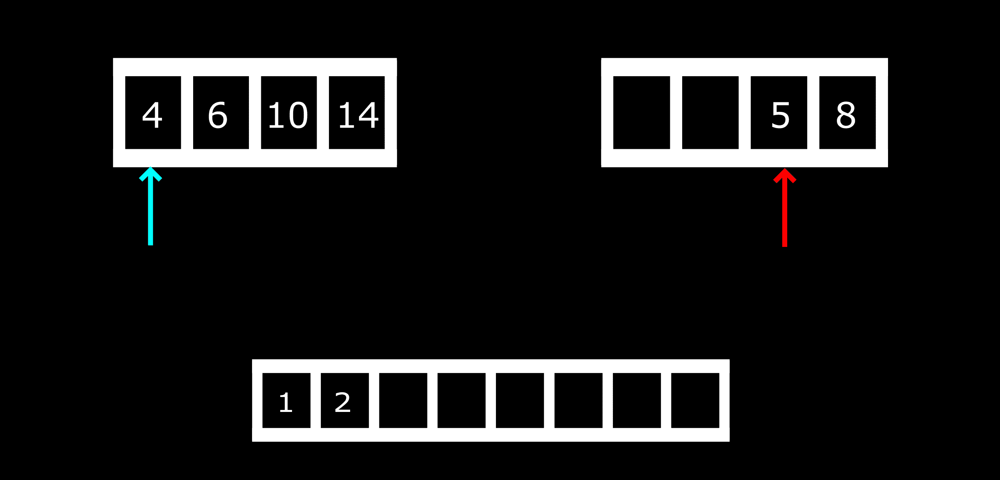

# 合并排序算法——具有时间复杂性的 Python 和 Java 示例

> 原文：<https://www.freecodecamp.org/news/merge-sort-algorithm-python-and-java-examples-with-time-complexity/>

在这篇文章中，我们讨论合并排序算法。我们将看到一些直观的例子来帮助理解算法，然后使用 Java 和 Python 代码实现它。

## 什么是合并排序算法？

合并排序算法是一种基于**分治**算法的高效排序算法。它将元素的集合(数组)划分为单个单元，然后以有序的方式将它们合并。

让我们看一个例子来理解合并排序是如何工作的。

我们将使用合并排序算法对这个数字数组进行排序:4，10，6，14，2，1，8，5

下图向您展示了“分割”过程:



该阵列首先被分成两个独立的阵列。然后那些数组也被划分了。这种分裂一直持续到数组中的所有元素变成一个单位。

在这个阶段之后，合并开始。这是如何发生的:



元素被重新组合成数组，但这次是按照排序的顺序。他们以同样的方式被分裂，他们正在被合并。

在我们使用代码实现这个算法之前，您应该理解我们如何能够按照排序的顺序收集这些元素。

我们将使用将元素重新分组为两个独立数组的部分——4，6，10，14 和 1，2，5，8。这里有一个图解，可以帮助我们理解最终阵列是如何形成的:



从上面可以看出，我们有两个箭头指向两个数组的第一个索引。将进行比较，以确定哪个指数更小。在我们的例子中，1 小于 4，所以将被推到合并的数组中。然后红色箭头将移动到下一个索引。那就是:



再做一个比较:2 < 4 吗？

2 小于 4，因此它将被推送到合并的数组，箭头移动到下一个索引。

为了下一次比较:



4 小于 5，所以 4 将被推送到合并的数组，青色箭头将移动到下一个索引。

这种比较将继续，直到合并的数组被填满。如果到达一个数组变空的点，剩下元素的数组将按排序顺序复制到合并的数组中。

让我们来看一些代码示例！

## **Java 中的合并排序示例**

如果我们想用 Java 实现合并排序，下面是它的样子:

```
public class MergeSort {
  public static void main(String[] args) {

    int[] numbers = {4, 10, 6, 14, 2, 1, 8, 5};

    mergeSort(numbers); 

    System.out.println("Sorted array:");
    for (int i = 0; i < numbers.length; i++) {
      System.out.println(numbers[i]);
    }
  }

  private static void mergeSort(int[] inputArray) {
    int arrayLength = inputArray.length;

    if (arrayLength < 2) {
      return;
    }

    int midPoint = arrayLength / 2;
    int[] leftArray = new int[midPoint];
    int[] rightArray = new int[arrayLength - midPoint];

    for (int i = 0; i < midPoint; i++) {
      leftArray[i] = inputArray[i];
    }
    for (int i = midPoint; i < arrayLength; i++) {
      rightArray[i - midPoint] = inputArray[i];
    }

    mergeSort(leftArray);
    mergeSort(rightArray);

    merge(inputArray, leftArray, rightArray);
  }

  private static void merge (int[] inputArray, int[] leftArray, int[] rightArray) {
    int leftArrayLength = leftArray.length;
    int rightArrayLength = rightArray.length;

    int x = 0;
    int y = 0;
    int z = 0;

    while (x < leftArrayLength && y < rightArrayLength) {
      if (leftArray[x] <= rightArray[y]) {
        inputArray[z] = leftArray[x];
        x++;
      }
      else {
        inputArray[z] = rightArray[y];
        y++;
      }
      z++;
    }

    while (x < leftArrayLength) {
      inputArray[z] = leftArray[x];
      x++;
      z++;
    }

    while (y < rightArrayLength) {
      inputArray[z] = rightArray[y];
      y++;
      z++;
    }

  }
} 
```

让我们来分解代码。

```
public static void main(String[] args) {

    int[] numbers = {4, 10, 6, 14, 2, 1, 8, 5};
    // 1, 2, 4, 5, 6, 8, 10, 14

    mergeSort(numbers); 

    System.out.println("Sorted array:");
    for (int i = 0; i < numbers.length; i++) {
      System.out.println(numbers[i]);
    }
  }
```

上面，我们创建了数字数组。之后，我们调用`mergeSort`方法对数字进行排序。然后，我们遍历排序后的数字数组，并将它们打印到控制台。

```
private static void mergeSort(int[] inputArray) {
    int arrayLength = inputArray.length;

    if (arrayLength < 2) {
      return;
    }

    int midPoint = arrayLength / 2;
    int[] leftArray = new int[midPoint];
    int[] rightArray = new int[arrayLength - midPoint];

    for (int i = 0; i < midPoint; i++) {
      leftArray[i] = inputArray[i];
    }
    for (int i = midPoint; i < arrayLength; i++) {
      rightArray[i - midPoint] = inputArray[i];
    }

    mergeSort(leftArray);
    mergeSort(rightArray);

    merge(inputArray, leftArray, rightArray);
  }
```

通过将数组长度除以 2，我们得到了数组的中点。左侧数组从第一个索引开始到中点，而右侧数组从中点后的索引开始到数组结束的位置。

然后，我们创建了两个循环，根据元素的位置将元素复制到左右数组中。然后我们在左右数组上调用了`mergeSort`方法。这将继续递归地分解数组，直到数组减少到单个单元(就像我们在上一节的图片中看到的那样)。

最后，我们调用了`merge`方法将数组按照排序后的顺序合并成一个数组。让我们来看看`merge`方法中使用的逻辑。

```
private static void merge (int[] inputArray, int[] leftArray, int[] rightArray) {
    int leftArrayLength = leftArray.length;
    int rightArrayLength = rightArray.length;

    int x = 0;
    int y = 0;
    int z = 0;

    while (x < leftArrayLength && y < rightArrayLength) {
      if (leftArray[x] <= rightArray[y]) {
        inputArray[z] = leftArray[x];
        x++;
      }
      else {
        inputArray[z] = rightArray[y];
        y++;
      }
      z++;
    }

    while (x < leftArrayLength) {
      inputArray[z] = leftArray[x];
      x++;
      z++;
    }

    while (y < rightArrayLength) {
      inputArray[z] = rightArray[y];
      y++;
      z++;
    }

  } 
```

还记得上一节图片中的箭头吗？我们在这里用`x`和`y`表示它们，然后用`z`表示合并后的数组，其中的数字将按排序顺序推入。

while 循环用于对两个数组进行比较，并在元素被推入合并后的数组时改变`x`、`y`和`z`的位置。

## **Python 中的插入排序示例**

```
 def mergeSort(array):
    if len(array) > 1:

        midPoint = len(array)//2
        leftArray = array[:midPoint]
        rightArray = array[midPoint:]

        mergeSort(leftArray)
        mergeSort(rightArray)

        x = 0
        y = 0
        z = 0

        while x < len(leftArray) and y < len(rightArray):
            if leftArray[x] < rightArray[y]:
                array[z] = leftArray[x]
                x += 1
            else:
                array[z] = rightArray[y]
                y += 1
            z += 1

        while x < len(leftArray):
            array[z] = leftArray[x]
            x += 1
            z += 1

        while y < len(rightArray):
            array[z] = rightArray[y]
            y += 1
            z += 1

def printSortedArray(array):
    for i in range(len(array)):
        print(array[i], end=" ")
    print()

if __name__ == '__main__':
    numbers = [4, 10, 6, 14, 2, 1, 8, 5]

    mergeSort(numbers)

    print("Sorted array: ")
    printSortedArray(numbers)
```

这里的逻辑与上一节完全相同。上面，我们使用 Python 实现了合并排序算法。你可以在最后一节找到代码如何工作的解释。

对于所有情况(最好、一般和最差)，合并排序的时间复杂度为 O(n*Log n)。

## 结论

在本文中，我们了解了合并排序算法是如何工作的。然后我们看到了一些例子，以及如何在我们的 Java 和 Python 代码中应用它。

编码快乐！