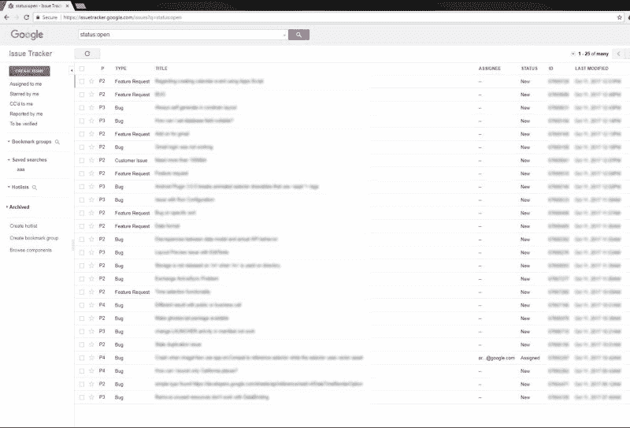
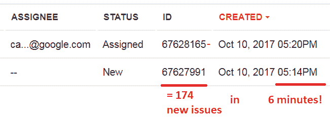
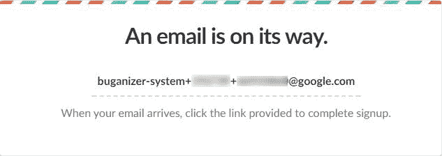
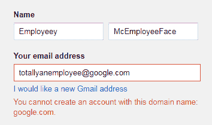
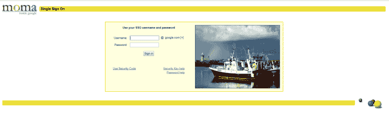
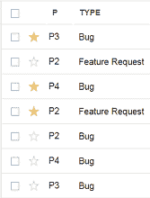
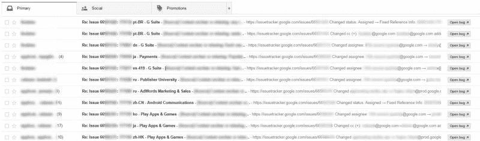

# 我是如何为了 15600 美元的奖金黑进谷歌的 bug 追踪系统的

> 原文：<https://www.freecodecamp.org/news/messing-with-the-google-buganizer-system-for-15-600-in-bounties-58f86cc9f9a5/>

亚历克斯·伯桑

# 我是如何为了 15600 美元的奖金黑进谷歌的 bug 追踪系统的

#### 硬通货的简单错误

你听说过谷歌问题跟踪器吗？可能不会，除非你是谷歌的员工或最近报告了谷歌工具中的错误的开发人员。我也没有，直到我注意到除了通常的电子邮件通知之外，我的漏洞报告现在通过在那里打开一个新线程来处理。

所以我立即开始尝试打破它。



那么这个网站到底是什么？根据文档，问题跟踪器(内部称为 Buganizer 系统)是谷歌内部使用的工具，用于在产品开发期间跟踪 bug 和功能请求。它在 Google 之外可供需要在特定项目上与 Google 团队合作的外部公众和合作伙伴用户使用。

换句话说，当有人对谷歌产品有**问题**时，它会进入**问题**跟踪器。有道理，对吧？作为外部用户，我们只能看到冰山一角:一小部分预先批准的类别，以及谷歌有人明确添加外部账户的问题，如**漏洞报告**。但是有多少信息隐藏在表面之下？



通过观察分配给最新公共线程的数字 id，我们可以很容易地估计这个工具在内部得到了多少使用。山景城上班时间每小时大约有**2000-3000 期**开放，其中只有 **0.1%** 是公开的。似乎这个系统的数据泄露会有很大的影响。让我们打破它！

### 尝试 1:获得一个谷歌员工账户

发现问题跟踪器后，我注意到的第一件事是可以通过向一个特殊的地址发送电子邮件来参与讨论，如下所示:

**buganizer-system+***componentID**+**issueID***@ Google . com**

(其中 *componentID* 是表示类别的数字，而 *issueID* 是您正在响应的线程的唯一标识符)

这让我想起了最近的一项发现，名为[票务骗局](https://medium.freecodecamp.org/how-i-hacked-hundreds-of-companies-through-their-helpdesk-b7680ddc2d4c)，它允许黑客通过利用这种电子邮件系统渗透到组织的聊天系统中。考虑到这是一个 **@google.com** 电子邮件地址，我试着用它注册了谷歌的 Slack 团队，我看到的确认页面看起来很有希望:



唉，没有来自 Slack 的电子邮件出现。

我能想到的下一个最好的办法是获得一个带有 **@google.com** 主电子邮件地址的谷歌账户，这有望给我在 Buganizer 上一些额外的特权。从谷歌外部注册这样一个账户是不被允许的:



然而，我找到了一个绕过这个过滤器的方法:如果我用任何其他虚假的电子邮件地址注册，但未能通过点击电子邮件收到的链接来确认帐户，我被允许更改我的电子邮件地址，没有任何限制。用这个方法，我把一个新鲜的 Google 账号的邮箱改成了`**buganizer-system+123123+67111111@google.com**` **。**

不久之后，我在相应的问题页面上收到了确认电子邮件:


不错！我点击确认链接，登录问题跟踪程序，然后…



我被重定向到公司登录页面。不，我的谷歌账户凭证在那里不起作用。真扫兴。

尽管如此，这个账户在互联网上的其他地方给了我很多额外的好处，包括可以免费搭车。)，所以当时还是一个安全问题，为恶意用户打开了很多大门。

接受: **11 小时** |赏金:**$ 3133.7**|优先级: **P1**

### 尝试 2:获得关于内部票证的通知

在熟悉 UI 时，另一个引起我注意的问题跟踪器功能是对项进行*标记的能力。*主演*一个问题意味着你对正在讨论的问题感兴趣，你想在有人添加评论时收到电子邮件通知。*



我注意到这个功能有趣的一点是，当我试图用它来解决我没有权限解决的问题时，很少出现错误。访问控制规则似乎从未应用于此端点，因此我登录到我的第二个帐户，并尝试通过替换请求中的问题 ID 从我的主帐户启动漏洞报告。然后，我看到了这条消息，这意味着该操作已经成功:

> 已有 1 人在本期中担任主角。

窥探公开的谷歌漏洞有那么容易吗？我很快在这个问题上发表了一个评论，看看我虚构的攻击者帐户是否会得到通知。


但还是没有邮件出现。

出于某种原因，我真的不记得，我决定做一些进一步的测试。所以我得到了一个最近的问题 ID，并推断出几千个 ID 的范围，这些 ID 应该与数据库中的最新问题一致。然后我给它们都打了星号。

几分钟后，我的收件箱看起来是这样的:



打开收件箱时，我的第一个想法是“中奖了！”。

然而，仔细观察一下，这些线程中并没有什么特别有趣的东西。显然，我只能偷听与翻译相关的对话，在那里人们会争论用不同的语言表达一个短语的意思的最佳方式。

我甚至考虑在几个小时内不要报告这件事，希望我能找到一种方法来提高严重性。最后，我意识到 Google 安全团队可能会对寻找可能的 pivot 方法和变体感兴趣，所以我发出了详细信息。

接受: **5 小时** |赏金:**、5000 美元** |优先级: **P0**

### 尝试 3:游戏结束

当您以外部用户身份访问问题跟踪器时，它的大部分功能都被取消了，留给您的权限极其有限。如果你想看看谷歌员工能做的所有很酷的事情，你可以在 JavaScript 文件中寻找 API 端点。这些功能中的一些被完全禁用，另一些只是隐藏在界面中。

在设计这个有限版本的系统时，有人很好地给我们留下了一个方法，让我们从 CCs 列表中删除自己，以防我们对某个问题失去兴趣或不想再收到关于它的电子邮件。这可以通过发送如下 POST 请求来实现:

```
POST /action/issues/bulk_edit HTTP/1.1
```

```
{   "issueIds":[      67111111,      67111112   ],   "actions":[      {         "fieldName":"ccs",         "value":"test@example.com",         "actionType":"REMOVE"      }   ]}
```

然而，我注意到这里的一些疏忽导致了一个巨大的问题:

1.  **不适当的访问控制:**在尝试执行给定的动作之前，没有明确检查当前用户实际上是否可以访问`issueIds`中指定的问题。
2.  **静默失败**:如果您提供了一个当前不在 CCs 列表中的电子邮件地址，端点将返回一条消息，声明该电子邮件已被成功删除。
3.  **完整的问题详细信息响应:**如果在操作过程中没有发生错误，系统的另一部分认为用户具有适当的权限。因此，关于给定问题 ID 的每个细节都将在 HTTP 响应主体中返回。

我现在可以通过替换上面请求中的`issueIds`来查看数据库中每个问题的详细信息。答对了。

我只尝试查看了几个连续的 id，然后从一个不相关的账户攻击自己，以确认这个问题的严重性。

是的，我可以看到关于漏洞报告的细节，以及 Buganizer 上托管的所有内容。

更糟糕的是，我可以在一个请求中泄漏关于多个票证的数据，因此实时监控所有内部活动可能不会触发任何速率限制器。

我立即将漏洞细节发送给谷歌，一小时后，他们的安全团队禁用了受影响的终端。令人印象深刻的响应时间！

接受: **1 小时** |赏金:**$ 7500**|优先级: **P0**

当我第一次开始寻找这种信息泄露时，我认为这将是谷歌漏洞的*圣杯*，因为它披露了所有其他漏洞的信息(例如，HackerOne 为类似的事情向[支付最低 10，000 美元](https://hackerone.com/security))。

但在找到它之后，我很快意识到影响将被最小化，因为所有危险的漏洞都会在一个小时内被消除。

我很高兴有额外的现金，并期待着在其他谷歌产品中发现错误。