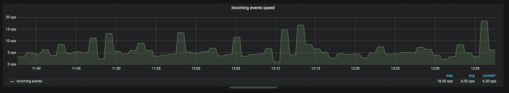
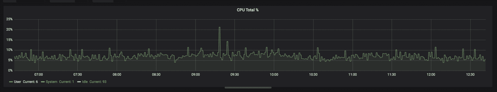
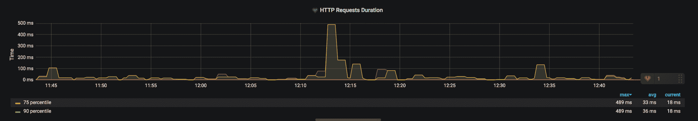
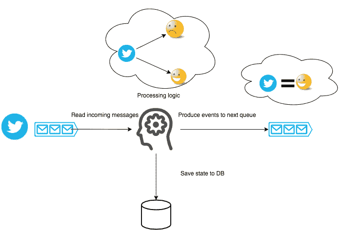
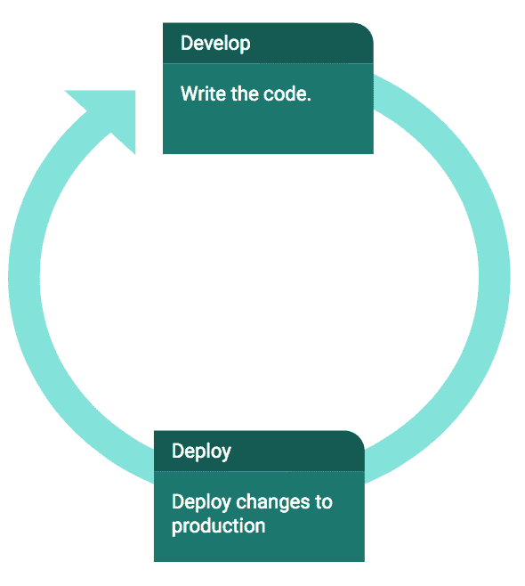
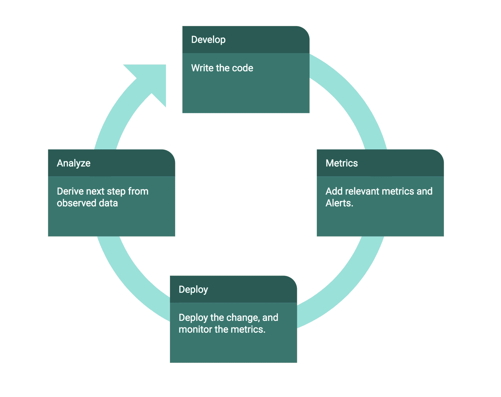
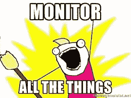
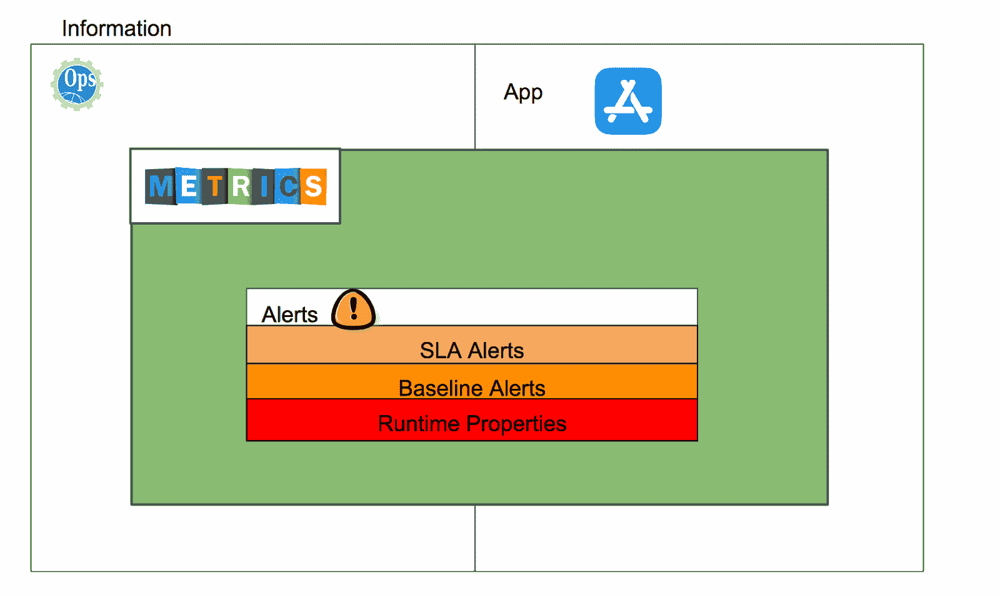
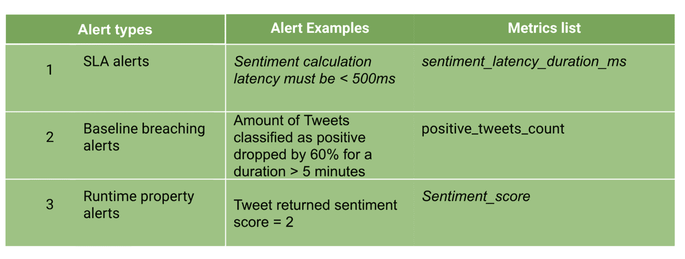
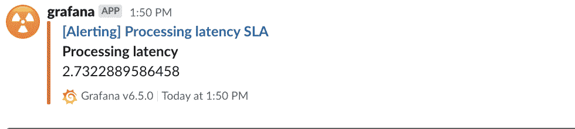

# 度量驱动开发简介:什么是度量，为什么要使用它们？

> 原文：<https://www.freecodecamp.org/news/metrics-driven-development/>

我在去年学到的最酷的事情之一是如何不断地将价值传递到生产中，而不引起太多的混乱。

在这篇文章中，我将解释度量驱动的开发方法，以及它是如何帮助我实现的。帖子结束时，你将能够回答以下问题:

*   什么是指标，为什么我应该使用它们
*   有哪些不同类型的指标
*   我可以使用什么工具来存储和显示指标
*   度量驱动开发的真实例子是什么

## 什么是指标，我为什么要使用它们？

度量使您能够在不改变代码的情况下收集正在运行的系统的信息。

它允许您在应用程序运行时获得关于其行为的有价值的数据，以便您可以根据实际的客户反馈和生产中的使用情况做出数据驱动的决策。

## 我可以使用哪些类型的指标？

以下是目前最常用的指标:

*   计数器—表示单调递增的值。



Counters are really useful for measuring rates!

在此示例中，计数器指标用于通过计算每秒的事件数来计算事件随时间的变化率

*   仪表-表示可以上升或下降的单个值。



Gauges are really useful for measuring CPU usage!

在本例中，使用一个度量标准来监控用户 CPU 的百分比

*   直方图—对可配置存储桶中的观察值(如请求持续时间或大小)进行计数。



Histograms are really useful for measuring request duration!

在本例中，直方图指标用于计算 HTTP 请求持续时间的第 75 和第 90 个百分点。

类型的位和字节:计数器、直方图和仪表可能相当混乱。试着在此阅读更多相关内容[。](https://prometheus.io/docs/concepts/metric_types/)

## 我可以使用什么工具来存储和显示指标？

大多数监控系统由几个部分组成:

1.  时序数据库—一种优化存储和服务[时序](https://en.wikipedia.org/wiki/Time_series)数据的数据库软件。这种数据库的两个例子是[耳语](https://graphite.readthedocs.io/en/latest/whisper.html)和[普罗米修斯](https://prometheus.io/)。
2.  查询引擎(使用查询语言)——常见查询引擎的两个例子是: [Graphite](https://graphiteapp.org/) 和 [PromQL](https://prometheus.io/docs/prometheus/latest/querying/basics/)
3.  警报系统—允许您根据查询语言创建的图形来配置警报的机制。系统可以将这些警报发送到 Mail、Slack、PagerDuty。常见警报系统的两个例子是:[格拉夫纳](https://grafana.com/)和[普罗米修斯](https://prometheus.io/)。
4.  UI —允许您查看由传入数据生成的图形，并配置查询和警报。常见 UI 系统的两个例子是: [Graphite](https://graphiteapp.org/) 和 [Grafana](https://grafana.com/)

我们今天在 [BigPanda 工程](https://medium.com/@bigpanda_engineering)中使用的设置是

*   [Telegraf](https://www.influxdata.com/time-series-platform/telegraf/) —用作 StatsD 服务器。
*   普罗米修斯 —用作我们的报废引擎、时序数据库和查询引擎。
*   [Grafana](https://grafana.com/) —用于报警和 UI

在选择这种堆栈时，我们考虑的约束条件是:

*   我们希望可扩展和弹性的指标刮
*   我们需要一个高性能的查询引擎
*   我们希望能够使用定制标签(如服务名、主机等)查询我们的指标。)

## 一个度量驱动的情感分析服务开发的真实例子

让我们开发一个新的管道服务，它基于文本输入计算情感，并以度量驱动的开发方式来完成！

假设我需要开发这个管道服务:



Sentiment analysis pipeline architecture

这是我通常的开发过程:



Usual development process - Test, code and deploy. Oh my!

所以我写了下面的实现:

```
let senService: SentimentAnalysisService = new SentimentAnalysisService();
while (true) {
    let tweetInformation = kafkaConsumer.consume()
    let deserializedTweet: { msg: string } = deSerialize(tweetInformation)
    let sentimentResult = senService.calculateSentiment(deserializedTweet.msg)
    let serializedSentimentResult = serialize(sentimentResult)
    sentimentStore.store(sentimentResult);
    kafkaProducer.produce(serializedSentimentResult, 'sentiment_topic', 0);
} 
```

完整的要点可以在这里找到[。](https://gist.github.com/dorsev/387800acee8d1b8e6af29c86101fedb8)

**和 t **他的方法非常管用****精细**** 。

****但是当它不**** 时会发生什么？


事实是，在工作时(在敏捷开发过程中)，我们会犯错误。这是生活的现实。

我相信犯错误的真正挑战不是避免它们，而是优化我们检测和修复它们的速度。所以，我们需要获得快速发现错误的能力。

是时候去 MDD 了。

## 度量驱动开发(MDD)方式


Behold! **The Three Commandments of Production!**

MDD 的方法很大程度上受到了生产三大戒律**的启发(这是我历经艰辛才了解到的)。**

******生产的三个**戒律是:********

1.  **您编写和部署的代码中存在错误和 bug。**
2.  **生产中流动的数据是不可预测的，并且 ****是唯一的！******
3.  **从 ****真实的客户反馈和生产中的使用**** 完善你的代码。**

**既然我们现在知道了 ****戒律**，**是时候回顾度量驱动开发过程的 4 步计划了。**

## **成功 MDD 的四步计划**

**

Metrics-driven development ?Oh wow!** 

### **开发代码**

**我编写代码，只要有可能，就用一个允许我逐渐向用户开放的特性标志来包装它。**

### **韵律学**

**这由两部分组成:**

****添加相关零件的指标****

**在这一部分中，我问自己，我可以定义哪些成功或失败的标准来确保我的功能正常工作？在这种情况下，我的新管道应用程序正确地执行了它的逻辑吗？**

**在它们上面添加提醒，这样当错误发生时我会得到提醒**

**在这一部分，我问自己，如果我忘记了什么或者没有正确地实现它，什么指标可以提醒我？**

### **部署**

**我部署代码并立即监控它，以验证它的行为符合我的预期。**

### **重复这个过程直到完美**

**就是这样！现在我们已经学习了这个过程，让我们来处理其中的一个重要任务。**

## **要报告的指标—我们应该监控什么？**

**当我在做《MDD》的时候，对我来说最棘手的问题之一是:“我应该监视什么”？**

**

That’s a lovely gif. but un-realistic in most cases.** 

**为了回答这个问题，让我们试着缩小范围，看看大图。
所有可用于监控的可能信息可分为两部分:**

1.  ******适用信息****——具有适用语境和意义的信息。这方面的一个例子是——“在过去的一个小时里，我们将多少条推文归类为正面的”？**
2.  ******运营信息**** —与我们应用周围的基础设施相关的信息—云数据、CPU 和磁盘利用率、网络使用情况等。**

**现在，由于我们无法监控所有信息，我们需要选择我们想要监控的应用和操作信息。**

*   **运营部分实际上依赖于您的运营体系，并且内置了满足(几乎)所有监控需求的解决方案。**
*   **应用部分更符合你的需求，我会在这篇文章的后面解释我是如何考虑的。**

**这样做之后，我们可以问自己这样一个问题:我们希望在刚刚定义的指标之上设置什么样的警报？**

**(信息、指标、警报的)图表可以这样绘制:**

**

The world of information, metrics, and alerts.** 

### **应用度量**

**我通常出于两种需要添加可应用的指标:**

#### **回答问题**

**问题类似于“当我的服务出现问题时，了解哪些信息会有帮助？”**

**这个问题的一些答案可能是—所有 IO 调用的延迟、处理速率、吞吐量等…**

**当你寻找答案时，这些问题中的大部分都会有所帮助。但是一旦你找到了，很可能你就不会再看它了(因为你已经知道答案了)。**

**这些问题通常由 RND 提出，并且(通常)用于内部收集信息。**

#### **添加警报**

**这听起来可能有些落后，但是我通常会添加可应用的指标，以便在它们之上定义警报。也就是说，我们定义警报列表，然后从中推导出要报告的适用指标。**

**这些警报源自产品的 SLA，通常被视为具有关键任务的重要性。**

## **常见的警报类型**

**警报可以分为三个部分:**

**

Alerts types to Metrics list** 

### **SLA 警报**

**

SLA alerts in reality** 

**[SLA](https://en.wikipedia.org/wiki/Service-level_agreement) 警报围绕我们系统中指定 SLA 以满足明确的客户或内部要求(即可用性、吞吐量、延迟等)的地方。).SLA 违约包括寻呼 RND 和唤醒人们，所以尽量减少此列表中的警报。**

**此外，除了 SLA 警报之外，我们还可以定义**降级警报。
降级警报定义的阈值比 SLA 警报低，因此有助于减少 SLA 违约数量——在违约发生之前给你适当的提醒。****

****SLA 警报的一个例子是，“所有情感请求必须在 500 毫秒内完成。”****

****降级警报的一个例子是:“所有情感请求必须在 400 毫秒内完成”。****

****这些是我定义的警报:****

1.  ****延迟—我希望单个请求持续时间的第 90 个百分点不超过 300 毫秒。****
2.  ****请求的成功/失败比率——我希望每秒的失败次数、每秒的成功次数保持在 0.01 以下。****
3.  ****吞吐量—我预计应用程序每秒处理的操作数(ops)将超过 200****
4.  ****数据大小—我希望我们一天存储的数据量不要超过 2GB。****

> ******200 ops * 60 字节(情感结果大小)*一天 86400 秒= 1GB<2GB******

### ****基线突破警报****

****这些警报通常涉及测量和定义基线，并确保它不会随着警报的发生而(急剧地)改变。****

****例如，一个事件的第 99 个处理延迟必须保持相对不变，除非我们对逻辑进行了重大更改。****

****这些是我定义的警报:****

1.  ****正面或中性或负面情绪推文的数量——如果出于任何原因，正面推文的数量急剧增加或减少，我可能在我的应用程序中的某个地方出现了错误。****
2.  ****所有延迟\请求成功率\吞吐量\数据大小不得随着时间的推移而急剧增加\减少。****

### ****运行时属性警报****

****我已经谈过基于属性的测试和它们疯狂的力量。事实证明，收集度量允许我们在生产系统 中的 ****上运行基于属性的测试！********

**我们系统的一些特性:**

1.  **因为我们使用来自 Kafka 主题的消息，所以处理的偏移量必须随时间单调增加。**
2.  **1 ≥情绪得分≥ 0**
3.  **一条推文应该分为负面\正面\中性。**
4.  **推文分类必须是唯一的。**

**这些警报帮助我确认:**

1.  **我们使用相同的组 id 进行阅读。在使用 Kafka 时，在部署中错误地更改消费者组 id 是一个常见的错误。这在生产中造成了许多混乱。**
2.  **情绪得分始终在 0 到 1 之间。**
3.  **推文类别长度应始终为 1。**

**为了定义这些警报，您需要从您的应用程序提交指标。点击[此处](https://gist.github.com/dorsev/181e84e091ae545cb7825b782faf9d20)查看完整的指标列表。**

**使用这些指标，我可以创建 ****警报**** ，每当这些属性中的一个在生产中不再适用时，它们就会“寻呼”我。**

**

Processing latency breached configured SLA! Oh my! ?** 

**让我们来看看所有这些指标的可能实现**

```
`import SDC = require("statsd-client");
let sdc = new SDC({ host: 'localhost' });
let senService: SentimentAnalysisService; //...
while (true) {
    let tweetInformation = kafkaConsumer.consume()
    sdc.increment('incoming_requests_count')
    let deserializedTweet: { msg: string } = deSerialize(tweetInformation)
    sdc.histogram('request_size_chars', deserializedTweet.msg.length);
    let sentimentResult = senService.calculateSentiment(deserializedTweet.msg)
    if (sentimentResult !== undefined) {
        let serializedSentimentResult = serialize(sentimentResult)
        sdc.histogram('outgoing_event_size_chars', serializedSentimentResult.length);
        sentimentStore.store(sentimentResult)
        kafkaProducer.produce(serializedSentimentResult, 'sentiment_topic', 0);
    }

}` 
```

 **完整的代码可以在[这里](https://gist.github.com/dorsev/d7737ed6a866cf98b026d47f4f7faae8)找到

****对上面代码例子的几点思考:****

1.  这个代码库中添加了数量惊人的指标。
2.  度量标准增加了代码库的复杂性，所以，像所有好的东西一样，负责任地适度添加它们。
3.  选择正确的度量名称很难。花点时间选择合适的名字。这里有一篇关于这个的极好的帖子。
4.  您仍然需要收集这些指标并在监控系统中显示它们(像 Grafana 一样)，并在它们之上添加警报，但这是另一篇文章的主题。

## 我们是否达到了识别问题并更快解决问题的最初目标？


YESSSS, it was!

我们现在可以确保应用延迟和吞吐量不会随着时间的推移而降低。此外，在这些指标上添加警报可以更快地发现和解决问题。

## 结论

度量驱动的开发与 CI\CD、DevOps 和敏捷开发过程携手并进。如果你正在使用以上任何一个关键词，那么你就来对地方了。

如果做得正确，度量标准会让您对部署更有信心，就像看到您的构建通过了单元测试会让您对自己编写的代码更有信心一样。

添加度量标准使您能够部署代码，并确信您的生产环境是稳定的，并且您的应用程序随着时间的推移会按预期运行。所以我鼓励你去尝试一下！

#### 一些参考

1.  这里有一个[链接](https://github.com/dorsev/MetricsSentimentAnalysis)到这篇文章中显示的代码，这里的是描述的完整指标列表。
2.  如果你渴望尝试编写一些指标，并将它们连接到一个监控系统，请查看一下[普罗米修斯](https://prometheus.io/docs/introduction/first_steps/)、[格拉法纳](https://grafana.com/docs/grafana/latest/guides/getting_started/)和可能的这个[帖子](https://dev.to/kirklewis/metrics-with-prometheus-statsd-exporter-and-grafana-5145)
3.  这个家伙写了一篇关于度量驱动开发的令人愉快的[帖子](https://sookocheff.com/post/mdd/mdd/)。去读吧。**