# 微处理器与负整数的罗曼史 CPU 算法设计的方式和原因

> 原文：<https://www.freecodecamp.org/news/microprocessors-romance-with-integers/>

我们对计算机了解的第一件事是，它们只理解**0 和 1**、**或**位**。**

另一方面，我们人类通过十进制来交流数字。这个系统使用从 0 到 9 的数字以及加号和减号(+和-)来表示正数或负数。

由于计算机只能使用两位数—**0 和 1——过去的工程师和数学家设计了巧妙的技术来表示负数和用它们做算术。让我们探索这些技术的美妙之处。**

## **首先，关于计算机如何工作的一些背景知识**

**软件、图像、文本、视频、数字以及介于两者之间的所有东西，在我们的电脑中处于最低层，都是 0 和 1。**

**对于图像、文本、视频和数字，我们有编码方案来决定这些东西如何变成 0 和 1。例如，文本的 ASCII 和 Unicode。**

**我们编写的软件程序通过编译器和汇编器得到 0 和 1。那些被称为机器代码(或机器指令)的 0 和 1 的集合首先被存储在我们计算机的主存储器(RAM)中，然后处理器才能执行它们。**

**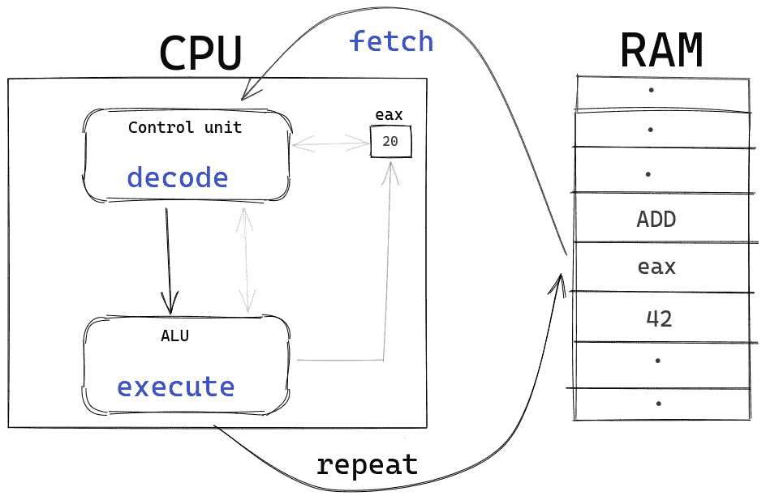

The fetch decode execute cycle architected by Sir [John von Neumann](https://en.wikipedia.org/wiki/John_von_Neumann). Every digital computer follows this cycle to run machine code.** 

**处理器通过**从主存储器获取**指令来开始执行周期，然后处理器的控制单元**将这些指令解码**成两部分——操作码(opcode)和操作数。**

**操作码决定了需要执行的进一步操作，如添加(加法)、JMP(跳转)、INC(递增)等。操作数是将对其执行运算的值(或内存位置)。**

**解码后的指令被送到算术逻辑单元(ALU)进行**执行**。在 ALU 中，根据操作数上的操作码执行指令，并将结果存储回内存中。**

**比如汇编代码`ADD eax, 42`先被汇编器变成机器码(0 和 1)。然后，在提取-解码-执行循环开始之前，将其存储到主存储器中。**

**当从存储器中取出`ADD eax, 42`的机器码后，指令被解码。解码后的输出表明操作码是`ADD`，操作数是`eax`和`42`。**

**`eax`是一个寄存器——处理器内置的一个内存位置，可以被处理器即时访问。在大多数处理器中，`eax`寄存器被称为累加器。**

**`ADD eax, 42`汇编代码设计为将`eax`寄存器(累加器)的当前值加 42，并将该总和存储在`eax`中。是`eax = eax + 42`。**

**假设目前`eax`是 20。这意味着执行`ADD eax, 42`后`eax`的值将是 20 + 42 = 62。**

**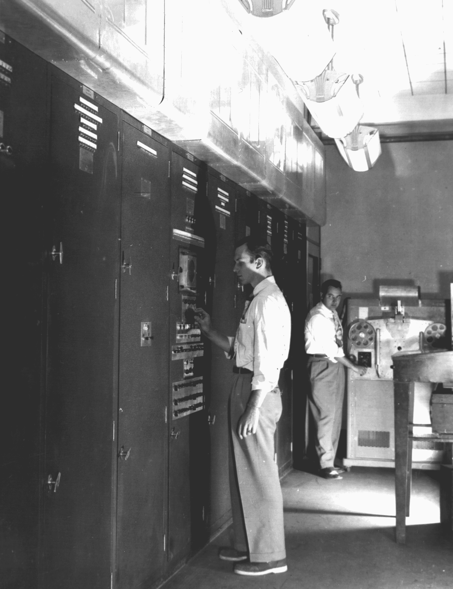

EDVAC was one of the earliest electronic binary computer built for the U.S. Army's Ballistics Research Laboratory. ([Image source](https://en.wikipedia.org/wiki/EDVAC#/media/File:Edvac.jpg), Public Domain).** 

**早期计算机(如 EDVAC)的设计始于让繁琐的数学计算变得更容易、更快的愿望。**

**让计算机进行计算的全部责任都落在了加法器的肩上——将两个数相加的电路。这是因为像减法、乘法和除法这样的复杂运算在电路中使用了加法器。**

**归根结底，计算机只是一台具有逻辑能力的快速运算机器。理解二进制算术设计(正整数和特别是负整数)的挑战和美丽是计算机处理器中最基本的概念之一。**

**我们先来看看十进制数是如何用二进制表示的，以及如何将两个二进制值相加。然后我们将开始探索美。**

## **二进制是如何工作的**

**如果我让你读出`872500`，你可能会说 **872.5K** 。让我们来看看我们的大脑是如何做到这一点的。**

**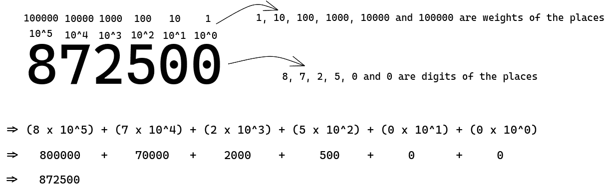**

**我们将 1 的位置分配给右边第一个数字，然后将 10 的位置分配给右边第二个数字，将百分之一的位置分配给第三个数字，依此类推，每次以 10 的幂递增。**

**每个地方的 10 次方就是地方的权重。第一百名的重量是一百。我们将每个位置的数字乘以它们所在位置的重量，然后将它们相加得到一个完整的数字。**

**在上图中，你可以看到每个地方权重的增长都是以 10 的幂为单位，从`10^0`开始，经过`10^5`。这就是为什么小数被称为十进制。**

**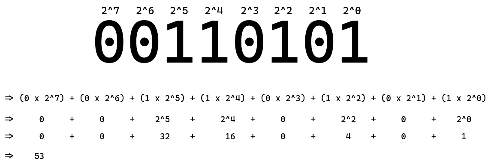**

**在二进制中，每个位置的权重以 2 的幂增长。这意味着该位置的权重从`2^0`开始，到`2^something`结束。这是唯一的区别。**

**`00110101`十进制翻译成 53。计算机解释二进制的方式和我们人类解释十进制的方式是一样的，就是将每个位置的数字乘以它的重量，然后求和。**

### **如何将 1 和 0 相加**

**二进制加法和十进制加法的工作方式非常相似。让我们通过一个例子来看看。我们将两个二进制数相加:`1101` (13)和`1100` (12)。**

**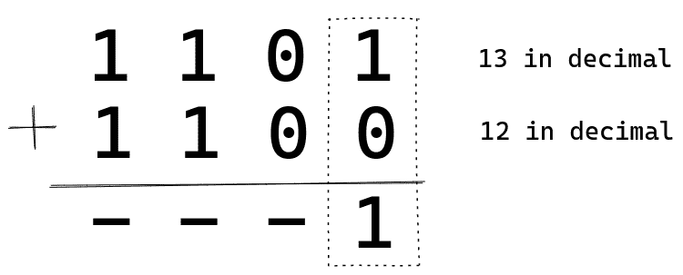**

**正如我们在十进制中所做的那样，我们从一的位置(`2^0`)开始。1 和 0 相加得到 1。所以我们在那里放了一个 1。和我呆在一起，你会了解整个情况。**

**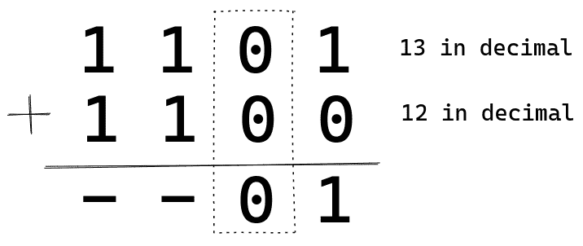**

**0 加 0 等于 0。继续前进。**

**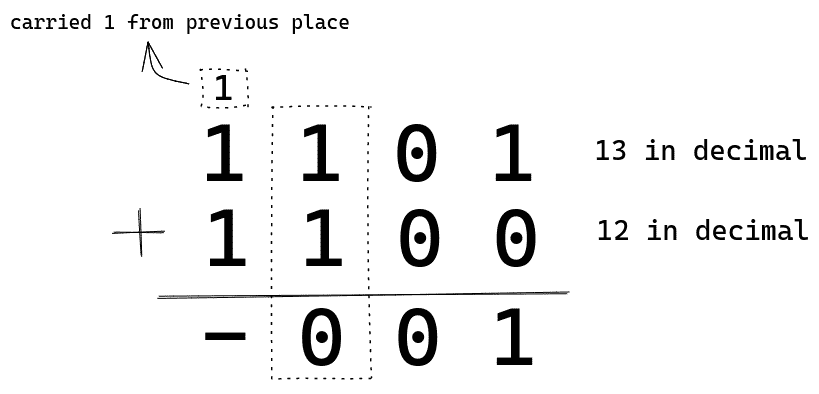**

**一加一等于二。而二进制中的 2 表示为`10`。我们将 1 进位到下一个位置，并保留 0 作为我们当前所处位置的结果。这和十进制加法中一个地方超过 9 不一样吗？**

**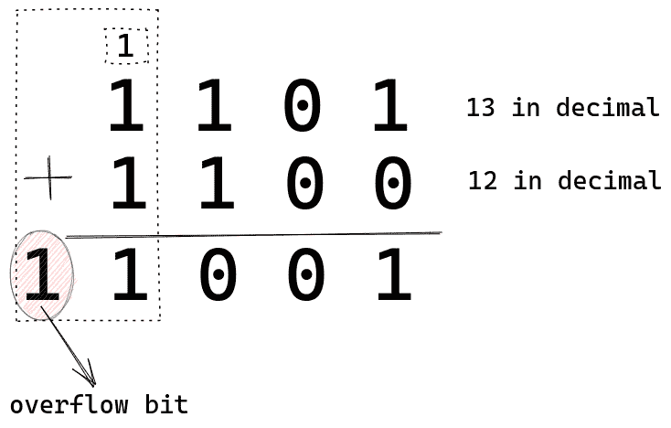**

**我们这里有两个 1，还有一个 1 是从上一个地方结转过来的，所以总共有三个 1。它们的和将是 3，在二进制中 3 是`11`，所以我们写`11`。最后的结果是`11001`或者十进制的 25，也就是 13 + 12。**

**上面的计算假设我们有五位可用于存储结果。如果一台 4 位计算机做这种加法，那么它将只有 4 位可用来存储结果。**

**在 4 位计算机中，第五位将被称为溢出位**。在整数运算中，溢出位被忽略或丢弃。因此，如果我们使用 4 位计算机，我们将得到`1001` (9)作为结果。****

## ****二进制算术设计之美****

****在继续之前，我们需要了解两个重要术语:最低有效位**和最高有效位**和**。******

******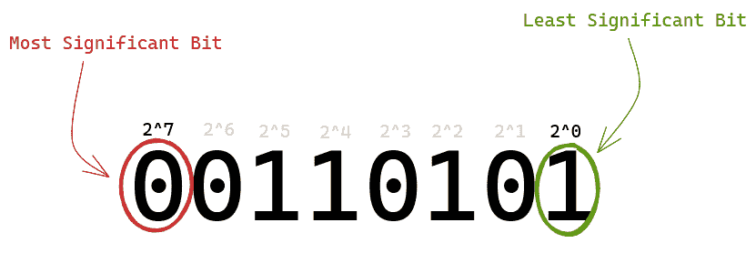******

******最右边的**位是最低有效位**，因为它具有最小的位置权重(`2^0`)。最左边的**上的位是最高有效位**，因为它具有最高的位置权重(`2^7`)。******

****如果世界上只有正数，那么这篇文章就结束了(因为我们已经学会了如何用二进制表示小数，以及如何用二进制相加)。****

****谢天谢地，我们也有负数。****

****CPU 的算术设计之美在于消极。****

****那么计算机是如何表示负数的，负数上的算术是如何工作的呢？让我们来看看这个问题的编码方法。****

****请注意，在下面的部分中，我们将使用 4 位计算机来理解这些概念，这意味着第 5 位将被视为溢出。同样的原则适用于所有的 CPU 架构，如 16 位、32 位或 64 位，以进行算术运算。****

### ****符号幅度编码方法****

****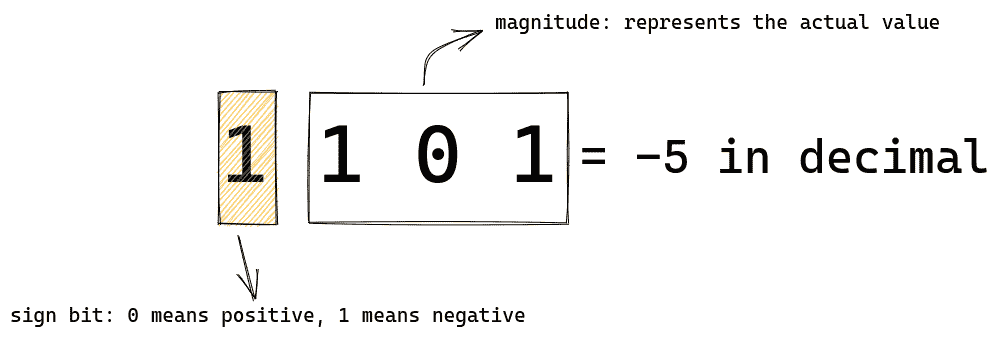****

****在这种编码方案中，十进制形式的`1101`将是-5。最左边或最高有效位是符号位。它告诉处理器数字的符号，即数字是正数还是负数。****

****符号位中的`0`表示正值，`1`表示负值。剩余的位告诉我们实际的幅度。****

****在`1101`中，符号位是`1`，所以数字是负数。`101`十进制等于 5。所以`1101`会计算到十进制的-5。****

****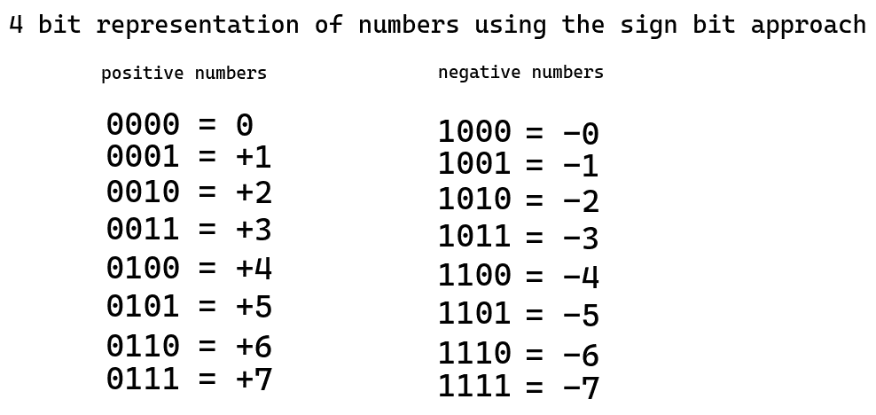

All possible numbers that can be represented by four bits with sign bit encoding scheme**** 

****在上图中，您可以看到使用这种编码方法可以用四位表示的所有整数。到目前为止一切看起来都很好。****

****但是如果我们仔细观察，我们会发现这个编码方案中有一个非常严重的设计问题。让我们面对这个问题。****

****让我们加一个正数和一个负数。例如，我们将+4 和-1 相加。我们的答案应该是`(+4) + (-1) = (+3)`那就是`0011`。****

****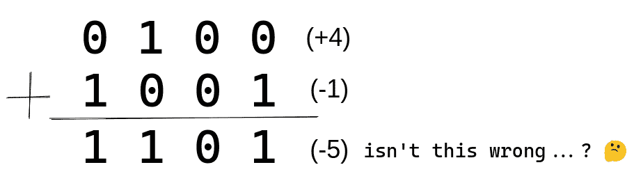****

****看，结果是`1101` (-5)。实际答案应该是`0011` (+3)。如果我们要在处理器上实现这种方法，那么我们就需要添加逻辑来处理这个问题，而工程师讨厌在他们的逻辑中增加额外的复杂性。****

****随着我们添加更多电路，功耗会增加，性能也会下降。****

****对于现代基于晶体管的计算机来说，这听起来可能是一个微不足道的问题。****

****但是想想早期的计算机，比如 EDVAC，它依靠成千上万的真空管运行，每天消耗数百人操作的千瓦功率。政府花了数百万建造它们。****

****那时候，安装额外的电路和真空管意味着数千美元和严重的维护麻烦。****

****所以工程师们必须想出一个更聪明的编码设计。****

****现在，是时候揭示解决这个问题的妙处，让我们的系统更简单、性能更高、耗电更少。****

### ****一个漂亮的编码系统进入，CPU 照耀❤️****

****在这种编码方案中，与前一种方案一样，最左边的位充当符号位，但需要一些艺术来表示负数。****

****正数的表示方式与前面的编码方案完全相同:一个前导的`0`，后面跟着剩余的位数。例如，在这种编码方案中，6 也将被表示为`0110`。****

****为了表示一个负数，一个两步数学过程在它的正数中运行。也就是说，为了表示-6，我们将对+6 进行两步数学处理，以二进制形式得到-6。****

****让我们看看-6 将如何编码成二进制:****

****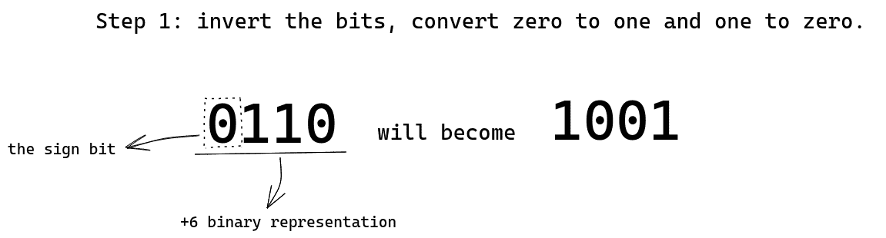****

****在前面的符号幅度方法中，为了计算+6 的负值，我们只需将符号位从`0`更改为`1`。`0110` (+6)会变成`1110` (-6)。****

****在这种新的编码方案中，我们首先反转比特。把 0 变成 1，1 变成 0。`0110` (+6)变成了`1001`。反转这些位被称为“一的补码”，所以这里我们计算了`0110`的一的补码，结果是`1001`。然后...****

****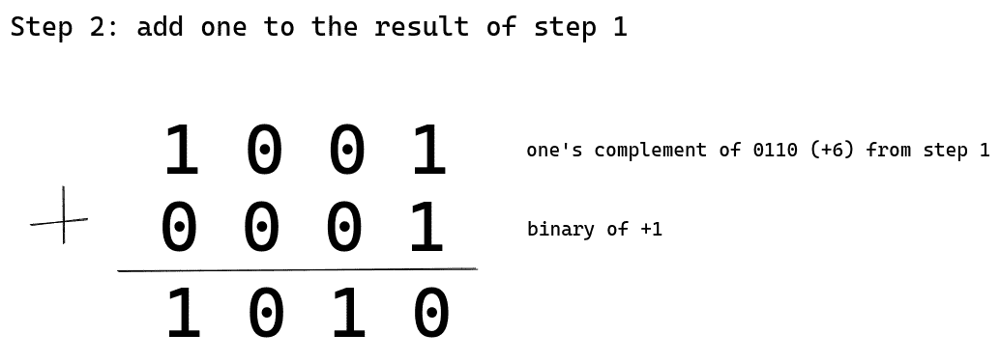****

****我们将`0001` (+1)加到从第一步(`1001`)中得到的补码上。结果 **`1010`将是-6 的二进制表示。这种编码方案被称为二进制补码。**所以请记住，计算一个正整数的二进制补码会得到它的反码。****

****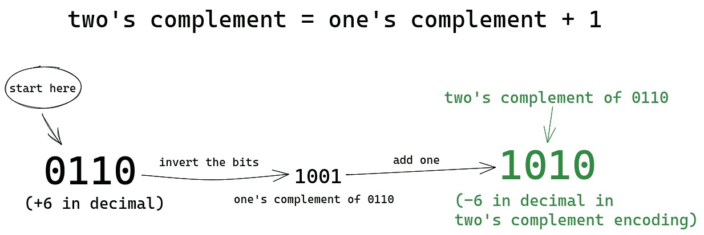****

****反转位给我们一的补码。将 1 加到 1 的补码上，得到我们开始时的原始位的 2 的补码。简单吧？****

****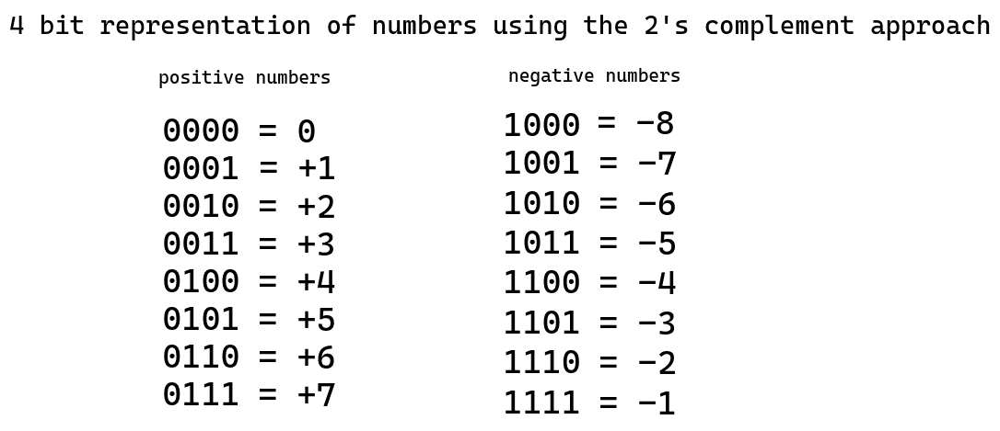

All possible numbers that can be represented by four bits with two's complement encoding scheme**** 

****现在，让我们看看为什么这个编码方案如此漂亮。我们再加上`0100` (+4)和`1111` (-1)。****

****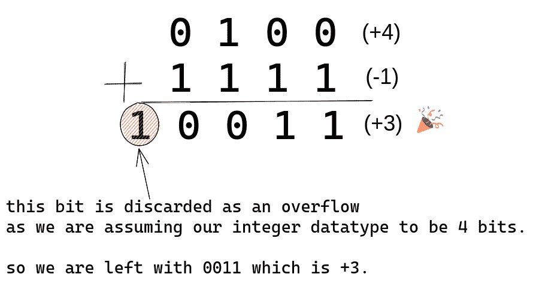****

****看，我们用二进制补码编码方案得到了准确的结果。现在我们可以将整数相加，而不用担心它们的符号。****

****我们已经了解了如何通过二进制补码编码用 0 和 1 来表示负整数。现在假设我们执行`ADD eax, -3`，eax 寄存器中的当前值是-1。所以在执行`ADD eax, -3`之后 eax 中的值将是-4(这是二进制补码编码中的`1100`)。****

****当操作系统从 eax 检索`1100`将结果呈现给用户时，操作系统如何将`1100`解码成十进制？或者假设，如果我们作为一个程序员遇到了`1100`，我们怎么能算出`1100`代表什么数字呢？****

****当然，我们不能一直计算每个正整数的二进制补码，看看我们什么时候碰到`1100`。那太慢了。****

****程序员和操作系统使用二进制补码的美丽特性将二进制解码成十进制。****

****当我们计算一个正数的二进制补数时，我们得到的是它的负数。嗯，**反过来也是正确的**——这意味着计算负数的二进制补码将得到它的正反码。我们一会儿就会明白为什么会这样。****

****首先，让我们了解操作系统或程序员如何将`1100`解码为十进制。****

****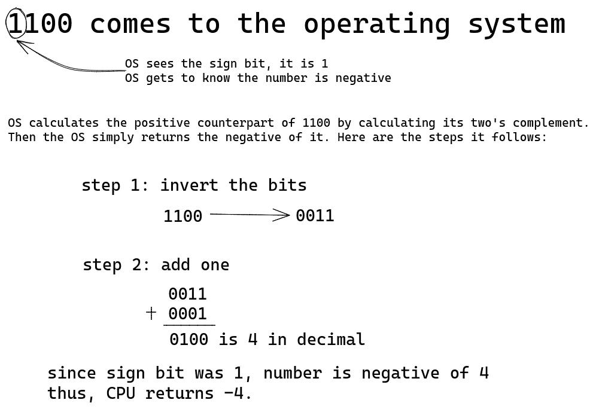****

****从 eax 寄存器中检索`1100`时，操作系统将`1`视为符号位，表示整数为负。计算`1100`的二进制补码，得到`1100`的正对应值，即`0100` (+4)。然后，操作系统在正的对应项上加上一个负号，并以-4 的形式返回最终答案。把这段再读一遍，你会有更好的理解。****

****然后 CPU 笑着对今天的美好说再见；)****

****CPU 去它家见妈妈了。现在我们有足够的时间来讨论二进制补码艺术的内部运作。****

## ****二进制补码编码为什么以及如何工作？****

****如果我告诉你求一个数的负数，比如说+42，求+42 的负数最简单的方法是什么？****

****可以说，最简单的方法是从 0 中减去这个数，对吗？`0 - (+42) = -42`。如果我们重复这个过程，我们会回到正值，`0 - (-42) = +42`。这是二进制补码的所有数学基础。****

****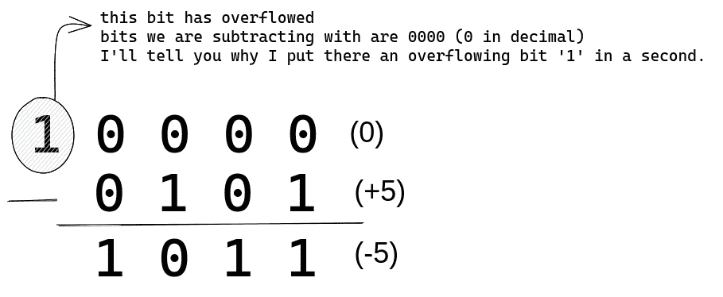****

****我们正在做`10000`(十进制的 0，因为最左边的 1 是溢出)减去`0101` (+5)。在二进制补码编码中，我们得到了十进制数为-5 的 T2。忽略减法是怎么做的。那不重要。理解二进制补码背后的直觉很重要。****

****`10000`可以写成`1111 + 0001`(试试把这两个加起来，就会得到`10000`)。所以实际上我们正在做:****

```
 **`10000       -   0101
=>  (1111 + 0001)   -   0101`** 
```

****重新排列上面的等式，我们可以把它写成:****

```
 **`(1111 + 0001)  -  0101
=>  (1111 - 0101)  +  0001

Step 1: subtract 0101 from 1111

        1 1 1 1
       -0 1 0 1
       ---------
        1 0 1 0

       see, subtracting 0101 from 1111 is equivalent 
       to inverting the bits of 0101, as we got 1010 as a result. 

Step 2: add 0001 to the above result  

        1 0 1 0  ---> result of step 1
       +0 0 0 1
       ---------
        1 0 1 1      

       we get 1011 that is -5 in two's complement encoding.`** 
```

****你看到二进制补码系统从根本上做 0 减去数了吗？反转这些位并加 1 是从 0 中减去这个数的一种快速而聪明的方法。****

****这就是当我们计算负数的补码时，我们得到负数的正数和正数的负数的原因——因为我们实际上是从 0 ( `0 - number`)中减去这个数。****

****20 世纪的计算机过去只有加法算术逻辑，因为二进制补码编码方案非常漂亮，减法很容易执行。****

****例如，要从 100 中减去 12，CPU 计算+12 的二进制补码，得到-12，然后我们将-12 加到 100，得到所需的输出。

我们为什么不直接从 0 中减去求一个数的负数或者在二进制中反过来呢？****

****因为减法是一个缓慢而复杂的过程(由于借用)，所以如果我们这样做，我们的计算机将需要一个昂贵的减法电路。想象一下，每次我们想表示一个负整数的时候，都要从 0 中减去。这对我们和我们的电脑都将是一场噩梦！****

****二进制补码编码是一种性能更高的解决方案，可以简化电路设计，并节省大量资金。这是因为我们不需要昂贵的减法电路，也没有额外的逻辑来处理+和-整数的算术运算。只是简单的加法，我们可以做加法和减法。****

****因此，让我们感谢我们的计算机设计师为这个美丽的编码方案-**二进制补码❤️.******

## ****最后的话****

****我向自己承诺，我永远不会对我制作的任何学习材料收费。无论我为教育做什么，无论是一篇简单的文章、一门课程还是一本电子书，都将是 100%免费和开放的。****

****我在我的推特账户上发布有用的资源，分享有意义的想法。如果你从这篇文章中学到了一些新的东西，你可以跟着我，给我发一个 DM。这将使我的一天:)****

****每一个开发者、每一个作者和每一个人都在向别人学习。我相信我们学习的人和资源应该被引用和传播。这鼓励了那些好人为我们做更多的事情。所以这里是我的好的。****

****mycodeschool 的 Animesh 比任何人都更好地教会了我许多编程概念，包括我在本文中所写的概念。****

****我的良师益友 André Jaenisch ，如果没有他的评论努力和持续支持，我是不会写这篇文章的。****

****快乐学习！****