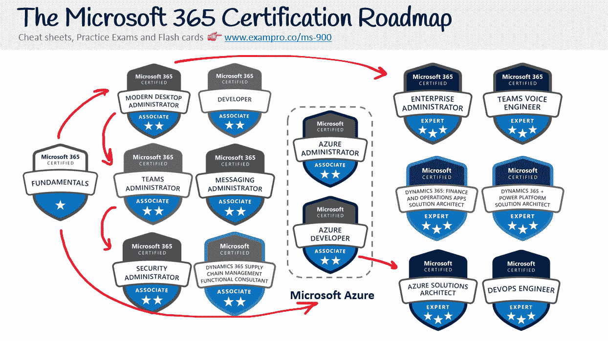

# 微软 365 基础认证(MS-900)-通过这个 4 小时的免费课程考试

> 原文：<https://www.freecodecamp.org/news/microsoft-365-fundamentals-certification-ms-900-course/>

通过完成这个 4 小时的免费课程，您可以了解获得 Microsoft 365 基础认证所需的一切。

## ******什么是**微软 365 的基本面？****

Microsoft 365 Fundamentals 是大量 Microsoft 软件即服务(SaaS)产品的入门级 Microsoft 认证。

这些微软 SaaS 产品专注于改善业务和管理运作以及团队管理和协作。

微软 365 基础的课程代码是 MS-900。

## 微软 365 基础认证是给谁的？

*   您是云新手，希望了解采用云服务的基本原理和优势，特别是软件即服务(SaaS)云模型。
*   您是企业用户、管理员或 IT 专业人员
*   您希望了解 Microsoft 365 的功能，以及如何在您的组织中构建基本解决方案和部署云服务
*   你是一名资深云工程师或者微软 365 管理员，工作多年后需要重置或者刷新知识。

## Microsoft 365 基础知识概述

Microsoft 365 基础知识包括以下内容:

*   云基础知识，例如云概念、云计算类型等。
*   核心的 Microsoft 365 服务和概念，例如 SharePoint Online、Microsoft Viva、团队
*   Microsoft 365 中的端点和部署选项，例如端点管理器、AVD 等
*   安全性、合规性、隐私和对 Microsoft 365 的信任，例如 MFA、Defender 365
*   Microsoft 365 对服务的订阅、许可和支持产品的定价

## **************如何获得认证？【T7**************

您可以通过支付考试费并在与微软合作的考试中心参加考试来获得认证。

微软 Azure 与 Pearson Vue 和 PSI Online 合作，它们在世界各地都有考试中心网络。他们提供现场考试和在线考试。如果有机会，我建议你亲自参加考试。

微软在 Pearsue Vue 上有一个门户页面，你可以在那里注册和预订考试。

那考试费就是******99****USD********。**

## **************我可以简单的看视频通过考试吗？【T7**************

强烈建议在参加真正的考试之前进行模拟考试。

ExamPro 有多个[付费模拟考试](https://exampro.co/ms-900)以及其他学习材料，以增加您通过考试的机会。

前往 freeCodeCamp 的 YouTube 频道,开始学习整个 4 小时的课程。