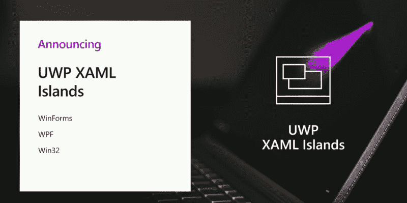
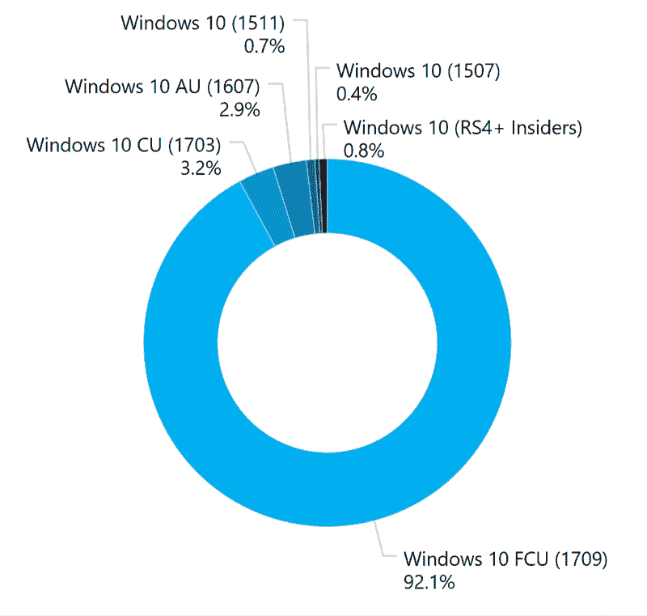
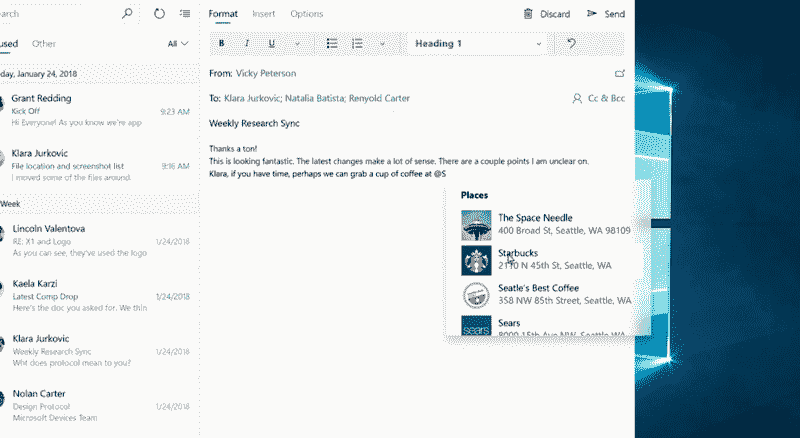
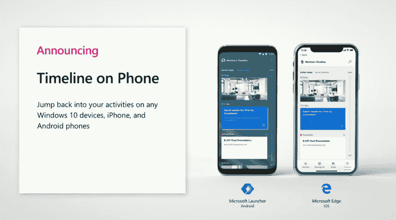

# UX 设计师视角下的微软 Build 2018

> 原文：<https://www.freecodecamp.org/news/microsoft-build-2018-from-the-perspective-of-a-ux-designer-a9aa77fb6eeb/>

由 samuele dassatti

# UX 设计师视角下的微软 Build 2018

我最近参加了西雅图的微软 Build 2018，因为我的一个应用程序获得了 Windows 开发者奖年度设计创新者的提名。在为期三天的会议中，微软巨头详细介绍了 Fluent 设计系统的下一步计划。这是在去年的 Build 上宣布的设计语言，微软希望在此基础上构建 Windows 及其应用程序的 UI。

以下是与 Windows 平台上用户体验设计的未来相关的最重要的公告。

### 流利的所有东西

从 UI 的角度来看，我看到的一个最大的趋势是微软愿意让尽可能多的开发者可以使用这种新的设计语言，不管他们选择什么样的框架。

我们可以用三个元素来概括这个策略: **UWP XAML 群岛**、 **Windows UI 库**和**流畅设计网页**(虽然只是简单调侃)。让我们更仔细地看一看每一个。

### UWP XAML 群岛

那么，什么是 UWP XAML 群岛？它们是新的同名库中的一部分，该库允许 WinForms、WPF 和 Win32 应用程序具有 UI 元素，到目前为止，这些元素仅限于 UWP 应用程序。这意味着开发者将能够通过集成 XAML 用户界面元素的“孤岛”(这个名字终于有意义了)，开始逐渐使他们的应用程序的用户界面现代化。

这些孤岛可以是 UI 的有限区域或整个窗口，因此允许开发人员保留 Windows 传统应用程序的代码，同时使其外观现代化，以增加用户参与度，并使应用程序感觉与操作系统的其余部分更加一致。

> XAML 岛只是一个标准的 UWP 控件，甚至是一个完整的 UWP 用户界面，它可以无缝地集成在任何其他用户界面框架中。[……]就是管用。

> 微软 Build 2018 开发者平台负责人凯文·加洛(Kevin Gallo)

### Windows 用户界面库

Windows 用户界面库(或许多微软代表称之为 WinUI)的核心概念与 UWP XAML 群岛非常相似。然而，其目的却大不相同。

Islands 专注于将 UWP XAML 控件引入传统应用程序。另一方面，WinUI 将允许开发人员利用 XAML 控件的多功能性，这种功能仅在最新版本的 Windows 上才能在每个版本的操作系统上使用(从周年更新开始，也称为版本 1607)。正如你所料，这一新功能令人兴奋的程度有限，因为新的 Windows 更新通常会在短短几个月内到达几乎每一台 Windows 设备。不过不管怎么说，有这个功能还是挺整洁的。

The WinUI library means that you can leverage the latest APIs in your app while reaching almost 10% more customers. The chart is based on the data from the AdDuplex report of April 2018

### 流畅的设计网页

如果这是你第一次听说这件事，尽管你已经密切关注了构建会议，不要担心。在一个关于渐进式网络应用的演示之后，该项目在问答环节中受到了短暂的嘲笑，在撰写本文时，还没有得到官方的证实。因此，这是我们所知道的:微软正试图推动其设计系统不仅仅局限于 Windows 平台。这是微软努力的一部分，以帮助 web 开发者使他们的 pwa 感觉更像操作系统本身。

顺便说一句，如果你有兴趣学习如何让你的 web 应用程序有原生的感觉，我建议你阅读[这篇文章](https://medium.freecodecamp.org/how-you-can-develop-progressive-web-apps-that-feel-native-5110fbbcbf4b)。

### 扩展 Fluent 工具包

今年 Build 大会上的一个重要声明是为 UWP 应用程序引入了新的窗口 API。特别是，最终引入了伴随窗口。我说“最后”，因为这将允许应用程序的主窗口将它的一些 UI 元素移动到主窗口后面的小窗口上。这将使开发人员有可能为通用 Windows 平台开发更复杂的应用程序。

另一个受欢迎的新增功能是应用于上下文菜单的新设计原则。它们不仅会被投影突出显示，并根据其在 Z 轴上的位置进行不同的渲染，而且它们还会被灯光消除(即，只需单击外部即可消除它们)。这将通过使用标志性的丙烯酸效果来体现。

我真的希望这些细微的设计变化能全面提高 UWP 用户的工作效率。

An example of the new design of context menus

### 让流畅的设计成为多设备、多感官的体验

The timeline of Microsoft Launcher is the first example of how Microsoft is trying to expand its design language beyond Windows

在第二个主题演讲中，Joe Belfiore 提到的第一批产品之一是用于 Android 的微软启动器。专注于这样一个产品，这在几年前是不可想象的，这凸显了微软对将 Fluent 设计系统带到其他平台的认真态度。这也进一步强化了塞特亚·纳德拉对微软体验是多设备、多感官体验的愿景。

另一个关于设计系统普适性的重要声明是新的密度标准。它从 Metro 的宽、触摸友好的矩形变成了健康的中间部分，允许用户在不牺牲触摸设备可用性的情况下看到更多细节。微软还展示了一个更密集的标准，针对桌面优先和商业应用进行了优化。

### 包扎

没有什么特别令人兴奋的设计被引入。但 Build 2018 的公告显示了一个设计系统，尽管在某些领域有所欠缺，但它相对年轻，正朝着正确的方向前进。我认为这是因为微软正致力于使它比以往任何时候都更加通用和通用。我希望这篇文章能帮助你理解 Fluent 设计系统的发展方向，如果你对最近的公告有任何想法，我很乐意阅读你的回复。