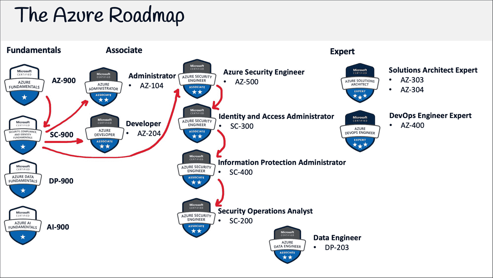

# 微软安全性、合规性和身份基础知识(SC-900)-通过 3.5 小时的免费课程考试

> 原文：<https://www.freecodecamp.org/news/microsoft-security-compliance-certification-sc-900/>

## 什么是微软的安全性、合规性和身份基础？

微软安全性、合规性和身份基础认证是 Azure 和微软安全性的基本入门级认证。

近年来，我们已经看到工作环境的重大转变，公司允许员工在家工作。

物联网设备的增加意味着我们在办公室之外拥有了更多技术。平板电脑和智能手机的低成本意味着我们有更多的员工携带敏感数据。公司正在利用更多的云服务，员工可以在没有中央 IT 部门批准的情况下购买他们的软件。

我们的人员、设备和软件不再局限于一个物理位置。因此，我们必须改变我们对网络安全的看法，将我们的主要安全视为以身份为中心。

微软的活动目录是企业身份的行业标准。借助微软的云变体 Azure Active Directory，任何规模的公司都可以轻松拥有一流的身份管理和目录服务，并快速实施**零信任模式**。

## **微软安全、合规和身份基础知识概述**

**Azure 数据基础包括以下内容:**

*   **零信任模型、安全性、合规性概念**
*   **蓝色广告**
*   **M365 和 Azure Defender**
*   **M365 合规中心**
*   **各种 Azure 安全和网络服务**

## **如何获得微软安全、合规和身份基础认证？**

**你可以通过支付考试费并在与微软 Azure 合作的考试中心参加考试来获得认证。**

**微软 Azure 与 Pearson Vue 和 PSI Online 合作，它们在世界各地都有考试中心网络。他们提供现场考试和在线考试。如果有机会，我建议你亲自参加考试。**

**微软在 Pearsue Vue 上有一个门户页面，你可以在那里注册和预订考试。**

**那个考试费是********【99 美元】******** 。**

## 我可以简单的看视频通过考试吗？

对于像 SC-900 这样的基础认证，你可以只看视频内容而不亲自动手探索 Azure 服务。

SC-900 是微软最重要的基础认证，因为它为四个可能的安全助理认证奠定了基础。

Azure 的更新频率远高于其他云服务提供商。有时每个月都会有新的认证更新，但是 SC-900 不是以动手为中心的，所以学习课程不太容易过时。

*   考试有 ********40 到 60******** 题有 ********60 分钟******** 。
*   考试包含许多不同的题型。
*   一个及格分数是********70%左右。********

## 免费的微软安全性、合规性和身份基础视频课程

就像我在 freeCodeCamp 上发布的其他云认证课程一样，这个课程将永远免费。

该课程包含学习策略、讲座、跟进和备忘单，是一门完整的端到端课程。

前往 freeCodeCamp 的 YouTube 频道，开始学习整个 3.5 小时的课程。

[https://www.youtube.com/embed/LLKza5oULAA?feature=oembed](https://www.youtube.com/embed/LLKza5oULAA?feature=oembed)

## 这是课程的全部内容

### 介绍

*   什么是 SC 900
*   考试指南

### 安全方法

*   零信任模型
*   零信任原则
*   零信任支柱
*   零信任评估工具
*   跟随零信任评估工具
*   分担责任模式
*   纵深防御
*   中情局三合会

### 安全概念

*   常见威胁
*   脆弱点
*   加密
*   赛弗
*   加密密钥
*   哈希和盐渍
*   数字签名
*   在途与静止
*   MasterofFineArts 美术硕士
*   扫描免疫电子显微镜检查
*   高耸
*   外部数据表示(External Data Representation)
*   EDR
*   CASB
*   安全态势
*   CSPM
*   jit & jeep
*   入口与出口
*   跟踪它
*   空气
*   威胁建模
*   进展
*   遵循微软威胁建模
*   IDS IPS
*   MITRE 攻击框架
*   遵循 Mitre 攻击框架

### 隐私

*   微软隐私原则
*   微软隐私

### 身份

*   主要安全边界
*   身份提供者

### 蓝色广告

*   Azure AD 简介
*   Active Directory 与 Azure AD
*   应用注册
*   外部身份
*   服务原则
*   托管身份
*   设备管理
*   MDM & MAM
*   Windows Hello
*   Azure 广告连接
*   SSPR
*   口令保护
*   身份管理最佳实践
*   紧急访问帐户

### Azure AD 身份验证

*   认证方法
*   微软认证器
*   跟随微软认证器
*   生物测定学
*   FIDO 和安全密钥
*   开放式认证
*   无密码认证

### Azure 广告管理

*   条件接收
*   Azure 广告角色
*   RBAC

### Azure AD 保护治理

*   身份治理
*   人宫颈粘液
*   身份生命周期
*   访问生命周期
*   特权访问生命周期
*   权限管理
*   个人信息管理
*   身份保护
*   检测和补救
*   调查

### 蔚蓝 NSG

*   NSG 规则
*   默认安全规则
*   安全规则逻辑
*   NSG 组合
*   NSG 小抄

### Azure 防火墙

*   Azure 防火墙

### Azure DDoS 保护

*   Azure Ddos 保护

### 蓝色堡垒

*   蓝色堡垒

### 天蓝色薄饼

*   天蓝色薄饼

### 加密

*   加密概述
*   Azure 磁盘加密
*   TDE
*   钥匙库

### Azure 安全中心

*   Azure 安全基准
*   Azuire 安全中心
*   详细的 Azure 安全基准

### 蔚蓝保卫者

*   蔚蓝保卫者

### 蔚蓝哨兵报

*   蔚蓝哨兵报
*   数据源
*   工作簿
*   前哨特征
*   定点定价

### M365 防御者

*   M365
*   M365 防御者
*   安全得分
*   Endpoint 的防御者
*   安全报告
*   身份捍卫者
*   Office 365 的捍卫者
*   MCAS

### Microsoft 端点管理器

*   Microsoft 端点管理器

### 服从

*   法规遵循
*   M365 合规中心
*   Azure 信任中心
*   合规经理
*   跟随合规经理
*   合规计划

### 保护和治理

*   可锻铸铁管(Malleable Iron Pipe)
*   知道保护预防
*   GIP
*   敏感信息类型
*   可训练分类器
*   内容浏览器
*   活动浏览器
*   敏感性标签
*   标签政策
*   保留标签和政策
*   档案管理
*   数字光学处理

### 风险能力

*   内部风险管理
*   通信合规性
*   信息壁垒
*   特权访问管理
*   客户锁箱
*   发现
*   核心电子发现工作流
*   内容搜索和保留
*   高级电子发现工作流
*   M365 审核

### Azure 安全概念

*   资源锁
*   资源标签
*   蔚蓝蓝图
*   Azure 策略
*   云采用框架
*   架构良好的框架
*   Microsoft 安全最佳实践
*   遵循 Microsoft 安全最佳实践
*   斯堪的纳维亚航空公司
*   克-奥二氏分级量表
*   SDL