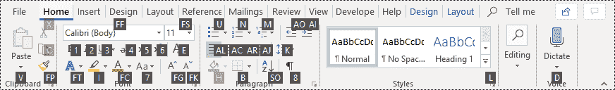

# Microsoft Word 键盘快捷键——终极指南

> 原文：<https://www.freecodecamp.org/news/microsoft-word-keyboard-shortcuts/>

根据微软第一季度业绩，Office 365 拥有 2 亿月活跃用户。很多用户利用订阅服务来访问 Microsoft Office 产品。

Office 365 中包含的核心应用和服务包括:

*   单词
*   擅长
*   文稿演示软件
*   观点
*   OneNote
*   OneDrive
*   组

在这篇文章中，我们将深入探讨其中的一个产品，微软 Word。

也许 Word 是你学会如何打字的第一台文字处理器。也许你每天在工作中使用它来进行研究、起草重要文件或写论文。很明显，公司喜欢并体验 Word 带来的好处，因为这个工具能让员工思考、交流和写作。

在大学里，我记得给自己发送 Word 文件，并用一个可笑的难以理解的名字保存每个文件(比如最终草案 1.21a)。不管你过去和 Word 有什么联系，现在有一些方法可以让你更好地使用这个流行的工具。具体来说，您可以使用键盘快捷键来大大加快您的打字和文字处理速度。

我认为自己是一个键盘快捷键大师，并希望将其中的一些经验传授给你。不像网上研讨会软件主要基于网络，需要简单的点击互动，Word 可以完全沉浸。

信不信由你，在这方面，Word 更类似于增强现实。当你弹钢琴时，你可以按键，或者你可以有一个更完整的身体体验，并与乐器深度互动。字相似。

如果您在家工作，并且希望提高使用 Word 的速度和准确性，您可以花时间了解下面的键盘快捷键。

当然，学习哪种快捷方式以及何时使用取决于你使用的电脑类型和你的目标。

首先，免责声明。

写一篇关于通用单词快捷方式的文章让我想起了诗人约翰·利德盖特(John Lydgate)的一句名言，后来被林肯总统改写:

> 你可以一直取悦一些人，你可以在某段时间取悦所有的人，但你不可能一直取悦所有的人。

这些快捷方式将在你的大多数电脑上工作**大多数时间**用于你的大多数用例**大多数时间**。

友情提示，您的键盘布局、操作系统(Windows 或 Mac)以及您正在运行的软件版本(桌面、客户端、版本等)可能会影响某些快捷方式和本建议的实用性。

我经常思考像 Dropbox vs Box 这样的不同版本的 Word:相似但不同。

完成此免责声明后，这里有一些 Microsoft Word 键盘快捷键，您现在可以学习它们来增强您的文字处理体验。所以，请坐好，因为我将从我最喜欢的 Word 快捷方式开始，然后介绍如何利用 Word Ribbon。

## Microsoft Word 键盘快捷键

### 
字体风格

字体样式和强调的三个最流行的格式选项是斜体(Ctrl+I)、粗体(Ctrl+B)和下划线(Ctrl+U)。

### 资本化

有时，为了清晰或强调，您可能希望所有文本都是大写的。但是，如果你刚刚用大写锁定键打出了一整段文字，现在看起来像是在尖叫呢？

不需要全部删除并重新键入:只需突出显示相关文本并按 Ctrl+Shift+A，即可将其全部转换为常规小写/大写。

### 文本对齐

你需要在页面的正中间放一段文字作为标题吗？您可以使用 Ctrl+E 将文本居中。之后，您很可能希望文本主体返回正常格式，在这种情况下，您可以使用 Ctrl+L 将文本向左对齐。

### 超链接

这在很多情况下都很方便——不仅在 Word 中，在 PowerPoint 和 Excel 中也是如此。

突出显示要链接到网页的单词或句子，然后按 Ctrl+K。会出现一个对话框，让您输入文本要链接到的网址。一旦你输入了信息，选定的文本将变成一个蓝色的，带下划线的超链接。

### 航行

您是否试图在一个长文档中找到特定的部分？按 Ctrl+F 进行查找，这允许您输入要查找的单词或短语，并直接找到它。

Ctrl+F 在 web 浏览器和整个 Office 套件中也非常有用。

### 深度搜索

在 Word 中按 F5 键会打开一个更全面的搜索工具，允许您导航到文档的特定页面、节或行，以及使用查找和替换功能。

### 选择文本

没有必要总是使用鼠标来突出显示选定的文本。Shift+箭头键也将执行此功能。

Shift+左/右一次突出显示一个字符，Shift+Alt+左/右一次一个单词，Shift+Ctrl+左/右一次一整行。

### 字数

按 Ctrl+Shift+G 组合键会立刻显示出你的字数，给你一个非常重要的视觉肯定，那就是你确实在朝着你的目标稳步前进。

### 保存、打开和打印文件

使用 Ctrl + S 保存您正在处理的任何文件——并且经常这样做，这样您就不会丢失您的工作！

在浏览器中，您也可以使用它来保存网页以便脱机查看。“存储为”(用新名称存储文件)的键盘快捷键取决于您正在使用的应用程序。在 Word 中是 F12。但是许多其他程序使用 Ctrl+Shift+s。Ctrl+O 将在您使用的任何程序中打开一个文件。

### 使用键盘剪切、复制和粘贴(个人收藏夹)

*   Ctrl + X 剪切突出显示的文本(将其移除并放在剪贴板上)。
*   Ctrl + C 复制文本(将文本的副本放在剪贴板上)。
*   Ctrl + V 粘贴文本(将剪贴板复制到光标位置，对于转换大量内容或进行文案撰写时非常方便。
*   全选:要选择当前空间中的所有内容，请使用 Ctrl + A
*   撤消:Ctrl + Z 将撤消任何操作。

## Word 也有一个功能区，很像微软的其他产品。

功能区是在 Word 主菜单中单击每个选项卡时出现的菜单(如果您不确定，请查看下图)。在 Word 中编写文档时，以下是一些有用的功能区键盘快捷键。

您可以将按键提示字母与 Alt 键结合起来，为功能区选项创建称为访问键的快捷方式。

当构建具有大量颜色、格式和设计要求的模板或新闻稿示例时，功能区快捷方式特别有用。

例如，按 Alt+H 打开“主页”选项卡，按 Alt+Q 移动到“告诉我”或“搜索”字段。

再次按 Alt 可查看所选选项卡选项的关键提示。

功能区对选项卡上的相关选项进行分组。例如，在“主页”选项卡上，“字体”组包括“字体颜色”选项。

按 Alt 键以选项卡和选项旁边的小图像中的字母显示功能区快捷方式(称为按键提示)，如下图所示。

