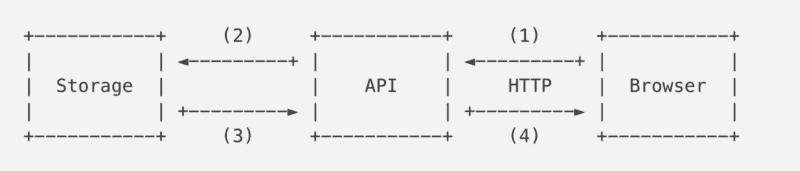
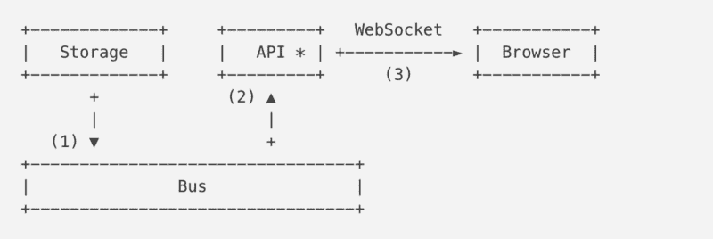

# 一百万个网络插座，然后开始

> 原文：<https://www.freecodecamp.org/news/million-websockets-and-go-cc58418460bb/>

谢尔盖·卡马丁

# 一百万个网络插座，然后开始


大家好！我叫 Sergey Kamardin，是 Mail.Ru 的一名开发人员。

这篇文章是关于我们如何用 Go 开发高负载 WebSocket 服务器的。

如果您熟悉 WebSockets，但对 Go 知之甚少，我希望您仍然会发现这篇文章在性能优化的思想和技术方面很有趣。

### 1.介绍

为了定义我们故事的背景，应该说几句话，为什么我们需要这个服务器。

邮件。Ru 有很多有状态的系统。用户电子邮件存储就是其中之一。有几种方法可以跟踪系统中的状态变化，以及系统事件。大多数情况下，这是通过定期的系统轮询或关于其状态变化的系统通知来实现的。

两种方式都有其利弊。但是说到邮件，用户收到新邮件越快越好。

邮件轮询涉及每秒大约 50，000 次 HTTP 查询，其中 60%返回 304 状态，这意味着邮箱中没有任何更改。

因此，为了减少服务器上的负载并加快向用户发送邮件的速度，决定通过编写一个发布者-订阅者服务器(也称为总线、消息代理或事件通道)来重新发明这个轮子，该服务器一方面接收关于状态变化的通知，另一方面接收对此类通知的订阅。

前情提要:



现在:



第一个方案显示了它以前的样子。浏览器定期轮询 API 并询问存储(邮箱服务)的变化。

第二个方案描述了新的架构。浏览器与通知 API 建立 WebSocket 连接，通知 API 是总线服务器的客户端。收到新电子邮件后，存储会向总线(1)发送通知，并向其订户(2)发送通知。API 确定发送接收到的通知的连接，并将其发送到用户的浏览器(3)。

所以今天我们要谈谈 API 或 WebSocket 服务器。展望未来，我会告诉你，服务器将有大约 300 万在线连接。

### 2.惯用的方法

让我们看看如何在没有任何优化的情况下使用 plain Go 特性实现服务器的某些部分。

在我们继续进行`net/http`之前，让我们讨论一下我们将如何发送和接收数据。位于 web socket 协议之上的*数据(例如 JSON 对象)在下文中将被称为*数据包*。*

让我们开始实现`Channel`结构，它将包含通过 WebSocket 连接发送和接收此类数据包的逻辑。

### 2.1.渠道结构

```
// Packet represents application level data.
type Packet struct {
    ...
}

// Channel wraps user connection.
type Channel struct {
    conn net.Conn    // WebSocket connection.
    send chan Packet // Outgoing packets queue.
}

func NewChannel(conn net.Conn) *Channel {
    c := &Channel{
        conn: conn,
        send: make(chan Packet, N),
    }

    go c.reader()
    go c.writer()

    return c
}
```

WebSocket Channel implementation.

我想提请大家注意两个阅读和写作 goroutines 的发布。每个 goroutine 都需要自己的内存堆栈，根据操作系统和 Go 版本，内存堆栈的初始大小可能为 2 到 8 KB [。](https://github.com/golang/go/blob/release-branch.go1.8/src/runtime/stack.go#L64-L82)

关于上面提到的 300 万在线连接数，我们将需要 **24 GB 内存**(堆栈为 4 KB)用于所有连接。这还不包括分配给`Channel`结构、输出包`ch.send`和其他内部字段的内存。

### 2.2 .高例程 I/O

让我们来看看“阅读器”的实现:

```
func (c *Channel) reader() {
    // We make a buffered read to reduce read syscalls.
    buf := bufio.NewReader(c.conn)

    for {
        pkt, _ := readPacket(buf)
        c.handle(pkt)
    }
}
```

Channel’s reading goroutine.

这里我们使用`bufio.Reader`来减少`read()`系统调用的数量，并在`buf`缓冲区大小允许的情况下读取尽可能多的系统调用。在无限循环中，我们期待新的数据出现。请记住这句话:*期待新的数据到来。*我们稍后将回到他们身上。

我们将忽略对传入数据包的解析和处理，因为这对我们将要讨论的优化并不重要。然而，`buf`现在值得我们注意:默认情况下，它是 4 KB，这意味着我们的连接需要另外的 **12 GB** 内存。“作家”也有类似的情况:

```
func (c *Channel) writer() {
    // We make buffered write to reduce write syscalls. 
    buf := bufio.NewWriter(c.conn)

    for pkt := range c.send {
        _ := writePacket(buf, pkt)
        buf.Flush()
    }
}
```

Channel’s writing goroutine.

我们遍历传出数据包通道`c.send`，并将它们写入缓冲区。正如我们细心的读者已经猜到的，这是我们 300 万个连接的另一个 4 KB 和 12 GB 的内存(T2)。

### 2.3.超文本传送协议

我们已经有了一个简单的`Channel`实现，现在我们需要一个 WebSocket 连接来处理。既然我们还在*惯用方式*标题下，那就用相应的方式吧。

> *注:如果你不知道 WebSocket 是如何工作的，需要提到的是，客户端通过一种叫做 Upgrade 的特殊 HTTP 机制切换到 WebSocket 协议。成功处理升级请求后，服务器和客户端使用 TCP 连接来交换二进制 WebSocket 帧。[这里的](https://tools.ietf.org/html/rfc6455#section-5.2)是对连接内部的帧结构的描述。*

```
import (
    "net/http"
    "some/websocket"
)

http.HandleFunc("/v1/ws", func(w http.ResponseWriter, r *http.Request) {
    conn, _ := websocket.Upgrade(r, w)
    ch := NewChannel(conn)
    //...
})
```

Idiomatic way of upgrading to WebSocket.

请注意，`http.ResponseWriter`为`bufio.Reader`和`bufio.Writer`分配内存(都有 4 KB 的缓冲区),用于`*http.Request`初始化和进一步的响应写入。

不管使用什么 WebSocket 库，在成功响应升级请求后，[服务器在`responseWriter.Hijack()`调用后接收到](https://github.com/golang/go/blob/143bdc27932451200f3c8f4b304fe92ee8bba9be/src/net/http/server.go#L1862-L1869) I/O 缓冲区和 TCP 连接。

> *提示:在某些情况下，`go:linkname`可以通过调用`net/http.putBufio{Reader,Writer}`将缓冲区返回给`net/http`内部的`sync.Pool`。*

因此，我们需要另外的 24 GB 内存来支持 300 万个连接。

因此，总共有 **72 GB** 的内存供这个还没有做任何事情的应用程序使用！

### 3 .优化

让我们回顾一下我们在引言部分讨论的内容，并记住用户连接的行为。在切换到 WebSocket 之后，客户端发送一个包含相关事件的包，或者换句话说，订阅事件。然后(不考虑诸如`ping/pong`之类的技术消息)，客户端可能在整个连接生命周期内不发送任何东西。

> 连接生命周期可能持续几秒到几天。

所以大多数时候我们的`Channel.reader()`和`Channel.writer()`都在等待接收或发送数据的处理。与它们一起等待的是每个 4 KB 的 I/O 缓冲区。

现在很明显，某些事情可以做得更好，不是吗？

### 3.1.网络民意测验

你还记得*通过锁定`bufio.Reader.Read()`内的`conn.Read()`调用来期待新数据到达*的`Channel.reader()`实现吗？如果连接中有数据，Go runtime 会“唤醒”我们的 goroutine，并允许它读取下一个数据包。之后，在等待新数据时，goroutine 再次被锁定。让我们看看 Go runtime 是如何理解 goroutine 必须被“唤醒”的。

如果我们看一下 [conn.Read()实现](https://github.com/golang/go/blob/release-branch.go1.8/src/net/net.go#L176-L186)，我们会看到其中的 [net.netFD.Read()调用](https://github.com/golang/go/blob/release-branch.go1.8/src/net/fd_unix.go#L245-L257):

```
// net/fd_unix.go

func (fd *netFD) Read(p []byte) (n int, err error) {
    //...
    for {
        n, err = syscall.Read(fd.sysfd, p)
        if err != nil {
            n = 0
            if err == syscall.EAGAIN {
                if err = fd.pd.waitRead(); err == nil {
                    continue
                }
            }
        }
        //...
        break
    }
    //...
}
```

Go internals about non-blocking reads.

> *Go 在非阻塞模式下使用套接字。EAGAIN 说套接字中没有数据，并且不要在从空套接字读取时被锁定，操作系统将控制权返回给我们。*

我们看到一个来自连接文件描述符的`read()`系统调用。如果 read 返回了 [EAGAIN 错误](http://man7.org/linux/man-pages/man2/read.2.html#ERRORS)，运行时会让 [pollDesc.waitRead()调用](https://github.com/golang/go/blob/release-branch.go1.8/src/net/fd_poll_runtime.go#L74-L81):

```
// net/fd_poll_runtime.go

func (pd *pollDesc) waitRead() error {
   return pd.wait('r')
}

func (pd *pollDesc) wait(mode int) error {
   res := runtime_pollWait(pd.runtimeCtx, mode)
   //...
}
```

Go internals about netpoll usage.

如果我们[深入挖掘](https://github.com/golang/go/blob/143bdc27932451200f3c8f4b304fe92ee8bba9be/src/runtime/netpoll.go#L14-L20)，我们会看到 netpoll 是使用 Linux 中的 [epoll](http://man7.org/linux/man-pages/man7/epoll.7.html) 和 BSD 中的 [kqueue](https://www.freebsd.org/cgi/man.cgi?query=kqueue&sektion=2) 实现的。为什么不把同样的方法用于我们的连接呢？我们可以分配一个读缓冲区，只在真正必要的时候才启动读例程:当套接字中有真正可读的数据时。

> 在 github.com/golang/go,，有一个导出网络民意测验函数的问题。

### 3.2.摆脱 goroutines

假设我们有用于 Go 的 [netpoll 实现](https://godoc.org/github.com/mailru/easygo/netpoll)。现在我们可以避免使用内部缓冲区启动`Channel.reader()` goroutine，并在连接中订阅可读数据事件:

```
ch := NewChannel(conn)

// Make conn to be observed by netpoll instance.
poller.Start(conn, netpoll.EventRead, func() {
    // We spawn goroutine here to prevent poller wait loop
    // to become locked during receiving packet from ch.
    go Receive(ch)
})

// Receive reads a packet from conn and handles it somehow.
func (ch *Channel) Receive() {
    buf := bufio.NewReader(ch.conn)
    pkt := readPacket(buf)
    c.handle(pkt)
}
```

Using netpoll.

使用`Channel.writer()`更容易，因为我们可以运行 goroutine，只在我们要发送数据包时分配缓冲区:

```
func (ch *Channel) Send(p Packet) {
    if c.noWriterYet() {
        go ch.writer()
    }
    ch.send <- p
}
```

Starting writer goroutine only when needed.

> *注意，我们不处理操作系统在`write()`系统调用中返回`EAGAIN`的情况。在这种情况下，我们依靠 Go runtime，因为这种服务器实际上很少见。然而，如果需要，也可以用同样的方法处理。*

从`ch.send`(一个或几个)读取输出数据包后，写入程序将完成其操作，并释放 goroutine 堆栈和发送缓冲区。

完美！通过去掉两个连续运行的 goroutines 中的堆栈和 I/O 缓冲区，我们节省了 48 GB。

### 3.3.资源控制

大量的连接不仅涉及高内存消耗。在开发服务器时，我们经历了重复的竞争条件和死锁，之后通常是所谓的自 DDoS——这是一种应用程序客户端疯狂地试图连接到服务器从而进一步破坏服务器的情况。

例如，如果由于某种原因，我们突然不能处理`ping/pong`消息，但是空闲连接的处理程序继续关闭这样的连接(假设连接断开，因此不提供数据)，客户端似乎每 N 秒就失去一次连接，并试图再次连接，而不是等待事件。

如果锁定或过载的服务器只是停止接受新的连接，而它之前的平衡器(例如 nginx)将请求传递给下一个服务器实例，那就太好了。

此外，不管服务器的负载如何，如果所有的客户端出于某种原因突然想给我们发送一个包(可能是由于 bug)，那么之前保存的 48 GB 将会再次被使用，因为我们实际上将会返回到每个连接的 goroutine 和 buffer 的初始状态。

#### Goroutine 游泳池

我们可以使用 goroutine 池来限制同时处理的数据包数量。这是这种池的简单实现的样子:

```
package gopool

func New(size int) *Pool {
    return &Pool{
        work: make(chan func()),
        sem:  make(chan struct{}, size),
    }
}

func (p *Pool) Schedule(task func()) error {
    select {
    case p.work <- task:
    case p.sem <- struct{}{}:
        go p.worker(task)
    }
}

func (p *Pool) worker(task func()) {
    defer func() { <-p.sem }
    for {
        task()
        task = <-p.work
    }
}
```

Naive implementation of goroutine pool.

现在我们带有`netpoll`的代码如下所示:

```
pool := gopool.New(128)

poller.Start(conn, netpoll.EventRead, func() {
    // We will block poller wait loop when
    // all pool workers are busy.
    pool.Schedule(func() {
        Receive(ch)
    })
})
```

Handling poller events within the goroutine pool.

因此，现在我们不仅在套接字中出现可读数据时读取数据包，而且在第一次有机会占用池中的空闲 goroutine 时也读取数据包。

同样，我们将更改`Send()`:

```
pool := gopool.New(128)

func (ch *Channel) Send(p Packet) {
    if c.noWriterYet() {
        pool.Schedule(ch.writer)
    }
    ch.send <- p
}
```

Reusing writing goroutine.

代替`go ch.writer()`，我们想要写入一个重用的 goroutines。因此，对于一个`N`go routine 池，我们可以保证在同时处理`N`请求和到达的`N + 1`请求的情况下，我们不会为读取分配一个`N + 1`缓冲区。goroutine 池还允许我们限制新连接的`Accept()`和`Upgrade()`，并避免大多数 DDoS 情况。

### 3.4.零拷贝升级

让我们稍微偏离一下 WebSocket 协议。如前所述，客户端使用 HTTP 升级请求切换到 WebSocket 协议。看起来是这样的:

```
GET /ws HTTP/1.1
Host: mail.ru
Connection: Upgrade
Sec-Websocket-Key: A3xNe7sEB9HixkmBhVrYaA==
Sec-Websocket-Version: 13
Upgrade: websocket

HTTP/1.1 101 Switching Protocols
Connection: Upgrade
Sec-Websocket-Accept: ksu0wXWG+YmkVx+KQR2agP0cQn4=
Upgrade: websocket
```

HTTP Upgrade example.

也就是说，在我们的例子中，我们只需要 HTTP 请求及其头部来切换到 WebSocket 协议。这些知识和[在`http.Request`中存储的内容](https://github.com/golang/go/blob/release-branch.go1.8/src/net/http/request.go#L100-L305)表明，为了优化，我们可能会在处理 HTTP 请求时拒绝不必要的分配和复制，并放弃标准的`net/http`服务器。

> *例如，`http.Request`包含一个具有相同名称头类型的[字段，通过将数据从连接复制到值字符串，该字段被无条件地填充了所有请求头。想象一下这个字段中可以保存多少额外的数据，例如一个大尺寸的 Cookie 头。](https://github.com/golang/go/blob/release-branch.go1.8/src/net/http/header.go#L19)*

但是拿什么作为回报呢？

#### WebSocket 实现

不幸的是，在我们优化服务器时，所有现存的库都只允许我们升级标准的`net/http`服务器。此外，这两个库都不能使用上述所有的读写优化。为了使这些优化工作，我们必须有一个相当低级的 API 来处理 WebSocket。为了重用缓冲区，我们需要 procotol 函数如下所示:

```
func ReadFrame(io.Reader) (Frame, error)
func WriteFrame(io.Writer, Frame) error
```

如果我们有一个这样的 API 库，我们可以如下从连接中读取包(包的编写看起来是一样的):

```
// getReadBuf, putReadBuf are intended to 
// reuse *bufio.Reader (with sync.Pool for example).
func getReadBuf(io.Reader) *bufio.Reader
func putReadBuf(*bufio.Reader)

// readPacket must be called when data could be read from conn.
func readPacket(conn io.Reader) error {
    buf := getReadBuf()
    defer putReadBuf(buf)

    buf.Reset(conn)
    frame, _ := ReadFrame(buf)
    parsePacket(frame.Payload)
    //...
}
```

Expected WebSocket implementation API.

简而言之，是时候建造我们自己的图书馆了。

#### github.com/gobwas/ws

从思想上来说，`ws`库的编写是为了不把它的协议操作逻辑强加给用户。所有读写方法都接受标准的`io.Reader`和`io.Writer`接口，这使得使用或不使用缓冲或任何其他 I/O 包装成为可能。

除了来自标准`net/http`，`ws`的升级请求，还支持**零拷贝升级**，处理升级请求并切换到 WebSocket，无需内存分配或拷贝。`ws.Upgrade()`接受`io.ReadWriter` ( `net.Conn`实现此接口)。换句话说，我们可以使用标准的`net.Listen()`并将接收到的连接从`ln.Accept()`立即传输到`ws.Upgrade()`。该库允许复制任何请求数据，以备将来在应用程序中使用(例如，`Cookie`验证会话)。

下面是升级请求处理的[基准](https://github.com/gobwas/ws/blob/f9c54e121bd17f7e6b9b283bd0299d19149f270b/server_test.go#L397-L464):标准`net/http`服务器与零拷贝升级的`net.Listen()`:

```
BenchmarkUpgradeHTTP    5156 ns/op    8576 B/op    9 allocs/op
BenchmarkUpgradeTCP     973 ns/op     0 B/op       0 allocs/op
```

切换到`ws`和**零拷贝升级**为我们节省了另一个**24gb**——在`net/http`处理器处理请求时分配给 I/O 缓冲区的空间。

### 3.5.摘要

让我们来构建我告诉你的优化。

*   内部带有缓冲区的 read goroutine 非常昂贵。**解** : netpoll (epoll，k queue)；重复使用缓冲器。
*   内部带有缓冲区的写入程序开销很大。**解决方案**:必要时启动 goroutine 重复使用缓冲器。
*   有了大量的连接，netpoll 就不起作用了。**解决方案**:限制 goroutines 的数量，重新使用。
*   `net/http`不是处理 WebSocket 升级的最快方式。**解决方案**:在裸 TCP 连接上使用零拷贝升级。

服务器代码可能是这样的:

```
import (
    "net"
    "github.com/gobwas/ws"
)

ln, _ := net.Listen("tcp", ":8080")

for {
    // Try to accept incoming connection inside free pool worker.
    // If there no free workers for 1ms, do not accept anything and try later.
    // This will help us to prevent many self-ddos or out of resource limit cases.
    err := pool.ScheduleTimeout(time.Millisecond, func() {
        conn := ln.Accept()
        _ = ws.Upgrade(conn)

        // Wrap WebSocket connection with our Channel struct.
        // This will help us to handle/send our app's packets.
        ch := NewChannel(conn)

        // Wait for incoming bytes from connection.
        poller.Start(conn, netpoll.EventRead, func() {
            // Do not cross the resource limits.
            pool.Schedule(func() {
                // Read and handle incoming packet(s).
                ch.Recevie()
            })
        })
    })
    if err != nil {   
        time.Sleep(time.Millisecond)
    }
}
```

Example WebSocket server with netpoll, goroutine pool and zero-copy upgrade.

### 4.结论

> 过早的优化是编程中所有罪恶(或者至少是大部分罪恶)的根源。唐纳德·克努特

当然，上述优化是相关的，但不是在所有情况下。例如，如果空闲资源(内存、CPU)和在线连接数之间的比率相当高，那么优化可能没有意义。然而，知道在哪里和什么地方需要改进会让你受益匪浅。

感谢您的关注！

### 5.参考

*   [https://github.com/mailru/easygo](https://github.com/mailru/easygo)
*   [https://github.com/gobwas/ws](https://github.com/gobwas/ws)
*   [https://github.com/gobwas/ws-examples](https://github.com/gobwas/ws-examples)
*   [https://github.com/gobwas/httphead](https://github.com/gobwas/httphead)
*   [本文俄文版](https://habrahabr.ru/company/mailru/blog/331784/)