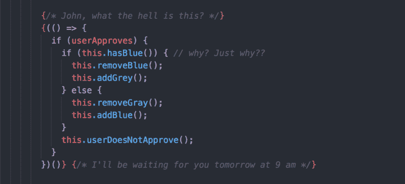

# 在使用 React 一年后，我学到的最重要的经验是

> 原文：<https://www.freecodecamp.org/news/mindset-lessons-from-a-year-with-react-1de862421981/>

托马斯·埃格林斯卡斯

# 在使用 React 一年后，我学到的最重要的经验是



No, I didn’t wrote that, but I know it got your attention ?

开始一项新技术可能会很麻烦。你通常会发现自己置身于教程和文章的海洋中，后面是数以百万计的个人观点。每一个人都声称他们找到了“正确而完美的方法”

这让我们争论我们选择的教程是否会浪费时间。

在潜入海洋之前，我们必须了解一项技术的基本概念。然后，我们需要培养一种基于技术的思维模式。如果我们开始学习反应，我们首先必须在反应中思考。只有在后来，我们才能开始将各种心态融合为一。

在这篇文章中，我们将介绍一些我从自己使用 React 的个人经历中学到的关于这种心态的经验。我们将回顾白天的工作和晚上的个人项目，甚至是我在当地 JavaScript 活动上的演讲。

所以我们走吧！

### React 在不断发展，因此您必须跟上时代的步伐

如果你记得 16.3.0 版本的最初发布，你会记得每个人是多么兴奋。

以下是我们收到的一些变化和改进:

*   官方上下文 API
*   createRef API
*   forwardRef API
*   严格模式
*   组件生命周期变化

React 核心团队和所有贡献者都在努力改进我们都很喜欢的技术。在 16.4.0 版本中，我们收到了[指针事件](https://reactjs.org/blog/2018/05/23/react-v-16-4.html)。

进一步的变化肯定会到来，这只是时间问题:异步渲染，缓存，17.0.0 版本和许多其他未知的。

所以，如果你想成为顶尖人物，你必须了解社区里发生的事情。

了解事物是如何工作的，为什么要开发它们。了解正在解决什么问题，以及开发是如何变得更容易的。这对你很有帮助。

### 不要害怕将你的代码分割成更小的块

React 是基于组件的。所以你应该利用这个概念，不要害怕把大块分割成小块。

有时一个简单的组件可以由 4-5 行代码组成，在某些情况下，这完全没问题。

这样，如果一个新人加入进来，他们就不需要几天时间来理解一切是如何运作的。

```
// isn't this easy to understand?
```

```
return (  [   <ChangeButton    onClick={this.changeUserApprovalStatus}    text="Let’s switch it!"   />,   <UserInformation status={status}/>   ]);
```

您不必制造内置复杂逻辑的组件。它们只能是视觉上的。如果这改善了代码的可读性和测试，并进一步减少了代码的味道，这对团队中的每个人来说都是一个巨大的胜利。

```
import ErrorMessage from './ErrorMessage';
```

```
const NotFound = () => (  <ErrorMessage    title="Oops! Page not found."    message="The page you are looking for does not exist!"    className="test_404-page"  />);
```

在上面的例子中，属性是静态的。所以我们可以有一个负责网站错误消息`Not Found`的纯组件，仅此而已。

另外，如果你不喜欢到处都用 CSS 类作为类名，我会推荐使用样式化的组件。这可以大大提高可读性。

```
const Number = styled.h1`  font-size: 36px;  line-height: 40px;  margin-right: 5px;  padding: 0px;`;//..
```

```
<Container>  <Number>{skipRatePre}</Number>  <InfoName>Skip Rate</InfoName></Container>
```

如果你因为文件污染了你的文件夹而害怕创建更多的组件，那么重新考虑你如何构建你的代码。我一直在用[分形结构](https://hackernoon.com/fractal-a-react-app-structure-for-infinite-scale-4dab943092af)而且很牛逼。

### 不要拘泥于基础——变得更高级

有时你可能会认为自己对某些东西理解不够，无法继续学习更高级的东西。但是很多时候你不应该太担心——接受挑战，证明自己是错的。

通过学习高级主题并鞭策自己，你可以了解更多的基础知识，以及它们如何用于更大的事情。

您可以探索许多模式:

*   复合组件
*   高阶组件
*   渲染道具
*   智能/非智能组件
*   许多其他人(尝试分析)

探索它们，你就会知道为什么和在哪里使用它们。你会对 React 更加适应。

```
// looks like magic?// it's not that hard when you just try
```

```
render() {  const children = React.Children.map(this.props.children,   (child, index) => {      return React.cloneElement(child, {        onSelect: () => this.props.onTabSelect(index)    });     });   return children;}
```

此外，不要害怕在工作中尝试新事物——当然是在一定的范围内！不要只在个人项目上做实验。

人们会问问题，这很正常。你的任务是用有力的论据为你的工作和决定辩护。

你的目标应该是解决现有的问题，使进一步的开发更容易，或者只是清理代码中的一些小问题。即使你的建议被拒绝，你回家时也会比沉默不语时知道更多。

### 不要把事情过分复杂化

这听起来像一个反驳的论点，但它是不同的。在生活中，在任何地方，我们都必须保持平衡。我们不应该过度工程化来炫耀。我们必须务实。编写易于理解并能实现其目的的代码。

如果你不需要 Redux，但是你想用它是因为大家都用而不知道它的真实用途，那就不要。要有主见，如果别人逼迫你，不要害怕为自己辩护。

有时你可能会想，通过利用最新的技术和编写复杂的代码，你是在对世界说:
“我不是初级，我正在成为中级/高级。看我能怎么办！”

老实说，这是我开始开发之旅时的心态。但是随着时间的推移，你会明白那些没有炫耀或因为“它工作”而写的代码更容易接受。

1.  同事可以参与你的项目，你不是唯一负责开发/修复/测试的人。插入 tas k >。
2.  团队可以理解其他人做了什么，而不需要坐很长时间的会议。几分钟足够讨论了。
3.  当你的同事外出度假两周时，你可以接管他们的任务。你也不必花 8 个小时去做，因为一个小时就能完成。

人们尊重那些让别人生活更轻松的人。因此，如果你的目标是赢得尊重，提升职位，并取得进步，那就为团队而不是你自己编码吧。

你会成为每个人最喜欢的团队成员。

### 重构，重构，再重构——这很正常

你会改变你的想法几十次，尽管项目经理会更频繁地改变他们的想法。别人会批评你的工作，你也会批评。因此，您将不得不多次修改您的代码。

但是不用担心，这是一个自然的学习过程。没有缺点和错误，我们就不能进步。

我们跌倒的次数越多，就越容易爬起来。

但是这里有一个提示:确保你测试了你当前的软件。烟雾、单位、整合、快照——不要回避它们。

每个人都面临或将要面临这样一种情况，即测试可以节省宝贵的时间。

如果你像许多人一样，认为这是浪费时间，试着换个角度思考。

1.  你不必和你的同事坐在一起解释事情是如何运作的。
2.  你不必和你的同事坐在一起解释为什么东西会坏掉。
3.  你不必为你的同事修正错误。
4.  你不必修复 3 周后发现的错误。
5.  你将有时间做你想做的事情。

这些都是相当大的好处。

### 如果你喜欢它，你会茁壮成长

在过去的一年里，我的目标是在 React 方面做得更好。我想谈谈这件事。我想让别人和我一起享受。

我可以整晚坐着不停地写代码，看各种各样的演讲，享受其中的每一分钟。

问题是，如果你想要什么，不知何故每个人都开始帮助你。上个月，我在 200 人面前做了第一次 React 演讲。

在这一年中，我变得更加强大，对 React——各种模式、范例和内部工作方式也更加得心应手。我可以进行更深入的讨论，并向他人传授我不敢触及的话题。

今天，我仍然能感受到一年前同样的兴奋和享受。

因此，我建议每个人都问问自己:“你喜欢自己的工作吗？”

如果没有，继续寻找那个你可以谈论几个小时的特别的片段，每天晚上都学习，并且快乐。

因为我们必须找到最贴近我们内心的东西。成功不能强求，必须实现。

如果我能回到一年前，这就是我对自己说的，在即将开始的伟大旅程之前要做的准备。

感谢您的阅读！

如果你觉得这篇文章有帮助？？？。